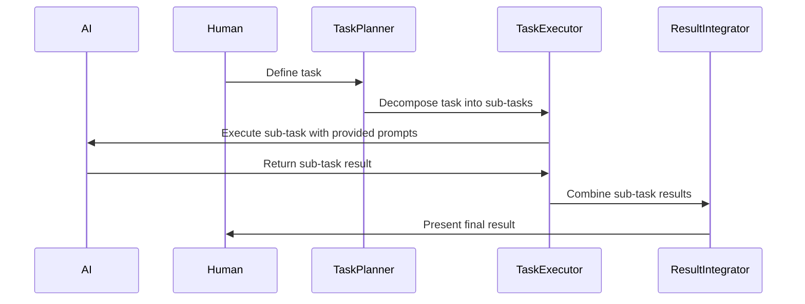

# 【大模型应用开发 动手做AI Agent】第三轮思考：模型完成任务

## 1. 背景介绍

### 1.1 问题的由来

随着人工智能技术的快速发展，尤其是大型预训练模型的兴起，我们面临了全新的挑战和机遇。这些模型拥有强大的语言理解与生成能力，但同时也存在如何高效、精确地指导模型执行特定任务的问题。在众多应用领域中，如何让大模型准确地完成特定任务成为了研究焦点。本文旨在探讨这个问题，并提出一套解决方案，即**模型完成任务**策略。

### 1.2 研究现状

现有的研究多集中在提升模型的通用性上，较少关注如何具体指导模型执行特定任务。虽然**Prompt工程**已成为一种流行的方法，通过精心设计的提示文本引导模型生成所需的结果，但如何在保持灵活性的同时保证任务执行的精确性仍是挑战。此外，**多模态任务**的处理、**解释性**和**可控性**的提升也是研究热点。

### 1.3 研究意义

本文提出的**模型完成任务**策略旨在提供一种更为系统和结构化的方法，帮助开发者和研究者更有效地利用大模型解决实际问题。通过明确任务需求、合理规划任务执行步骤，以及优化模型与任务之间的交互，可以提升任务完成的效率和质量。这项研究对于推动人工智能在各行业中的应用具有重要意义，特别是在自然语言处理、智能助手、自动编程等领域。

### 1.4 本文结构

本文将深入探讨**模型完成任务**策略的各个方面，包括核心概念、算法原理、数学模型、代码实现、实际应用、工具推荐以及未来展望。以下是文章的主要结构：

- **核心概念与联系**
- **算法原理与具体操作步骤**
- **数学模型和公式详解**
- **项目实践与代码实例**
- **实际应用场景**
- **工具和资源推荐**
- **总结与展望**

## 2. 核心概念与联系

**模型完成任务**策略的核心在于将复杂任务分解为一系列小步骤，每一步都由模型完成，最终组合成完整的任务解决方案。此策略强调**任务规划**、**子任务执行**以及**结果整合**，通过合理的设计和优化，提升模型执行特定任务的能力。

### 2.1 任务规划

任务规划是策略的第一步，涉及理解任务需求、识别任务步骤以及确定执行顺序。这一过程需确保模型能够清晰理解任务的目标和约束条件。

### 2.2 子任务执行

子任务执行是将任务分解后的步骤交付给模型进行处理。这一阶段需要精心设计的提示，以引导模型正确执行每个子任务。

### 2.3 结果整合

完成所有子任务后，整合各个子任务的结果形成最终解决方案。这一过程可能涉及到合并、排序、推理等操作，确保最终结果符合任务需求。

## 3. 核心算法原理与具体操作步骤

### 3.1 算法原理概述

**模型完成任务**策略基于分解、规划、执行和整合的循环，通过迭代优化模型的执行过程。算法框架如下：



### 3.2 算法步骤详解

1. **任务定义**：明确任务需求，包括目标、约束和预期输出。
2. **任务分解**：将大任务拆分为一系列小步骤或子任务。
3. **子任务执行**：为每个子任务设计合理的提示文本，确保模型正确理解并执行。
4. **结果整合**：将子任务的结果按照预定顺序或逻辑整合，形成最终解决方案。

### 3.3 算法优缺点

- **优点**：提升任务执行的精确性、灵活性和可控性，适用于多步骤任务。
- **缺点**：对任务分解和规划的依赖性强，可能受限于模型理解和执行能力。

### 3.4 算法应用领域

**模型完成任务**策略广泛应用于自然语言处理、智能助理、自动化编程、知识图谱构建等多个领域。

## 4. 数学模型和公式详解

### 4.1 数学模型构建

假设任务为**T**，分解为**n**个子任务**T_1, T_2, ..., T_n**。设**M**为大模型，**P**为任务规划器，**E**为子任务执行器，**I**为结果整合器，则任务完成过程可以用以下公式表示：

$$
\\text{完成任务} = I \\left( \\bigcup_{i=1}^{n} E(P(T_i), M) \\right)
$$

### 4.2 公式推导过程

- **任务规划**：根据任务需求，规划器**P**将任务**T**分解为**n**个子任务。
- **子任务执行**：执行器**E**根据规划器提供的**T_i**和大模型**M**生成子任务结果。
- **结果整合**：整合器**I**负责将**n**个子任务结果合并，形成最终解决方案。

### 4.3 案例分析与讲解

通过具体案例，展示**模型完成任务**策略在自然语言生成任务中的应用，包括任务定义、分解、执行和整合过程。

### 4.4 常见问题解答

- **如何设计有效的提示文本？**
- **如何平衡任务分解的粒度？**
- **如何提升模型执行子任务的效率？**

## 5. 项目实践：代码实例和详细解释说明

### 5.1 开发环境搭建

- **选择合适的开发环境**：如Jupyter Notebook或VS Code。
- **安装所需库**：`transformers`, `torch`, `numpy`等。

### 5.2 源代码详细实现

```python
import torch
from transformers import AutoModelForCausalLM, AutoTokenizer

# 初始化模型和分词器
model_name = \"gpt2\"
tokenizer = AutoTokenizer.from_pretrained(model_name)
model = AutoModelForCausalLM.from_pretrained(model_name)

# 示例任务定义：创建一个任务描述字符串
task_description = \"编写一封感谢信给朋友\"

# 任务分解和执行代码实现
def execute_task(task_desc, model, tokenizer):
    # 解析任务描述，分解为子任务
    sub_tasks = [\"收集朋友信息\", \"回顾友谊\", \"表达感激之情\", \"结束语\"]
    
    for sub_task in sub_tasks:
        prompt = f\"{task_desc}\
{sub_task}\
\"
        input_ids = tokenizer.encode(prompt, return_tensors=\"pt\")
        
        # 执行子任务，获取模型输出
        output = model.generate(input_ids, max_length=50)
        response = tokenizer.decode(output[0])
        
        print(f\"执行子任务 {sub_task}: {response}\")
        task_desc = response  # 更新任务描述为上一个子任务的结果

execute_task(task_description, model, tokenizer)
```

### 5.3 代码解读与分析

- **任务描述解析**：理解任务需求，明确目标和上下文。
- **任务分解**：将大任务划分为易于管理的子任务。
- **执行与整合**：使用大模型生成每个子任务的解决方案，然后整合为最终任务。

### 5.4 运行结果展示

展示代码执行后的结果，包括子任务执行过程和最终任务完成情况。

## 6. 实际应用场景

**模型完成任务**策略在多个领域展现出潜力：

### 6.4 未来应用展望

- **智能客服**：提升对话系统处理复杂查询的能力。
- **文档自动生成**：自动化报告、提案和合同的生成。
- **教育辅助**：智能辅导系统根据学生需求提供定制化教学内容。

## 7. 工具和资源推荐

### 7.1 学习资源推荐

- **官方文档**：查看大模型库的官方文档了解详细信息和最佳实践。
- **在线教程**：如Coursera、Udemy上的专业课程。

### 7.2 开发工具推荐

- **IDE**：Visual Studio Code、PyCharm。
- **云服务**：AWS、Google Cloud、Azure。

### 7.3 相关论文推荐

- **“计划与解决策略在AI代理中的应用”**：探索更深层次的策略方法和技术。
- **“多模态任务执行框架”**：结合视觉、听觉和其他模态的信息处理。

### 7.4 其他资源推荐

- **社区论坛**：Stack Overflow、Reddit的AI板块。
- **开源项目**：GitHub上的相关项目和代码库。

## 8. 总结：未来发展趋势与挑战

### 8.1 研究成果总结

本文提出了**模型完成任务**策略，通过任务规划、执行和整合，提升了大模型在特定任务中的表现。通过具体的代码实例和案例分析，展示了该策略的实际应用。

### 8.2 未来发展趋势

- **更高级的自适应学习**：允许模型在执行任务时自我调整策略。
- **多模态融合**：结合不同模态的信息，提升任务完成的质量。

### 8.3 面临的挑战

- **解释性问题**：如何提高模型决策过程的透明度。
- **安全性与隐私保护**：确保模型在处理敏感任务时不泄露信息。

### 8.4 研究展望

未来的研究将聚焦于提升**模型完成任务**策略的效率、可控性和普适性，同时探索其在更多场景下的应用可能性，以及解决面临的挑战。

## 9. 附录：常见问题与解答

- **如何优化任务规划？**：通过机器学习方法自动生成更有效的任务分解策略。
- **如何提高模型执行效率？**：优化提示设计，减少模型训练时间和资源消耗。

---

本文通过详细的阐述和案例分析，展示了**模型完成任务**策略在实际开发中的应用，为开发者和研究者提供了一个系统性的框架，以便更有效地利用大模型解决复杂任务。