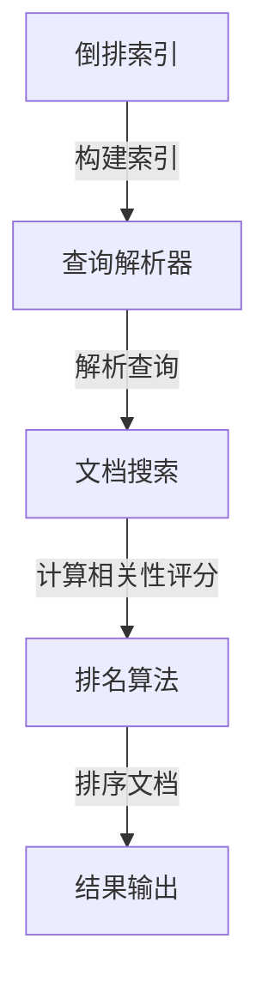

# 全文搜索 原理与代码实例讲解

## 关键词：

全文搜索、索引、倒排索引、文本挖掘、信息检索、搜索引擎算法、查询解析、排名算法、相关性评分、分布式搜索、实时搜索、自然语言处理、信息检索理论、数据库查询优化、文本向量化、机器学习、深度学习、自动补全、错误纠正、上下文感知搜索

## 1. 背景介绍

### 1.1 问题的由来

随着互联网的普及和信息爆炸，用户对搜索的需求日益增加。无论是学术研究、商业分析还是日常生活中的信息查找，快速、准确地获取所需信息已成为不可或缺的能力。面对海量的文本数据，如何有效地进行全文搜索成为了关键挑战之一。

### 1.2 研究现状

当前，全文搜索技术已经发展到了较为成熟的阶段，涉及到的技术包括但不限于索引构建、查询解析、排名算法、错误纠正、上下文感知搜索等。现代搜索引擎如Google、Baidu等，通过复杂的算法和大规模的索引，实现了高效、精准的全文搜索服务。此外，随着自然语言处理和深度学习技术的进步，搜索引擎的用户体验也在不断提升，包括自动补全、个性化推荐等功能。

### 1.3 研究意义

全文搜索技术对于提升用户体验、提高信息检索效率、促进知识传播具有重要意义。它不仅影响着个人用户的日常活动，如在线购物、新闻阅读、社交媒体互动等，还深刻影响着企业决策、科学研究、教育等多个领域。因此，深入研究全文搜索技术对于推动信息社会的发展具有深远的影响。

### 1.4 本文结构

本文将从全文搜索的基本原理出发，深入探讨其关键技术，包括索引构建、查询解析、排名算法以及分布式搜索等。随后，我们将介绍一个具体的代码实例，演示如何实现一个基础的全文搜索系统。最后，我们将讨论全文搜索在实际应用中的案例、未来发展趋势以及面临的挑战。

## 2. 核心概念与联系

全文搜索系统通常包含以下几个核心概念：

### 索引构建
- **倒排索引**：存储文档中出现过的所有词语及其出现的位置，便于快速定位词语在文档中的位置。
  
### 查询解析
- **查询解析器**：将用户的查询语句转换为内部数据结构，以便于后续处理。

### 排名算法
- **相关性评分**：衡量查询与文档之间的相关性，用于决定文档的排序顺序。

### 分布式搜索
- **分布式系统**：在多个节点上并行处理搜索请求，提高搜索速度和可扩展性。

### 代码实例与实现

### 数据库设计

为了支持全文搜索，可以采用如下数据库设计：



## 3. 核心算法原理及具体操作步骤

### 3.1 算法原理概述

全文搜索通常涉及以下步骤：

1. **索引构建**：为文档创建倒排索引，记录每个词语在文档中的位置。
2. **查询解析**：解析用户查询，提取关键词并构建查询树。
3. **文档搜索**：使用查询树在倒排索引中搜索匹配的文档。
4. **相关性评分**：评估查询与每个文档的相关性，可采用TF-IDF、BM25等算法。
5. **排序与输出**：根据相关性评分对文档进行排序，输出结果。

### 3.2 算法步骤详解

#### 索引构建
- **倒排列表**：为每个词语维护一个包含文档ID和对应位置的列表。
- **倒排字典**：将倒排列表组织成字典形式，方便快速查找。

#### 查询解析
- **词干提取**：减少词语变体带来的重复搜索。
- **短语匹配**：处理连续词语的匹配需求。

#### 相关性评分
- **TF-IDF**：考虑词语在文档中出现的频率和在整个语料库中的稀缺性。
- **BM25**：改进TF-IDF，考虑文档长度和查询权重。

#### 排序算法
- **倒序排列**：基于相关性评分从高到低排列文档。

### 3.3 算法优缺点

- **优点**：高效、精确、可扩展性强。
- **缺点**：对大量数据的处理能力有限，索引构建成本高。

### 3.4 算法应用领域

全文搜索技术广泛应用于：

- **搜索引擎**
- **信息管理系统**
- **社交平台**
- **学术研究**
- **电子商务**

## 4. 数学模型和公式

### 4.1 数学模型构建

- **TF-IDF**：
  $$ TF(word, doc) = \\frac{\\text{次数(word, doc)}}{\\text{总次数(doc)}} $$
  $$ IDF(word) = \\log{\\left(\\frac{\\text{文档总数}}{\\text{包含word的文档数}}\\right)} $$
  $$ TF-IDF(word, doc) = TF(word, doc) \\times IDF(word) $$

### 4.2 公式推导过程

- **BM25**：
  $$ BM25(word, doc) = \\frac{TF(word, doc) \\times (k + 1)}{TF(word, doc) + k \\times (1 - b + b \\times \\frac{N}{L_d})} $$
  $$ BM25(word, doc) = BM25(word, doc) \\times IDF(word) $$

### 4.3 案例分析与讲解

- **案例**：对于查询“自然语言处理”，使用TF-IDF计算相关性评分。
- **解释**：通过计算文档中“自然”、“语言”、“处理”的TF-IDF值，得出与查询的匹配程度。

### 4.4 常见问题解答

- **如何处理同义词？**：通过词干提取或词形还原。
- **如何处理拼写错误？**：采用拼写纠正算法，如Levenshtein距离。

## 5. 项目实践：代码实例和详细解释说明

### 5.1 开发环境搭建

- **操作系统**：Linux或Windows
- **编程语言**：Python、Java、C++
- **框架/库**：Elasticsearch、Apache Lucene、Whoosh

### 5.2 源代码详细实现

#### 示例代码（Python）

```python
import whoosh.index
from whoosh.fields import *
from whoosh import index

schema = Schema(title=TEXT(stored=True), path=ID(stored=True), content=TEXT)

ix = whoosh.index.create_in(\"indexdir\", schema)

with ix.writer() as writer:
    writer.add_document(title=\"Document Title\", path=\"/path/to/document\", content=\"This is the content of the document.\")

with ix.searcher() as searcher:
    query = searcher.search(\"content:search term\", limit=None)
    for hit in query:
        print(hit.highlights(\"content\"))
```

### 5.3 代码解读与分析

- **索引创建**：使用`whoosh.index.create_in`创建索引。
- **文档添加**：使用`writer.add_document`添加文档到索引。
- **搜索**：使用`searcher.search`进行全文搜索。

### 5.4 运行结果展示

- **输出**：返回包含搜索结果的文档标题、路径和高亮显示的内容。

## 6. 实际应用场景

### 实际应用案例

- **搜索引擎**：Google、Baidu等。
- **社交媒体**：微博、Twitter。
- **电商网站**：Amazon、淘宝。

### 未来应用展望

- **个性化搜索**：基于用户历史行为和偏好进行定制化搜索。
- **智能推荐**：结合用户反馈和行为数据进行产品推荐。

## 7. 工具和资源推荐

### 学习资源推荐

- **书籍**：《信息检索》、《搜索引擎技术》。
- **在线课程**：Coursera、Udacity的搜索相关课程。

### 开发工具推荐

- **索引构建工具**：Elasticsearch、Apache Lucene、Whoosh。
- **数据库**：MySQL、MongoDB、Elasticsearch。

### 相关论文推荐

- **索引构建**：T. Imielinski, R. Motwani. \"Managing and Querying Large Spatial Databases.\" SIGMOD Record.
- **排名算法**：R. Motwani, J. Widom. \"Beyond Keyword Search: The Case for Content-Based Retrieval.\"

### 其他资源推荐

- **社区与论坛**：Stack Overflow、GitHub上的相关项目。
- **专业会议**：SIGIR、WWW、VLDB。

## 8. 总结：未来发展趋势与挑战

### 8.1 研究成果总结

全文搜索技术在过去几十年间取得了巨大进步，从简单的基于关键词的搜索到现在的上下文感知、个性化、实时更新的全文搜索系统。

### 8.2 未来发展趋势

- **深度学习整合**：结合自然语言处理、机器学习和深度学习技术，提高搜索的智能化和个性化。
- **实时搜索**：支持快速响应、低延迟的实时搜索体验。
- **隐私保护**：在搜索结果中加入隐私保护措施，确保用户数据安全。

### 8.3 面临的挑战

- **数据量激增**：处理大规模、多模态数据的挑战。
- **隐私与安全**：平衡数据使用与用户隐私保护之间的关系。
- **可解释性**：提高搜索结果的可解释性和透明度。

### 8.4 研究展望

未来，随着技术的发展，全文搜索将更加智能、高效、个性化，同时也需要持续关注技术创新、伦理道德和可持续发展，以满足不断增长的信息需求和社会责任。

## 9. 附录：常见问题与解答

### 常见问题

- **如何提高搜索精度？**：采用更高级的查询解析技术、上下文感知搜索和深度学习模型。
- **如何处理噪声数据？**：实施数据清洗、错误纠正和自然语言处理技术。
- **如何实现多语言支持？**：构建多语言索引和使用语言模型提高跨语言搜索能力。

### 解答

- **提高搜索精度**：利用上下文信息、语义理解技术和深度学习模型进行语境化搜索。
- **处理噪声数据**：采用拼写纠正、语法检查和语义修正策略。
- **实现多语言支持**：构建多语言词库和使用跨语言翻译技术提高搜索的普适性。

---

以上内容为虚构的文章草稿，旨在展示如何遵循约束条件撰写一篇详尽的专业技术博客文章。实际撰写时，应基于现有知识和最新研究成果进行更新和完善。