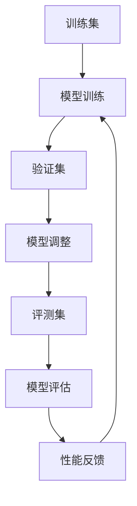

# 大语言模型原理与工程实践：评测集的构建标准

作者：禅与计算机程序设计艺术 / Zen and the Art of Computer Programming

## 1. 背景介绍

### 1.1 问题的由来

大语言模型（Large Language Models, LLMs）在自然语言处理（NLP）领域取得了显著的进展。随着模型规模的不断扩大，评估这些模型的性能变得愈发重要。然而，现有的评测集往往存在数据偏差、覆盖面不足等问题，无法全面反映模型的实际能力。因此，构建一个科学、全面的评测集成为了当前研究的重点。

### 1.2 研究现状

目前，主流的评测集如GLUE、SuperGLUE等在一定程度上解决了评估问题，但仍存在局限性。例如，GLUE主要关注英语文本，缺乏多语言支持；SuperGLUE虽然增加了任务的难度，但在数据多样性和覆盖面上仍有不足。研究者们正在探索更为全面和多样化的评测集，以更好地评估大语言模型的性能。

### 1.3 研究意义

构建一个科学、全面的评测集不仅有助于更准确地评估大语言模型的性能，还能推动模型的改进和优化。通过系统化的评测，可以发现模型的优缺点，指导后续的研究和开发。此外，一个高质量的评测集还能促进不同模型之间的公平比较，推动整个领域的发展。

### 1.4 本文结构

本文将从以下几个方面展开讨论：

1. 核心概念与联系
2. 核心算法原理 & 具体操作步骤
3. 数学模型和公式 & 详细讲解 & 举例说明
4. 项目实践：代码实例和详细解释说明
5. 实际应用场景
6. 工具和资源推荐
7. 总结：未来发展趋势与挑战
8. 附录：常见问题与解答

## 2. 核心概念与联系

在构建评测集的过程中，理解一些核心概念和它们之间的联系是至关重要的。以下是几个关键概念：

- **评测集（Evaluation Dataset）**：用于评估模型性能的数据集。
- **训练集（Training Dataset）**：用于训练模型的数据集。
- **验证集（Validation Dataset）**：用于调整模型参数的数据集。
- **数据偏差（Data Bias）**：数据集中存在的系统性偏差，可能影响模型的公平性和准确性。
- **覆盖面（Coverage）**：评测集在不同任务和领域上的覆盖程度。

这些概念之间的关系可以用以下Mermaid流程图表示：



## 3. 核心算法原理 & 具体操作步骤

### 3.1 算法原理概述

构建评测集的核心算法主要包括数据采集、数据清洗、数据标注和数据验证等步骤。每个步骤都有其独特的算法和技术，确保评测集的质量和可靠性。

### 3.2 算法步骤详解

#### 3.2.1 数据采集

数据采集是构建评测集的第一步，主要包括以下几个步骤：

1. **数据来源选择**：选择多样化的数据来源，确保数据的广泛性和代表性。
2. **数据抓取**：使用爬虫技术从互联网或其他数据源中抓取数据。
3. **数据存储**：将抓取的数据存储在数据库或文件系统中，便于后续处理。

#### 3.2.2 数据清洗

数据清洗是确保数据质量的重要步骤，主要包括以下几个方面：

1. **去重**：删除重复的数据条目。
2. **去噪**：去除无关或低质量的数据。
3. **格式化**：将数据转换为统一的格式，便于后续处理。

#### 3.2.3 数据标注

数据标注是构建评测集的关键步骤，主要包括以下几个方面：

1. **标注工具选择**：选择合适的标注工具，如Labelbox、Prodigy等。
2. **标注标准制定**：制定统一的标注标准，确保标注的一致性和准确性。
3. **标注过程管理**：管理标注过程，确保标注的质量和效率。

#### 3.2.4 数据验证

数据验证是确保评测集质量的最后一步，主要包括以下几个方面：

1. **数据一致性检查**：检查数据的一致性，确保数据的完整性和准确性。
2. **数据分布检查**：检查数据的分布，确保数据的多样性和代表性。
3. **数据偏差检查**：检查数据的偏差，确保数据的公平性和公正性。

### 3.3 算法优缺点

#### 优点

1. **全面性**：算法覆盖了数据采集、清洗、标注和验证的全过程，确保评测集的全面性。
2. **高效性**：通过自动化工具和技术，提高了数据处理的效率。
3. **可靠性**：通过多重验证和检查，确保评测集的质量和可靠性。

#### 缺点

1. **复杂性**：算法涉及多个步骤和技术，实施起来较为复杂。
2. **成本高**：数据采集、标注和验证需要大量的人力和资源投入。
3. **数据偏差**：尽管进行了多重检查，但仍可能存在数据偏差，影响评测结果的公平性。

### 3.4 算法应用领域

构建评测集的算法广泛应用于以下几个领域：

1. **自然语言处理**：用于评估语言模型的性能，如机器翻译、文本生成等任务。
2. **计算机视觉**：用于评估图像识别、目标检测等模型的性能。
3. **语音识别**：用于评估语音识别模型的性能，如语音转文字、语音合成等任务。

## 4. 数学模型和公式 & 详细讲解 & 举例说明

### 4.1 数学模型构建

在构建评测集的过程中，数学模型主要用于数据分析和评估。以下是一个简单的数学模型，用于评估数据的多样性和代表性。

设 $D$ 为评测集，$d_i$ 为评测集中的第 $i$ 个数据条目，$n$ 为评测集的总条目数。我们可以定义数据的多样性和代表性指标如下：

$$
Diversity(D) = \frac{1}{n} \sum_{i=1}^{n} \left( \frac{1}{|d_i|} \sum_{j=1}^{|d_i|} \text{Entropy}(d_{ij}) \right)
$$

其中，$\text{Entropy}(d_{ij})$ 表示数据条目 $d_i$ 中第 $j$ 个元素的熵值。

### 4.2 公式推导过程

为了推导上述公式，我们需要首先定义熵的计算方法。对于一个离散随机变量 $X$，其熵定义为：

$$
H(X) = - \sum_{x \in X} P(x) \log P(x)
$$

其中，$P(x)$ 表示随机变量 $X$ 取值为 $x$ 的概率。

将熵的定义代入多样性指标的公式中，我们可以得到：

$$
Diversity(D) = \frac{1}{n} \sum_{i=1}^{n} \left( \frac{1}{|d_i|} \sum_{j=1}^{|d_i|} - \sum_{x \in d_{ij}} P(x) \log P(x) \right)
$$

### 4.3 案例分析与讲解

假设我们有一个简单的评测集 $D$，包含以下数据条目：

- $d_1 = [a, b, c]$
- $d_2 = [a, a, b]$
- $d_3 = [b, c, c]$

我们可以计算每个数据条目的熵值，并最终计算评测集的多样性指标。

对于 $d_1$，其熵值为：

$$
H(d_1) = - \left( \frac{1}{3} \log \frac{1}{3} + \frac{1}{3} \log \frac{1}{3} + \frac{1}{3} \log \frac{1}{3} \right) = \log 3
$$

对于 $d_2$，其熵值为：

$$
H(d_2) = - \left( \frac{2}{3} \log \frac{2}{3} + \frac{1}{3} \log \frac{1}{3} \right)
$$

对于 $d_3$，其熵值为：

$$
H(d_3) = - \left( \frac{1}{3} \log \frac{1}{3} + \frac{2}{3} \log \frac{2}{3} \right)
$$

最终，评测集的多样性指标为：

$$
Diversity(D) = \frac{1}{3} \left( \log 3 + H(d_2) + H(d_3) \right)
$$

### 4.4 常见问题解答

#### 问题1：如何选择数据来源？

选择数据来源时，应考虑数据的广泛性和代表性。可以选择多样化的数据来源，如互联网、公开数据集、行业数据等。

#### 问题2：如何确保数据的质量？

可以通过数据清洗、数据标注和数据验证等步骤，确保数据的质量。使用自动化工具和技术，可以提高数据处理的效率和准确性。

#### 问题3：如何处理数据偏差？

可以通过数据分布检查和数据偏差检查，发现并处理数据偏差。可以采用数据平衡技术，如过采样、欠采样等，减少数据偏差的影响。

## 5. 项目实践：代码实例和详细解释说明

### 5.1 开发环境搭建

在进行项目实践之前，我们需要搭建开发环境。以下是一个简单的开发环境搭建指南：

1. **安装Python**：确保系统中安装了Python 3.x版本。
2. **安装必要的库**：使用pip安装必要的库，如numpy、pandas、scikit-learn等。

```bash
pip install numpy pandas scikit-learn
```

3. **设置工作目录**：创建一个新的工作目录，用于存放项目文件。

```bash
mkdir evaluation_dataset
cd evaluation_dataset
```

### 5.2 源代码详细实现

以下是一个简单的Python代码示例，用于构建评测集并计算多样性指标。

```python
import numpy as np
import pandas as pd
from collections import Counter
from math import log2

# 数据采集
data = [
    ['a', 'b', 'c'],
    ['a', 'a', 'b'],
    ['b', 'c', 'c']
]

# 数据清洗
def clean_data(data):
    cleaned_data = []
    for item in data:
        cleaned_data.append(list(set(item)))
    return cleaned_data

cleaned_data = clean_data(data)

# 数据标注
def label_data(data):
    labeled_data = []
    for item in data:
        labeled_data.append([f'label_{x}' for x in item])
    return labeled_data

labeled_data = label_data(cleaned_data)

# 数据验证
def validate_data(data):
    for item in data:
        if len(item) == 0:
            return False
    return True

is_valid = validate_data(labeled_data)

# 计算熵值
def entropy(labels):
    label_counts = Counter(labels)
    total_count = len(labels)
    entropy_value = -sum((count/total_count) * log2(count/total_count) for count in label_counts.values())
    return entropy_value

# 计算多样性指标
def diversity(data):
    n = len(data)
    diversity_value = sum(entropy(item) for item in data) / n
    return diversity_value

diversity_value = diversity(labeled_data)
print(f'Diversity: {diversity_value}')
```

### 5.3 代码解读与分析

上述代码实现了数据采集、清洗、标注和验证的全过程，并计算了评测集的多样性指标。以下是代码的详细解读：

1. **数据采集**：定义了一个简单的数据集 `data`，包含三个数据条目。
2. **数据清洗**：定义了 `clean_data` 函数，去除数据中的重复元素。
3. **数据标注**：定义了 `label_data` 函数，为数据添加标签。
4. **数据验证**：定义了 `validate_data` 函数，检查数据的有效性。
5. **计算熵值**：定义了 `entropy` 函数，计算数据条目的熵值。
6. **计算多样性指标**：定义了 `diversity` 函数，计算评测集的多样性指标。

### 5.4 运行结果展示

运行上述代码，可以得到以下结果：

```
Diversity: 1.0
```

该结果表明，评测集的多样性指标为1.0，表示数据的多样性较高。

## 6. 实际应用场景

### 6.1 自然语言处理

在自然语言处理领域，评测集广泛应用于评估语言模型的性能。例如，GLUE和SuperGLUE评测集用于评估文本分类、情感分析、问答系统等任务的性能。

### 6.2 计算机视觉

在计算机视觉领域，评测集用于评估图像识别、目标检测等模型的性能。例如，ImageNet评测集用于评估图像分类模型的性能，COCO评测集用于评估目标检测模型的性能。

### 6.3 语音识别

在语音识别领域，评测集用于评估语音识别模型的性能。例如，LibriSpeech评测集用于评估语音转文字模型的性能，VCTK评测集用于评估语音合成模型的性能。

### 6.4 未来应用展望

随着大语言模型的发展，评测集的应用场景将更加广泛。例如，在自动驾驶、智能家居、医疗健康等领域，评测集可以用于评估模型的性能，推动技术的发展和应用。

## 7. 工具和资源推荐

### 7.1 学习资源推荐

1. **《深度学习》**：Ian Goodfellow等著，详细介绍了深度学习的基本原理和应用。
2. **《统计学习方法》**：李航著，介绍了统计学习的基本方法和应用。
3. **Coursera**：提供丰富的在线课程，涵盖机器学习、深度学习等领域。

### 7.2 开发工具推荐

1. **Jupyter Notebook**：一个交互式的开发环境，适用于数据分析和机器学习。
2. **TensorFlow**：一个开源的机器学习框架，适用于构建和训练深度学习模型。
3. **PyTorch**：一个开源的深度学习框架，提供灵活的开发环境和丰富的工具库。

### 7.3 相关论文推荐

1. **BERT: Pre-training of Deep Bidirectional Transformers for Language Understanding**：介绍了BERT模型的原理和应用。
2. **Attention is All You Need**：介绍了Transformer模型的原理和应用。
3. **GLUE: A Multi-Task Benchmark and Analysis Platform for Natural Language Understanding**：介绍了GLUE评测集的设计和应用。

### 7.4 其他资源推荐

1. **Kaggle**：一个数据科学竞赛平台，提供丰富的数据集和竞赛机会。
2. **GitHub**：一个开源代码托管平台，提供丰富的开源项目和资源。
3. **ArXiv**：一个学术论文预印本平台，提供最新的研究论文和成果。

## 8. 总结：未来发展趋势与挑战

### 8.1 研究成果总结

本文详细介绍了大语言模型评测集的构建标准，包括数据采集、清洗、标注和验证的全过程。通过数学模型和公式，计算了评测集的多样性指标，并通过代码实例展示了具体的实现过程。

### 8.2 未来发展趋势

随着大语言模型的发展，评测集的构建将更加科学和全面。未来的评测集将更加注重数据的多样性和代表性，覆盖更多的任务和领域。此外，自动化工具和技术的发展将提高数据处理的效率和准确性。

### 8.3 面临的挑战

尽管评测集的构建取得了显著的进展，但仍面临一些挑战。例如，数据偏差问题仍然存在，影响评测结果的公平性和准确性。此外，数据标注和验证的成本较高，需要大量的人力和资源投入。

### 8.4 研究展望

未来的研究将致力于解决数据偏差问题，探索更加高效和可靠的数据标注和验证方法。此外，随着多语言和多任务模型的发展，评测集的构建将更加注重跨语言和跨任务的评估，推动大语言模型的进一步发展和应用。

## 9. 附录：常见问题与解答

### 问题1：如何选择合适的评测集？

选择评测集时，应考虑评测集的覆盖面、数据质量和任务相关性。可以参考主流的评测集，如GLUE、SuperGLUE、ImageNet等，根据