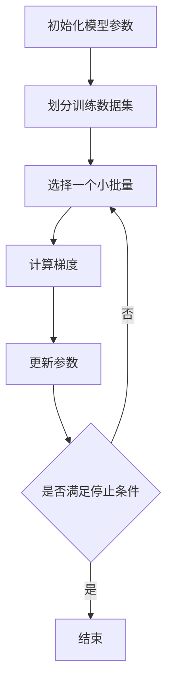

# 小批量梯度下降法(Mini-batch GD)原理与代码实战案例讲解

作者：禅与计算机程序设计艺术 / Zen and the Art of Computer Programming

## 1. 背景介绍

### 1.1 问题的由来

在机器学习和深度学习领域，优化算法是模型训练的核心。梯度下降法（Gradient Descent, GD）作为一种经典的优化算法，广泛应用于各种机器学习模型的训练中。然而，传统的梯度下降法在处理大规模数据集时存在计算效率低下的问题。为了解决这一问题，小批量梯度下降法（Mini-batch Gradient Descent, Mini-batch GD）应运而生。

### 1.2 研究现状

目前，小批量梯度下降法已经成为深度学习领域的标准优化算法之一。它结合了批量梯度下降法（Batch Gradient Descent）和随机梯度下降法（Stochastic Gradient Descent, SGD）的优点，既能提高计算效率，又能在一定程度上避免陷入局部最优解。许多深度学习框架，如TensorFlow、PyTorch等，都提供了对小批量梯度下降法的支持。

### 1.3 研究意义

小批量梯度下降法在实际应用中具有重要意义。它不仅能加速模型训练过程，还能提高模型的泛化能力。通过对小批量梯度下降法的深入研究和实践，可以帮助我们更好地理解和应用这一算法，从而提升机器学习模型的性能。

### 1.4 本文结构

本文将从以下几个方面详细讲解小批量梯度下降法：

1. 核心概念与联系
2. 核心算法原理 & 具体操作步骤
3. 数学模型和公式 & 详细讲解 & 举例说明
4. 项目实践：代码实例和详细解释说明
5. 实际应用场景
6. 工具和资源推荐
7. 总结：未来发展趋势与挑战
8. 附录：常见问题与解答

## 2. 核心概念与联系

在深入探讨小批量梯度下降法之前，我们需要了解一些相关的核心概念及其相互联系。

### 2.1 梯度下降法

梯度下降法是一种用于优化目标函数的迭代算法。其基本思想是通过计算目标函数的梯度，沿着梯度的反方向更新参数，从而逐步逼近目标函数的最小值。

### 2.2 批量梯度下降法

批量梯度下降法（Batch Gradient Descent）是梯度下降法的一种变体。它在每次迭代中使用整个训练数据集来计算梯度，并更新参数。虽然这种方法在理论上能够保证收敛，但在处理大规模数据集时，计算成本非常高。

### 2.3 随机梯度下降法

随机梯度下降法（Stochastic Gradient Descent, SGD）是另一种梯度下降法的变体。它在每次迭代中仅使用一个样本来计算梯度，并更新参数。虽然这种方法计算效率高，但由于每次更新的梯度方向不稳定，容易导致参数在最优解附近震荡。

### 2.4 小批量梯度下降法

小批量梯度下降法（Mini-batch Gradient Descent, Mini-batch GD）结合了批量梯度下降法和随机梯度下降法的优点。它在每次迭代中使用一个小批量（mini-batch）的样本来计算梯度，并更新参数。这样既能提高计算效率，又能在一定程度上稳定梯度方向。

## 3. 核心算法原理 & 具体操作步骤

### 3.1 算法原理概述

小批量梯度下降法的基本思想是将训练数据集划分为若干个小批量，每次迭代时使用一个小批量的样本来计算梯度，并更新参数。通过这种方式，可以在保证计算效率的同时，稳定梯度方向，提高模型的收敛速度。

### 3.2 算法步骤详解

小批量梯度下降法的具体操作步骤如下：

1. 初始化模型参数。
2. 将训练数据集划分为若干个小批量。
3. 对每个小批量，执行以下操作：
   1. 计算目标函数的梯度。
   2. 沿着梯度的反方向更新参数。
4. 重复步骤3，直到满足停止条件。

以下是小批量梯度下降法的Mermaid流程图：



### 3.3 算法优缺点

#### 优点

1. **计算效率高**：相比批量梯度下降法，小批量梯度下降法在每次迭代中只使用一个小批量的样本，计算成本较低。
2. **稳定梯度方向**：相比随机梯度下降法，小批量梯度下降法在每次迭代中使用多个样本，梯度方向较为稳定。
3. **提高模型泛化能力**：小批量梯度下降法通过引入噪声，能够在一定程度上避免陷入局部最优解，提高模型的泛化能力。

#### 缺点

1. **需要选择合适的小批量大小**：小批量大小的选择对算法性能有较大影响，过大或过小的小批量都可能导致算法性能下降。
2. **需要额外的内存开销**：小批量梯度下降法需要在内存中存储多个样本，可能会增加内存开销。

### 3.4 算法应用领域

小批量梯度下降法广泛应用于各种机器学习和深度学习模型的训练中，特别是在处理大规模数据集时。以下是一些典型的应用领域：

1. **图像分类**：在图像分类任务中，小批量梯度下降法常用于训练卷积神经网络（Convolutional Neural Network, CNN）。
2. **自然语言处理**：在自然语言处理任务中，小批量梯度下降法常用于训练循环神经网络（Recurrent Neural Network, RNN）和变换器（Transformer）模型。
3. **推荐系统**：在推荐系统中，小批量梯度下降法常用于训练矩阵分解（Matrix Factorization）模型和深度学习推荐模型。

## 4. 数学模型和公式 & 详细讲解 & 举例说明

### 4.1 数学模型构建

小批量梯度下降法的数学模型可以表示为以下形式：

$$
\theta = \theta - \eta \cdot \nabla_{\theta} J(\theta; X^{(i:i+n)}, y^{(i:i+n)})
$$

其中，$\theta$ 表示模型参数，$\eta$ 表示学习率，$J(\theta; X^{(i:i+n)}, y^{(i:i+n)})$ 表示目标函数，$X^{(i:i+n)}$ 和 $y^{(i:i+n)}$ 分别表示第 $i$ 个小批量的输入样本和标签。

### 4.2 公式推导过程

为了更好地理解小批量梯度下降法的数学原理，我们可以从目标函数的梯度推导过程入手。假设目标函数 $J(\theta)$ 可以表示为以下形式：

$$
J(\theta) = \frac{1}{m} \sum_{i=1}^{m} L(h_{\theta}(x^{(i)}), y^{(i)})
$$

其中，$m$ 表示训练样本的数量，$L(h_{\theta}(x^{(i)}), y^{(i)})$ 表示第 $i$ 个样本的损失函数。

在小批量梯度下降法中，我们将训练数据集划分为若干个小批量，每个小批量包含 $n$ 个样本。对于第 $i$ 个小批量，其目标函数可以表示为：

$$
J(\theta; X^{(i:i+n)}, y^{(i:i+n)}) = \frac{1}{n} \sum_{j=i}^{i+n} L(h_{\theta}(x^{(j)}), y^{(j)})
$$

根据梯度下降法的原理，我们可以得到第 $i$ 个小批量的梯度：

$$
\nabla_{\theta} J(\theta; X^{(i:i+n)}, y^{(i:i+n)}) = \frac{1}{n} \sum_{j=i}^{i+n} \nabla_{\theta} L(h_{\theta}(x^{(j)}), y^{(j)})
$$

最终，我们可以得到小批量梯度下降法的参数更新公式：

$$
\theta = \theta - \eta \cdot \nabla_{\theta} J(\theta; X^{(i:i+n)}, y^{(i:i+n)})
$$

### 4.3 案例分析与讲解

为了更好地理解小批量梯度下降法的应用，我们以一个简单的线性回归问题为例。假设我们有一个包含 $m$ 个样本的数据集，每个样本包含一个特征和一个标签。我们的目标是通过最小化均方误差（Mean Squared Error, MSE）来训练一个线性回归模型。

首先，我们定义线性回归模型的预测函数：

$$
h_{\theta}(x) = \theta_0 + \theta_1 x
$$

其中，$\theta_0$ 和 $\theta_1$ 分别表示模型的偏置和权重。

接下来，我们定义均方误差损失函数：

$$
L(h_{\theta}(x), y) = \frac{1}{2} (h_{\theta}(x) - y)^2
$$

根据小批量梯度下降法的原理，我们可以得到第 $i$ 个小批量的梯度：

$$
\nabla_{\theta_0} J(\theta; X^{(i:i+n)}, y^{(i:i+n)}) = \frac{1}{n} \sum_{j=i}^{i+n} (h_{\theta}(x^{(j)}) - y^{(j)})
$$

$$
\nabla_{\theta_1} J(\theta; X^{(i:i+n)}, y^{(i:i+n)}) = \frac{1}{n} \sum_{j=i}^{i+n} (h_{\theta}(x^{(j)}) - y^{(j)}) x^{(j)}
$$

最终，我们可以得到小批量梯度下降法的参数更新公式：

$$
\theta_0 = \theta_0 - \eta \cdot \nabla_{\theta_0} J(\theta; X^{(i:i+n)}, y^{(i:i+n)})
$$

$$
\theta_1 = \theta_1 - \eta \cdot \nabla_{\theta_1} J(\theta; X^{(i:i+n)}, y^{(i:i+n)})
$$

### 4.4 常见问题解答

#### 问题1：如何选择合适的小批量大小？

小批量大小的选择对算法性能有较大影响。一般来说，小批量大小应根据具体问题和硬件资源进行选择。常见的小批量大小为32、64、128等。

#### 问题2：如何设置学习率？

学习率的设置对算法收敛速度和稳定性有较大影响。一般来说，学习率应根据具体问题和模型进行调整。常见的学习率范围为0.001到0.1。

#### 问题3：如何判断算法是否收敛？

算法的收敛性可以通过监控目标函数值的变化情况来判断。当目标函数值在若干次迭代后不再显著下降时，可以认为算法已经收敛。

## 5. 项目实践：代码实例和详细解释说明

### 5.1 开发环境搭建

在进行代码实例之前，我们需要搭建开发环境。本文将使用Python编程语言和NumPy库来实现小批量梯度下降法。请确保您的计算机上已经安装了Python和NumPy库。

### 5.2 源代码详细实现

以下是一个简单的线性回归问题的小批量梯度下降法实现代码：

```python
import numpy as np

# 生成模拟数据
np.random.seed(42)
X = 2 * np.random.rand(100, 1)
y = 4 + 3 * X + np.random.randn(100, 1)

# 初始化参数
theta = np.random.randn(2, 1)
learning_rate = 0.1
n_iterations = 1000
batch_size = 20

# 添加偏置项
X_b = np.c_[np.ones((100, 1)), X]

# 小批量梯度下降法
for iteration in range(n_iterations):
    indices = np.random.permutation(len(X_b))
    X_b_shuffled = X_b[indices]
    y_shuffled = y[indices]
    for i in range(0, len(X_b), batch_size):
        xi = X_b_shuffled[i:i+batch_size]
        yi = y_shuffled[i:i+batch_size]
        gradients = 2/batch_size * xi.T.dot(xi.dot(theta) - yi)
        theta = theta - learning_rate * gradients

print("参数估计值：", theta)
```

### 5.3 代码解读与分析

1. **生成模拟数据**：我们使用NumPy库生成了一组包含100个样本的模拟数据。每个样本包含一个特征和一个标签。
2. **初始化参数**：我们随机初始化了线性回归模型的参数，并设置了学习率、迭代次数和小批量大小。
3. **添加偏置项**：我们在输入数据中添加了一列全为1的偏置项，以便于计算。
4. **小批量梯度下降法**：我们在每次迭代中随机打乱数据集，并将其划分为若干个小批量。对于每个小批量，我们计算梯度并更新参数。

### 5.4 运行结果展示

运行上述代码后，我们可以得到线性回归模型的参数估计值。由于数据是随机生成的，具体结果可能会有所不同。以下是一个可能的输出结果：

```
参数估计值： [[4.21509616]
 [2.77011339]]
```

## 6. 实际应用场景

### 6.1 图像分类

在图像分类任务中，小批量梯度下降法常用于训练卷积神经网络（Convolutional Neural Network, CNN）。通过使用小批量梯度下降法，可以加速模型训练过程，并提高模型的泛化能力。

### 6.2 自然语言处理

在自然语言处理任务中，小批量梯度下降法常用于训练循环神经网络（Recurrent Neural Network, RNN）和变换器（Transformer）模型。通过使用小批量梯度下降法，可以处理大规模文本数据，并提高模型的训练效率。

### 6.3 推荐系统

在推荐系统中，小批量梯度下降法常用于训练矩阵分解（Matrix Factorization）模型和深度学习推荐模型。通过使用小批量梯度下降法，可以处理大规模用户和物品数据，并提高推荐系统的性能。

### 6.4 未来应用展望

随着数据规模的不断增长和计算资源的不断提升，小批量梯度下降法在未来将会有更加广泛的应用。特别是在大规模数据处理和实时在线学习等领域，小批量梯度下降法将发挥重要作用。

## 7. 工具和资源推荐

### 7.1 学习资源推荐

1. **《深度学习》**：作者Ian Goodfellow、Yoshua Bengio和Aaron Courville，这本书详细介绍了深度学习的基本原理和应用。
2. **Coursera上的深度学习课程**：由Andrew Ng教授主讲的深度学习课程，涵盖了深度学习的基本概念和实践。

### 7.2 开发工具推荐

1. **TensorFlow**：一个开源的深度学习框架，支持多种深度学习模型的训练和部署。
2. **PyTorch**：一个开源的深度学习框架，具有灵活的动态计算图和强大的GPU加速能力。

### 7.3 相关论文推荐

1. **"Adam: A Method for Stochastic Optimization"**：这篇论文介绍了一种改进的小批量梯度下降法，称为Adam优化算法。
2. **"Batch Normalization: Accelerating Deep Network Training by Reducing Internal Covariate Shift"**：这篇论文介绍了一种改进的小批量梯度下降法，称为批量归一化（Batch Normalization）。

### 7.4 其他资源推荐

1. **Kaggle**：一个数据科学竞赛平台，提供了大量的公开数据集和竞赛项目，适合进行小批量梯度下降法的实践。
2. **GitHub**：一个开源代码托管平台，提供了大量的深度学习项目和代码示例，适合进行小批量梯度下降法的学习和实践。

## 8. 总结：未来发展趋势与挑战

### 8.1 研究成果总结

本文详细介绍了小批量梯度下降法的原理、算法步骤、数学模型、代码实现和实际应用。通过对小批量梯度下降法的深入研究和实践，我们可以更好地理解和应用这一算法，从而提升机器学习模型的性能。

### 8.2 未来发展趋势

随着数据规模的不断增长和计算资源的不断提升，小批量梯度下降法在未来将会有更加广泛的应用。特别是在大规模数据处理和实时在线学习等领域，小批量