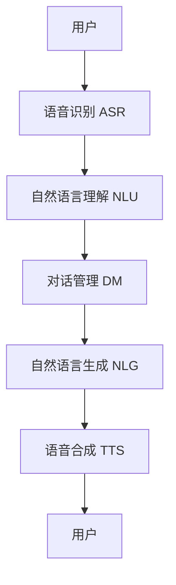

# 自然语言交互与对话系统原理与代码实战案例讲解

作者：禅与计算机程序设计艺术 / Zen and the Art of Computer Programming

## 1. 背景介绍

### 1.1 问题的由来

自然语言处理（NLP）是人工智能领域中最具挑战性和前景的研究方向之一。随着计算能力的提升和数据量的爆炸性增长，NLP技术在过去几十年中取得了显著进展。自然语言交互与对话系统作为NLP的一个重要应用领域，已经在智能客服、虚拟助手、智能家居等多个场景中得到了广泛应用。

### 1.2 研究现状

目前，自然语言交互与对话系统的研究主要集中在以下几个方面：

1. **语音识别与合成**：将语音信号转换为文本，并将文本转换为语音信号。
2. **自然语言理解**：解析用户输入的自然语言文本，提取其中的意图和关键信息。
3. **对话管理**：根据用户的意图和上下文信息，生成合理的对话响应。
4. **自然语言生成**：将系统生成的响应转换为自然语言文本。

### 1.3 研究意义

研究自然语言交互与对话系统具有重要的理论和实际意义：

1. **理论意义**：推动NLP和人工智能领域的发展，深化对人类语言和认知过程的理解。
2. **实际意义**：提升人机交互的自然性和智能化水平，广泛应用于智能客服、虚拟助手、智能家居等领域，提高用户体验和工作效率。

### 1.4 本文结构

本文将从以下几个方面详细介绍自然语言交互与对话系统的原理与实战案例：

1. 核心概念与联系
2. 核心算法原理与具体操作步骤
3. 数学模型和公式的详细讲解与举例说明
4. 项目实践：代码实例和详细解释说明
5. 实际应用场景
6. 工具和资源推荐
7. 总结：未来发展趋势与挑战
8. 附录：常见问题与解答

## 2. 核心概念与联系

自然语言交互与对话系统涉及多个核心概念和技术模块。以下是一些关键概念及其相互联系的简要介绍：

1. **语音识别（ASR）**：将用户的语音输入转换为文本。
2. **自然语言理解（NLU）**：解析文本，提取用户意图和关键信息。
3. **对话管理（DM）**：根据用户意图和上下文信息，生成合理的对话响应。
4. **自然语言生成（NLG）**：将系统生成的响应转换为自然语言文本。
5. **语音合成（TTS）**：将文本转换为语音输出。

以下是自然语言交互与对话系统的整体架构图：



## 3. 核心算法原理 & 具体操作步骤

### 3.1 算法原理概述

自然语言交互与对话系统的核心算法主要包括以下几个方面：

1. **语音识别算法**：基于深度神经网络（DNN）和隐马尔可夫模型（HMM）的语音识别算法。
2. **自然语言理解算法**：基于词向量（Word Embedding）、循环神经网络（RNN）和注意力机制（Attention Mechanism）的自然语言理解算法。
3. **对话管理算法**：基于有限状态机（FSM）、强化学习（RL）和记忆网络（Memory Network）的对话管理算法。
4. **自然语言生成算法**：基于生成对抗网络（GAN）和变分自编码器（VAE）的自然语言生成算法。
5. **语音合成算法**：基于波形生成模型（WaveNet）和神经网络的语音合成算法。

### 3.2 算法步骤详解

#### 3.2.1 语音识别算法步骤

1. **预处理**：对语音信号进行预处理，包括降噪、归一化等。
2. **特征提取**：提取语音信号的特征，如梅尔频率倒谱系数（MFCC）。
3. **模型训练**：使用DNN或HMM模型进行训练。
4. **解码**：将特征向量解码为文本。

#### 3.2.2 自然语言理解算法步骤

1. **文本预处理**：对文本进行分词、去停用词、词干提取等预处理。
2. **词向量表示**：将文本转换为词向量表示，如Word2Vec或GloVe。
3. **意图识别**：使用RNN或注意力机制模型进行意图识别。
4. **槽位填充**：提取文本中的关键信息，填充到预定义的槽位中。

#### 3.2.3 对话管理算法步骤

1. **状态表示**：将对话状态表示为有限状态机或记忆网络。
2. **策略学习**：使用强化学习算法学习对话策略。
3. **响应生成**：根据当前状态和策略生成对话响应。

#### 3.2.4 自然语言生成算法步骤

1. **文本生成**：使用GAN或VAE模型生成自然语言文本。
2. **后处理**：对生成的文本进行语法和语义校正。

#### 3.2.5 语音合成算法步骤

1. **文本分析**：对输入文本进行分析，提取语音合成所需的特征。
2. **波形生成**：使用WaveNet或神经网络模型生成语音波形。

### 3.3 算法优缺点

#### 3.3.1 语音识别算法

**优点**：
- 高准确率
- 能处理多种语言和口音

**缺点**：
- 对噪声敏感
- 需要大量训练数据

#### 3.3.2 自然语言理解算法

**优点**：
- 能处理复杂的语义关系
- 适应性强

**缺点**：
- 计算复杂度高
- 需要大量标注数据

#### 3.3.3 对话管理算法

**优点**：
- 能处理多轮对话
- 适应性强

**缺点**：
- 训练难度大
- 需要大量对话数据

#### 3.3.4 自然语言生成算法

**优点**：
- 生成文本自然
- 适应性强

**缺点**：
- 生成质量不稳定
- 需要大量训练数据

#### 3.3.5 语音合成算法

**优点**：
- 语音质量高
- 适应性强

**缺点**：
- 计算复杂度高
- 需要大量训练数据

### 3.4 算法应用领域

自然语言交互与对话系统的应用领域非常广泛，包括但不限于：

1. **智能客服**：自动回答用户问题，提高客服效率。
2. **虚拟助手**：如Siri、Alexa等，提供语音交互服务。
3. **智能家居**：通过语音控制家电设备。
4. **教育**：提供智能辅导和答疑服务。
5. **医疗**：提供智能诊断和健康咨询服务。

## 4. 数学模型和公式 & 详细讲解 & 举例说明

### 4.1 数学模型构建

自然语言交互与对话系统的数学模型主要包括以下几个方面：

1. **语音识别模型**：基于DNN和HMM的语音识别模型。
2. **自然语言理解模型**：基于RNN和注意力机制的自然语言理解模型。
3. **对话管理模型**：基于强化学习和记忆网络的对话管理模型。
4. **自然语言生成模型**：基于GAN和VAE的自然语言生成模型。
5. **语音合成模型**：基于WaveNet和神经网络的语音合成模型。

### 4.2 公式推导过程

#### 4.2.1 语音识别模型公式

语音识别模型的核心公式是贝叶斯公式：

$$
P(W|X) = \frac{P(X|W)P(W)}{P(X)}
$$

其中，$P(W|X)$ 是给定语音信号 $X$ 的情况下，文本 $W$ 的概率；$P(X|W)$ 是给定文本 $W$ 的情况下，语音信号 $X$ 的概率；$P(W)$ 是文本 $W$ 的先验概率；$P(X)$ 是语音信号 $X$ 的先验概率。

#### 4.2.2 自然语言理解模型公式

自然语言理解模型的核心公式是RNN的前向传播公式：

$$
h_t = \sigma(W_h h_{t-1} + W_x x_t + b)
$$

其中，$h_t$ 是时刻 $t$ 的隐藏状态；$W_h$ 和 $W_x$ 是权重矩阵；$x_t$ 是时刻 $t$ 的输入；$b$ 是偏置项；$\sigma$ 是激活函数。

#### 4.2.3 对话管理模型公式

对话管理模型的核心公式是强化学习的价值函数：

$$
Q(s, a) = r + \gamma \max_{a'} Q(s', a')
$$

其中，$Q(s, a)$ 是状态 $s$ 和动作 $a$ 的价值函数；$r$ 是即时奖励；$\gamma$ 是折扣因子；$s'$ 是下一个状态；$a'$ 是下一个动作。

#### 4.2.4 自然语言生成模型公式

自然语言生成模型的核心公式是GAN的损失函数：

$$
L = \mathbb{E}_{x \sim p_{data}(x)}[\log D(x)] + \mathbb{E}_{z \sim p_z(z)}[\log(1 - D(G(z)))]
$$

其中，$D$ 是判别器；$G$ 是生成器；$x$ 是真实数据；$z$ 是噪声向量。

#### 4.2.5 语音合成模型公式

语音合成模型的核心公式是WaveNet的生成公式：

$$
P(x_t|x_1, x_2, ..., x_{t-1}) = \text{softmax}(W h_t + b)
$$

其中，$x_t$ 是时刻 $t$ 的语音信号；$W$ 是权重矩阵；$h_t$ 是时刻 $t$ 的隐藏状态；$b$ 是偏置项。

### 4.3 案例分析与讲解

#### 4.3.1 语音识别案例

假设我们有一段语音信号 $X$，我们希望将其转换为文本 $W$。首先，我们对语音信号进行预处理和特征提取，得到特征向量 $X'$。然后，我们使用训练好的DNN模型计算 $P(X'|W)$ 和 $P(W)$，并使用贝叶斯公式计算 $P(W|X')$，最终得到最可能的文本 $W$。

#### 4.3.2 自然语言理解案例

假设我们有一段用户输入的文本 $T$，我们希望提取其中的意图和关键信息。首先，我们对文本进行预处理和词向量表示，得到词向量序列 $X$。然后，我们使用训练好的RNN模型计算隐藏状态序列 $H$，并使用注意力机制计算意图和槽位的概率分布，最终提取出用户的意图和关键信息。

#### 4.3.3 对话管理案例

假设我们有一个对话系统，当前状态为 $s$，我们希望生成一个合理的响应。首先，我们使用强化学习算法计算当前状态 $s$ 的价值函数 $Q(s, a)$，并选择价值函数最大的动作 $a$。然后，我们根据动作 $a$ 生成响应，并更新对话状态 $s'$。

#### 4.3.4 自然语言生成案例

假设我们希望生成一段自然语言文本。首先，我们从噪声分布 $p_z(z)$ 中采样一个噪声向量 $z$。然后，我们使用训练好的生成器 $G$ 生成文本 $T = G(z)$。最后，我们使用判别器 $D$ 评估生成文本的质量，并根据评估结果调整生成器的参数。

#### 4.3.5 语音合成案例

假设我们有一段文本 $T$，我们希望将其转换为语音信号。首先，我们对文本进行分析，提取语音合成所需的特征。然后，我们使用训练好的WaveNet模型生成语音波形 $X$。最后，我们对生成的语音波形进行后处理，得到最终的语音信号。

### 4.4 常见问题解答

#### 4.4.1 语音识别中的噪声问题

**问题**：语音识别系统对噪声敏感，如何解决？

**解答**：可以使用噪声抑制技术和数据增强技术来提高语音识别系统的鲁棒性。例如，可以在训练数据中加入噪声样本，或者使用自适应滤波器进行噪声抑制。

#### 4.4.2 自然语言理解中的歧义问题

**问题**：自然语言理解系统如何处理歧义问题？

**解答**：可以使用上下文信息和多任务学习技术来解决歧义问题。例如，可以通过上下文信息来确定词语的具体含义，或者使用多任务学习技术同时进行意图识别和槽位填充。

#### 4.4.3 对话管理中的多轮对话问题

**问题**：对话管理系统如何处理多轮对话？

**解答**：可以使用记忆网络和强化学习技术来处理多轮对话。例如，可以使用记忆网络存储对话历史，并使用强化学习算法学习对话策略。

#### 4.4.4 自然语言生成中的质量问题

**问题**：自然语言生成系统如何提高生成文本的质量？

**解答**：可以使用生成对抗网络和变分自编码器技术来提高生成文本的质量。例如，可以通过生成对抗网络的对抗训练来提高生成文本的自然性，或者通过变分自编码器的重构损失来提高生成文本的语义一致性。

#### 4.4.5 语音合成中的自然性问题

**问题**：语音合成系统如何提高生成语音的自然性？

**解答**：可以使用WaveNet和神经网络技术来提高生成语音的自然性。例如，可以通过WaveNet的自回归生成模型来生成高质量的语音波形，或者通过神经网络的端到端训练来优化语音合成的各个环节。

## 5. 项目实践：代码实例和详细解释说明

### 5.1 开发环境搭建

在进行自然语言交互与对话系统的项目实践之前，我们需要搭建开发环境。以下是开发环境的搭建步骤：

1. **安装Python**：自然语言处理和机器学习的主要编程语言是Python。可以从[Python官网](https://www.python.org/)下载并安装最新版本的Python。
2. **安装必要的库**：我们需要安装一些常用的Python库，如NumPy、Pandas、TensorFlow、PyTorch等。可以使用以下命令安装这些库：

```bash
pip install numpy pandas tensorflow pytorch
```

3. **安装NLP工具包**：我们还需要安装一些常用的NLP工具包，如NLTK、spaCy、Transformers等。可以使用以下命令安装这些工具包：

```bash
pip install nltk spacy transformers
```

4. **下载预训练模型**：我们可以使用一些预训练的NLP模型，如BERT、GPT-3等。可以从[Hugging Face](https://huggingface.co/models)下载并加载这些模型。

### 5.2 源代码详细实现

以下是一个简单的自然语言交互与对话系统的代码实例：

```python
import numpy as np
import tensorflow as tf
from transformers import BertTokenizer, TFBertModel

# 加载预训练的BERT模型和分词器
tokenizer = BertTokenizer.from_pretrained('bert-base-uncased')
model = TFBertModel.from_pretrained('bert-base-uncased')

# 定义语音识别函数
def speech_recognition(audio):
    # 这里使用一个简单的占位符函数，实际应用中可以使用ASR模型
    return "hello world"

# 定义自然语言理解函数
def natural_language_understanding(text):
    inputs = tokenizer(text, return_tensors='tf')
    outputs = model(inputs)
    return outputs.last_hidden_state

# 定义对话管理函数
def dialogue_management(state, intent):
    # 这里使用一个简单的占位符函数，实际应用中可以使用强化学习算法
    return "response"

# 定义自然语言生成函数
def natural_language_generation(response):
    # 这里使用一个简单的占位符函数，实际应用中可以使用NLG模型
    return response

# 定义语音合成函数
def text_to_speech(text):
    # 这里使用一个简单的占位符函数，实际应用中可以使用TTS模型
    return text

# 主函数
def main(audio):
    # 语音识别