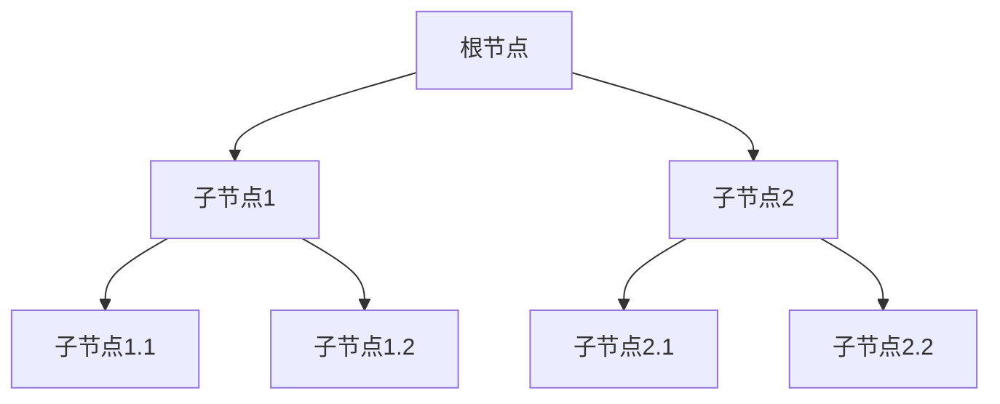
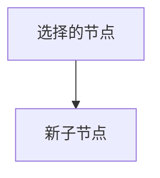
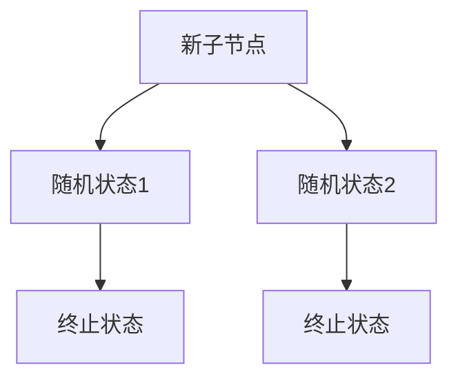
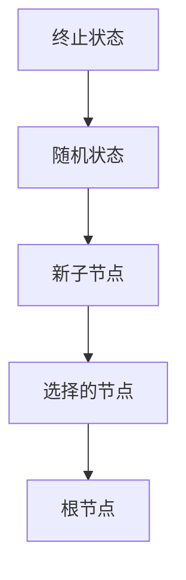
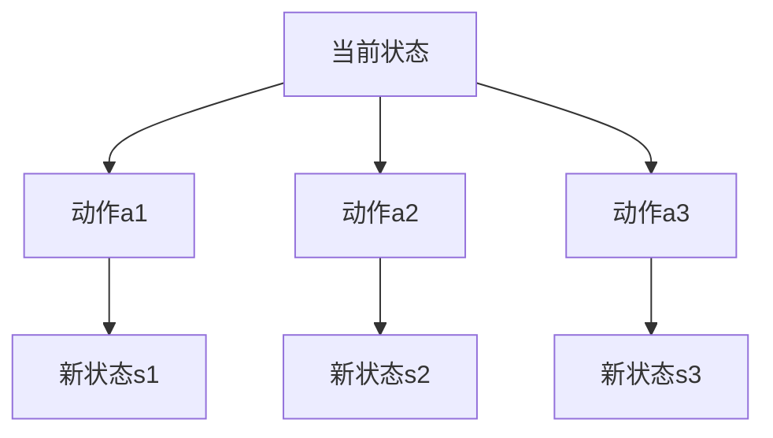

# 蒙特卡罗树搜索 (Monte Carlo Tree Search, MCTS) 原理与代码实例讲解

作者：禅与计算机程序设计艺术 / Zen and the Art of Computer Programming

## 1. 背景介绍

### 1.1 问题的由来

在人工智能和机器学习领域，决策问题一直是一个重要的研究方向。特别是在游戏AI、机器人控制和自动驾驶等领域，如何在复杂的状态空间中做出最优决策是一个核心问题。传统的搜索算法如深度优先搜索（DFS）和广度优先搜索（BFS）在面对庞大的状态空间时往往显得力不从心。蒙特卡罗树搜索（Monte Carlo Tree Search, MCTS）作为一种新兴的搜索算法，因其在复杂决策问题中的优异表现而备受关注。

### 1.2 研究现状

自2006年提出以来，MCTS已经在多个领域取得了显著的成果。特别是在围棋、国际象棋和其他复杂棋类游戏中，MCTS的表现尤为突出。AlphaGo的成功更是将MCTS推向了公众视野。当前，MCTS不仅在游戏AI中广泛应用，还在机器人控制、自动驾驶、金融决策等领域展现了其强大的潜力。

### 1.3 研究意义

研究MCTS不仅有助于解决复杂的决策问题，还能为其他领域的研究提供新的思路和方法。通过深入理解MCTS的原理和实现，可以更好地应用这一算法解决实际问题，提高系统的智能化水平。

### 1.4 本文结构

本文将从以下几个方面详细介绍MCTS：

1. 核心概念与联系
2. 核心算法原理 & 具体操作步骤
3. 数学模型和公式 & 详细讲解 & 举例说明
4. 项目实践：代码实例和详细解释说明
5. 实际应用场景
6. 工具和资源推荐
7. 总结：未来发展趋势与挑战
8. 附录：常见问题与解答

## 2. 核心概念与联系

在深入探讨MCTS之前，我们需要了解一些核心概念和它们之间的联系。

### 2.1 蒙特卡罗方法

蒙特卡罗方法是一种通过随机采样来估计数学问题解的方法。它广泛应用于数值积分、优化问题和统计物理等领域。在MCTS中，蒙特卡罗方法用于模拟游戏的随机走子，从而估计每个节点的价值。

### 2.2 树搜索

树搜索是一种在树形结构中寻找最优路径的算法。常见的树搜索算法包括深度优先搜索（DFS）和广度优先搜索（BFS）。MCTS结合了蒙特卡罗方法和树搜索的优点，通过随机模拟和树结构的结合，实现了高效的决策搜索。

### 2.3 UCT算法

上置信界树（Upper Confidence bounds applied to Trees, UCT）是MCTS的核心算法之一。UCT通过平衡探索和利用，选择最优的子节点进行扩展。其公式为：

$$
UCT = \frac{w_i}{n_i} + C \sqrt{\frac{\ln N}{n_i}}
$$

其中，$w_i$ 是节点 $i$ 的胜利次数，$n_i$ 是节点 $i$ 的访问次数，$N$ 是父节点的访问次数，$C$ 是一个常数，用于调节探索和利用的平衡。

### 2.4 节点与树结构

在MCTS中，每个节点代表一个状态，节点之间的边代表从一个状态到另一个状态的动作。树的根节点代表初始状态，叶节点代表终止状态。通过不断扩展和模拟，MCTS逐渐构建出一棵决策树。

## 3. 核心算法原理 & 具体操作步骤

### 3.1 算法原理概述

MCTS通过四个主要步骤实现：选择、扩展、模拟和回溯。这四个步骤循环进行，逐步构建和优化决策树。

### 3.2 算法步骤详解

#### 3.2.1 选择

在选择步骤中，从根节点开始，根据UCT公式选择最优的子节点，直到到达一个未完全扩展的节点。



#### 3.2.2 扩展

在扩展步骤中，从选择的节点出发，添加一个新的子节点，代表一个新的状态。



#### 3.2.3 模拟

在模拟步骤中，从新扩展的子节点开始，进行随机模拟，直到到达终止状态。记录模拟的结果。



#### 3.2.4 回溯

在回溯步骤中，将模拟的结果反向传播到根节点，更新每个节点的统计信息。



### 3.3 算法优缺点

#### 3.3.1 优点

1. **高效性**：MCTS通过随机模拟和树结构的结合，实现了高效的决策搜索。
2. **适应性强**：MCTS可以应用于各种复杂的决策问题，不需要特定的领域知识。
3. **渐进最优性**：随着模拟次数的增加，MCTS的决策质量逐渐提高，趋近于最优解。

#### 3.3.2 缺点

1. **计算资源消耗大**：MCTS需要大量的模拟和计算，可能会消耗较多的计算资源。
2. **参数调节复杂**：MCTS的性能依赖于参数的选择，如UCT公式中的常数 $C$，需要进行调节和优化。

### 3.4 算法应用领域

MCTS在以下领域有广泛的应用：

1. **游戏AI**：如围棋、国际象棋、扑克等复杂棋类游戏。
2. **机器人控制**：如路径规划、动作决策等。
3. **自动驾驶**：如路径选择、避障决策等。
4. **金融决策**：如投资组合优化、风险管理等。

## 4. 数学模型和公式 & 详细讲解 & 举例说明

### 4.1 数学模型构建

MCTS的数学模型基于马尔可夫决策过程（Markov Decision Process, MDP）。MDP由状态空间、动作空间、转移概率和奖励函数组成。MCTS通过模拟和树搜索，估计每个状态的价值，从而选择最优动作。

### 4.2 公式推导过程

MCTS的核心公式是UCT公式：

$$
UCT = \frac{w_i}{n_i} + C \sqrt{\frac{\ln N}{n_i}}
$$

其中，$w_i$ 是节点 $i$ 的胜利次数，$n_i$ 是节点 $i$ 的访问次数，$N$ 是父节点的访问次数，$C$ 是一个常数，用于调节探索和利用的平衡。

### 4.3 案例分析与讲解

以围棋为例，假设当前状态为 $s$，可选择的动作为 $a_1, a_2, a_3$。通过MCTS，我们可以估计每个动作的价值，从而选择最优动作。



### 4.4 常见问题解答

#### 4.4.1 如何选择UCT公式中的常数 $C$？

常数 $C$ 的选择需要根据具体问题进行调节。一般来说，$C$ 的值越大，算法越倾向于探索；$C$ 的值越小，算法越倾向于利用。

#### 4.4.2 如何处理MCTS中的剪枝问题？

剪枝是指在搜索过程中，去除不必要的分支，以提高搜索效率。可以通过设定阈值，剪除访问次数较少的节点。

## 5. 项目实践：代码实例和详细解释说明

### 5.1 开发环境搭建

在进行代码实现之前，我们需要搭建开发环境。本文使用Python语言进行实现，推荐使用以下工具：

1. **Python 3.8+**：确保安装了最新版本的Python。
2. **IDE**：推荐使用PyCharm或VSCode。
3. **依赖库**：安装必要的依赖库，如numpy、scipy等。

### 5.2 源代码详细实现

以下是MCTS的Python实现代码：

```python
import numpy as np
import math
import random

class Node:
    def __init__(self, state, parent=None):
        self.state = state
        self.parent = parent
        self.children = []
        self.visits = 0
        self.wins = 0

    def add_child(self, child_state):
        child = Node(child_state, self)
        self.children.append(child)
        return child

    def update(self, result):
        self.visits += 1
        self.wins += result

def uct_select(node):
    log_parent_visits = math.log(node.parent.visits)
    return max(node.children, key=lambda n: n.wins / n.visits + math.sqrt(2 * log_parent_visits / n.visits))

def simulate(state):
    # 模拟游戏，返回结果
    return random.choice([0, 1])

def expand(node):
    # 扩展节点，返回新节点
    new_state = node.state + 1  # 示例
    return node.add_child(new_state)

def backpropagate(node, result):
    while node is not None:
        node.update(result)
        node = node.parent

def mcts(root, iterations):
    for _ in range(iterations):
        node = root
        while node.children:
            node = uct_select(node)
        if node.visits > 0:
            node = expand(node)
        result = simulate(node.state)
        backpropagate(node, result)
    return max(root.children, key=lambda n: n.visits)

# 示例使用
root = Node(0)
best_node = mcts(root, 1000)
print(f"最佳状态: {best_node.state}")
```

### 5.3 代码解读与分析

1. **Node类**：表示树中的节点，包含状态、父节点、子节点、访问次数和胜利次数。
2. **uct_select函数**：根据UCT公式选择最优子节点。
3. **simulate函数**：模拟游戏，返回结果。
4. **expand函数**：扩展节点，返回新节点。
5. **backpropagate函数**：将模拟结果反向传播到根节点，更新每个节点的统计信息。
6. **mcts函数**：MCTS算法的主函数，执行指定次数的迭代，返回最优子节点。

### 5.4 运行结果展示

运行上述代码，可以得到最佳状态的输出结果。通过增加迭代次数，可以提高决策的准确性。

## 6. 实际应用场景

### 6.1 游戏AI

MCTS在游戏AI中有广泛的应用，如围棋、国际象棋、扑克等复杂棋类游戏。通过MCTS，AI可以在庞大的状态空间中做出最优决策，提高游戏水平。

### 6.2 机器人控制

在机器人控制中，MCTS可以用于路径规划、动作决策等任务。通过模拟和树搜索，机器人可以在复杂环境中找到最优路径，完成任务。

### 6.3 自动驾驶

在自动驾驶中，MCTS可以用于路径选择、避障决策等任务。通过模拟和树搜索，自动驾驶系统可以在复杂交通环境中做出最优决策，提高行车安全性。

### 6.4 金融决策

在金融决策中，MCTS可以用于投资组合优化、风险管理等任务。通过模拟和树搜索，金融系统可以在复杂市场环境中做出最优决策，提高投资收益。

### 6.5 未来应用展望

随着计算能力的提高和算法的优化，MCTS在更多领域的应用前景广阔。未来，MCTS有望在医疗诊断、智能制造、能源管理等领域发挥重要作用。

## 7. 工具和资源推荐

### 7.1 学习资源推荐

1. **《人工智能：一种现代的方法》**：经典的人工智能教材，详细介绍了MCTS等搜索算法。
2. **Coursera上的AI课程**：如斯坦福大学的《机器学习》课程，涵盖了MCTS等算法的应用。

### 7.2 开发工具推荐

1. **PyCharm**：功能强大的Python IDE，适合进行MCTS的开发和调试。
2. **VSCode**：轻量级的代码编辑器，支持多种编程语言和插件。

### 7.3 相关论文推荐

1. **"Monte Carlo Tree Search: A Review of Recent Modifications and Applications"**：详细介绍了MCTS的最新研究进展和应用。
2. **"A Survey of Monte Carlo Tree Search Methods"**：综述了MCTS的各种变体和改进方法。

### 7.4 其他资源推荐

1. **GitHub上的MCTS项目**：可以参考开源项目，学习MCTS的实现和应用。
2. **Kaggle上的比赛**：参与相关比赛，实践MCTS算法，提升技能。

## 8. 总结：未来发展趋势与挑战

### 8.1 研究成果总结

本文详细介绍了MCTS的原理、算法步骤、数学模型、代码实现和应用场景。通过对MCTS的深入理解，可以更好地应用这一算法解决实际问题。

### 8.2 未来发展趋势

随着计算能力的提高和算法的优化，MCTS在更多领域的应用前景广阔。未来，MCTS有望在医疗诊断、智能制造、能源管理等领域发挥重要作用。

### 8.3 面临的挑战

1. **计算资源消耗**：MCTS需要大量的模拟和计算，可能会消耗较多的计算资源。
2. **参数调节复杂**：MCTS的性能依赖于参数的选择，如UCT公式中的常数 $C$，需要进行调节和优化。

### 8.4 研究展望

未来的研究可以集中在以下几个方面：

1. **算法优化**：通过改进算法，提高MCTS的效率和性能。
2. **应用扩展**：探索MCTS在更多领域的应用，解决实际问题。
3. **资源优化**：通过分布式计算和并行化技术，降低MCTS的计算资源消耗。

## 9. 附录：常见问题与解答

### 9.1 如何选择UCT公式中的常数 $C$？

常数 $C$ 的选择需要根据具体问题进行调节。一般来说，$C$ 的值越大，算法越倾向于探索；$C$ 的值越小，算法越倾向于利用。

### 9.2 如何处理MCTS中的剪枝问题？

剪枝是指在搜索过程中，去除不必要的分支，以提高搜索效率。可以通过设定阈值，剪除访问次数较少的节点。

### 9.3 如何提高MCTS的效率？

可以通过以下方法提高MCTS的效率：

1. **并行化**：通过多线程或分布式计算，提高模拟和计算的效率。
2. **剪枝**：通过设定阈值，剪除不必要的分支，提高搜索效率。
3. **参数优化**：通过调节参数，如UCT公式中的常数 $C$，提高算法性能。

### 9.4 MCTS在实际应用中有哪些挑战？

MCTS在实际应用中面临以下挑战：

1. **计算资源消耗**：MCTS需要大量的模拟和计算，可能会消耗较多的计算资源。
2. **参数调节复杂**：MCTS的性能依赖于参数的选择，如UCT公式中的常数 $C$，需要进行调节和优化。

通过本文的详细介绍，相信读者对MCTS有了更深入的理解和掌握。希望本文能为读者在实际应用中提供有价值的参考和帮助。