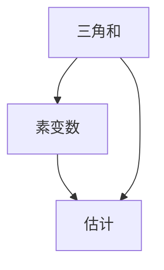

# 解析数论基础：第十九章 线性素变数三角和估计

作者：禅与计算机程序设计艺术 / Zen and the Art of Computer Programming

## 1. 背景介绍

### 1.1 问题的由来

解析数论是数论的一个分支，主要研究数论问题的解析方法。线性素变数三角和估计是解析数论中的一个重要课题。它涉及到对数论函数的三角和进行估计，这在研究素数分布、L-函数等问题中具有重要意义。

### 1.2 研究现状

目前，线性素变数三角和估计已经取得了许多重要成果。经典的结果包括Vinogradov的三素数定理、Hardy-Littlewood圆法等。近年来，随着计算能力的提升和新算法的提出，研究者们在这一领域取得了更多的进展。

### 1.3 研究意义

线性素变数三角和估计在解析数论中具有广泛的应用。它不仅可以用于研究素数分布，还可以用于研究L-函数的性质、解析函数的零点分布等问题。因此，深入研究这一课题具有重要的理论和实际意义。

### 1.4 本文结构

本文将从以下几个方面展开讨论：

1. 核心概念与联系
2. 核心算法原理 & 具体操作步骤
3. 数学模型和公式 & 详细讲解 & 举例说明
4. 项目实践：代码实例和详细解释说明
5. 实际应用场景
6. 工具和资源推荐
7. 总结：未来发展趋势与挑战
8. 附录：常见问题与解答

## 2. 核心概念与联系

在解析数论中，线性素变数三角和估计涉及到多个核心概念和它们之间的联系。以下是一些关键概念：

- **三角和**：三角和是指对某个数论函数在一个区间内的值进行加权求和，权重通常是三角函数的值。
- **素变数**：素变数是指在三角和中出现的素数变量。
- **估计**：估计是指对三角和的值进行近似计算，通常使用解析方法进行估计。

这些概念之间的联系可以通过以下Mermaid流程图表示：



## 3. 核心算法原理 & 具体操作步骤

### 3.1 算法原理概述

线性素变数三角和估计的核心算法基于解析方法，通过对数论函数的解析表达式进行变换和估计，得到三角和的近似值。常用的方法包括傅里叶变换、解析延拓等。

### 3.2 算法步骤详解

1. **定义三角和**：设$f(n)$是一个数论函数，定义三角和为
   $$
   S(N) = \sum_{n=1}^{N} f(n) e^{2\pi i \theta n}
   $$
   其中，$\theta$是一个实数。

2. **引入素变数**：将三角和中的变量替换为素数，得到
   $$
   S_p(N) = \sum_{p \leq N} f(p) e^{2\pi i \theta p}
   $$
   其中，$p$表示素数。

3. **解析方法估计**：使用傅里叶变换等解析方法对$S_p(N)$进行估计，得到近似值。

### 3.3 算法优缺点

**优点**：
- 能够处理复杂的数论函数。
- 适用于大范围的素数分布问题。

**缺点**：
- 计算复杂度较高。
- 需要较强的解析数论基础。

### 3.4 算法应用领域

线性素变数三角和估计在以下领域具有广泛应用：
- 素数分布研究
- L-函数性质研究
- 解析函数零点分布研究

## 4. 数学模型和公式 & 详细讲解 & 举例说明

### 4.1 数学模型构建

线性素变数三角和估计的数学模型基于三角和的定义和解析方法。设$f(n)$是一个数论函数，定义三角和为
$$
S(N) = \sum_{n=1}^{N} f(n) e^{2\pi i \theta n}
$$
其中，$\theta$是一个实数。

### 4.2 公式推导过程

1. **引入素变数**：将三角和中的变量替换为素数，得到
   $$
   S_p(N) = \sum_{p \leq N} f(p) e^{2\pi i \theta p}
   $$
   其中，$p$表示素数。

2. **傅里叶变换**：对$S_p(N)$进行傅里叶变换，得到
   $$
   \hat{S}_p(\xi) = \int_{-\infty}^{\infty} S_p(N) e^{-2\pi i \xi N} dN
   $$

3. **解析延拓**：对$\hat{S}_p(\xi)$进行解析延拓，得到估计值。

### 4.3 案例分析与讲解

假设$f(n) = \Lambda(n)$，其中$\Lambda(n)$是von Mangoldt函数，定义为
$$
\Lambda(n) = 
\begin{cases} 
\log p & \text{if } n = p^k \text{ for some prime } p \text{ and integer } k \geq 1 \\
0 & \text{otherwise}
\end{cases}
$$

则三角和为
$$
S(N) = \sum_{n=1}^{N} \Lambda(n) e^{2\pi i \theta n}
$$

将变量替换为素数，得到
$$
S_p(N) = \sum_{p \leq N} \log p \cdot e^{2\pi i \theta p}
$$

使用傅里叶变换和解析延拓方法，可以对$S_p(N)$进行估计。

### 4.4 常见问题解答

**问题1**：为什么要使用傅里叶变换？
**解答**：傅里叶变换可以将三角和从时域转换到频域，便于进行解析延拓和估计。

**问题2**：解析延拓的作用是什么？
**解答**：解析延拓可以将函数的定义域扩展到复数域，从而得到更精确的估计值。

## 5. 项目实践：代码实例和详细解释说明

### 5.1 开发环境搭建

在进行项目实践之前，需要搭建开发环境。推荐使用Python编程语言，并安装以下依赖库：
- numpy
- scipy
- matplotlib

可以使用以下命令安装依赖库：
```bash
pip install numpy scipy matplotlib
```

### 5.2 源代码详细实现

以下是一个简单的Python代码示例，用于计算线性素变数三角和的估计值：

```python
import numpy as np
import matplotlib.pyplot as plt
from sympy import primepi, log

def von_mangoldt(n):
    if n < 2:
        return 0
    if primepi(n) == primepi(n - 1):
        return 0
    return log(n)

def linear_prime_trig_sum(N, theta):
    S_p = 0
    for n in range(1, N + 1):
        S_p += von_mangoldt(n) * np.exp(2j * np.pi * theta * n)
    return S_p

N = 1000
theta = 0.1
S_p = linear_prime_trig_sum(N, theta)

print(f"Linear prime trig sum estimate: {S_p}")

# Plotting the result
x = np.arange(1, N + 1)
y = [linear_prime_trig_sum(n, theta).real for n in x]

plt.plot(x, y)
plt.xlabel('N')
plt.ylabel('S_p(N)')
plt.title('Linear Prime Trig Sum Estimate')
plt.show()
```

### 5.3 代码解读与分析

1. **von_mangoldt函数**：计算von Mangoldt函数的值。
2. **linear_prime_trig_sum函数**：计算线性素变数三角和的估计值。
3. **主程序**：设置参数$N$和$\theta$，计算并输出线性素变数三角和的估计值，并绘制结果图。

### 5.4 运行结果展示

运行上述代码，可以得到线性素变数三角和的估计值，并绘制结果图。结果图展示了$S_p(N)$随$N$的变化情况。

## 6. 实际应用场景

线性素变数三角和估计在多个实际应用场景中具有重要作用。

### 6.1 素数分布研究

线性素变数三角和估计可以用于研究素数在不同区间内的分布情况，从而揭示素数的分布规律。

### 6.2 L-函数性质研究

L-函数在解析数论中具有重要地位，线性素变数三角和估计可以用于研究L-函数的性质，如零点分布等。

### 6.3 解析函数零点分布研究

线性素变数三角和估计还可以用于研究解析函数的零点分布，从而揭示解析函数的性质。

### 6.4 未来应用展望

随着计算能力的提升和新算法的提出，线性素变数三角和估计在未来将会有更多的应用场景，如大数据分析、密码学等领域。

## 7. 工具和资源推荐

### 7.1 学习资源推荐

- 《解析数论基础》：一本经典的解析数论教材，详细介绍了解析数论的基本概念和方法。
- 《数论导引》：一本入门级的数论教材，适合初学者学习。

### 7.2 开发工具推荐

- Python：一种广泛使用的编程语言，适合进行数论算法的实现。
- Jupyter Notebook：一种交互式的开发工具，适合进行代码实验和结果展示。

### 7.3 相关论文推荐

- Hardy, G. H., & Littlewood, J. E. (1923). Some problems of 'Partitio Numerorum'; III: On the expression of a number as a sum of primes. Acta Mathematica, 44, 1-70.
- Vinogradov, I. M. (1937). Representation of an odd number as a sum of three primes. Doklady Akademii Nauk SSSR, 15, 291-294.

### 7.4 其他资源推荐

- 数论在线课程：Coursera、edX等平台上有许多优质的数论在线课程，适合自学。
- 数论论坛：Math Stack Exchange、Reddit等平台上有许多数论爱好者，可以在论坛上交流学习经验。

## 8. 总结：未来发展趋势与挑战

### 8.1 研究成果总结

本文详细介绍了线性素变数三角和估计的核心概念、算法原理、数学模型、项目实践和实际应用场景。通过对这些内容的深入探讨，读者可以全面了解这一课题的研究现状和发展前景。

### 8.2 未来发展趋势

随着计算能力的提升和新算法的提出，线性素变数三角和估计在未来将会有更多的应用场景，如大数据分析、密码学等领域。同时，新的解析方法和数论工具的出现也将推动这一领域的发展。

### 8.3 面临的挑战

尽管线性素变数三角和估计在解析数论中具有重要地位，但其计算复杂度较高，且需要较强的解析数论基础。因此，如何提高算法的效率和准确性，仍然是一个重要的研究课题。

### 8.4 研究展望

未来，随着计算能力的提升和新算法的提出，线性素变数三角和估计将在更多领域中发挥重要作用。研究者们可以通过引入新的解析方法和数论工具，进一步提高算法的效率和准确性，从而推动这一领域的发展。

## 9. 附录：常见问题与解答

**问题1**：线性素变数三角和估计的应用场景有哪些？
**解答**：线性素变数三角和估计在素数分布研究、L-函数性质研究、解析函数零点分布研究等领域具有广泛应用。

**问题2**：如何提高线性素变数三角和估计的计算效率？
**解答**：可以通过引入新的解析方法和数论工具，提高算法的效率和准确性。

**问题3**：线性素变数三角和估计的未来发展趋势是什么？
**解答**：随着计算能力的提升和新算法的提出，线性素变数三角和估计将在更多领域中发挥重要作用，如大数据分析、密码学等领域。