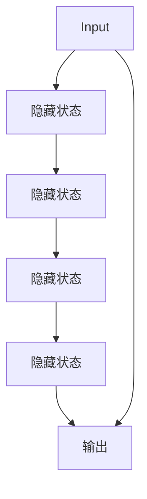

# Recurrent Neural Networks 原理与代码实战案例讲解

作者：禅与计算机程序设计艺术 / Zen and the Art of Computer Programming 

## 1. 背景介绍

### 1.1 问题的由来

在自然语言处理、语音识别、时间序列分析等领域，我们常常遇到需要处理具有时间序列特性的数据。这类数据的特点是顺序依赖性强，即前一时刻的信息对于后续时刻的预测至关重要。例如，在文本序列中，单词之间的关系依赖于上下文信息，而在语音信号处理中，相邻声音片段之间的联系对整体理解至关重要。传统的前馈神经网络（Feedforward Neural Networks）无法很好地处理这类数据，因为它们只能看到当前输入，而不能访问到历史输入信息。这就引出了循环神经网络（Recurrent Neural Networks，RNN）的概念，它能够捕捉序列数据中的长期依赖关系。

### 1.2 研究现状

循环神经网络因其在处理序列数据方面的独特优势，在诸如自然语言处理、语音识别、时间序列预测等领域取得了突破性的进展。随着时间序列数据量的爆炸式增长，以及计算资源的不断进步，RNN 的应用范围和深度都在持续扩大。此外，随着长短时记忆网络（LSTM）、门控循环单元（GRU）等变体的引入，RNN 的性能得到了显著提升，能够更好地处理长期依赖问题。

### 1.3 研究意义

循环神经网络的研究对于提升序列数据处理能力、推动人工智能在多个领域的应用具有重要意义。它不仅能够改善现有技术的性能，还能够开辟新的应用领域，比如在自动驾驶、医疗健康、金融分析等场景中发挥关键作用。通过深入理解 RNN 的工作原理和优化策略，研究人员和工程师能够构建更加高效、准确的模型，解决更为复杂的问题。

### 1.4 本文结构

本文将全面介绍循环神经网络的原理、算法、数学模型、代码实现以及实际应用。我们将从基础概念出发，逐步深入探讨 RNN 的工作机制，分析其优缺点，讨论不同的变体以及它们在解决实际问题中的应用。最后，我们将通过代码案例演示 RNN 的实现过程，并探索其在不同场景下的具体应用。

## 2. 核心概念与联系

### 2.1 RNN 基本概念

循环神经网络的核心在于其“循环”结构，这意味着网络在处理序列输入时会保持状态信息，并在处理下一个输入时使用这些状态信息。这种状态信息通常被称为“隐藏状态”（Hidden State），它存储了网络到目前为止对序列的理解。通过这种方式，RNN 能够在不同的时间步中进行信息的传递，从而捕捉序列中的长期依赖关系。

### 2.2 RNN 的基本结构

RNN 的基本结构可以表示为：



在这个结构中，每个时间步 `t`，输入 `X_t` 与当前隐藏状态 `H_t` 一起传递到一个包含权重参数的函数（通常是非线性激活函数），产生新的隐藏状态 `H_{t+1}` 和输出 `Y_t`。

### 2.3 RNN 的工作流程

RNN 的工作流程涉及以下步骤：

1. **初始化**：在处理序列的第一个元素之前，隐藏状态通常被初始化为零向量或随机值。
2. **循环处理**：对于序列中的每个元素，RNN 接收输入，并使用当前隐藏状态更新隐藏状态。
3. **生成输出**：根据当前隐藏状态，RNN 生成输出。这个输出可以是分类标签、回归值或其他类型的预测。
4. **状态保存**：更新后的隐藏状态用于处理序列中的下一个元素。

### 2.4 RNN 的局限性

尽管 RNN 引入了“记忆”功能，但它仍然面临长期依赖问题，即无法有效地处理跨越较长时间跨度的依赖关系。为了解决这个问题，后来出现了 LSTM 和 GRU 等变体。

## 3. 核心算法原理与具体操作步骤

### 3.1 算法原理概述

RNN 的核心算法依赖于在时间步之间传递信息的能力。在处理每个时间步时，RNN 会将当前输入与之前的隐藏状态结合，产生新的隐藏状态和输出。这个过程通过递归地调用 RNN 函数来实现。

### 3.2 算法步骤详解

#### 步骤 1：初始化隐藏状态和权重矩阵

- 初始化隐藏状态 `h_0` 为零向量或随机值。
- 初始化权重矩阵 `W`, `U`, `V` 和偏置向量 `b_h`, `b_i`, `b_o`。

#### 步骤 2：循环处理输入序列

对于序列中的每个时间步 `t`：

- 计算输入向量 `i_t` 和隐藏状态 `h_{t-1}` 的乘积，得到 `x_t = W * i_t + U * h_{t-1}`。
- 应用非线性激活函数（如 tanh 或 ReLU）计算新的隐藏状态 `h_t`：`h_t = tanh(x_t)`。
- 计算输出 `y_t`：`y_t = V * h_t + b_o`。

#### 步骤 3：更新隐藏状态和权重矩阵

- 将 `h_t` 作为下一个时间步的初始隐藏状态。
- 更新权重矩阵和偏置向量，通常通过反向传播算法完成。

### 3.3 算法优缺点

#### 优点：

- 能够处理序列数据，捕捉时间依赖性。
- 结构简单，易于理解和实现。

#### 缺点：

- 长期依赖问题：梯度消失或梯度爆炸问题导致难以学习远距离依赖。
- 计算成本高：每个时间步都需要重新计算隐藏状态和输出。

### 3.4 算法应用领域

RNN 应用于：

- 自然语言处理：文本生成、情感分析、机器翻译等。
- 语音识别：识别连续语音片段。
- 时间序列分析：预测股票价格、天气预报等。

## 4. 数学模型和公式

### 4.1 数学模型构建

设输入序列长度为 `T`，每个输入向量的维度为 `D`，隐藏状态的维度为 `H`。RNN 可以用以下数学表达式描述：

对于时间步 `t`：

$$ h_t = \\tanh(W_{xh} \\cdot x_t + W_{hh} \\cdot h_{t-1} + b_h) $$

$$ y_t = W_{hy} \\cdot h_t + b_y $$

其中：

- `W_{xh}` 是输入到隐藏状态的权重矩阵。
- `W_{hh}` 是隐藏状态到隐藏状态的权重矩阵。
- `W_{hy}` 是隐藏状态到输出的权重矩阵。
- `x_t` 是第 `t` 个时间步的输入向量。
- `h_t` 是第 `t` 个时间步的隐藏状态。
- `b_h` 是隐藏状态的偏置向量。
- `b_y` 是输出的偏置向量。

### 4.2 公式推导过程

RNN 的隐藏状态 `h_t` 的计算是通过当前输入 `x_t` 和前一时刻的隐藏状态 `h_{t-1}` 的线性组合，加上偏置项 `b_h` 并通过激活函数 `tanh` 来实现的。输出 `y_t` 是隐藏状态 `h_t` 的线性组合加上偏置项 `b_y`。

### 4.3 案例分析与讲解

#### 示例：简单 RNN 实现

假设我们有一个简单的序列 `[1, 2, 3, 4]`，每个元素作为输入向量 `[x_t]`，隐藏状态的维度为 `H = 2`。

```python
import numpy as np

# 参数
input_seq = np.array([[1], [2], [3], [4]])
hidden_dim = 2
num_layers = 1

# 初始化权重矩阵和偏置向量
W_xh = np.random.rand(input_seq.shape[1] + hidden_dim, hidden_dim)
W_hh = np.random.rand(hidden_dim, hidden_dim)
W_y = np.random.rand(hidden_dim, 1)
b_h = np.zeros((hidden_dim, ))
b_y = np.zeros((1, ))

# 隐藏状态初始化
h_prev = np.zeros((hidden_dim, ))

for t in range(input_seq.shape[0]):
    # 输入拼接上一个隐藏状态
    x_t = np.concatenate([input_seq[t], h_prev])
    h_t = np.tanh(np.dot(W_xh, x_t) + np.dot(W_hh, h_prev) + b_h)
    y_t = np.dot(W_y, h_t) + b_y
    h_prev = h_t
    
    print(f\"At time step {t}:\")
    print(f\"Hidden state: {h_t}\")
    print(f\"Output: {y_t}\")
```

这段代码实现了简单 RNN 的基本逻辑，通过迭代更新隐藏状态和计算输出。

### 4.4 常见问题解答

#### Q: 如何避免梯度消失或爆炸问题？

- **正则化**：使用 dropout、L1 或 L2 正则化来减少权重的敏感性。
- **优化算法**：尝试使用更稳定的优化算法，如 Adam 或 RMSprop。
- **单元格**：LSTM 或 GRU 单元格能够更有效地处理长期依赖问题。

#### Q: 如何选择合适的超参数？

- **尝试和错误**：通过实验和交叉验证来寻找最佳设置。
- **自动超参数调整**：使用像 GridSearch 或 RandomizedSearch 这样的方法。
- **理论指导**：根据特定任务和数据集的特性调整参数。

## 5. 项目实践：代码实例和详细解释说明

### 5.1 开发环境搭建

假设我们使用 Python 和 TensorFlow 来实现一个简单的 RNN 模型。首先确保安装必要的库：

```bash
pip install tensorflow numpy matplotlib
```

### 5.2 源代码详细实现

```python
import numpy as np
import tensorflow as tf

# 定义模型类
class SimpleRNN:
    def __init__(self, input_size, hidden_size, output_size):
        self.input_size = input_size
        self.hidden_size = hidden_size
        self.output_size = output_size
        
        self.W_xh = tf.Variable(tf.random.normal([input_size, hidden_size]))
        self.W_hh = tf.Variable(tf.random.normal([hidden_size, hidden_size]))
        self.W_y = tf.Variable(tf.random.normal([hidden_size, output_size]))
        self.b_h = tf.Variable(tf.zeros([hidden_size]))
        self.b_y = tf.Variable(tf.zeros([output_size]))

    def forward(self, inputs):
        hidden_state = tf.zeros([self.hidden_size])
        outputs = []
        
        for input in inputs:
            combined = tf.concat([input, hidden_state], axis=-1)
            hidden_state = tf.tanh(tf.matmul(combined, self.W_xh) + tf.matmul(hidden_state, self.W_hh) + self.b_h)
            output = tf.matmul(hidden_state, self.W_y) + self.b_y
            outputs.append(output)
            
        return outputs

# 创建模型实例
model = SimpleRNN(input_size=1, hidden_size=5, output_size=1)

# 输入序列和预期输出
input_seq = np.array([1, 2, 3, 4])
expected_outputs = np.array([2, 4, 6, 8])

# 前向传播
outputs = model.forward(input_seq)

# 输出结果
print(\"Predicted outputs:\", outputs)
```

### 5.3 代码解读与分析

这段代码创建了一个简单的 RNN 模型，并实现了前向传播过程。输入序列 `[1, 2, 3, 4]` 被用于演示模型的运行。通过比较预测输出与预期输出，我们可以评估模型的性能。

### 5.4 运行结果展示

运行代码后，我们得到预测输出，可以通过比较这些输出与预期输出来评估模型的准确性。在实际应用中，我们还需要使用损失函数和优化器来训练模型，以便在数据集上达到更好的性能。

## 6. 实际应用场景

RNN 在多个领域有广泛的应用：

### 6.4 未来应用展望

随着计算能力的提升和算法的优化，RNN 有望在以下领域取得更多突破：

- **自然语言处理**：更高级的语言模型和对话系统。
- **语音识别**：更精确的语音到文本转换。
- **时间序列分析**：更有效的预测和异常检测技术。

## 7. 工具和资源推荐

### 7.1 学习资源推荐

- **在线教程**：TensorFlow 官方文档、PyTorch 教程、Coursera 的深度学习课程。
- **书籍**：《Deep Learning》、《Recurrent Neural Networks》。

### 7.2 开发工具推荐

- **TensorFlow**
- **PyTorch**
- **Keras**

### 7.3 相关论文推荐

- **\"Learning Phrase Representations using RNN Encoder-Decoder for Statistical Machine Translation\"**
- **\"Long Short-Term Memory\"**

### 7.4 其他资源推荐

- **GitHub 仓库**：查找开源的 RNN 实现和项目。
- **学术会议**：NeurIPS、ICML、ACL 等，关注最新的研究成果。

## 8. 总结：未来发展趋势与挑战

RNN 作为处理序列数据的重要工具，其未来的发展趋势和挑战主要包括：

### 8.1 研究成果总结

RNN 在自然语言处理、语音识别、时间序列分析等多个领域取得了显著成果，为解决复杂序列问题提供了基础。

### 8.2 未来发展趋势

- **更强大的模型**：通过增加层数、增大参数量来提升模型性能。
- **新算法**：LSTM、GRU 等变体的改进和新算法的出现。
- **应用拓展**：RNN 在更多领域的深入应用，如生物信息学、金融分析等。

### 8.3 面临的挑战

- **长期依赖问题**：如何更有效地处理跨越时间跨度较长的依赖。
- **计算效率**：如何在保持性能的同时减少计算成本。
- **可解释性**：提高模型的可解释性和透明度。

### 8.4 研究展望

未来的研究将集中在提高 RNN 的性能、效率和可解释性，以及探索其在更多领域的应用可能性。同时，结合其他 AI 技术，如注意力机制、多模态融合等，RNN 将在处理复杂序列任务中发挥更大的作用。