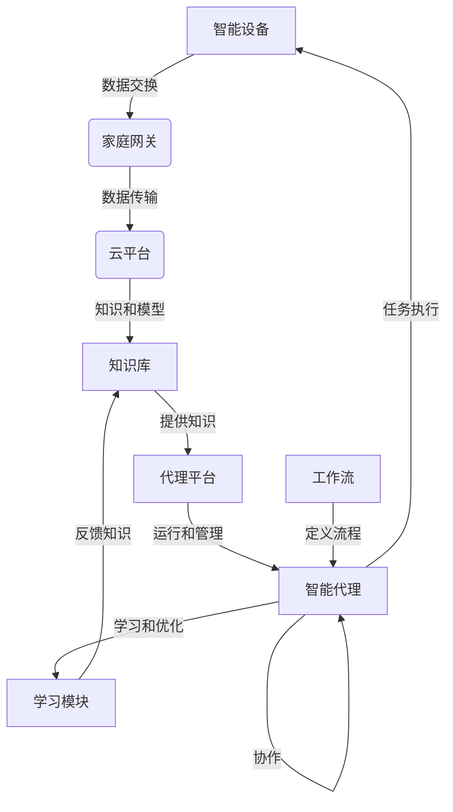

# AI人工智能代理工作流AI Agent Workflow：在智能家居场景应用代理技术

## 1. 背景介绍

### 1.1 问题的由来

随着物联网和人工智能技术的不断发展，智能家居已经成为了现代生活中不可或缺的一部分。智能家居系统旨在通过各种智能设备和传感器来监控和控制家居环境,为用户提供更加舒适、安全和节能的生活体验。然而,由于智能家居系统涉及多种异构设备和复杂的任务协调,因此需要一种高效的工作流程来协调和管理这些设备和任务。

在传统的智能家居系统中,通常采用集中式控制的方式,即由一个中央控制器负责管理和协调所有的智能设备。但是,这种方式存在一些缺陷,例如:

1. **单点故障风险**:如果中央控制器出现故障,整个系统将无法正常工作。
2. **扩展性差**:随着智能设备数量的增加,中央控制器的负载将越来越重,系统的性能和响应速度将受到影响。
3. **隐私和安全问题**:所有的数据和控制命令都需要经过中央控制器,存在潜在的隐私和安全风险。

为了解决这些问题,人工智能代理工作流(AI Agent Workflow)应运而生。

### 1.2 研究现状

人工智能代理工作流是一种分布式的智能系统架构,它将智能家居系统中的各种功能和任务分解为多个智能代理,每个代理负责特定的任务或功能。这些代理通过协作和交互来完成复杂的任务,从而实现整个系统的智能化控制。

目前,已有一些研究机构和公司在探索和应用人工智能代理工作流技术,例如:

- **麻省理工学院(MIT)人工智能实验室**:开发了一种基于多智能体系统的智能家居控制框架,通过多个智能代理的协作来实现家居环境的智能控制。
- **IBM Watson物联网平台**:提供了一种基于人工智能代理的物联网解决方案,可以在智能家居、智能城市等场景中应用。
- **Google Assistant**:Google推出的虚拟助手,可以通过自然语言交互的方式控制智能家居设备,实现了一种基于对话的人工智能代理工作流。

### 1.3 研究意义

应用人工智能代理工作流技术在智能家居场景中具有重要的意义:

1. **提高系统的可靠性和容错性**:由于系统采用分布式架构,单个代理出现故障不会影响整个系统的运行。
2. **增强系统的扩展性和灵活性**:可以根据需求动态添加或移除代理,无需重构整个系统。
3. **提升用户体验**:代理可以根据用户的偏好和行为习惯进行个性化的智能控制,提供更加人性化的服务。
4. **保护用户隐私和数据安全**:数据和控制命令在本地代理中处理,降低了隐私和安全风险。

### 1.4 本文结构

本文将详细介绍人工智能代理工作流在智能家居场景中的应用,包括以下几个方面:

1. 核心概念与联系
2. 核心算法原理与具体操作步骤
3. 数学模型和公式详细讲解与案例分析
4. 项目实践:代码实例和详细解释说明
5. 实际应用场景
6. 工具和资源推荐
7. 总结:未来发展趋势与挑战
8. 附录:常见问题与解答

## 2. 核心概念与联系

在介绍人工智能代理工作流的核心概念之前,我们先来了解一下智能家居系统中的几个关键概念:

1. **智能设备(Smart Device)**:指具有一定智能化功能的家用电器或传感器,如智能灯泡、智能门锁、温湿度传感器等。
2. **家庭网关(Home Gateway)**:连接智能设备和互联网的网关设备,负责智能设备的管理和数据交换。
3. **云平台(Cloud Platform)**:提供远程控制、数据存储和分析等服务的云端平台。

人工智能代理工作流中的核心概念包括:

1. **智能代理(Intelligent Agent)**:具有一定智能和自主性的软件实体,可以感知环境、执行任务并与其他代理协作。
2. **代理平台(Agent Platform)**:运行和管理智能代理的软件平台,提供代理之间的通信和协作机制。
3. **工作流(Workflow)**:定义了智能代理之间的任务分配、执行顺序和协作方式。
4. **知识库(Knowledge Base)**:存储代理所需的规则、数据和模型的数据库。
5. **学习模块(Learning Module)**:使代理具有自主学习和优化的能力,提高系统的智能水平。

这些概念之间的关系如下:

智能设备通过家庭网关与云平台进行数据交换,云平台提供知识和模型给知识库。代理平台基于知识库运行和管理智能代理,智能代理根据工作流执行任务,控制智能设备,并通过学习模块不断优化自身。智能代理之间也可以协作完成复杂任务。

## 3. 核心算法原理与具体操作步骤

### 3.1 算法原理概述

人工智能代理工作流的核心算法原理是**基于规则的推理和多智能体协作**。具体来说,包括以下几个方面:

1. **规则库(Rule Base)**:存储了系统中所有的规则,如设备控制规则、任务执行规则、代理协作规则等。
2. **推理引擎(Inference Engine)**:根据规则库中的规则和当前的环境状态,推理出应该执行的行为或任务。
3. **任务分解(Task Decomposition)**:将复杂任务分解为多个子任务,分配给不同的智能代理执行。
4. **代理协作(Agent Collaboration)**:智能代理之间通过消息传递和协商机制进行协作,完成分配的子任务。
5. **学习优化(Learning and Optimization)**:通过机器学习算法,智能代理可以从历史数据和用户反馈中学习,优化规则库和决策模型。

### 3.2 算法步骤详解

人工智能代理工作流的算法步骤如下:

1. **初始化**:启动代理平台,加载规则库、知识库和学习模块。
2. **环境感知**:智能代理通过传感器或用户输入获取当前环境状态。
3. **状态匹配**:推理引擎根据当前状态和规则库进行匹配,确定需要执行的任务或行为。
4. **任务分解**:如果是复杂任务,则将其分解为多个子任务。
5. **代理分配**:根据代理的能力和当前负载,将子任务分配给合适的智能代理执行。
6. **代理协作**:智能代理通过消息传递和协商,协作完成分配的子任务。
7. **行为执行**:智能代理执行相应的行为,如控制智能设备、发送通知等。
8. **反馈收集**:收集环境反馈和用户反馈,用于学习和优化。
9. **学习优化**:利用机器学习算法,优化规则库、决策模型和代理行为。
10. **循环迭代**:重复上述步骤,持续优化系统性能。

### 3.3 算法优缺点

人工智能代理工作流算法的优点包括:

1. **高可靠性**:分布式架构,单点故障影响较小。
2. **高扩展性**:可以动态添加或移除智能代理。
3. **高灵活性**:可以根据需求定制工作流和规则。
4. **智能化**:通过学习和优化,系统智能水平不断提高。

缺点包括:

1. **复杂性高**:涉及多个智能代理的协作,系统复杂度较高。
2. **通信开销**:智能代理之间需要频繁通信,存在一定的通信开销。
3. **一致性问题**:多个智能代理并行执行,需要解决数据一致性问题。
4. **隐私和安全风险**:智能代理可能会访问敏感数据,存在隐私和安全风险。

### 3.4 算法应用领域

人工智能代理工作流算法不仅可以应用于智能家居场景,还可以应用于以下领域:

1. **智能制造**:通过智能代理协作,实现工厂自动化和智能优化。
2. **智能交通**:利用智能代理控制交通信号灯、导航等,优化交通流量。
3. **智能医疗**:智能代理可以协助医生诊断和治疗,提高医疗效率和质量。
4. **智能建筑**:通过智能代理管理楼宇设备,实现节能和智能化。
5. **军事领域**:智能代理可以用于无人机协同作战、情报分析等。

## 4. 数学模型和公式详细讲解与举例说明

### 4.1 数学模型构建

在人工智能代理工作流中,我们需要构建数学模型来描述和优化系统的行为。常用的数学模型包括:

1. **马尔可夫决策过程(Markov Decision Process, MDP)**:用于描述智能代理在不确定环境中的决策过程。
2. **多智能体马尔可夫决策过程(Multi-Agent Markov Decision Process, MMDP)**:扩展了 MDP,用于描述多个智能代理之间的协作决策过程。
3. **博弈论模型(Game Theory Model)**:用于分析智能代理之间的竞争和合作关系。
4. **机器学习模型**:如深度神经网络、强化学习等,用于优化智能代理的决策和行为。

我们以马尔可夫决策过程(MDP)为例,构建数学模型。

MDP 可以用一个五元组 $(S, A, P, R, \gamma)$ 来表示:

- $S$ 是状态集合,表示环境的所有可能状态。
- $A$ 是行为集合,表示智能代理可以执行的所有行为。
- $P(s'|s, a)$ 是状态转移概率,表示在状态 $s$ 下执行行为 $a$ 后,转移到状态 $s'$ 的概率。
- $R(s, a)$ 是即时奖励函数,表示在状态 $s$ 下执行行为 $a$ 所获得的即时奖励。
- $\gamma \in [0, 1)$ 是折现因子,用于平衡即时奖励和长期奖励。

智能代理的目标是找到一个策略 $\pi: S \rightarrow A$,使得期望的累积折现奖励最大化:

$$
\max_\pi \mathbb{E}\left[\sum_{t=0}^\infty \gamma^t R(s_t, a_t) \Big| \pi\right]
$$

其中 $s_t$ 和 $a_t$ 分别表示第 $t$ 个时间步的状态和行为。

### 4.2 公式推导过程

我们可以使用动态规划或强化学习算法来求解最优策略 $\pi^*$。以值迭代算法(Value Iteration)为例,其核心思想是通过不断更新状态值函数 $V(s)$,逼近最优值函数 $V^*(s)$。

值迭代算法的更新公式如下:

$$
V_{k+1}(s) = \max_{a \in A} \left\{R(s, a) + \gamma \sum_{s' \in S} P(s'|s, a) V_k(s')\right\}
$$

其中 $V_k(s)$ 表示第 $k$ 次迭代时状态 $s$ 的值函数估计。

通过不断迭代更新,值函数 $V_k(s)$ 将收敛到最优值函数 $V^*(s)$,对应的最优策略为:

$$
\pi^*(s) = \arg\max_{a \in A} \left\{R(s, a) + \gamma \sum_{s' \in S} P(s'|s, a) V^*(s')\right\}
$$

###