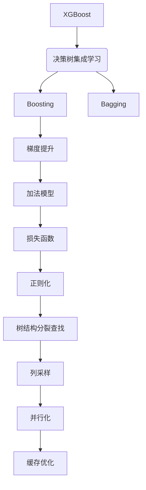

# XGBoost 原理与代码实战案例讲解

## 1. 背景介绍

### 1.1 问题的由来

在当今大数据时代，数据的规模和复杂性都在不断增长。传统的机器学习算法在处理大规模数据集时往往会遇到效率低下、过拟合等问题。为了解决这些挑战,XGBoost(Extreme Gradient Boosting)应运而生。它是一种高效的梯度提升决策树算法,广泛应用于各种预测任务中。

### 1.2 研究现状

XGBoost自2014年发布以来,迅速成为了业界最流行的机器学习算法之一。它在众多机器学习竞赛中表现出色,并被许多知名公司(如微软、亚马逊等)广泛采用。目前,XGBoost已成为机器学习从业者的必备技能之一。

### 1.3 研究意义

XGBoost的优势在于它能够高效地处理大规模数据,并提供出色的预测性能。通过研究XGBoost的原理和实现,我们可以更好地理解梯度提升算法的工作机制,并将其应用于实际问题中。此外,了解XGBoost的内部结构和优化技术,也有助于我们设计出更高效、更准确的机器学习模型。

### 1.4 本文结构

本文将从以下几个方面全面介绍XGBoost:

1. 核心概念与联系
2. 核心算法原理与具体操作步骤
3. 数学模型和公式详细讲解与案例分析
4. 项目实践:代码实例和详细解释说明
5. 实际应用场景
6. 工具和资源推荐
7. 总结:未来发展趋势与挑战
8. 附录:常见问题与解答

## 2. 核心概念与联系



XGBoost是一种基于决策树的集成学习算法,它结合了Boosting和Bagging的思想。其核心是梯度提升(Gradient Boosting)算法,通过构建一个加法模型,并在每一轮迭代中优化一个损失函数,从而逐步拟合训练数据。

为了提高模型的泛化能力,XGBoost引入了正则化(Regularization)技术,用于控制模型的复杂度。在构建决策树时,XGBoost采用了一种高效的树结构分裂查找(Tree Pruning)算法,以及列采样(Column Subsampling)技术,从而提高了训练速度和模型的鲁棒性。

此外,XGBoost还实现了多线程并行化(Parallelization)和缓存优化(Cache Optimization),进一步提升了计算效率。这些优化技术使得XGBoost在处理大规模数据集时表现出色,成为了机器学习领域的佼佼者。

## 3. 核心算法原理与具体操作步骤

### 3.1 算法原理概述

XGBoost的核心算法是梯度提升决策树(Gradient Boosting Decision Tree, GBDT)。它通过以下步骤构建一个强大的预测模型:

1. 初始化一个简单的模型,通常是一个常数或平均值。
2. 对于每一轮迭代:
   a. 计算当前模型在训练数据上的残差(residual)。
   b. 根据残差,拟合一个新的决策树模型。
   c. 将新模型加入到整体模型中,形成一个加法模型。
3. 重复步骤2,直到达到停止条件(如最大迭代次数或模型收敛)。

在每一轮迭代中,XGBoost通过优化一个正则化的目标函数,来确定新的决策树模型。这个目标函数包括两部分:训练数据上的损失函数(Loss Function)和模型复杂度的惩罚项(Regularization Term)。

### 3.2 算法步骤详解

1. **初始化模型**

   初始化一个简单的模型,通常是一个常数或训练数据的平均值。这个初始模型用于计算第一轮迭代的残差。

2. **计算残差**

   对于第t轮迭代,计算当前模型在训练数据上的残差:

   $$r_{ti} = y_i - \hat{y}_{t-1}(x_i)$$

   其中,$y_i$是第i个样本的真实标签,$\hat{y}_{t-1}(x_i)$是前t-1轮迭代得到的模型在$x_i$上的预测值。

3. **拟合新的决策树模型**

   使用残差$r_{ti}$作为新的"伪残差",拟合一个新的决策树模型$f_t(x)$。这个决策树模型的目标是最小化以下目标函数:

   $$\mathrm{Obj}^{(t)} = \sum_{i=1}^n l(y_i, \hat{y}_{t-1}(x_i) + f_t(x_i)) + \Omega(f_t)$$

   其中,$l$是损失函数(如平方损失或对数损失),$\Omega$是正则化项,用于控制模型复杂度。

4. **更新整体模型**

   将新拟合的决策树模型$f_t(x)$加入到整体模型中,形成一个加法模型:

   $$\hat{y}_t(x) = \hat{y}_{t-1}(x) + \eta f_t(x)$$

   其中,$\eta$是学习率(Learning Rate),控制每一轮迭代对整体模型的影响程度。

5. **重复迭代**

   重复步骤2-4,直到达到停止条件(如最大迭代次数或模型收敛)。

在每一轮迭代中,XGBoost采用了一些优化技术来提高效率和模型质量,包括:

- **正则化(Regularization)**:通过在目标函数中加入惩罚项,控制模型复杂度,避免过拟合。
- **树结构分裂查找(Tree Pruning)**:使用一种高效的近似算法来查找最优的决策树分裂点,从而加快训练速度。
- **列采样(Column Subsampling)**:在构建决策树时,只使用一部分特征,提高模型的鲁棒性。
- **并行化(Parallelization)**:利用多线程并行计算,加速训练过程。
- **缓存优化(Cache Optimization)**:通过数据压缩和缓存技术,减少内存占用和磁盘IO开销。

### 3.3 算法优缺点

**优点**:

- 高效处理大规模数据,训练速度快。
- 防止过拟合,泛化能力强。
- 支持多种损失函数和评估指标。
- 内置了多种优化技术,如并行化和缓存优化。
- 适用于分类、回归、排序等多种任务。

**缺点**:

- 模型可解释性较差,难以直观解释特征的重要性。
- 对异常值敏感,需要进行数据预处理。
- 参数较多,调参过程复杂。
- 对于高维稀疏数据,性能可能不佳。

### 3.4 算法应用领域

XGBoost由于其出色的性能和高效的计算能力,在各种领域都有广泛的应用,包括但不限于:

- 金融风险预测
- 网络安全和欺诈检测
- 推荐系统和个性化营销
- 天气预报和气候建模
- 基因组学和生物信息学
- 计算机视觉和图像识别
- 自然语言处理和文本分类
- 工业预测维护和故障诊断

## 4. 数学模型和公式详细讲解与举例说明

### 4.1 数学模型构建

XGBoost的数学模型基于加法模型(Additive Model)和梯度提升算法(Gradient Boosting)。假设我们有一个训练数据集$\mathcal{D} = \{(x_i, y_i)\}_{i=1}^n$,其中$x_i$是输入特征向量,$y_i$是对应的标签。我们希望找到一个模型$\hat{y}(x)$,使得它能够很好地拟合训练数据。

XGBoost的加法模型表示为:

$$\hat{y}(x) = \phi(x) + \sum_{k=1}^K f_k(x)$$

其中,$\phi(x)$是一个初始模型(如常数或平均值),$f_k(x)$是第k棵决策树模型,$K$是决策树的总数。

在梯度提升算法中,我们希望通过迭代的方式,逐步优化目标函数:

$$\mathrm{Obj} = \sum_{i=1}^n l(y_i, \hat{y}(x_i)) + \sum_{k=1}^K \Omega(f_k)$$

其中,$l$是损失函数(如平方损失或对数损失),$\Omega$是正则化项,用于控制模型复杂度。

在每一轮迭代中,我们需要找到一个新的决策树模型$f_t$,使得目标函数最小化:

$$f_t = \underset{f}{\arg\min} \sum_{i=1}^n l(y_i, \hat{y}_{t-1}(x_i) + f(x_i)) + \Omega(f)$$

其中,$\hat{y}_{t-1}$是前t-1轮迭代得到的模型。

通过不断迭代,我们可以得到一系列决策树模型$\{f_1, f_2, \dots, f_K\}$,并将它们相加,形成最终的预测模型$\hat{y}(x)$。

### 4.2 公式推导过程

在XGBoost中,我们通常使用二阶泰勒展开来近似目标函数,从而简化优化过程。对于任意一个可微的凸函数$l(y, \hat{y})$,在点$\hat{y}_{t-1}$处进行二阶泰勒展开:

$$l(y, \hat{y}_{t-1} + f_t(x)) \approx l(y, \hat{y}_{t-1}) + g_tf_t(x) + \frac{1}{2}h_tf_t^2(x)$$

其中,$g_t = \partial_{\hat{y}_{t-1}}l(y, \hat{y}_{t-1})$是损失函数在$\hat{y}_{t-1}$处的一阶导数(梯度),$h_t = \partial^2_{\hat{y}_{t-1}}l(y, \hat{y}_{t-1})$是二阶导数(海森矩阵对角线元素)。

将上式代入目标函数,并去掉与$f_t$无关的常数项,我们得到:

$$\mathrm{Obj}^{(t)} \approx \sum_{i=1}^n [g_{ti}f_t(x_i) + \frac{1}{2}h_{ti}f_t^2(x_i)] + \Omega(f_t)$$

其中,$g_{ti} = \partial_{\hat{y}_{t-1}}l(y_i, \hat{y}_{t-1}(x_i))$,$h_{ti} = \partial^2_{\hat{y}_{t-1}}l(y_i, \hat{y}_{t-1}(x_i))$。

现在,我们需要找到一个决策树模型$f_t$,使得上式最小化。XGBoost采用了一种高效的近似算法来查找最优的决策树分裂点,从而加快训练速度。

### 4.3 案例分析与讲解

为了更好地理解XGBoost的数学模型和公式,我们以一个简单的二元分类问题为例进行分析。

假设我们有一个包含两个特征($x_1$和$x_2$)的训练数据集,标签为0或1。我们希望构建一个XGBoost模型来预测样本属于哪一类。

1. **初始化模型**

   我们初始化一个常数模型$\phi(x) = \log(\frac{1}{2})$,表示两个类别的先验概率相等。

2. **计算残差**

   对于第一轮迭代,残差为:

   $$r_{1i} = y_i - \phi(x_i) = y_i - \log(\frac{1}{2})$$

3. **拟合新的决策树模型**

   使用残差$r_{1i}$作为"伪残差",拟合一棵新的决策树模型$f_1(x)$。假设我们得到了如下决策树:

   ```mermaid
   graph TD
       A[Root] --> B{x1 <= 0.5}
       B -->|Yes| C[Leaf: 0.2]
       B -->|No| D[Leaf: -0.3]