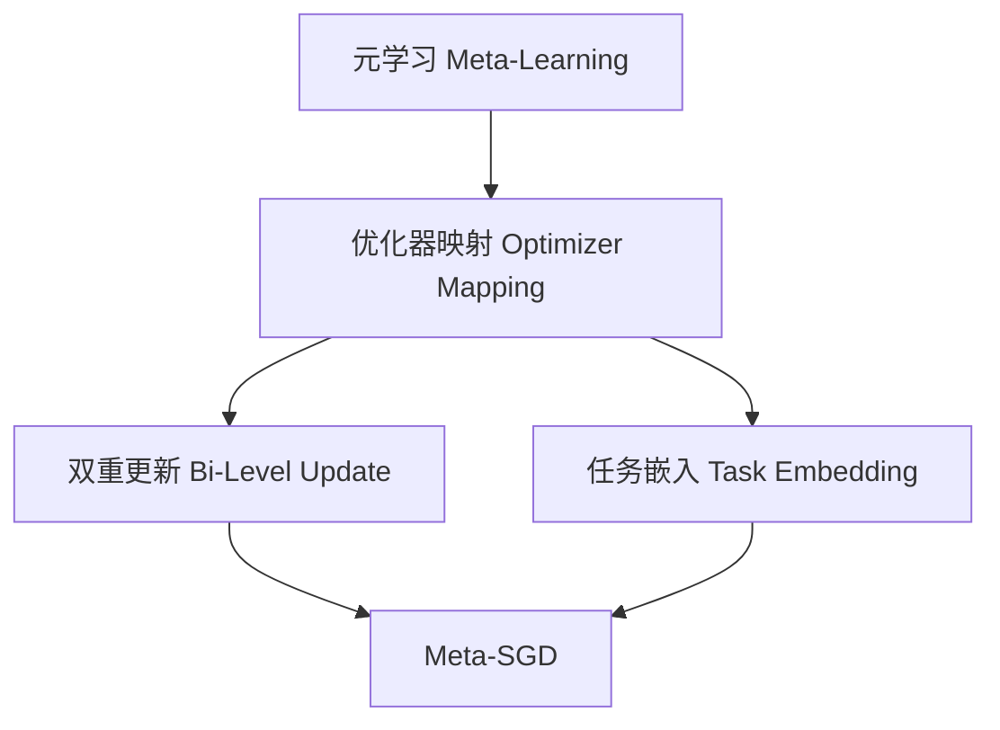

# 一切皆是映射：Meta-SGD：元学习的优化器调整

## 1. 背景介绍

### 1.1 问题的由来

在深度学习的发展历程中,模型的优化一直是一个关键的挑战。传统的优化算法如随机梯度下降(SGD)虽然简单有效,但在处理复杂任务时往往需要耗费大量的时间和资源进行调参,以获得理想的性能表现。为了解决这一问题,元学习(Meta-Learning)应运而生,它旨在自动学习优化算法的参数,从而加快模型在新任务上的收敛速度。

Meta-SGD作为元学习领域的一种新颖方法,通过学习一个可更新的优化器,使其能够根据不同任务的特征自适应地调整优化策略,从而显著提高了模型的泛化能力和收敛速率。

### 1.2 研究现状

目前,元学习在机器学习领域已经取得了广泛的关注和应用。一些经典的元学习算法,如MAML(Model-Agnostic Meta-Learning)、Reptile等,已经被证明在少样本学习、持续学习等任务中表现出色。然而,这些算法往往需要对元学习器和基学习器进行分开训练,增加了训练复杂度。

相比之下,Meta-SGD则是一种全新的范式,它将优化器参数直接整合到模型中,使得优化器能够在训练过程中自动进化,从而实现了端到端的优化。这种思路不仅简化了训练流程,而且为优化器提供了更大的灵活性,使其能够更好地适应不同的任务需求。

### 1.3 研究意义

Meta-SGD的提出为解决深度学习中的优化问题开辟了一条全新的途径。它的核心思想是将优化器视为一个可学习的组件,使其能够根据任务的特征动态调整优化策略,从而显著提高模型的泛化能力和收敛速率。

这一创新思路不仅在理论层面上具有重要意义,更为实际应用带来了巨大的价值。例如,在少样本学习、持续学习等领域,Meta-SGD可以帮助模型更快地适应新的任务,从而大幅降低了数据标注和计算资源的需求。同时,它也为优化算法的自动设计提供了一种新的思路,有望推动机器学习算法的自动化发展。

### 1.4 本文结构

本文将全面介绍Meta-SGD的核心理论、算法细节以及实际应用。具体内容安排如下:

1. 背景介绍
2. 核心概念与联系
3. 核心算法原理与具体操作步骤
4. 数学模型和公式详细讲解与举例说明
5. 项目实践:代码实例和详细解释说明
6. 实际应用场景
7. 工具和资源推荐
8. 总结:未来发展趋势与挑战
9. 附录:常见问题与解答

## 2. 核心概念与联系

Meta-SGD的核心思想是将优化器视为一个可学习的组件,使其能够根据任务的特征动态调整优化策略。为了实现这一目标,Meta-SGD引入了一些关键概念,包括:

1. **元学习(Meta-Learning)**: 元学习是机器学习中的一个重要范式,它旨在通过学习不同任务之间的共性,从而加快新任务的学习速度。Meta-SGD正是基于这一思想,通过学习优化器参数,使其能够适应不同的任务需求。

2. **优化器映射(Optimizer Mapping)**: 这是Meta-SGD的核心概念。它将优化器视为一个可学习的映射函数,该函数将模型参数和任务特征作为输入,输出优化器的更新策略。通过学习这个映射函数,优化器就能够根据任务的特征自适应地调整优化策略。

3. **双重更新(Bi-Level Update)**: 为了学习优化器映射,Meta-SGD采用了双重更新的策略。在内循环中,它使用当前的优化器参数更新模型参数;在外循环中,它根据模型在不同任务上的表现,反向更新优化器参数。这种双重更新机制使得优化器能够不断进化,适应不同任务的需求。

4. **任务嵌入(Task Embedding)**: 为了捕捉任务的特征,Meta-SGD引入了任务嵌入的概念。它将每个任务的数据和标签编码为一个向量,作为优化器映射的输入之一,从而使优化器能够根据任务的特征进行调整。

这些核心概念相互关联,共同构建了Meta-SGD的理论基础。通过将优化器视为一个可学习的映射,并利用双重更新和任务嵌入等技术,Meta-SGD实现了优化器的自适应调整,从而显著提高了模型的泛化能力和收敛速率。

## 3. 核心算法原理与具体操作步骤

### 3.1 算法原理概述

Meta-SGD的核心原理是将优化器视为一个可学习的映射函数,该函数将模型参数和任务特征作为输入,输出优化器的更新策略。通过学习这个映射函数,优化器就能够根据任务的特征自适应地调整优化策略,从而显著提高模型的泛化能力和收敛速率。

具体来说,Meta-SGD采用了双重更新的策略:

1. **内循环更新(Inner-Loop Update)**: 在内循环中,Meta-SGD使用当前的优化器参数更新模型参数,就像传统的梯度下降一样。这一步骤可以表示为:

$$\theta' = \theta - \alpha \nabla_\theta \mathcal{L}(\theta, \mathcal{D}_\text{train})$$

其中,$\theta$表示模型参数,$\mathcal{L}$表示损失函数,$\mathcal{D}_\text{train}$表示训练数据集,$\alpha$表示学习率,它是由优化器映射函数输出的。

2. **外循环更新(Outer-Loop Update)**: 在外循环中,Meta-SGD根据模型在不同任务上的表现,反向更新优化器参数。具体来说,它计算模型在验证集上的损失,并对优化器参数进行梯度更新,以最小化这一损失。这一步骤可以表示为:

$$\phi' = \phi - \beta \nabla_\phi \mathcal{L}(\theta', \mathcal{D}_\text{val})$$

其中,$\phi$表示优化器参数,$\beta$表示元学习率(meta learning rate),$\mathcal{D}_\text{val}$表示验证数据集。

通过这种双重更新机制,优化器参数不断进化,使得优化器能够适应不同任务的需求,从而显著提高模型的泛化能力和收敛速率。

### 3.2 算法步骤详解

Meta-SGD算法的具体步骤如下:

1. **初始化**: 初始化模型参数$\theta$和优化器参数$\phi$。

2. **采样任务批次**: 从任务分布中采样一个任务批次$\mathcal{T}$,每个任务$\mathcal{T}_i$包含一个支持集(support set)$\mathcal{D}_\text{train}^i$和一个查询集(query set)$\mathcal{D}_\text{val}^i$。

3. **内循环更新**:
   a. 对于每个任务$\mathcal{T}_i$,计算支持集上的损失$\mathcal{L}(\theta, \mathcal{D}_\text{train}^i)$。
   b. 使用当前的优化器参数$\phi$和模型参数$\theta$,通过优化器映射函数计算更新步长$\alpha$。
   c. 根据更新步长$\alpha$,更新模型参数$\theta'$。

4. **外循环更新**:
   a. 计算查询集上的损失$\mathcal{L}(\theta', \mathcal{D}_\text{val}^i)$。
   b. 对所有任务的查询集损失求和,得到元损失(meta loss)$\sum_i \mathcal{L}(\theta', \mathcal{D}_\text{val}^i)$。
   c. 对元损失进行反向传播,计算优化器参数$\phi$的梯度。
   d. 使用元学习率$\beta$,更新优化器参数$\phi'$。

5. **重复步骤2-4**,直到收敛或达到最大迭代次数。

通过这种双重更新机制,Meta-SGD能够同时优化模型参数和优化器参数,使得优化器能够根据任务的特征自适应地调整优化策略,从而显著提高模型的泛化能力和收敛速率。

### 3.3 算法优缺点

**优点**:

1. **端到端优化**: Meta-SGD将优化器参数直接整合到模型中,实现了端到端的优化,简化了训练流程。

2. **自适应优化**: 通过学习优化器映射,Meta-SGD使得优化器能够根据任务的特征动态调整优化策略,从而显著提高了模型的泛化能力和收敛速率。

3. **灵活性强**: Meta-SGD为优化器提供了更大的灵活性,使其能够更好地适应不同的任务需求。

4. **少样本学习**: Meta-SGD在少样本学习任务中表现出色,能够快速适应新的任务,从而大幅降低了数据标注和计算资源的需求。

**缺点**:

1. **计算开销大**: Meta-SGD需要同时优化模型参数和优化器参数,计算开销较大,尤其是在处理大规模数据集时。

2. **收敛性问题**: 由于优化器参数和模型参数的交互影响,Meta-SGD的收敛性可能会受到影响,需要谨慎设置超参数。

3. **任务分布偏差**: Meta-SGD的性能在一定程度上依赖于训练任务和测试任务的分布一致性。如果两者存在较大偏差,可能会导致性能下降。

4. **理论分析复杂**: Meta-SGD涉及了双重优化问题,其理论分析相对复杂,需要更深入的研究来探索其收敛性和优化性质。

### 3.4 算法应用领域

由于Meta-SGD在少样本学习和快速适应新任务方面表现出色,因此它在以下领域具有广阔的应用前景:

1. **计算机视觉**:
   - 少样本目标检测和分割
   - 持续学习视觉模型
   - 视觉域适应

2. **自然语言处理**:
   - 少样本文本分类和序列标注
   - 持续学习语言模型
   - 跨领域/跨语言迁移学习

3. **强化学习**:
   - 快速适应新环境
   - 元策略优化
   - 机器人控制

4. **医疗健康**:
   - 少样本疾病诊断
   - 个性化治疗方案
   - 药物发现

5. **物联网**:
   - 边缘设备上的持续学习
   - 个性化推荐系统
   - 预测性维护

总的来说,Meta-SGD为解决深度学习中的优化问题开辟了一条全新的途径,它的广阔应用前景值得我们进一步探索和研究。

## 4. 数学模型和公式详细讲解与举例说明

### 4.1 数学模型构建

为了构建Meta-SGD的数学模型,我们首先需要定义一些基本概念和符号:

- $\mathcal{T}$: 任务分布,每个任务$\mathcal{T}_i$包含一个支持集(support set)$\mathcal{D}_\text{train}^i$和一个查询集(query set)$\mathcal{D}_\text{val}^i$。
- $\theta$: 模型参数。
- $\phi$: 优化器参数。
- $\mathcal{L}(\theta, \mathcal{D})$: 损失函数,用于评估模型在数据集$\mathcal{D}$上的性能。
- $f_\phi(\theta, \mathcal{D}_\text{train})$: 优化器映射函数,它将模型参数$\theta$和任务特征(通过支持集$\mathcal{D}_\text{train}$表示)作为输入,输出优化器的更新策略。

Meta-SGD的目标是找到一组优化器参数$\phi$,使得在任务分布$\mathcal{T}$上,模型在查询集上的期望损失最小化。数学上,我们可