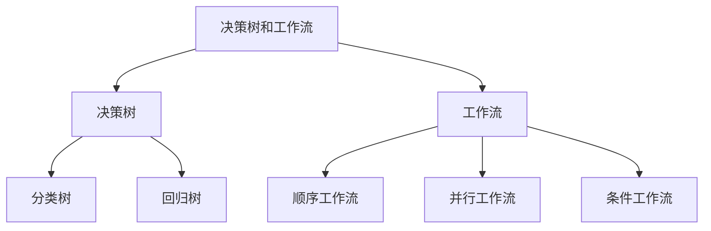

# 决策树和工作流：AI代理如何进行决策分析

## 1. 背景介绍

### 1.1 问题的由来

在当今快节奏的商业环境中，及时做出明智的决策对于企业的成功至关重要。然而，由于信息过载和复杂的决策过程,人类决策者常常面临着巨大的挑战。这就催生了对自动化决策支持系统的需求,以提高决策效率和质量。作为人工智能领域的一个分支,决策树和工作流技术应运而生,旨在模拟人类的决策过程,为复杂问题提供自动化解决方案。

### 1.2 研究现状

决策树和工作流技术已经在多个领域得到广泛应用,包括金融、医疗、制造业等。研究人员一直在努力改进算法,提高其准确性和可解释性。同时,随着大数据和机器学习技术的发展,决策树和工作流也在不断演进,以适应更复杂的决策场景。

### 1.3 研究意义

掌握决策树和工作流技术,对于企业和组织来说具有重要意义。它们可以帮助优化决策过程,提高效率,减少人为错误,从而为企业带来竞争优势。此外,这些技术还可以应用于自动化系统、智能代理等领域,为人工智能的发展做出贡献。

### 1.4 本文结构

本文将全面介绍决策树和工作流技术的原理、算法、应用场景等。首先,我们将探讨决策树和工作流的核心概念及其联系。接下来,将深入解释核心算法原理和具体操作步骤。然后,我们将构建数学模型,推导公式,并通过案例分析加深理解。此外,还将提供项目实践的代码示例和详细解释。最后,我们将探讨实际应用场景、工具和资源推荐,并总结未来发展趋势和面临的挑战。

## 2. 核心概念与联系

决策树和工作流是两个密切相关的概念,它们都旨在为复杂决策问题提供自动化解决方案。

**决策树**是一种基于树形结构的监督学习算法,用于解决分类和回归问题。它通过递归地将数据集划分为更小的子集,直到每个子集都具有相同的目标值或无法进一步划分为止。决策树可以分为两种主要类型:

1. **分类树**:用于解决分类问题,预测离散的目标值。
2. **回归树**:用于解决回归问题,预测连续的目标值。

**工作流**是一种描述业务过程的模型,它定义了一系列有序的活动及其执行条件。工作流可以分为三种主要类型:

1. **顺序工作流**:活动按照预定义的顺序依次执行。
2. **并行工作流**:多个活动可以同时执行。
3. **条件工作流**:活动的执行取决于特定条件的满足。

决策树和工作流之间存在密切的联系。决策树可以用于建模和优化工作流,帮助确定在特定条件下应该执行哪些活动。同时,工作流也可以用于构建决策树,将复杂的决策过程分解为一系列有条件的步骤。

## 3. 核心算法原理 & 具体操作步骤

### 3.1 算法原理概述

决策树和工作流算法的核心原理是将复杂的决策问题分解为一系列更简单的决策,并基于特征值构建树形结构或流程图。

**决策树算法**的主要步骤包括:

1. 选择最优特征作为根节点
2. 根据特征值将数据集划分为子集
3. 对子集递归构建子树
4. 直到所有实例属于同一类别或无法进一步划分

**工作流算法**的主要步骤包括:

1. 定义活动及其执行条件
2. 确定活动之间的依赖关系
3. 构建工作流模型
4. 根据输入数据执行工作流

这两种算法都利用了分而治之的策略,将复杂问题分解为更简单的子问题,从而提高了决策的效率和准确性。

### 3.2 算法步骤详解

#### 3.2.1 决策树算法步骤

1. **数据准备**:收集并预处理数据,确保数据质量。
2. **选择特征**:根据特征选择标准(如信息增益、基尼指数等)选择最优特征作为根节点。
3. **构建树**:根据特征值将数据集划分为子集,对每个子集递归构建子树。
4. **树的生长**:重复步骤2和3,直到满足停止条件(如所有实例属于同一类别或无法进一步划分)。
5. **树的修剪**:通过剪枝策略减少过拟合,提高泛化能力。
6. **树的输出**:将构建的决策树应用于新的数据实例,进行分类或回归预测。

#### 3.2.2 工作流算法步骤

1. **定义活动**:确定工作流中需要执行的活动及其属性(如输入、输出、执行条件等)。
2. **确定依赖关系**:分析活动之间的依赖关系,确定执行顺序。
3. **构建模型**:根据活动和依赖关系构建工作流模型,可以使用图形化工具或编程语言。
4. **执行工作流**:根据输入数据执行工作流,按照模型中定义的顺序和条件执行活动。
5. **监控和优化**:监控工作流执行情况,收集执行数据,并根据需要优化工作流模型。

### 3.3 算法优缺点

#### 3.3.1 决策树算法优缺点

**优点**:

- 易于理解和解释
- 可处理数值型和类别型数据
- 无需进行数据归一化
- 能够捕获非线性关系
- 训练速度快

**缺点**:

- 容易过拟合
- 对缺失数据敏感
- 对数据的微小变化敏感
- 对于某些问题可能产生不平衡的树结构

#### 3.3.2 工作流算法优缺点

**优点**:

- 提高了流程的可视化和可理解性
- 支持并行执行,提高效率
- 灵活性强,易于修改和扩展
- 有利于标准化和自动化
- 提高了流程的可重用性

**缺点**:

- 构建复杂工作流模型的难度较大
- 对于动态变化的环境,工作流可能需要频繁修改
- 工作流执行可能受到资源限制的影响
- 需要对工作流进行持续的监控和优化

### 3.4 算法应用领域

决策树和工作流算法在多个领域都有广泛的应用,包括但不限于:

- **金融**: 信用风险评估、欺诈检测、投资决策等。
- **医疗**: 疾病诊断、治疗方案选择、药物开发等。
- **制造业**: 产品缺陷检测、工艺优化、供应链管理等。
- **营销**: 客户分类、个性化推荐、营销策略优化等。
- **自然语言处理**: 文本分类、情感分析、对话系统等。
- **计算机视觉**: 图像分类、目标检测、场景理解等。

## 4. 数学模型和公式 & 详细讲解 & 举例说明

### 4.1 数学模型构建

决策树和工作流算法都涉及到一些数学模型和公式,用于量化特征重要性、评估模型性能等。

#### 4.1.1 决策树数学模型

**信息增益**是决策树算法中常用的特征选择标准之一,它基于信息论中的熵(entropy)概念。熵可以衡量数据集的无序程度,公式如下:

$$
H(X) = -\sum_{i=1}^{n}p(x_i)\log_2 p(x_i)
$$

其中,$ X $是离散随机变量,$ n $是可能取值的个数,$ p(x_i) $是$ X $取值为$ x_i $的概率。

特征$ A $对数据集$ D $的信息增益可以表示为:

$$
\text{Gain}(A, D) = H(D) - \sum_{v \in \text{Values}(A)} \frac{|D_v|}{|D|} H(D_v)
$$

其中,$ H(D) $是数据集$ D $的熵,$ \text{Values}(A) $是特征$ A $的所有可能取值,$ D_v $是在特征$ A $取值为$ v $的子集,$ |D_v| $和$ |D| $分别表示子集和总数据集的大小。

在决策树算法中,我们选择具有最大信息增益的特征作为节点,从而最大程度地减少数据集的无序程度。

#### 4.1.2 工作流数学模型

工作流模型通常可以用图论中的有向图来表示,其中节点表示活动,边表示活动之间的依赖关系。

对于并行工作流,我们可以使用**临界路径**概念来确定工作流的最短完成时间。临界路径是指完成工作流所需的最长时间路径,它可以用以下公式计算:

$$
\text{CP} = \max_{1 \leq i \leq n} \sum_{j \in P_i} t_j
$$

其中,$ n $是工作流中路径的数量,$ P_i $是第$ i $条路径,$ t_j $是路径$ P_i $中第$ j $个活动的执行时间。

通过计算临界路径,我们可以优化工作流的执行效率,并合理分配资源。

### 4.2 公式推导过程

#### 4.2.1 信息增益公式推导

信息增益公式的推导过程如下:

1. 定义数据集$ D $的熵$ H(D) $:

$$
H(D) = -\sum_{i=1}^{n}p(x_i)\log_2 p(x_i)
$$

其中,$ n $是类别的个数,$ p(x_i) $是数据集$ D $中属于第$ i $类的比例。

2. 计算特征$ A $对数据集$ D $的条件熵$ H(D|A) $:

$$
H(D|A) = \sum_{v \in \text{Values}(A)} \frac{|D_v|}{|D|} H(D_v)
$$

其中,$ \text{Values}(A) $是特征$ A $的所有可能取值,$ D_v $是在特征$ A $取值为$ v $的子集,$ |D_v| $和$ |D| $分别表示子集和总数据集的大小,$ H(D_v) $是子集$ D_v $的熵。

3. 信息增益定义为:

$$
\text{Gain}(A, D) = H(D) - H(D|A)
$$

将条件熵的公式代入,我们可以得到:

$$
\text{Gain}(A, D) = H(D) - \sum_{v \in \text{Values}(A)} \frac{|D_v|}{|D|} H(D_v)
$$

这就是信息增益的公式。

#### 4.2.2 临界路径公式推导

临界路径公式的推导过程如下:

1. 定义工作流中第$ i $条路径为$ P_i $,包含$ n_i $个活动。

2. 第$ i $条路径的总执行时间为:

$$
T_i = \sum_{j=1}^{n_i} t_j
$$

其中,$ t_j $是路径$ P_i $中第$ j $个活动的执行时间。

3. 工作流的最短完成时间等于所有路径中最长的那条路径的执行时间,即临界路径$ \text{CP} $:

$$
\text{CP} = \max_{1 \leq i \leq n} T_i
$$

将$ T_i $的公式代入,我们可以得到:

$$
\text{CP} = \max_{1 \leq i \leq n} \sum_{j=1}^{n_i} t_j
$$

这就是临界路径的公式。

### 4.3 案例分析与讲解

#### 4.3.1 决策树案例

假设我们有一个关于客户购买行为的数据集,包含以下特征:年龄、收入、学历、是否已婚、是否有小孩。我们希望构建一个决策树模型,预测客户是否会购买某种产品。

1. 计算每个特征对数据集的信息增益,选择具有最