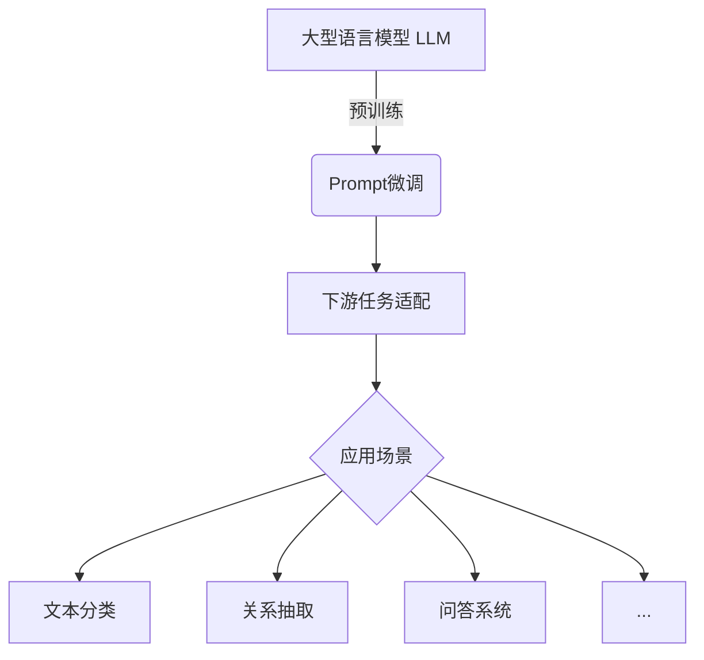

# 大语言模型应用指南：Prompt高效微调

## 1. 背景介绍

### 1.1 问题的由来

在过去几年中,大型语言模型(Large Language Models, LLMs)取得了令人瞩目的进展,展现出强大的自然语言理解和生成能力。然而,直接将预训练的LLM应用于下游任务通常会遇到一些挑战,例如:

1. **数据分布偏移**:预训练数据与下游任务数据之间存在分布差异,导致模型性能下降。
2. **指令不明确**:用户提供的指令可能存在歧义或不完整,导致模型无法正确理解和执行任务。
3. **知识更新滞后**:预训练数据通常无法及时反映最新知识,需要持续的知识更新。

为了解决这些挑战,Prompt微调(Prompt Tuning)作为一种有效的技术手段应运而生。

### 1.2 研究现状

Prompt微调是一种基于少量标注数据对预训练语言模型进行微调的方法。与传统的模型微调(Fine-tuning)相比,Prompt微调只需要更新模型的Prompt部分(通常是一个小的前缀或后缀),而保持大部分模型参数不变。这种方式具有以下优势:

1. **高效**:只需要更新少量参数,计算成本较低。
2. **泛化能力强**:保留了大部分预训练知识,有助于提高模型的泛化能力。
3. **可解释性好**:Prompt本身可以作为解释模型行为的线索。

目前,Prompt微调已经在多个领域取得了不错的效果,如文本分类、关系抽取、问答系统等。但与此同时,也存在一些需要进一步研究和改进的地方,如Prompt设计策略、微调算法优化、多任务场景下的Prompt共享等。

### 1.3 研究意义

高效的Prompt微调技术对于充分发挥大型语言模型的潜力至关重要。本文将系统地介绍Prompt微调的基本概念、核心算法原理、实践案例,以及未来的发展趋势和挑战,旨在为读者提供一个全面的Prompt微调指南。通过本文的学习,读者将能够:

1. 理解Prompt微调的基本思想和优势。
2. 掌握Prompt微调的核心算法和实现细节。
3. 了解Prompt微调在不同场景下的应用实践。
4. 获悉Prompt微调的发展趋势和面临的挑战。

### 1.4 本文结构

本文共分为9个部分:

1. 背景介绍
2. 核心概念与联系
3. 核心算法原理与具体操作步骤
4. 数学模型和公式详细讲解与举例说明
5. 项目实践:代码实例和详细解释说明
6. 实际应用场景
7. 工具和资源推荐
8. 总结:未来发展趋势与挑战
9. 附录:常见问题与解答

## 2. 核心概念与联系

在深入探讨Prompt微调的细节之前,我们先来了解一些核心概念及它们之间的联系。

1. **大型语言模型(LLM)**: 指通过自监督学习方式在大规模文本语料上预训练得到的大型神经网络模型,如GPT、BERT、T5等。这些模型具备强大的语言理解和生成能力,是Prompt微调的基础。

2. **Prompt**: 一段人工设计的文本序列,用于指导语言模型完成特定的下游任务。Prompt可以是任务说明、示例输入输出对、关键词等形式。

3. **Prompt微调**: 基于少量标注数据,对预训练语言模型的Prompt部分进行微调,使其更好地适配下游任务,而无需更新整个模型。

4. **下游任务适配**: 通过Prompt微调,将通用的大型语言模型适配到特定的下游任务上,如文本分类、关系抽取、问答系统等。

5. **应用场景**: Prompt微调技术可以广泛应用于自然语言处理的各个领域,包括但不限于文本分类、关系抽取、问答系统等。

## 3. 核心算法原理与具体操作步骤

### 3.1 算法原理概述

Prompt微调的核心思想是:通过学习一个很小的Prompt,将预训练语言模型适配到下游任务上,而不需要微调整个模型的参数。这种方式可以在保留预训练知识的同时,有效降低计算成本和避免过拟合的风险。

Prompt微调算法主要分为两个阶段:

1. **Prompt初始化**: 根据任务需求,设计一个初始的Prompt模板。
2. **Prompt微调**: 基于少量标注数据,对Prompt模板的参数(通常是词嵌入向量)进行微调,使其更好地指导语言模型完成下游任务。

在Prompt微调过程中,语言模型的其他参数保持不变,只有Prompt部分的参数在更新。这种参数高效微调的方式,可以极大地减少计算开销,同时避免了对预训练知识的破坏,从而提高了模型的泛化能力。

### 3.2 算法步骤详解

我们以文本分类任务为例,详细介绍Prompt微调的具体步骤:

1. **构建Prompt模板**

   根据任务需求,设计一个合适的Prompt模板。常见的Prompt模板形式包括:

   - 带有占位符的任务说明,如"这段文本的情感是 [X]"。
   - 示例输入输出对,如"评论:这部电影真是无聊透顶。情感:负面"。
   - 关键词提示,如"负面,无聊"。

   Prompt模板的设计直接影响了模型的理解和表现,需要结合具体任务和数据特点进行探索。

2. **初始化Prompt嵌入**

   将Prompt模板tokenize为一系列token,并为每个token随机初始化一个可训练的嵌入向量,作为Prompt的参数。

3. **构建微调数据**

   从下游任务的标注数据中,抽取出一小部分数据作为微调集。通常只需要几十到几百个样本即可。

4. **微调Prompt嵌入**

   将Prompt嵌入与语言模型的输出进行结合,并基于微调数据,使用监督学习的方式微调Prompt嵌入。常见的优化目标是最小化模型在微调集上的损失函数(如交叉熵损失)。

5. **模型推理**

   在推理阶段,将微调后的Prompt与输入序列拼接,输入到语言模型中进行预测。由于Prompt已经被微调以适配下游任务,因此模型可以生成更准确的输出。

通过上述步骤,我们可以高效地将预训练语言模型适配到特定的下游任务上,而无需对整个模型进行昂贵的微调。

### 3.3 算法优缺点

**优点**:

1. **高效**:只需要微调少量的Prompt参数,计算开销较低。
2. **泛化能力强**:保留了大部分预训练知识,有助于提高模型的泛化能力。
3. **可解释性好**:Prompt本身可以作为解释模型行为的线索。
4. **灵活性高**:可以方便地探索不同形式的Prompt,以适应不同任务需求。

**缺点**:

1. **Prompt设计挑战**:设计高质量的Prompt模板需要一定的经验和探索。
2. **表现上限**:相比完全微调,Prompt微调的性能提升有一定上限。
3. **长期依赖**:对于一些需要持续学习的任务,Prompt微调可能无法完全满足需求。

总的来说,Prompt微调是一种高效且具有一定优势的微调方法,但也存在一些局限性,需要根据具体任务特点权衡利弊。

### 3.4 算法应用领域

Prompt微调技术可以广泛应用于自然语言处理的各个领域,包括但不限于:

1. **文本分类**:通过设计合适的Prompt,将文本分类任务转化为语言模型的文本生成问题。
2. **关系抽取**:利用Prompt指导语言模型从文本中抽取出实体及其关系。
3. **问答系统**:将问题和上下文文本拼接为Prompt,让语言模型生成答案。
4. **文本摘要**:使用Prompt引导语言模型生成文本的摘要。
5. **数据增强**:通过构造不同的Prompt,从语言模型生成多样化的数据,用于数据增强。
6. **少样本学习**:利用Prompt微调,可以在少量标注数据的情况下快速适配语言模型。

除了上述领域,Prompt微调技术在自然语言理解、生成、多模态等多个方向都有广阔的应用前景。

## 4. 数学模型和公式详细讲解与举例说明

### 4.1 数学模型构建

在正式介绍Prompt微调的数学模型之前,我们先回顾一下语言模型的基本原理。

语言模型的目标是学习文本序列的概率分布$P(X)$,其中$X=\{x_1, x_2, \ldots, x_n\}$表示长度为$n$的token序列。基于链式法则,我们可以将$P(X)$分解为:

$$P(X) = \prod_{t=1}^{n}P(x_t|x_1, \ldots, x_{t-1})$$

其中$P(x_t|x_1, \ldots, x_{t-1})$表示在给定前$t-1$个token的条件下,生成第$t$个token的概率。

对于Transformer等基于自注意力机制的语言模型,我们可以使用掩码自注意力机制来并行计算上述条件概率。具体来说,给定输入序列$X$和掩码向量$M$,模型的输出向量$H$可以表示为:

$$H = \text{Transformer}(X, M)$$

其中$\text{Transformer}(\cdot)$代表Transformer模型的计算过程。

在Prompt微调中,我们将Prompt $P$和输入序列$X$拼接为新的输入序列$X^{'}=[P;X]$,并将它们输入到语言模型中。对于文本分类任务,我们可以将分类标签$y$作为模型的输出目标,并最小化模型的交叉熵损失:

$$\mathcal{L} = -\log P(y|X^{'})$$

在微调过程中,我们只更新Prompt $P$的参数,而保持语言模型其他参数不变。

### 4.2 公式推导过程

接下来,我们将详细推导Prompt微调的数学模型及其优化目标。

假设我们有一个包含$N$个样本的微调数据集$\mathcal{D}=\{(X^{(i)}, y^{(i)})\}_{i=1}^{N}$,其中$X^{(i)}$表示第$i$个样本的输入序列,$y^{(i)}$表示对应的标签。我们的目标是找到一个合适的Prompt $P$,使得在微调数据集上的损失函数最小化:

$$\min_{P} \sum_{i=1}^{N} \mathcal{L}(y^{(i)}, P(X^{(i)}))$$

其中$\mathcal{L}(\cdot)$是一个损失函数,如交叉熵损失。$P(X^{(i)})$表示将Prompt $P$与输入序列$X^{(i)}$拼接后,输入到语言模型中得到的输出概率分布。

为了优化上述目标函数,我们可以使用随机梯度下降(SGD)等优化算法。在每一步迭代中,我们计算损失函数关于Prompt参数的梯度,并沿着梯度的反方向更新Prompt参数。

具体来说,假设Prompt $P$由$m$个token组成,每个token对应一个可训练的嵌入向量$e_j \in \mathbb{R}^{d}$,其中$j=1,\ldots,m$。我们将这些嵌入向量拼接为一个矩阵$E = [e_1, e_2, \ldots, e_m] \in \mathbb{R}^{d \times m}$,作为Prompt的参数。

在第$t$次迭代中,我们从微调数据集$\mathcal{D}$中采样一个小批量数据$\mathcal{B}_t$,并计