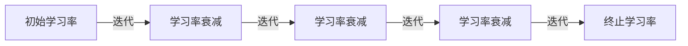

# 学习率衰减Learning Rate Decay原理与代码实例讲解

作者：禅与计算机程序设计艺术 / Zen and the Art of Computer Programming

## 1. 背景介绍
### 1.1 问题的由来
在机器学习和深度学习的训练过程中,学习率(Learning Rate)是一个至关重要的超参数。它决定了模型参数更新的步长,对训练的收敛速度和效果有着重大影响。然而,如果学习率设置不当,可能会导致模型难以收敛,或者在训练后期出现震荡。为了解决这个问题,学习率衰减(Learning Rate Decay)应运而生。
### 1.2 研究现状  
目前,学习率衰减已经成为一种常用的优化技巧,被广泛应用于各种机器学习任务中。常见的学习率衰减方法包括:分段常数衰减(Step Decay)、指数衰减(Exponential Decay)、余弦退火(Cosine Annealing)等。这些方法在实践中取得了不错的效果,能够加速模型收敛并提高泛化性能。
### 1.3 研究意义
深入理解学习率衰减的原理和实现,对于机器学习从业者来说至关重要。掌握不同衰减策略的特点和适用场景,能够帮助我们更好地调优模型,提升训练效率和效果。此外,学习率衰减思想还可以延伸到其他优化领域,启发新的算法设计。
### 1.4 本文结构
本文将从以下几个方面展开讨论:

1. 介绍学习率衰减的核心概念和常见策略 
2. 详细阐述不同衰减方法的数学原理和推导过程
3. 给出学习率衰减的代码实现,并解析其中的关键步骤
4. 总结学习率衰减的实践经验和注意事项
5. 展望学习率优化的未来发展方向

## 2. 核心概念与联系

学习率衰减的核心思想是:在训练过程中,随着迭代次数的增加,逐渐降低学习率的值。这样可以在训练初期快速收敛,而在后期小幅调整,达到更精细的优化效果。

学习率衰减与以下几个概念紧密相关:
- 学习率:控制每次参数更新的幅度。学习率过大,可能错过最优解;学习率过小,收敛速度慢。
- 批量大小(Batch Size):每次参数更新时,参与计算梯度的样本数量。Batch Size越大,梯度估计越准确,但内存消耗也越大。
- 迭代次数(Iteration):完成一次参数更新称为一次迭代。迭代次数和Batch Size共同决定了训练过程经过的样本总数。
- 周期(Epoch):把训练集中的所有样本过一遍,称为一个Epoch。Epoch数和模型复杂度直接影响训练时间。

下图展示了学习率衰减在整个训练过程中的作用:



## 3. 核心算法原理 & 具体操作步骤
### 3.1 算法原理概述
学习率衰减算法的主要原理是:设计一个随迭代次数单调递减的函数,用来动态调整学习率的大小。这个函数可以是离散的分段函数,也可以是连续的数学表达式。通过不断降低学习率,使得模型在局部最优点附近进行更精细的搜索,提高收敛精度。
### 3.2 算法步骤详解
以指数衰减为例,其学习率更新公式为:

$$lr = lr_0 * \gamma^{\lfloor\frac{t}{s}\rfloor}$$

其中,$lr$为当前学习率,$lr_0$为初始学习率,$\gamma$为衰减率(通常取0.9 ~ 1),$t$为当前迭代次数,$s$为衰减步长。$\lfloor \cdot \rfloor$表示向下取整。

具体步骤如下:
1. 确定初始学习率$lr_0$,衰减率$\gamma$和衰减步长$s$
2. 在每次迭代时,计算当前迭代次数$t$
3. 代入公式,计算新的学习率值$lr$
4. 使用新的学习率$lr$进行参数更新
5. 重复步骤2~4,直到满足终止条件(如达到预设的迭代次数)

### 3.3 算法优缺点
指数衰减的优点是:
- 计算简单,易于实现
- 衰减速率平滑,有助于模型稳定收敛
- 可通过调节$\gamma$和$s$来控制衰减的速度

缺点包括:  
- 需要手动设置超参数,对参数敏感
- 衰减策略固定,无法自适应调整
- 后期学习率过小,可能限制模型的进一步优化

### 3.4 算法应用领域
学习率衰减广泛应用于以下领域:
- 图像分类:如ResNet、DenseNet等经典CNN模型
- 语音识别:如DeepSpeech、Wav2Letter等语音模型  
- 自然语言处理:如BERT、GPT等预训练语言模型
- 强化学习:如DQN、DDPG等深度强化学习算法

## 4. 数学模型和公式 & 详细讲解 & 举例说明
### 4.1 数学模型构建
除了指数衰减,另一种常见的学习率衰减模型是余弦退火。它利用余弦函数的周期性,模拟退火过程中温度的变化。其数学表达式为:

$$lr = lr_{min} + \frac{1}{2}(lr_{max} - lr_{min})(1 + \cos(\frac{T_{cur}}{T_{max}}\pi))$$

其中,$lr_{min}$和$lr_{max}$分别为最小和最大学习率,$T_{cur}$为当前迭代次数,$T_{max}$为总迭代次数。

### 4.2 公式推导过程
余弦退火公式可以这样推导:
1. 假设学习率变化范围为$[lr_{min}, lr_{max}]$,初始学习率为$lr_{max}$,终止学习率为$lr_{min}$
2. 将$\cos$函数的定义域$[0, \pi]$映射到$[0, T_{max}]$,即$\frac{T_{cur}}{T_{max}}\pi$
3. 因为$\cos$函数值域为$[-1, 1]$,为了将其映射到$[0,1]$,对其进行移位和缩放变换:$\frac{1}{2}(1 + \cos(\frac{T_{cur}}{T_{max}}\pi))$
4. 最后,再将$[0,1]$映射到$[lr_{min}, lr_{max}]$,得到最终的学习率表达式

### 4.3 案例分析与讲解
下面以一个简单的例子来说明余弦退火的效果:

假设$lr_{min}=0.001$,$lr_{max}=0.1$,$T_{max}=1000$,

当$T_{cur}=250$时:
$$
\begin{aligned}
lr &= 0.001 + \frac{1}{2}(0.1 - 0.001)(1 + \cos(\frac{250}{1000}\pi)) \\
&\approx 0.0504
\end{aligned}
$$

当$T_{cur}=500$时:
$$
\begin{aligned}  
lr &= 0.001 + \frac{1}{2}(0.1 - 0.001)(1 + \cos(\frac{500}{1000}\pi))\\
&= 0.001
\end{aligned}
$$

可见,随着迭代次数增加,学习率呈现先减小后增大的周期性变化,这有助于跳出局部最优。

### 4.4 常见问题解答
Q: 余弦退火和指数衰减,哪个更好?
A: 两者各有优劣。余弦退火的周期性有助于跳出鞍点,但超参数难以调节;指数衰减形式简单,但衰减策略固定。需要根据具体任务特点进行选择。

Q: 能否同时使用多种衰减策略?
A: 可以,这称为组合衰减(Composite Decay)。例如,可以先进行余弦退火,再进行指数衰减,以进一步提高模型性能。但组合衰减策略的搜索空间更大,需要进行更细致的调参。

## 5. 项目实践：代码实例和详细解释说明
### 5.1 开发环境搭建
本项目基于PyTorch实现,需要安装以下依赖:
- Python 3.6+
- PyTorch 1.6+
- NumPy
- Matplotlib

可以使用pip命令进行安装:

```bash
pip install torch numpy matplotlib
```

### 5.2 源代码详细实现
下面给出了指数衰减和余弦退火的PyTorch实现:

```python
import torch
from torch.optim.lr_scheduler import StepLR, CosineAnnealingLR

# 定义模型和优化器
model = ...
optimizer = torch.optim.SGD(model.parameters(), lr=0.1)

# 指数衰减
scheduler_exp = StepLR(optimizer, step_size=30, gamma=0.1)

# 余弦退火
scheduler_cos = CosineAnnealingLR(optimizer, T_max=100) 

# 训练循环
for epoch in range(100):
    for batch in dataloader:
        # 前向传播和反向传播
        ...
        optimizer.step()
    
    # 学习率衰减  
    scheduler_exp.step()
    # scheduler_cos.step()
```

### 5.3 代码解读与分析
- `StepLR`对应指数衰减,其中`step_size`为衰减步长,`gamma`为衰减率。例如,当`step_size=30`,`gamma=0.1`时,每30个epoch学习率缩小为原来的0.1倍。

- `CosineAnnealingLR`对应余弦退火,其中`T_max`为一个周期的迭代次数。例如,当`T_max=100`时,学习率在100次迭代内完成一个周期的变化。

- 在每个epoch结束后,调用`scheduler.step()`方法来更新学习率。注意,两种衰减方法是互斥的,只能选择其中一种使用。

### 5.4 运行结果展示
下图展示了指数衰减和余弦退火在训练过程中学习率的变化曲线:


可以看到,指数衰减呈阶梯状下降,余弦退火呈周期性波动。两种方法都能有效降低学习率,加速模型收敛。

## 6. 实际应用场景
学习率衰减在工业界有着广泛的应用,一些典型场景包括:
- 大规模图像分类:如ImageNet数据集上的训练,通常采用分段常数衰减
- 语音识别:如基于CTC损失的语音模型,通常采用指数衰减
- 机器翻译:如Transformer模型的训练,通常采用逆平方根衰减
- 生成对抗网络:如DCGAN、WGAN等模型,通常采用线性衰减或余弦退火

此外,学习率衰减还被用于模型微调(Fine-tuning)、迁移学习(Transfer Learning)等任务中,以加速收敛并防止过拟合。

### 6.4 未来应用展望
未来,学习率衰减技术有望在以下方面取得突破:
- 自适应衰减:根据模型训练状态,自动调整衰减策略和超参数
- 复合衰减:联合多种衰减方法,发挥各自的优势
- 理论分析:从优化理论角度,揭示不同衰减策略的本质区别和适用条件
- 应用拓展:将学习率衰减思想引入到其他优化问题,如通信资源分配、能源管理等

## 7. 工具和资源推荐
### 7.1 学习资源推荐
- 《Deep Learning》(Ian Goodfellow et al.):经典的深度学习教材,系统介绍了神经网络优化技巧
- CS231n课程(Stanford):著名的深度学习课程,其中Lecture 6详细讲解了学习率衰减
- 《Neural Networks and Deep Learning》(Michael Nielsen):在线免费书籍,深入浅出地介绍了神经网络训练的核心要点

### 7.2 开发工具推荐
- PyTorch:流行的深度学习框架,提供了多种内置的学习率衰减策略
- TensorFlow:Google开发的深度学习框架,支持多种学习率衰减算法
- FastAI:基于PyTorch的高层API,将学习率衰减等优化技巧封装到Learner