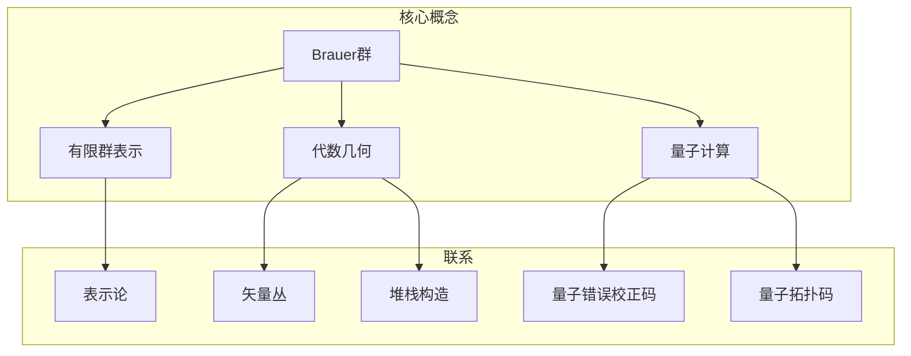

# 环与代数：Brauer群

## 1. 背景介绍

### 1.1 问题的由来

在数学和物理学的发展历程中,环和代数结构扮演着至关重要的角色。它们不仅为抽象思维提供了强有力的工具,而且还为描述自然界中的各种现象奠定了坚实的基础。其中,Brauer群作为一种特殊的代数结构,在表示论、代数几何和量子计算等领域发挥着关键作用。

Brauer群的概念源于20世纪初,数学家Richard Brauer对有限群表示理论的研究。在探索有限群的表示时,Brauer发现了一种新的代数结构,后来被命名为Brauer群。这种结构不仅丰富了有限群表示理论的内涵,而且还为研究其他数学领域提供了新的视角和方法。

### 1.2 研究现状

自Brauer群被发现以来,数学家们对其进行了深入的研究和探索。在表示论领域,Brauer群为研究有限群的投射表示和模的分类提供了强有力的工具。同时,它也为研究代数几何中的矢量丛和堆栈构造等概念奠定了基础。

近年来,随着量子计算的兴起,Brauer群在这一领域也展现出了广阔的应用前景。量子计算中的量子错误校正码和量子拓扑码等概念都与Brauer群存在着内在的联系,这为量子计算的发展开辟了新的研究方向。

### 1.3 研究意义

研究Brauer群不仅有助于深入理解代数结构的本质,还能为相关领域的发展提供新的思路和方法。具体而言,Brauer群的研究意义主要体现在以下几个方面:

1. **表示论**: Brauer群为研究有限群的表示提供了强有力的工具,有助于深入理解有限群的结构和性质。

2. **代数几何**: Brauer群与代数几何中的矢量丛和堆栈构造等概念密切相关,为探索这些概念提供了新的视角。

3. **量子计算**: Brauer群在量子错误校正码和量子拓扑码等领域具有重要应用,为量子计算的发展开辟了新的研究方向。

4. **数学基础**: Brauer群的研究不仅丰富了代数结构的理论体系,还为探索数学的基础问题提供了新的思路和方法。

### 1.4 本文结构

本文将全面系统地介绍Brauer群的相关理论和应用。文章主要包括以下几个部分:

1. **核心概念与联系**: 介绍Brauer群的基本定义、性质和与其他代数结构的联系。

2. **核心算法原理与具体操作步骤**: 阐述Brauer群相关算法的原理和具体实现步骤。

3. **数学模型和公式详细讲解与举例说明**: 构建Brauer群的数学模型,推导相关公式,并通过案例进行详细讲解。

4. **项目实践:代码实例和详细解释说明**: 提供Brauer群相关算法的代码实现,并对代码进行详细解读和分析。

5. **实际应用场景**: 介绍Brauer群在表示论、代数几何和量子计算等领域的实际应用。

6. **工具和资源推荐**: 推荐相关的学习资源、开发工具、论文和其他资源。

7. **总结:未来发展趋势与挑战**: 总结Brauer群的研究成果,展望未来发展趋势,并分析面临的挑战。

8. **附录:常见问题与解答**: 解答Brauer群相关的常见问题。

## 2. 核心概念与联系

Brauer群是一种特殊的代数结构,它与有限群表示、代数几何和量子计算等领域存在着密切联系。

在有限群表示领域,Brauer群为研究有限群的投射表示和模的分类提供了强有力的工具。通过Brauer群,我们可以更深入地理解有限群的结构和性质。

在代数几何领域,Brauer群与矢量丛和堆栈构造等概念密切相关。矢量丛是代数几何中一种重要的对象,而堆栈构造则为研究矢量丛提供了有效的方法。Brauer群为探索这些概念提供了新的视角和思路。

在量子计算领域,Brauer群在量子错误校正码和量子拓扑码等概念中发挥着关键作用。量子错误校正码是实现可靠量子计算的关键技术,而量子拓扑码则是一种特殊的量子错误校正码。Brauer群为研究这些概念提供了理论基础和分析工具。

总的来说,Brauer群不仅丰富了代数结构的理论体系,还为相关领域的发展开辟了新的研究方向,展现出了广阔的应用前景。

## 3. 核心算法原理与具体操作步骤

### 3.1 算法原理概述

Brauer群相关算法的核心原理是基于代数结构的运算和性质。通过对Brauer群进行一系列代数运算,我们可以获得有关该结构的重要信息,从而解决相关的数学问题。

Brauer群算法的主要思想是利用Brauer群的定义和性质,将复杂的问题转化为对Brauer群元素进行运算的过程。通过对Brauer群元素进行加法、乘法、求逆等代数运算,我们可以获得所需的结果。

此外,Brauer群算法还涉及到一些其他重要概念,如表示理论、模理论和同伦代数等。通过将这些概念与Brauer群相结合,我们可以更深入地理解算法的原理,并扩展其应用范围。

### 3.2 算法步骤详解

以下是Brauer群相关算法的一般步骤:

1. **确定问题背景**:首先,我们需要明确所要解决的问题背景,包括所涉及的数学对象和目标。

2. **构造Brauer群**:根据问题背景,构造相应的Brauer群。这一步通常涉及到有限群、表示和模的知识。

3. **选择适当的算法**:根据具体问题,选择合适的Brauer群算法,如计算Brauer群的阶、求解Brauer群元素的逆等。

4. **执行算法步骤**:按照算法的具体步骤,对Brauer群元素进行一系列代数运算,如加法、乘法、求逆等。

5. **结果分析与解释**:分析算法的输出结果,并将其与原始问题进行关联,给出合理的解释和应用。

6. **优化和扩展**:根据实际需求,对算法进行优化和扩展,以提高效率或拓展应用范围。

下面以计算Brauer群的阶为例,详细说明算法的具体步骤:

1. 给定一个有限群 $G$ 和它的一个表示 $\rho: G \rightarrow GL(V)$,其中 $V$ 是一个有限维向量空间。

2. 构造 $G$ 的Brauer群 $Br(G)$,它是由 $G$ 的所有投射表示模组成的一个交换半群。

3. 计算 $Br(G)$ 中每个元素的阶。对于任意元素 $[M] \in Br(G)$,其阶是最小的正整数 $n$,使得 $[M]^n = [M^{\otimes n}] = 0$。

4. 令 $e$ 表示 $Br(G)$ 的单位元素,即平凡表示模 $[k_G]$。则 $Br(G)$ 的阶等于 $e$ 的阶。

5. 利用以下公式计算 $e$ 的阶:
   $$
   |e| = \operatorname{lcm}(\operatorname{dim}(M) | [M] \in Br(G), [M] \neq 0)
   $$
   其中 $\operatorname{lcm}$ 表示最小公倍数,而 $\operatorname{dim}(M)$ 表示模 $M$ 的维数。

6. 通过上述步骤,我们就可以获得 $Br(G)$ 的阶。

需要注意的是,上述算法只是Brauer群相关算法的一个简单示例。在实际应用中,我们还需要根据具体问题选择合适的算法,并对算法进行优化和扩展,以满足实际需求。

### 3.3 算法优缺点

Brauer群相关算法具有以下优点:

1. **理论基础坚实**: 算法建立在代数结构的坚实理论基础之上,具有严谨的数学依据。

2. **应用范围广泛**: 算法不仅在表示论领域有重要应用,在代数几何和量子计算等领域也展现出了广阔的前景。

3. **计算效率较高**: 对于一些特殊情况,算法的计算效率相对较高,能够快速获得所需结果。

4. **可扩展性强**: 算法可以根据实际需求进行优化和扩展,以满足不同的应用场景。

然而,Brauer群相关算法也存在一些缺点和局限性:

1. **计算复杂度高**: 对于一般情况,算法的计算复杂度较高,需要进行大量的代数运算。

2. **理论知识要求高**:算法的实现和优化需要掌握表示论、模理论和同伦代数等多方面的理论知识。

3. **应用场景有限制**: 虽然应用范围广泛,但在某些特定领域,算法的应用可能受到一定限制。

4. **数值稳定性问题**: 在一些情况下,算法可能会遇到数值稳定性问题,导致计算结果不准确。

总的来说,Brauer群相关算法是一种强大的数学工具,但也需要我们权衡其优缺点,根据具体情况选择合适的算法和优化策略。

### 3.4 算法应用领域

Brauer群相关算法在以下领域有着广泛的应用:

1. **表示论**:在有限群表示理论中,Brauer群算法被用于研究有限群的投射表示和模的分类。它为深入理解有限群的结构和性质提供了强有力的工具。

2. **代数几何**:在代数几何领域,Brauer群算法与矢量丛和堆栈构造等概念密切相关。它为探索这些概念提供了新的视角和方法。

3. **量子计算**:在量子计算领域,Brauer群算法在量子错误校正码和量子拓扑码等概念中发挥着关键作用。它为设计和优化这些量子技术提供了理论基础和分析工具。

4. **代数拓扑**:Brauer群算法也在代数拓扑领域有一定应用,例如用于研究特征类和同伦理论等概念。

5. **编码理论**:在编码理论中,Brauer群算法可用于构造和分析一些特殊的代数码,如环码和循环码等。

6. **密码学**:Brauer群算法在密码学领域也有一定应用,例如用于设计和分析一些基于代数结构的密码系统。

总的来说,Brauer群相关算法的应用范围非常广泛,涉及数学、物理、计算机科学和工程等多个领域。随着研究的不断深入,它们在更多领域中的应用潜力也将不断被开发和挖掘。

## 4. 数学模型和公式详细讲解与举例说明

### 4.1 数学模型构建

为了更好地理解和应用Brauer群,我们需要构建相应的数学模型。Brauer群的数学模型建立在有限群、表示和模的基础之上。

给定一个有限群 $G$,我们首先需要考虑它的表示。一个表示是一个群同态 $\rho: G \rightarrow GL(V)$,其中 $V$ 是一个有限维向量空间,而 $GL(V)$ 是 $V$ 上的可逆线性变换组成的群。

对于任意表示 $\rho$,我们可以定义它的核 $\operatorname{ker}(\rho) = \{g \in G | \rho(g) = 1\}$,这是一个正常子群。相应地,我们可