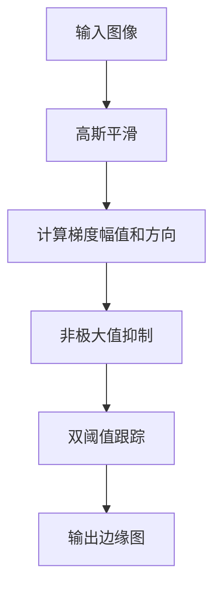

# 边缘检测原理与代码实例讲解

## 1. 背景介绍

### 1.1 问题的由来

在数字图像处理和计算机视觉领域中,边缘检测是一项基础且广泛应用的技术。边缘指的是图像中亮度发生剧烈变化的区域,通常对应于物体的边界或轮廓。准确检测和定位边缘对于许多高级视觉任务至关重要,例如目标识别、物体跟踪、图像分割等。

边缘检测的挑战在于如何有效地从复杂的图像信息中提取出有意义的边缘信息。由于噪声、光照变化、阴影等因素的影响,图像中的边缘往往不是理想的阶跃函数,而是一些模糊的灰度变化区域。因此,我们需要设计出能够准确、鲁棒地检测这些边缘的算法。

### 1.2 研究现状

自20世纪60年代以来,研究人员提出了多种经典的边缘检测算法,例如Sobel、Prewitt、Canny等。这些算法基于不同的数学原理和策略,在特定场景下表现出不同的优缺点。

- **Sobel算法**是一种基于一阶导数的简单边缘检测算法,对噪声较为敏感,但计算效率较高。
- **Prewitt算法**与Sobel算法类似,但使用不同的卷积核。
- **Canny算法**则是一种更为复杂但性能优异的算法,它利用多级策略来检测边缘,包括高斯平滑、非极大值抑制、双阈值跟踪等步骤。

近年来,随着深度学习技术的发展,一些基于卷积神经网络的边缘检测模型也逐渐兴起,例如HED(Holistically-Nested Edge Detection)等,这些模型通过大量数据训练,能够学习到更加鲁棒的边缘特征表示。

### 1.3 研究意义

边缘检测技术在图像处理和计算机视觉领域有着广泛的应用,对于提高图像理解和分析的能力至关重要。准确的边缘检测结果可以为后续的高级视觉任务提供有价值的先验信息,从而提高整体系统的性能。

此外,边缘检测算法的研究也推动了相关数学理论和优化方法的发展,例如小波变换、变分方法等,这些理论和方法在信号处理、图像压缩等领域也有重要应用。

### 1.4 本文结构

本文将系统地介绍边缘检测的基本原理和代码实现细节。我们将从经典的Canny算法入手,详细讲解其核心思想和数学模型,并给出相应的代码实例。此外,我们还将探讨边缘检测在实际应用中的场景,以及未来的发展趋势和挑战。文章结构如下:

```
1. 背景介绍
2. 核心概念与联系
3. 核心算法原理与具体操作步骤
4. 数学模型和公式详细讲解与举例说明
5. 项目实践:代码实例和详细解释说明
6. 实际应用场景
7. 工具和资源推荐
8. 总结:未来发展趋势与挑战
9. 附录:常见问题与解答
```

## 2. 核心概念与联系

边缘检测是图像处理和计算机视觉中的一个基础概念,它与以下核心概念密切相关:

1. **图像梯度(Image Gradient)**:图像梯度描述了图像亮度值在水平和垂直方向上的变化率,是边缘检测的基础。梯度的大小和方向可以用来定位和描述边缘。

2. **卷积(Convolution)**:卷积是信号处理中的一个基本操作,通过将一个小的权重核(kernel)在整个图像上滑动并进行加权求和,可以实现各种滤波和特征提取操作。边缘检测算法通常会使用一些特殊设计的卷积核来计算梯度。

3. **非极大值抑制(Non-Maximum Suppression)**:非极大值抑制是一种常用的后处理步骤,它通过抑制掉非边缘上的梯度值,从而使得边缘更加细化和连续。

4. **双阈值跟踪(Hysteresis Thresholding)**:双阈值跟踪是一种有效的边缘连接策略,它使用两个阈值(高阈值和低阈值)来识别强边缘和弱边缘,并利用强边缘来连接相邻的弱边缘,从而获得更加完整的边缘轮廓。

5. **小波变换(Wavelet Transform)**:小波变换是一种时频分析工具,它可以在不同的尺度上捕获信号的细节特征。一些新兴的边缘检测算法基于小波变换,能够更好地处理噪声和纹理等复杂情况。

这些概念相互关联、相辅相成,共同构建了边缘检测的理论基础和实现方法。掌握它们有助于我们全面地理解和应用边缘检测技术。

## 3. 核心算法原理与具体操作步骤

在本节中,我们将重点介绍经典的Canny边缘检测算法的核心原理和具体操作步骤。Canny算法是当前最广泛使用的边缘检测算法之一,它综合了多种策略,能够产生相对精确且连续的边缘。



### 3.1 算法原理概述

Canny边缘检测算法由以下几个核心步骤组成:

1. **高斯平滑(Gaussian Smoothing)**:使用高斯核对图像进行平滑,以减少噪声对边缘检测的影响。

2. **计算梯度幅值和方向(Gradient Magnitude and Direction)**:计算图像在水平和垂直方向上的一阶导数,并根据导数值求得每个像素点的梯度幅值和方向。

3. **非极大值抑制(Non-Maximum Suppression)**:对梯度幅值图像进行非极大值抑制,去除非边缘上的像素点,使得边缘更加细化和连续。

4. **双阈值跟踪(Hysteresis Thresholding)**:使用两个阈值(高阈值和低阈值)对非极大值抑制后的图像进行阈值处理,识别出强边缘和弱边缘,并利用强边缘来连接相邻的弱边缘,从而获得更加完整的边缘轮廓。

Canny算法的核心思想是综合利用多种策略,以获得较为精确且连续的边缘检测结果。它不仅考虑了梯度信息,还引入了非极大值抑制和双阈值跟踪等技术,能够有效地抑制噪声并连接断裂的边缘。

### 3.2 算法步骤详解

#### 3.2.1 高斯平滑

高斯平滑是Canny算法的第一步,目的是减少图像中的噪声,使得后续的梯度计算更加准确。高斯平滑的数学表达式如下:

$$
G(x, y) = \frac{1}{2\pi\sigma^2}e^{-\frac{x^2+y^2}{2\sigma^2}}
$$

其中,$(x, y)$表示像素坐标,而$\sigma$控制着高斯核的宽度。较大的$\sigma$值会产生更加平滑的结果,但也可能导致边缘信息的丢失。因此,需要权衡噪声抑制和边缘保留之间的平衡。

在实现中,我们通常使用离散的高斯核对图像进行卷积操作,得到平滑后的图像。

#### 3.2.2 计算梯度幅值和方向

在完成高斯平滑后,我们需要计算图像在水平和垂直方向上的一阶导数,即梯度。梯度的大小和方向可以用来定位和描述边缘。

梯度幅值$G$和梯度方向$\Theta$的计算公式如下:

$$
G = \sqrt{G_x^2 + G_y^2}
$$

$$
\Theta = \tan^{-1}(\frac{G_y}{G_x})
$$

其中,$G_x$和$G_y$分别表示水平和垂直方向上的一阶导数。在实现中,我们通常使用Sobel算子或Prewitt算子等离散卷积核来近似计算导数。

#### 3.2.3 非极大值抑制

非极大值抑制是一种常用的后处理步骤,它通过抑制掉非边缘上的梯度值,从而使得边缘更加细化和连续。

具体来说,对于每个像素点,我们首先根据其梯度方向,确定一条垂直于梯度方向的直线。然后,我们在该直线上比较当前像素点的梯度幅值与相邻像素点的梯度幅值。如果当前像素点的梯度幅值不是局部最大值,则将其设置为0,否则保留原值。

通过这一步骤,我们可以获得一个只包含候选边缘像素点的"细化"图像,为后续的边缘连接做准备。

#### 3.2.4 双阈值跟踪

最后一步是双阈值跟踪,它使用两个阈值(高阈值和低阈值)来识别强边缘和弱边缘,并利用强边缘来连接相邻的弱边缘,从而获得更加完整的边缘轮廓。

具体操作如下:

1. 应用高阈值,将梯度幅值大于高阈值的像素点标记为强边缘像素。
2. 应用低阈值,将梯度幅值大于低阈值但小于高阈值的像素点标记为弱边缘像素。
3. 对于每个弱边缘像素,如果它与强边缘像素相邻,则将其也标记为强边缘像素,否则将其抑制。

通过这种策略,我们可以保留强边缘,同时利用强边缘来连接相邻的弱边缘,从而获得更加完整和连续的边缘轮廓。

### 3.3 算法优缺点

Canny边缘检测算法具有以下优点:

1. **良好的噪声抑制能力**:通过高斯平滑和双阈值跟踪策略,Canny算法能够有效地抑制噪声对边缘检测的影响。
2. **边缘定位精度高**:非极大值抑制步骤可以使得边缘更加细化,提高了边缘定位的精度。
3. **单像素响应**:理想情况下,Canny算法能够产生单像素宽度的边缘响应,这对于后续的图像处理任务非常有利。

然而,Canny算法也存在一些缺点:

1. **计算复杂度较高**:相比于一些简单的边缘检测算法(如Sobel、Prewitt等),Canny算法包含多个复杂的步骤,计算量较大。
2. **参数选择敏感**:算法的性能很大程度上依赖于高斯核宽度、高低阈值等参数的选择,不同的参数设置可能导致结果差异较大。
3. **对噪声和纹理敏感**:尽管Canny算法具有一定的噪声抑制能力,但在存在大量噪声或复杂纹理的情况下,它的表现可能不尽如人意。

### 3.4 算法应用领域

Canny边缘检测算法由于其良好的性能,在多个领域得到了广泛的应用,包括但不限于:

1. **目标识别和跟踪**:准确的边缘信息可以为目标识别和跟踪提供有价值的先验知识,例如轮廓特征、形状模板等。
2. **图像分割**:边缘检测是图像分割的一个重要预处理步骤,能够为后续的区域生长、图割等分割算法提供有用的边界信息。
3. **机器人视觉**:在机器人视觉系统中,边缘检测可用于障碍物检测、路径规划等任务。
4. **医学图像分析**:医学图像中的边缘信息对于病灶检测、组织分割等任务至关重要。
5. **运动估计**:视频序列中的运动边缘可用于估计运动矢量,实现运动补偿等功能。

除了上述领域,边缘检测技术在图像处理