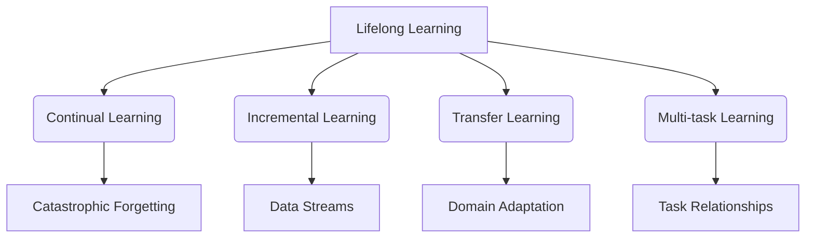
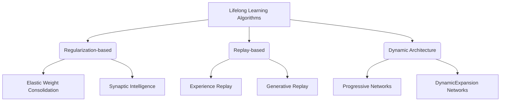

# Lifelong Learning原理与代码实例讲解

## 1. 背景介绍

### 1.1 问题的由来

在当今快速变化的世界中,机器学习模型面临着一个重大挑战:如何在遇到新的数据时持续学习和适应,而不是简单地固步自封。传统的机器学习系统往往是在固定的训练数据集上进行训练,然后部署到生产环境中。但是,现实世界的数据分布会随着时间的推移而发生变化,这就导致了模型的性能下降。为了解决这个问题,研究人员提出了Lifelong Learning(终身学习)的概念。

### 1.2 研究现状  

Lifelong Learning旨在开发能够持续学习和适应新数据的智能系统。这种系统不仅可以在初始训练阶段学习知识,而且还能在部署后通过持续学习来更新和扩展其知识库。目前,Lifelong Learning已经在多个领域得到广泛研究和应用,如自然语言处理、计算机视觉和机器人技术等。

### 1.3 研究意义

Lifelong Learning的研究对于构建通用人工智能系统至关重要。通过持续学习,智能系统可以不断适应环境的变化,提高其泛化能力和鲁棒性。此外,Lifelong Learning还可以减少重新训练模型的成本,提高模型的可解释性和可信赖性。

### 1.4 本文结构

本文将从以下几个方面全面介绍Lifelong Learning:

1. 核心概念与联系
2. 核心算法原理及具体操作步骤
3. 数学模型和公式详细讲解及案例分析
4. 项目实践:代码实例和详细解释
5. 实际应用场景
6. 工具和资源推荐
7. 总结:未来发展趋势与挑战
8. 附录:常见问题与解答

## 2. 核心概念与联系

Lifelong Learning涉及多个核心概念,包括持续学习(Continual Learning)、增量学习(Incremental Learning)、迁移学习(Transfer Learning)和多任务学习(Multi-task Learning)等。这些概念相互关联,共同构建了Lifelong Learning的理论基础。

1. **持续学习(Continual Learning)**: 指机器学习模型在遇到新数据时能够持续学习,而不会完全遗忘之前学习到的知识。这个过程需要解决"灾难性遗忘"(Catastrophic Forgetting)的问题。

2. **增量学习(Incremental Learning)**: 指机器学习模型能够在新数据到来时逐步更新自身,而不需要从头开始重新训练。这种学习方式特别适用于处理数据流(Data Streams)的场景。

3. **迁移学习(Transfer Learning)**: 指利用在一个领域或任务中学习到的知识,来帮助解决另一个相关但不同的领域或任务。它通过域适应(Domain Adaptation)来缓解不同领域之间的差异。

4. **多任务学习(Multi-task Learning)**: 指同时学习多个相关任务,利用不同任务之间的关系来提高整体性能。这种方法可以提高模型的泛化能力和鲁棒性。

上述概念相互关联且存在一定重叠,共同构建了Lifelong Learning的理论基础。Lifelong Learning系统通常会综合运用这些技术,以实现持续学习和适应新数据的目标。

## 3. 核心算法原理及具体操作步骤

### 3.1 算法原理概述

Lifelong Learning算法的核心思想是在保留已学习知识的同时,能够从新数据中继续学习和更新模型。为了实现这一目标,研究人员提出了多种算法,包括基于正则化的方法、基于重播的方法和基于动态架构的方法等。

1. **基于正则化的方法**: 这类方法通过在损失函数中添加正则化项,来约束模型参数的更新范围,从而防止遗忘先前学习的知识。典型算法包括Elastic Weight Consolidation(EWC)和Synaptic Intelligence等。

2. **基于重播的方法**: 这类方法通过存储和重播先前的训练数据,来帮助模型保留之前学习的知识。常见算法包括Experience Replay和Generative Replay等。

3. **基于动态架构的方法**: 这类方法通过动态扩展神经网络的架构,为新任务分配专门的子网络,从而避免干扰之前学习的知识。代表性算法有Progressive Networks和Dynamic Expansion Networks等。

### 3.2 算法步骤详解

以下以Elastic Weight Consolidation(EWC)算法为例,详细介绍其具体操作步骤:

1. **初始训练**: 在初始训练阶段,使用传统的监督学习方法在初始数据集上训练神经网络模型,获得初始模型参数$\theta_0$。

2. **计算重要性权重**: 在初始模型训练完成后,计算每个模型参数对应的重要性权重$F_i$,用于衡量该参数对于保留之前学习的知识的重要程度。重要性权重的计算公式如下:

$$F_i = \sum_j \frac{\partial L_j}{\partial \theta_i}^2$$

其中,$L_j$表示在初始数据集上的损失函数,$\theta_i$表示第$i$个模型参数。

3. **继续训练**: 在遇到新的数据集时,将损失函数修改为:

$$L(\theta) = L_D(\theta) + \sum_i \frac{\lambda}{2} F_i(\theta_i - \theta_{0,i})^2$$

其中,$L_D(\theta)$表示在新数据集上的损失函数,$\lambda$是一个超参数,用于平衡两项损失的权重。第二项是EWC算法引入的正则化项,它惩罚了与初始参数$\theta_0$偏离较大且重要性权重较高的参数的更新。

4. **更新模型参数**: 使用优化算法(如随机梯度下降)最小化修改后的损失函数,从而获得新的模型参数$\theta_1$。

5. **循环训练**: 对于后续的新数据集,重复步骤3和步骤4,使用上一次训练得到的模型参数作为初始参数,并根据新数据计算新的重要性权重。

通过上述步骤,EWC算法可以在新数据到来时继续训练模型,同时尽可能保留之前学习到的知识,从而实现持续学习。

### 3.3 算法优缺点

EWC算法的主要优点是:

1. 简单高效,易于实现和部署。
2. 可以在新旧数据集之间实现平衡,避免遗忘先前知识。
3. 对模型架构无特殊要求,可应用于各种神经网络模型。

但它也存在一些缺陷:

1. 需要存储所有先前训练数据的重要性权重,内存开销较大。
2. 对于任务差异较大的情况,保留先前知识的能力有限。
3. 正则化强度的选择需要人工调参,影响效果。

### 3.4 算法应用领域

EWC算法及其变体已被广泛应用于多个领域,包括:

1. **自然语言处理**: 用于构建可持续学习的语言模型,适应不断变化的语料库。
2. **计算机视觉**: 用于增量训练目标检测和图像分类模型,提高其泛化能力。
3. **推荐系统**: 用于个性化推荐模型的持续学习,适应用户偏好的变化。
4. **机器人控制**: 用于机器人在线学习新的控制策略,同时保留之前学习的技能。

总的来说,EWC算法为构建持续学习系统提供了一种有效且易于实现的方法,在多个领域都有广泛的应用前景。

## 4. 数学模型和公式详细讲解及案例分析

### 4.1 数学模型构建

在介绍EWC算法的数学模型之前,我们先定义一些基本符号:

- $\mathcal{D}_0$: 初始训练数据集
- $\mathcal{D}_1, \mathcal{D}_2, \ldots, \mathcal{D}_n$: 后续到来的新数据集
- $\theta_0$: 在$\mathcal{D}_0$上训练得到的初始模型参数
- $\theta_1, \theta_2, \ldots, \theta_n$: 在新数据集上继续训练得到的模型参数
- $L_j(\theta)$: 在数据集$\mathcal{D}_j$上的损失函数
- $F_i$: 第$i$个模型参数对应的重要性权重

EWC算法的数学模型可以表示为:

$$\min_\theta \sum_{j=1}^n L_j(\theta) + \sum_i \frac{\lambda}{2} F_i(\theta_i - \theta_{0,i})^2$$

其中,第一项是在所有数据集上的总损失函数,第二项是EWC算法引入的正则化项,用于约束模型参数的更新范围,避免遗忘先前学习的知识。$\lambda$是一个超参数,用于平衡两项损失的权重。

重要性权重$F_i$的计算公式为:

$$F_i = \sum_j \frac{\partial L_j(\theta_0)}{\partial \theta_i}^2$$

它反映了第$i$个参数对于保留初始模型在$\mathcal{D}_0$上的性能的重要程度。如果一个参数对初始模型的性能影响较大,那么它的重要性权重就会较高,在后续训练过程中,该参数的更新就会受到更大的约束。

### 4.2 公式推导过程

我们可以将EWC算法的目标函数进一步展开:

$$\begin{aligned}
\min_\theta & \sum_{j=1}^n L_j(\theta) + \sum_i \frac{\lambda}{2} F_i(\theta_i - \theta_{0,i})^2 \\
           & \approx \min_\theta \sum_{j=1}^n L_j(\theta_0) + \sum_i \frac{\lambda}{2} F_i(\theta_i - \theta_{0,i})^2 \\
           & \quad + \sum_{j=1}^n \sum_i \frac{\partial L_j(\theta_0)}{\partial \theta_i}(\theta_i - \theta_{0,i}) + \mathcal{O}(\|\theta - \theta_0\|^2)
\end{aligned}$$

其中,我们使用了泰勒展开的近似,忽略了高阶无穷小项。将重要性权重$F_i$的定义代入,可以得到:

$$\begin{aligned}
\min_\theta & \sum_{j=1}^n L_j(\theta_0) + \sum_i \frac{\lambda}{2} \left(\sum_j \frac{\partial L_j(\theta_0)}{\partial \theta_i}^2\right)(\theta_i - \theta_{0,i})^2 \\
           & \quad + \sum_{j=1}^n \sum_i \frac{\partial L_j(\theta_0)}{\partial \theta_i}(\theta_i - \theta_{0,i}) + \mathcal{O}(\|\theta - \theta_0\|^2)
\end{aligned}$$

由于$\sum_{j=1}^n L_j(\theta_0)$是一个常数,对于优化目标函数没有影响,因此可以忽略。同时,由于我们希望模型参数$\theta$尽可能接近初始参数$\theta_0$,所以第三项也可以忽略。最终,EWC算法的优化目标函数可以简化为:

$$\min_\theta \sum_i \frac{\lambda}{2} \left(\sum_j \frac{\partial L_j(\theta_0)}{\partial \theta_i}^2\right)(\theta_i - \theta_{0,i})^2$$

这就是EWC算法的核心公式,它惩罚了与初始参数$\theta_0$偏离较大且重要性权重较高的参数的更新,从而实现了在新数据集上继续训练的同时,尽可能保留之前学习到的知识。

### 4.3 案例分析与讲解

为了更好地理解EWC算法的原理和实现效果,我们以一个简单的线性回归案例进行分析和讲解。

假