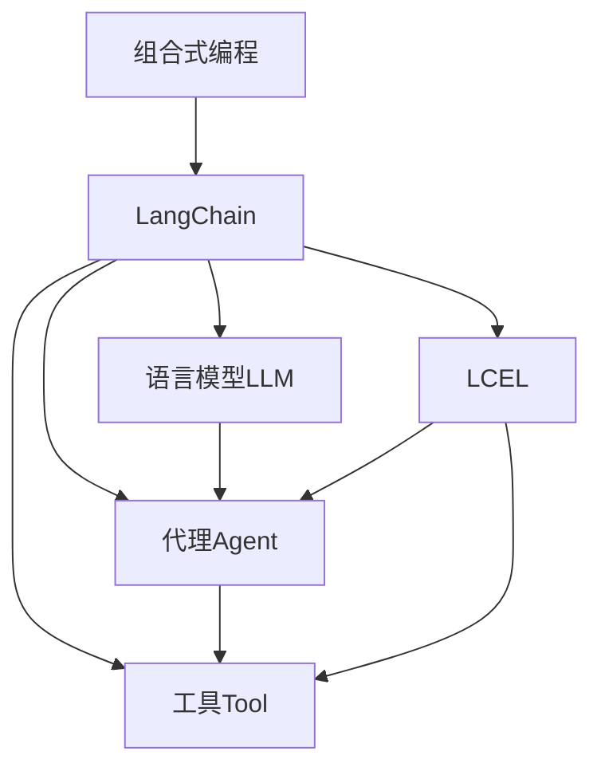
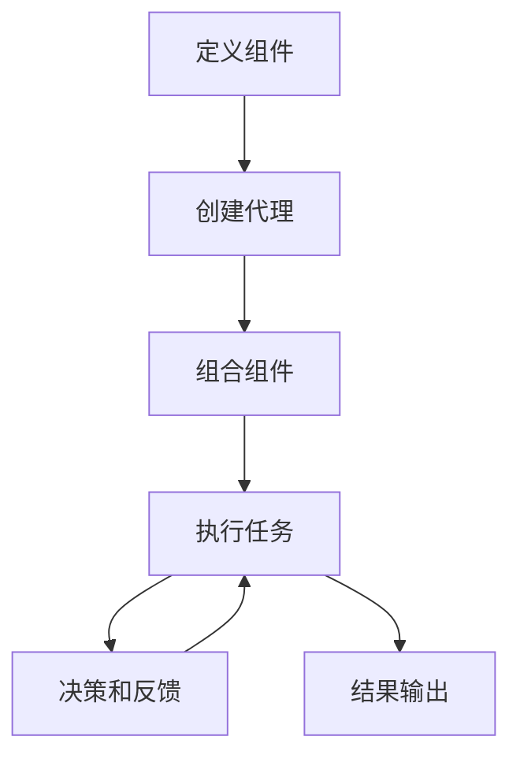

# 【LangChain编程：从入门到实践】使用LCEL进行组合

## 1. 背景介绍

### 1.1 问题的由来

在当今数据驱动的世界中,我们面临着海量的异构数据源和复杂的任务需求。传统的编程方式往往无法满足这些需求,因为它们通常是孤立的,无法轻松地集成和组合不同的数据源和功能模块。因此,我们需要一种新的编程范式,能够更好地处理这种复杂性。

### 1.2 研究现状

近年来,一种新兴的编程范式——组合式编程(Compositional Programming)开始引起人们的关注。组合式编程的核心思想是将不同的功能模块(如数据源、模型、工具等)组合在一起,形成一个更大的应用程序或工作流。这种方法提供了更好的可扩展性、灵活性和可重用性。

LangChain是一个Python库,它为组合式编程提供了一个强大的框架。它允许开发人员轻松地集成不同的语言模型(LLM)、数据源和功能模块,构建复杂的应用程序。LangChain还提供了一种新的编程范式——LCEL(LangChain Entities and Chains Exploration Language),它使得组合和探索不同的组件变得更加容易和直观。

### 1.3 研究意义

通过学习和实践LangChain和LCEL,我们可以掌握组合式编程的核心概念和技术,从而更好地应对当前和未来的数据处理挑战。这不仅有助于提高我们的编程效率和代码质量,还能为我们开发更加智能和创新的应用程序提供支持。

### 1.4 本文结构

本文将全面介绍LangChain和LCEL,内容包括:

1. 核心概念与联系
2. 核心算法原理和具体操作步骤
3. 数学模型和公式详细讲解及举例说明
4. 项目实践:代码实例和详细解释说明
5. 实际应用场景
6. 工具和资源推荐
7. 总结:未来发展趋势与挑战
8. 附录:常见问题与解答

## 2. 核心概念与联系

在深入探讨LangChain和LCEL之前,我们需要先了解一些核心概念及它们之间的联系。

### 2.1 组合式编程(Compositional Programming)

组合式编程是一种编程范式,它将不同的功能模块(如数据源、模型、工具等)组合在一起,形成一个更大的应用程序或工作流。这种方法提供了更好的可扩展性、灵活性和可重用性。

### 2.2 语言模型(Language Model, LLM)

语言模型是一种基于深度学习的人工智能模型,它可以理解和生成自然语言。常见的语言模型包括GPT-3、BERT、T5等。在LangChain中,语言模型扮演着核心的角色,它们被用于各种任务,如问答、文本生成、文本摘要等。

### 2.3 代理(Agent)

代理是LangChain中的一个重要概念。它是一个具有特定目标和能力的实体,可以与语言模型、工具和数据源进行交互,以完成特定的任务。代理可以被视为一个智能系统,它可以根据当前的状态和目标选择合适的行动。

### 2.4 工具(Tool)

工具是LangChain中的一个重要组件,它代表了一个特定的功能或服务,如网络搜索、数据库查询、文件操作等。工具可以被代理调用,以完成特定的任务。

### 2.5 LCEL(LangChain Entities and Chains Exploration Language)

LCEL是LangChain中的一种领域特定语言(DSL),它提供了一种直观和声明式的方式来定义和组合不同的实体(如代理、工具、数据源等)。LCEL使得构建复杂的应用程序变得更加容易和高效。

上图展示了这些核心概念之间的关系。组合式编程是一种编程范式,LangChain提供了一个框架来支持这种范式。在LangChain中,语言模型、代理、工具和LCEL是核心组件,它们相互协作,构建出复杂的应用程序和工作流。

## 3. 核心算法原理 & 具体操作步骤

### 3.1 算法原理概述

LangChain和LCEL的核心算法原理是基于组合式编程和智能代理系统的概念。

1. **组合式编程**:LangChain允许开发人员将不同的组件(如语言模型、工具、数据源等)组合在一起,形成一个更大的应用程序或工作流。这种组合式方法提供了更好的可扩展性、灵活性和可重用性。

2. **智能代理系统**:LangChain中的代理是一个具有特定目标和能力的实体,它可以与语言模型、工具和数据源进行交互,以完成特定的任务。代理的核心算法是基于智能代理系统的概念,它可以根据当前的状态和目标选择合适的行动。

3. **LCEL**:LCEL是LangChain中的一种领域特定语言(DSL),它提供了一种直观和声明式的方式来定义和组合不同的实体(如代理、工具、数据源等)。LCEL的核心算法是基于语言解析和模式匹配的原理,它可以解析LCEL代码,并将其转换为相应的LangChain组件和工作流。

### 3.2 算法步骤详解

以下是LangChain和LCEL的核心算法步骤:

1. **定义组件**:首先,需要定义所需的组件,如语言模型、工具、数据源等。这可以通过LangChain提供的API或LCEL代码来实现。

2. **创建代理**:根据任务需求,创建一个或多个代理。代理可以通过LangChain的API或LCEL代码来定义。

3. **组合组件**:将定义好的组件(如语言模型、工具、数据源等)组合到代理中。这可以通过LangChain的API或LCEL代码来实现。

4. **执行任务**:代理开始执行任务,它可以与语言模型、工具和数据源进行交互,以完成特定的任务。

5. **决策和反馈**:在执行任务的过程中,代理会根据当前的状态和目标选择合适的行动。它可以与语言模型进行交互,获取建议或反馈,并根据反馈调整自己的行为。

6. **结果输出**:任务完成后,代理会输出最终的结果。

上图展示了LangChain和LCEL的核心算法步骤。首先定义所需的组件,然后创建代理并将组件组合到代理中。接下来,代理开始执行任务,在执行过程中会进行决策和获取反馈,最终输出结果。

### 3.3 算法优缺点

**优点**:

1. **灵活性和可扩展性**:组合式编程方法提供了很高的灵活性和可扩展性,可以轻松地集成和组合不同的组件,构建复杂的应用程序。

2. **可重用性**:组件可以被多个应用程序重用,提高了代码的可重用性和开发效率。

3. **智能化**:代理系统具有一定的智能化能力,可以根据当前状态和目标做出合理的决策,提高了系统的自主性和适应性。

4. **易于理解和维护**:LCEL提供了一种直观和声明式的方式来定义和组合组件,使得代码更加易于理解和维护。

**缺点**:

1. **复杂性**:组合式编程涉及多个组件的集成和协作,可能会增加系统的复杂性。

2. **性能开销**:组件之间的通信和协作可能会带来一定的性能开销。

3. **依赖问题**:系统依赖于多个外部组件(如语言模型、工具、数据源等),可能会引入一些依赖问题和风险。

4. **学习曲线**:掌握LangChain和LCEL需要一定的学习成本,特别是对于不熟悉组合式编程和智能代理系统的开发人员而言。

### 3.4 算法应用领域

LangChain和LCEL的算法可以应用于各种领域,包括但不限于:

1. **自然语言处理(NLP)**:可以用于构建问答系统、文本摘要、情感分析等NLP应用程序。

2. **智能助手**:可以用于构建智能助手,如个人助理、客户服务助手等。

3. **数据处理**:可以用于集成和处理来自多个异构数据源的数据。

4. **自动化工作流**:可以用于构建自动化的工作流程,如文档处理、数据分析等。

5. **决策支持系统**:可以用于构建决策支持系统,通过集成多个数据源和模型来支持决策过程。

6. **教育和培训**:可以用于构建智能教育和培训系统,提供个性化的学习体验。

总的来说,LangChain和LCEL的算法为构建智能化、可扩展和灵活的应用程序提供了一种新的编程范式,具有广阔的应用前景。

## 4. 数学模型和公式 & 详细讲解 & 举例说明

在LangChain和LCEL中,数学模型和公式主要用于描述和优化代理的决策过程。下面我们将详细介绍一些常见的数学模型和公式。

### 4.1 数学模型构建

#### 4.1.1 马尔可夫决策过程(Markov Decision Process, MDP)

马尔可夫决策过程(MDP)是一种常用的数学模型,用于描述代理在不确定环境中的决策过程。MDP由以下几个要素组成:

- 状态集合 $\mathcal{S}$
- 动作集合 $\mathcal{A}$
- 转移概率 $\mathcal{P}(s' \mid s, a)$,表示在状态 $s$ 下执行动作 $a$ 后转移到状态 $s'$ 的概率
- 奖励函数 $\mathcal{R}(s, a, s')$,表示在状态 $s$ 下执行动作 $a$ 并转移到状态 $s'$ 时获得的奖励

代理的目标是找到一个策略 $\pi: \mathcal{S} \rightarrow \mathcal{A}$,使得期望的累积奖励最大化。

#### 4.1.2 部分可观测马尔可夫决策过程(Partially Observable Markov Decision Process, POMDP)

部分可观测马尔可夫决策过程(POMDP)是MDP的一种扩展,用于描述代理在部分可观测环境中的决策过程。POMDP由以下几个要素组成:

- 状态集合 $\mathcal{S}$
- 动作集合 $\mathcal{A}$
- 转移概率 $\mathcal{P}(s' \mid s, a)$
- 奖励函数 $\mathcal{R}(s, a, s')$
- 观测集合 $\mathcal{O}$
- 观测概率 $\mathcal{Z}(o \mid s', a)$,表示在状态 $s'$ 下执行动作 $a$ 后获得观测 $o$ 的概率

在POMDP中,代理无法直接观测到真实的状态,只能通过观测来推断状态。代理的目标是找到一个策略 $\pi: \mathcal{H} \rightarrow \mathcal{A}$,使得期望的累积奖励最大化,其中 $\mathcal{H}$ 表示观测历史。

### 4.2 公式推导过程

#### 4.2.1 值迭代(Value Iteration)

值迭代是一种常用的算法,用于求解MDP中的最优策略。它基于贝尔曼方程(Bellman Equation)进行迭代更新,直到收敛。

贝尔曼方程定义了状态值函数 $V(s)$,表示在状态 $s$ 下遵循最优策略时的期望累积奖励:

$$V(s) = \max_{a \in \math