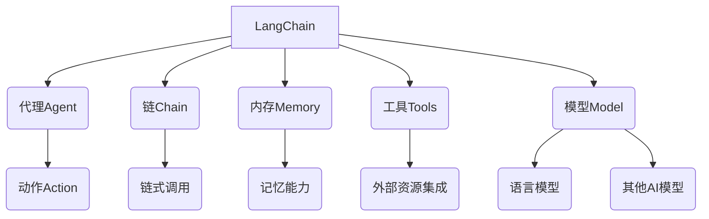

# 【LangChain编程：从入门到实践】示例选择器

## 1. 背景介绍

### 1.1 问题的由来

在当今的数字时代,人工智能(AI)和大数据分析已经成为推动技术创新和商业发展的关键驱动力。随着数据量的不断增长和问题复杂性的提高,传统的编程方式已经难以满足需求。因此,需要一种新的编程范式来应对这些挑战。LangChain是一个新兴的Python库,旨在简化人工智能应用程序的开发过程,使开发人员能够更高效地构建和部署复杂的AI系统。

### 1.2 研究现状

目前,LangChain已经在学术界和工业界引起了广泛关注。越来越多的研究人员和开发人员开始探索和应用LangChain,以解决各种复杂的问题。然而,由于LangChain是一个相对新颖的概念,很多开发人员可能还不太熟悉它的使用方法和最佳实践。

### 1.3 研究意义

本文旨在为读者提供一个全面的指南,帮助他们了解LangChain的核心概念、算法原理和实际应用。通过详细的代码示例和案例分析,读者将能够掌握LangChain的使用方法,并学习如何将其应用于实际项目中。此外,本文还将探讨LangChain的未来发展趋势和潜在挑战,为读者提供更广阔的视野。

### 1.4 本文结构

本文将分为以下几个部分:

1. 背景介绍
2. 核心概念与联系
3. 核心算法原理和具体操作步骤
4. 数学模型和公式详细讲解与举例说明
5. 项目实践:代码实例和详细解释说明
6. 实际应用场景
7. 工具和资源推荐
8. 总结:未来发展趋势与挑战
9. 附录:常见问题与解答

## 2. 核心概念与联系

LangChain是一个用于构建应用程序的框架,它将各种组件(如代理、链、内存、工具和模型)集成在一起,使开发人员能够更轻松地构建复杂的AI系统。

- **代理(Agent)**: 代理是LangChain中的核心概念之一。它是一个决策制定者,根据当前状态选择适当的动作。代理可以与链、内存、工具和模型交互,以完成特定的任务。

- **链(Chain)**: 链是一系列预定义的步骤或操作,用于完成特定的任务。链可以由多个组件(如代理、工具和模型)组成,并且可以链式调用,形成更复杂的流程。

- **内存(Memory)**: 内存为代理提供了记忆能力,允许它存储和检索相关信息。这对于处理需要上下文信息的任务非常有用。

- **工具(Tools)**: 工具是一组外部资源或服务,可以被代理调用以执行特定的操作。工具可以是网络API、数据库查询或任何其他可用的资源。

- **模型(Model)**: 模型通常指语言模型或其他AI模型,用于生成文本、进行推理或执行其他任务。LangChain支持集成各种模型,如GPT、BERT等。

这些核心概念相互关联,共同构建了LangChain的强大功能。代理利用链、内存、工具和模型来完成复杂的任务,实现智能化的决策和操作。

## 3. 核心算法原理和具体操作步骤

### 3.1 算法原理概述

LangChain的核心算法原理是基于**代理-环境交互**的范式。该范式源自强化学习领域,其基本思想是代理与环境进行交互,根据当前状态选择合适的动作,并从环境中获得反馈,不断优化其决策过程。

在LangChain中,代理与环境的交互过程可以概括为以下步骤:

1. **观察(Observation)**: 代理观察当前的环境状态,包括任务描述、上下文信息等。

2. **思考(Thought)**: 代理根据观察到的状态,结合其内部知识和经验,思考下一步的行动计划。

3. **行动(Action)**: 代理执行计划中的行动,可能包括调用工具、查询内存或生成输出等操作。

4. **观察结果(Observation Result)**: 代理观察行动的结果,并将其作为新的环境状态。

5. **反馈(Feedback)**: 代理根据行动的结果获得反馈,用于评估和优化其决策过程。

这个过程循环往复,直到代理完成任务或达到终止条件。通过不断的交互和学习,代理可以逐步优化其决策策略,从而提高任务完成的效率和质量。

### 3.2 算法步骤详解

LangChain提供了多种算法实现,以支持不同类型的任务和场景。以下是一种常见的算法步骤,用于解决复杂的问题:

1. **任务分解(Task Decomposition)**: 将原始任务分解为多个子任务,每个子任务由一个代理负责处理。

2. **代理选择(Agent Selection)**: 根据子任务的性质,选择合适的代理类型和配置。

3. **工具集成(Tool Integration)**: 为每个代理集成所需的工具,如网络API、数据库查询等。

4. **内存初始化(Memory Initialization)**: 为每个代理初始化内存,用于存储和检索相关信息。

5. **链构建(Chain Construction)**: 将代理、工具和内存组合成一个或多个链,用于执行特定的任务流程。

6. **输入处理(Input Processing)**: 将原始输入数据转换为代理可理解的格式。

7. **链执行(Chain Execution)**: 执行构建的链,代理根据当前状态选择合适的动作,并与工具和内存交互。

8. **输出生成(Output Generation)**: 根据链的执行结果,生成最终的输出结果。

9. **反馈收集(Feedback Collection)**: 收集任务执行过程中的反馈信息,用于优化代理的决策策略。

10. **模型微调(Model Fine-tuning)**: 根据收集的反馈,对代理使用的语言模型或其他AI模型进行微调,以提高其性能。

这些步骤可以根据具体的任务需求进行调整和优化。LangChain提供了丰富的API和工具,使开发人员能够灵活地构建和自定义这些步骤。

### 3.3 算法优缺点

LangChain算法的优点包括:

- **模块化设计**: 代理、链、内存、工具和模型之间的松散耦合,使得系统具有良好的扩展性和可维护性。

- **灵活性**: 可以根据任务需求灵活组合不同的组件,构建定制化的AI系统。

- **可解释性**: 代理的决策过程可以被记录和解释,提高了系统的透明度和可信度。

- **并行处理**: 多个代理可以并行工作,提高了系统的效率和吞吐量。

然而,LangChain算法也存在一些缺点和挑战:

- **复杂性**: 构建复杂的AI系统需要对LangChain的各个组件有深入的理解,存在一定的学习曲线。

- **性能瓶颈**: 频繁的组件交互和数据传输可能会导致性能瓶颈,需要进行优化。

- **模型质量依赖**: 系统的整体性能在很大程度上依赖于所使用的语言模型或其他AI模型的质量。

- **决策一致性**: 确保多个代理之间的决策一致性和协调性是一个挑战。

- **成本**: 集成高质量的语言模型和其他AI模型可能需要付出较高的计算资源成本。

### 3.4 算法应用领域

LangChain算法可以应用于各种领域,包括但不限于:

- **自然语言处理(NLP)**: 如问答系统、文本摘要、情感分析等。

- **决策支持系统**: 利用LangChain构建智能决策支持系统,为决策者提供建议和分析。

- **任务自动化**: 将重复性的任务自动化,提高效率和准确性。

- **知识管理**: 利用LangChain整合和管理各种知识源,构建智能知识库。

- **教育和学习**: 开发智能教学助手,为学生提供个性化的学习体验。

- **科研领域**: 应用于各种科学研究领域,如生物信息学、物理学、化学等,辅助研究人员进行数据分析和建模。

总的来说,LangChain算法为构建智能系统提供了一种灵活且可扩展的方法,在各个领域都有广阔的应用前景。

## 4. 数学模型和公式详细讲解与举例说明

### 4.1 数学模型构建

在LangChain中,数学模型通常用于描述代理与环境之间的交互过程,以及代理的决策策略。一种常见的数学模型是基于**马尔可夫决策过程(Markov Decision Process, MDP)**的框架。

MDP是一种离散时间的随机控制过程,可以用一个元组 $(S, A, P, R, \gamma)$ 来表示,其中:

- $S$ 是状态集合,表示代理可能观察到的所有环境状态。
- $A$ 是动作集合,表示代理可以执行的所有动作。
- $P$ 是状态转移概率函数,定义了在执行某个动作后,从一个状态转移到另一个状态的概率。
- $R$ 是奖励函数,定义了在某个状态执行某个动作后获得的即时奖励。
- $\gamma \in [0, 1)$ 是折现因子,用于平衡即时奖励和未来奖励的权重。

在MDP框架下,代理的目标是找到一个策略 $\pi: S \rightarrow A$,将状态映射到动作,以最大化累积的期望奖励:

$$
G_t = \sum_{k=0}^{\infty} \gamma^k R_{t+k+1}
$$

其中 $G_t$ 表示从时间步 $t$ 开始的累积奖励。

为了找到最优策略,可以使用各种强化学习算法,如Q-Learning、策略梯度等。这些算法通过不断的试错和学习,逐步优化代理的决策策略,以获得更高的累积奖励。

### 4.2 公式推导过程

在LangChain中,常常需要计算代理在执行某个动作序列后获得的期望累积奖励。这可以通过贝尔曼方程(Bellman Equation)来推导。

假设代理在时间步 $t$ 处于状态 $s_t$,执行动作 $a_t$,然后转移到状态 $s_{t+1}$,获得即时奖励 $r_{t+1}$。根据MDP的定义,我们可以写出以下等式:

$$
G_t = r_{t+1} + \gamma G_{t+1}
$$

其中 $G_{t+1}$ 表示从时间步 $t+1$ 开始的累积奖励。

由于我们不知道确切的状态序列,我们需要对所有可能的状态序列进行求和,并乘以相应的概率:

$$
G_t = \sum_{s_{t+1}} P(s_{t+1} | s_t, a_t) \left[ r_{t+1} + \gamma G_{t+1} \right]
$$

这就是贝尔曼方程的一般形式。

为了找到最优策略,我们定义了一个值函数 $V(s)$,表示在状态 $s$ 下遵循最优策略可获得的期望累积奖励。根据贝尔曼方程,我们可以写出以下等式:

$$
V(s) = \max_a \sum_{s'} P(s' | s, a) \left[ R(s, a, s') + \gamma V(s') \right]
$$

这个等式被称为贝尔曼最优方程(Bellman Optimality Equation)。通过求解这个方程,我们可以找到最优值函数 $V^*(s)$,进而推导出最优策略 $\pi^*(s)$。

### 4.3 案例分析与讲解

为了更好地理解数学模型和公式在LangChain中的应用,我们来分析一个简单