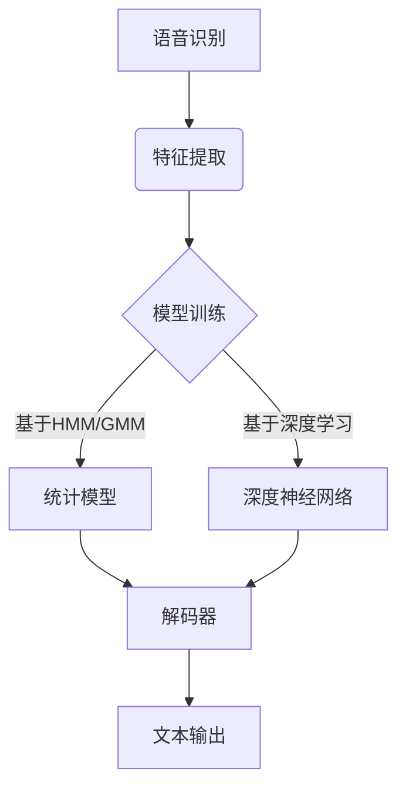
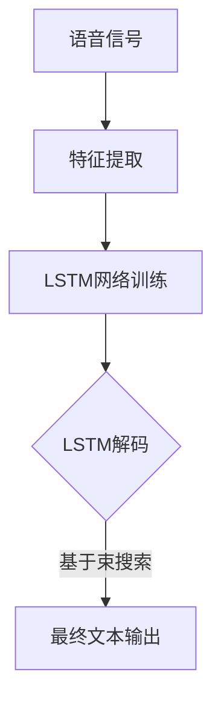

以下是《Python机器学习实战：深度学习在语音识别中的应用》的正文内容:

# Python机器学习实战：深度学习在语音识别中的应用

## 1. 背景介绍

### 1.1 问题的由来

语音识别是一项将人类语音转换为相应文本或命令的技术,广泛应用于人机交互、自动语音转文本等领域。传统的语音识别系统主要基于隐马尔可夫模型(HMM)和高斯混合模型(GMM),但由于其本身的局限性,很难有效处理复杂的语音信号。

随着深度学习技术的兴起,特别是卷积神经网络(CNN)和循环神经网络(RNN)的出现,语音识别领域取得了长足进步。深度神经网络能够自动从大量数据中学习特征表示,克服了传统方法手工设计特征的缺陷,在处理复杂语音信号方面表现出色。

### 1.2 研究现状  

目前,基于深度学习的语音识别系统已经在学术界和工业界得到广泛应用,取得了令人瞩目的成绩。例如,谷歌、微软、苹果、亚马逊等科技巨头都在语音助手产品中采用了深度学习技术。

研究人员不断探索新的深度神经网络模型和优化算法,以期进一步提高语音识别的准确率和鲁棒性。值得一提的是,注意力机制(Attention Mechanism)的引入大幅提升了基于序列到序列(Seq2Seq)模型的性能。

### 1.3 研究意义

语音识别技术的发展对于促进人机交互、提高工作效率、助残等领域具有重要意义。随着物联网、智能家居等新兴领域的不断发展,语音识别技术也将迎来更广阔的应用前景。

深入研究深度学习在语音识别中的应用,不仅可以推动语音识别技术的进步,也将为相关领域的创新应用铺平道路。本文将系统介绍深度学习在语音识别中的应用,以期为读者提供一个全面的认识。

### 1.4 本文结构

本文共分为9个部分:

1. 背景介绍
2. 核心概念与联系
3. 核心算法原理与具体操作步骤
4. 数学模型和公式详细讲解与举例说明
5. 项目实践:代码实例和详细解释说明
6. 实际应用场景
7. 工具和资源推荐  
8. 总结:未来发展趋势与挑战
9. 附录:常见问题与解答

## 2. 核心概念与联系



语音识别系统通常包括以下核心概念和步骤:

1. **特征提取**: 将原始语音信号转换为适合语音识别系统处理的特征向量序列,如MFCC、PLP等。
2. **声学模型**: 对应输入语音特征的概率模型,常见有基于统计方法(HMM/GMM)和基于深度学习的模型。
3. **语言模型**: 估计所识别文本序列的概率,是声学模型的重要补充。
4. **解码器**: 根据声学模型和语言模型的输出,搜索出最可能的文本序列作为识别结果。

深度学习主要用于构建声学模型,常见的网络结构有卷积神经网络(CNN)、循环神经网络(RNN)、长短期记忆网络(LSTM)、门控循环单元(GRU)等。这些模型能够自动从大量数据中学习特征表示,在复杂语音信号的建模方面表现优异。

## 3. 核心算法原理与具体操作步骤  

### 3.1 算法原理概述

深度神经网络在语音识别中的应用,主要包括以下几个核心算法:

1. **卷积神经网络(CNN)**
2. **循环神经网络(RNN)**
3. **长短期记忆网络(LSTM)**
4. **门控循环单元(GRU)** 
5. **注意力机制(Attention Mechanism)**
6. **联合训练(Multitask Learning)**

这些算法各有特点,可根据具体任务和数据特征进行选择和组合使用。

### 3.2 算法步骤详解

以LSTM为例,介绍其在语音识别中的应用步骤:



1. **特征提取**: 将原始语音信号转换为时间序列的特征向量,如MFCC、PLP等。
2. **LSTM网络训练**: 将特征向量序列输入LSTM网络,以最小化损失函数(如交叉熵)为目标,通过反向传播算法不断调整网络参数。
3. **LSTM解码**: 对于新的语音输入,通过训练好的LSTM网络计算出对应的每一个时间步的输出概率分布。
4. **束搜索解码**: 基于LSTM输出的概率分布和语言模型,使用束搜索(Beam Search)等解码算法搜索出最可能的文本序列作为识别结果。

### 3.3 算法优缺点

**优点**:

- 深度学习算法能够自动学习特征表示,无需人工设计特征。
- 具有很强的建模能力,可以学习复杂的语音模式。
- 算法通用性强,可应用于不同语言和领域的语音识别任务。

**缺点**:

- 需要大量标注数据进行有效训练,获取数据成本较高。
- 训练过程计算复杂,对硬件要求较高。
- 存在过拟合风险,需要合理的正则化策略。
- 模型可解释性较差,内部工作机理复杂。

### 3.4 算法应用领域

基于深度学习的语音识别技术在以下领域有广泛应用:

- 智能语音助手
- 自动语音转文本
- 人机交互系统
- 会议记录
- 车载语音控制
- 无障碍访问技术
- 多语种语音识别
- 嘈杂环境语音识别

## 4. 数学模型和公式详细讲解与举例说明

### 4.1 数学模型构建

语音识别的核心目标是根据给定的语音特征序列$X$,求解使条件概率$P(W|X)$最大的文本序列$W^*$:

$$W^* = \arg\max_{W} P(W|X)$$

根据贝叶斯公式可得:

$$P(W|X) = \frac{P(X|W)P(W)}{P(X)}$$

其中:
- $P(X|W)$为声学模型,描述了语音特征序列$X$给定文本序列$W$的概率分布
- $P(W)$为语言模型,描述了文本序列$W$的概率分布
- $P(X)$为语音特征序列$X$的先验概率,在识别过程中是一个常数,可忽略

因此,语音识别问题可转化为求解:

$$W^* = \arg\max_{W} P(X|W)P(W)$$

声学模型$P(X|W)$和语言模型$P(W)$的计算是语音识别系统的核心,深度学习算法主要用于构建声学模型。

### 4.2 公式推导过程

以LSTM模型为例,推导其在语音识别中的应用公式。

LSTM是一种特殊的RNN,能够有效捕捉长期依赖关系。对于时间步$t$,LSTM的隐藏状态$h_t$和记忆细胞状态$c_t$的计算公式为:

$$\begin{align*}
f_t &= \sigma(W_f \cdot [h_{t-1}, x_t] + b_f) \\
i_t &= \sigma(W_i \cdot [h_{t-1}, x_t] + b_i) \\
\tilde{c}_t &= \tanh(W_c \cdot [h_{t-1}, x_t] + b_c) \\
c_t &= f_t \odot c_{t-1} + i_t \odot \tilde{c}_t \\
o_t &= \sigma(W_o \cdot [h_{t-1}, x_t] + b_o) \\
h_t &= o_t \odot \tanh(c_t)
\end{align*}$$

其中:
- $x_t$为时间步$t$的输入
- $\sigma$为sigmoid激活函数
- $\odot$为元素级别的向量乘积
- $W$和$b$分别为权重和偏置参数

对于语音识别任务,LSTM的输出$h_t$可以通过一个全连接层和softmax函数转换为每个时间步对应的字符概率分布$y_t$:

$$y_t = \text{softmax}(W_y h_t + b_y)$$

其中$W_y$和$b_y$为全连接层的权重和偏置参数。

在训练过程中,以交叉熵损失函数为目标,通过反向传播算法更新LSTM和全连接层的参数,使模型输出的概率分布$y_t$逼近真实的字符标签分布。

### 4.3 案例分析与讲解

我们以一个简单的加法运算为例,说明LSTM在序列学习任务中的工作原理。

假设我们希望LSTM能够学习将两个数字序列相加的规则,例如:

```
输入: [3, 4], [1, 9]
输出: [4, 3, 1]  # 3+1=4, 4+9=13
```

我们可以构建一个包含LSTM层和全连接层的网络模型,将输入序列按时间步传入LSTM,LSTM的输出通过全连接层转换为每个时间步的输出概率分布。

在训练过程中,我们将输入序列和期望输出序列对输入模型,以交叉熵损失函数为目标,通过反向传播算法更新网络参数。经过足够的训练,LSTM就能够自动捕捉到数字序列相加的规律。

对于更复杂的语音识别任务,虽然输入和输出序列的形式不同,但LSTM的工作机制是类似的,通过大量训练数据,LSTM能够学习到将语音特征序列映射为对应文本序列的复杂模式。

### 4.4 常见问题解答

**Q: 为什么要使用深度学习模型,而不是传统的HMM/GMM模型?**

A: 相比传统模型,深度学习模型具有以下优势:
1. 自动学习特征表示,无需人工设计特征
2. 建模能力更强,能够捕捉复杂的语音模式
3. 泛化性能更好,适用于不同语言和领域

**Q: 为什么LSTM能够有效捕捉长期依赖关系?**

A: LSTM通过精心设计的门控机制和记忆细胞状态,能够在时间维度上选择性地保留和遗忘信息,从而更好地捕捉长期的上下文依赖关系。

**Q: 如何避免深度学习模型过拟合?**

A: 可以采取以下策略:
1. 增加训练数据量
2. 使用正则化技术,如L1/L2正则、dropout等
3. 数据增强,如噪声注入、时间扭曲等
4. 提前停止训练

**Q: 深度学习模型是否能够完全取代传统模型?**

A: 深度学习模型在大多数情况下表现优异,但并不意味着能够完全取代传统模型。在某些特定场景下,传统模型可能更加简单高效。两者可以结合使用,发挥各自的优势。

## 5. 项目实践:代码实例和详细解释说明

### 5.1 开发环境搭建

本节将使用Python和PyTorch框架,构建一个基于LSTM的语音识别系统。我们首先需要安装所需的Python包:

```bash
pip install torch torchaudio
```

接下来,导入所需的模块:

```python
import torch
import torchaudio
import torchaudio.transforms as transforms
```

### 5.2 源代码详细实现

我们定义一个LSTM模型类:

```python
class SpeechRecognitionModel(nn.Module):
    def __init__(self, input_size, hidden_size, num_layers, num_classes):
        super(SpeechRecognitionModel, self).__init__()
        self.hidden_size = hidden_size
        self.num_layers = num_layers
        self.lstm = nn.