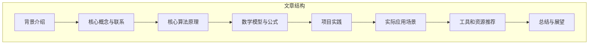
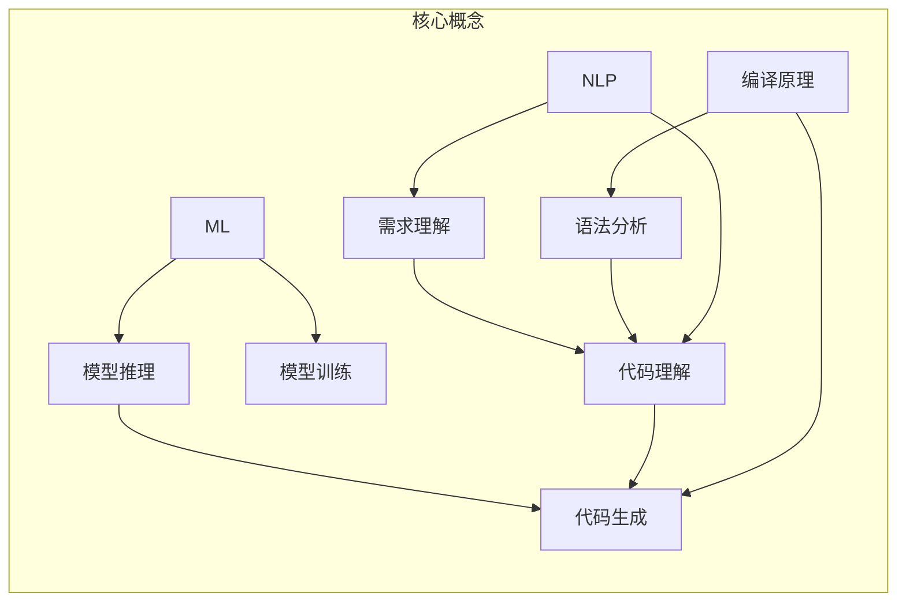
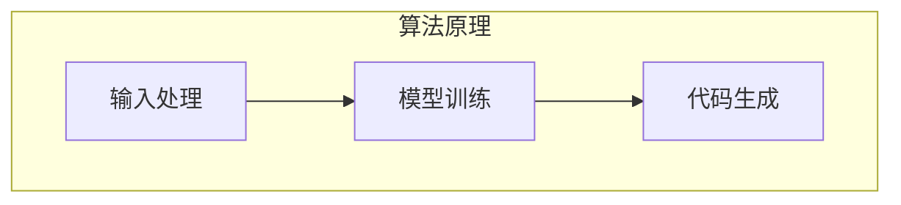

好的,我会严格按照您提供的要求和约束条件,以"CodeGen原理与代码实例讲解"为主题,撰写一篇专业的技术博客文章。

# CodeGen原理与代码实例讲解

## 1. 背景介绍

### 1.1 问题的由来

在软件开发过程中,编写高质量、可维护的代码一直是程序员面临的一大挑战。随着应用程序的复杂性不断增加,手工编写代码变得越来越困难和耗时。因此,自动生成代码(Code Generation)的需求日益迫切。

传统的代码生成方式通常依赖于模板、框架或领域特定语言(DSL),但这些方法存在一些局限性:

1. **灵活性不足**:模板和框架通常是固定的,难以适应快速变化的需求。
2. **复杂性高**:DSL需要定义复杂的语法和语义规则,学习成本高。
3. **可维护性差**:生成的代码通常难以理解和修改。

为了解决这些问题,CodeGen(Code Generation)作为一种新兴的代码自动生成技术应运而生。

### 1.2 研究现状  

CodeGen技术的核心思想是利用人工智能(AI)和机器学习(ML)算法,从给定的需求规范、设计文档或示例代码中自动生成目标代码。目前,CodeGen技术主要应用于以下几个领域:

1. **低代码/无代码开发平台**:通过可视化建模和AI辅助,降低开发门槛。
2. **代码重构和迁移**:自动重构遗留代码,实现系统现代化。
3. **自动测试用例生成**:根据规范或现有代码生成测试用例,提高测试覆盖率。
4. **API生成**:从接口定义自动生成客户端和服务端代码。

目前,主流的CodeGen技术包括基于规则的方法(Rule-based)、基于示例的方法(Example-based)和基于神经网络的方法(Neural Networks)等。其中,基于神经网络的方法由于其强大的学习能力和泛化性,在CodeGen领域取得了令人瞩目的成绩,成为研究的热点。

### 1.3 研究意义

CodeGen技术的发展有望带来以下重要意义:

1. **提高开发效率**:自动生成大部分代码,减少手工编码工作量。
2. **保证代码质量**:生成的代码符合规范和最佳实践,减少人为错误。
3. **降低开发成本**:缩短开发周期,节省人力和资金投入。
4. **促进创新**:程序员可将精力集中于创新性的工作,而非重复的编码劳动。

因此,CodeGen技术有望彻底改变传统的软件开发模式,成为软件工程领域的一场革命性变革。

### 1.4 本文结构

本文将全面介绍CodeGen技术的核心原理、算法细节、数学模型以及实际应用。文章主要结构如下:

## 2. 核心概念与联系

CodeGen技术涉及多个领域的核心概念,包括编译原理、自然语言处理(NLP)、机器学习(ML)等。这些概念相互关联、相辅相成,共同构建了CodeGen的理论基础。

1. **编译原理**:编译器的核心技术,包括词法分析、语法分析、语义分析和代码生成等,为CodeGen提供了基础的代码处理能力。

2. **自然语言处理(NLP)**: 用于理解自然语言的需求描述,提取关键信息;同时也用于分析现有代码,获取代码语义。

3. **机器学习(ML)**: 通过大量数据训练,构建映射需求与代码的模型;在推理阶段,根据需求生成目标代码。

4. **语法分析和需求理解**:基于编译原理和NLP技术,对输入的需求描述和代码进行语法和语义分析,获取代码结构和逻辑。

5. **代码理解和模型推理**:将分析得到的代码语义表示输入到训练好的ML模型,模型根据需求生成新的代码。

6. **代码生成**:基于编译原理,将模型输出的中间表示转换为可执行的目标代码。

可见,CodeGen技术是多学科交叉融合的产物,需要编译原理、NLP、ML等多方面的知识作为理论基础。

## 3. 核心算法原理与具体操作步骤  

### 3.1 算法原理概述

CodeGen技术的核心算法主要分为三个阶段:

1. **输入处理**:对输入的需求描述和示例代码进行预处理,提取关键信息。
2. **模型训练**:基于大量需求-代码对训练生成模型。 
3. **代码生成**:将新的需求输入到模型,生成对应的目标代码。

其中,模型训练阶段是算法的核心部分,通常采用序列到序列(Seq2Seq)的神经网络架构。该架构由编码器(Encoder)和解码器(Decoder)两部分组成:

- **编码器**:将输入的需求描述和示例代码编码为语义向量表示。
- **解码器**:根据编码器的输出,生成目标代码的token序列。

在训练过程中,模型会不断调整参数,使生成的代码逐步逼近示例代码。训练完成后,模型可应用于新的需求,自动生成对应的目标代码。

### 3.2 算法步骤详解

CodeGen算法的具体步骤如下:

#### 输入处理

1. **标记化(Tokenization)**: 将输入文本拆分为单词、符号等token序列。
2. **嵌入(Embedding)**: 将每个token映射为向量表示,以便神经网络处理。
3. **语法分析**: 对输入代码进行词法、语法分析,构建抽象语法树(AST)。
4. **语义分析**: 利用NLP技术分析需求描述,提取关键信息。

#### 模型训练 

5. **数据准备**: 构建大规模的需求-代码对作为训练数据集。
6. **编码器**: 使用RNN/Transformer等模型,对输入的需求描述和AST进行编码。
7. **解码器**: 初始化解码器的状态为编码器的输出。
8. **生成目标代码**: 解码器基于输入,自回归地生成目标代码token序列。
9. **损失计算**: 将生成序列与示例代码进行对比,计算损失值。
10. **参数更新**: 基于损失值,使用优化算法(如Adam)更新模型参数。
11. **迭代训练**: 重复步骤6-10,直至模型收敛。

#### 代码生成

12. **输入新需求**: 对新的需求描述进行输入处理(步骤1-4)。
13. **编码新需求**: 将处理后的需求输入到训练好的编码器(步骤6)。
14. **生成目标代码**: 解码器基于编码器输出,生成目标代码token序列(步骤8)。
15. **代码构建**: 将生成的token序列转换为可执行的目标代码文件。

### 3.3 算法优缺点

CodeGen算法具有以下优缺点:

**优点**:

1. **高效生成代码**: 模型可根据需求快速生成大量代码,提高开发效率。
2. **泛化能力强**: 基于大数据训练,模型可应对多种场景,生成多种编程语言代码。
3. **持续学习**: 模型可使用新数据持续训练,不断提高生成质量。

**缺点**:

1. **训练数据质量要求高**: 需要大量高质量的需求-代码对作为训练数据。
2. **生成代码质量参差不齐**: 有时生成的代码存在错误或不合理的情况。
3. **缺乏创新性**: 模型生成的代码大多遵循已有模式,创新能力有限。

### 3.4 算法应用领域

CodeGen算法可广泛应用于以下领域:

1. **低代码开发平台**: 通过自然语言或可视化建模方式,自动生成应用程序代码。
2. **API生成**: 根据接口定义描述,一键生成客户端SDK和服务端框架代码。
3. **代码迁移**: 将遗留系统代码自动迁移到新框架或语言版本。
4. **单元测试生成**: 根据功能需求或现有代码,自动生成单元测试case。
5. **编程教育**: 根据学生提供的需求描述,生成解决方案代码以辅助教学。

总的来说,CodeGen技术可以显著提高软件开发的效率和质量,并在多个领域发挥重要作用。

## 4. 数学模型和公式详细讲解举例说明

### 4.1 数学模型构建

CodeGen算法的核心是序列到序列(Seq2Seq)模型,主要由编码器(Encoder)和解码器(Decoder)两部分组成。

#### 编码器(Encoder)

编码器的作用是将输入序列(需求描述和代码AST)编码为语义向量表示。常用的编码器模型有:

- **RNN编码器**:使用RNN(如LSTM/GRU)对输入序列进行编码,最终隐状态向量作为语义表示。

$$
\begin{aligned}
h_t &= \text{RNNCell}(x_t, h_{t-1}) \\
c &= h_T
\end{aligned}
$$

其中,$x_t$为时间步$t$的输入,$h_t$为对应的隐状态,$c$为最终编码向量。

- **Transformer编码器**:使用Self-Attention机制对输入序列进行编码。

$$
\begin{aligned}
c &= \text{TransformerEncoder}(x_1, x_2, \ldots, x_n) \\
  &= \text{MultiHeadAttention}(x_1, x_2, \ldots, x_n)
\end{aligned}
$$

$c$为编码向量,通过Self-Attention获得输入序列的语义表示。

#### 解码器(Decoder)

解码器的作用是根据编码器的输出,自回归地生成目标代码序列。常用的解码器模型有:

- **RNN解码器**:使用RNN对目标序列进行生成,每个时间步的输出作为下一步的输入。

$$
\begin{aligned}
y_t &\sim \text{Distribution}(W_o h_t + b_o) \\
h_t &= \text{RNNCell}(y_{t-1}, h_{t-1}, c)
\end{aligned}
$$

其中,$y_t$为时间步$t$生成的token,$h_t$为对应的隐状态,$c$为编码器的输出。

- **Transformer解码器**:使用Masked Self-Attention和Cross Attention机制生成序列。

$$
\begin{aligned}
y_t &\sim \text{Distribution}(\text{TransformerDecoder}(y_1, \ldots, y_{t-1}, c)) \\
    &= \text{MaskedSelfAttention}(y_1, \ldots, y_{t-1}) \\
    &\quad + \text{CrossAttention}(y_1, \ldots, y_{t-1}, c)
\end{aligned}
$$

解码器基于之前生成的序列和编码器输出$c$,预测下一个token $y_t$。

模型的目标是最大化生成序列与示例代码序列的条件概率:

$$
\begin{aligned}
\theta^* &= \arg\max_\theta \sum_{(x, y) \in \mathcal{D}} \log P(y | x; \theta) \\
         &= \arg\max_\theta \sum_{(x, y) \in \mathcal{D}} \sum_{t=1}^{|y|} \log P(y_t | y_{<t}, x; \theta)
\end{aligned}
$$

其中,$\mathcal{D}$为训练数据集,$(x