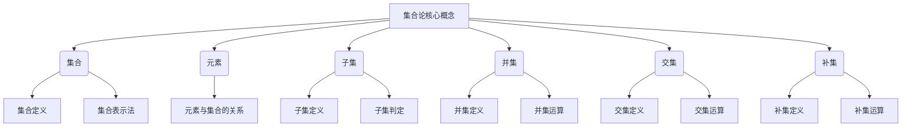
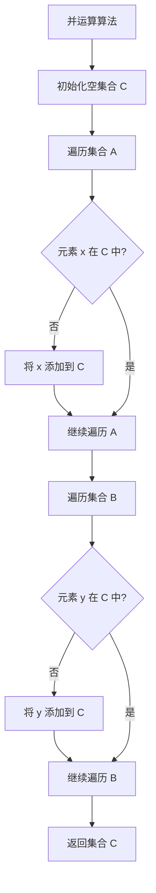
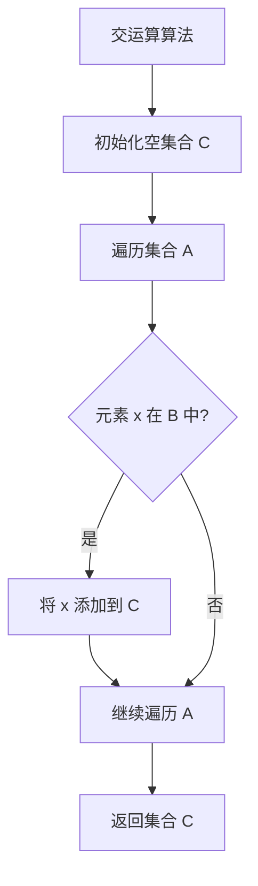
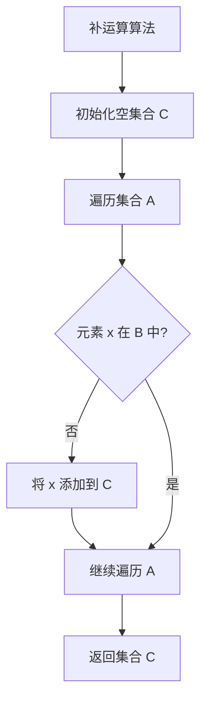

# 集合论导引：集合论模型

## 1. 背景介绍

### 1.1 问题的由来

集合论作为数学的一个基础分支,在计算机科学、逻辑学、人工智能等诸多领域扮演着重要角色。它为这些领域提供了一种描述和操作离散结构的形式化语言。然而,对于初学者来说,集合论的抽象性和形式化特征常常会带来一定的困难和挑战。

### 1.2 研究现状  

目前,已有大量的教材和资源致力于介绍集合论的基本概念和理论。然而,这些资源往往侧重于数学严谨性,缺乏对集合论在实际应用中的阐释。此外,一些资源的表达方式过于生硬和晦涩,难以激发初学者的兴趣。

### 1.3 研究意义

本文旨在为读者提供一种更加贴近实际、更加生动形象的集合论学习途径。通过介绍集合论的核心概念、算法原理、数学模型,并结合实际应用场景和代码实例,帮助读者更好地理解和掌握集合论的内涵。

### 1.4 本文结构

本文将从以下几个方面全面阐述集合论:

1. 核心概念与联系
2. 核心算法原理与具体操作步骤
3. 数学模型和公式详细讲解与举例说明
4. 项目实践:代码实例和详细解释说明
5. 实际应用场景
6. 工具和资源推荐
7. 总结:未来发展趋势与挑战
8. 附录:常见问题与解答

## 2. 核心概念与联系

集合论的核心概念包括集合、元素、子集、并集、交集、补集等。这些概念相互关联,构成了集合论的基础框架。

### 2.1 集合 (Set)

集合是由确定的元素所构成的整体。一个集合可以是有限的,也可以是无限的。集合通常用大写字母表示,如 $A$、$B$、$C$ 等。

$$集合 A = \\{a, b, c\\}$$

其中,$a$、$b$、$c$ 是集合 $A$ 的元素。

### 2.2 元素 (Element)

元素是构成集合的基本单位。一个元素可以属于一个或多个集合,也可以不属于任何集合。元素通常用小写字母表示,如 $a$、$b$、$c$ 等。

### 2.3 子集 (Subset)

如果一个集合 $B$ 中的所有元素都属于另一个集合 $A$,那么我们称集合 $B$ 是集合 $A$ 的子集,记作 $B \subseteq A$。

$$B \subseteq A \Leftrightarrow \forall x \in B, x \in A$$

### 2.4 并集 (Union)

两个集合 $A$ 和 $B$ 的并集,记作 $A \cup B$,是由属于 $A$ 或属于 $B$ 的所有元素构成的集合。

$$A \cup B = \\{x | x \in A \lor x \in B\\}$$

### 2.5 交集 (Intersection)

两个集合 $A$ 和 $B$ 的交集,记作 $A \cap B$,是由同时属于 $A$ 和 $B$ 的所有元素构成的集合。

$$A \cap B = \\{x | x \in A \land x \in B\\}$$

### 2.6 补集 (Complement)

给定一个универ集 (Universal Set) $U$,集合 $A$ 相对于 $U$ 的补集,记作 $\overline{A}$ 或 $A^c$,是由属于 $U$ 但不属于 $A$ 的所有元素构成的集合。

$$\overline{A} = \\{x | x \in U \land x \notin A\\}$$

这些核心概念相互关联,构成了集合论的基础框架。掌握了这些概念,就能更好地理解和应用集合论。

## 3. 核心算法原理与具体操作步骤

集合论中有一些常见的算法,如集合的并运算、交运算、补运算等。这些算法的原理和操作步骤如下:

### 3.1 算法原理概述

- **并运算**:将两个集合中的所有元素合并,形成一个新的集合。
- **交运算**:找出两个集合中共同的元素,形成一个新的集合。
- **补运算**:从一个较大的集合中去掉另一个较小的集合中的元素,形成一个新的集合。

### 3.2 算法步骤详解

#### 3.2.1 并运算算法步骤

输入: 集合 $A$ 和集合 $B$
输出: 集合 $A$ 和集合 $B$ 的并集 $C$

1. 初始化一个空集合 $C$
2. 遍历集合 $A$ 中的每个元素 $x$
    - 如果 $x$ 不在 $C$ 中,将 $x$ 添加到 $C$
3. 遍历集合 $B$ 中的每个元素 $y$
    - 如果 $y$ 不在 $C$ 中,将 $y$ 添加到 $C$
4. 返回集合 $C$

#### 3.2.2 交运算算法步骤

输入: 集合 $A$ 和集合 $B$
输出: 集合 $A$ 和集合 $B$ 的交集 $C$

1. 初始化一个空集合 $C$
2. 遍历集合 $A$ 中的每个元素 $x$
    - 如果 $x$ 也在集合 $B$ 中,将 $x$ 添加到 $C$
3. 返回集合 $C$

#### 3.2.3 补运算算法步骤

输入: 集合 $A$ 和集合 $B$
输出: 集合 $A$ 相对于集合 $B$ 的补集 $C$

1. 初始化一个空集合 $C$
2. 遍历集合 $A$ 中的每个元素 $x$
    - 如果 $x$ 不在集合 $B$ 中,将 $x$ 添加到 $C$
3. 返回集合 $C$

### 3.3 算法优缺点

- **优点**:
    - 算法原理简单,易于理解和实现。
    - 时间复杂度较低,适合处理大规模数据集。
- **缺点**:
    - 对于无序集合,需要遍历整个集合,效率较低。
    - 对于稠密集合,可能会占用较多内存空间。

### 3.4 算法应用领域

集合运算算法在以下领域有广泛应用:

- 数据库系统:用于处理关系代数操作,如连接、并、差等。
- 信息检索:用于文档索引和搜索结果合并。
- 机器学习:用于特征选择、数据预处理等。
- 编译原理:用于符号表管理、类型检查等。
- 计算机图形学:用于几何运算、物体碰撞检测等。

## 4. 数学模型和公式详细讲解与举例说明

集合论中有一些重要的数学模型和公式,对于理解和应用集合论概念至关重要。

### 4.1 数学模型构建

#### 4.1.1 笛卡尔积 (Cartesian Product)

笛卡尔积是两个集合的一种二元运算,它构造出一个新的集合,其元素是两个集合中元素的一一对应的有序对。

设 $A$ 和 $B$ 是两个集合,则 $A$ 与 $B$ 的笛卡尔积记作 $A \times B$,定义为:

$$A \times B = \\{(a, b) | a \in A \land b \in B\\}$$

例如,如果 $A = \\{1, 2\\}$,且 $B = \\{a, b\\}$,则:

$$A \times B = \\{(1, a), (1, b), (2, a), (2, b)\\}$$

笛卡尔积在数学和计算机科学中有广泛应用,例如:

- 关系代数:用于构造关系的笛卡尔积。
- 图论:用于构造图的顶点集和边集。
- 形式语言:用于构造语言的字母表和单词集。

#### 4.1.2 幂集 (Power Set)

给定一个集合 $A$,它的幂集 $\mathcal{P}(A)$ 是 $A$ 的所有子集构成的集合,包括空集和 $A$ 本身。

$$\mathcal{P}(A) = \\{B | B \subseteq A\\}$$

例如,如果 $A = \\{1, 2, 3\\}$,则:

$$\mathcal{P}(A) = \\{\emptyset, \\{1\\}, \\{2\\}, \\{3\\}, \\{1, 2\\}, \\{1, 3\\}, \\{2, 3\\}, \\{1, 2, 3\\}\\}$$

幂集在数学和计算机科学中有重要应用,例如:

- 组合数学:用于计算组合数。
- 逻辑电路设计:用于构造真值表。
- 机器学习:用于构造特征子集。

### 4.2 公式推导过程

#### 4.2.1 集合运算公式

设 $A$、$B$ 和 $C$ 是任意集合,则有以下公式成立:

$$
\begin{aligned}
& A \cup \emptyset = A \\\\
& A \cap \mathcal{U} = A \\\\
& A \cup \mathcal{U} = \mathcal{U} \\\\
& A \cap \emptyset = \emptyset \\\\
& A \cup A = A \\\\
& A \cap A = A \\\\
& A \cup B = B \cup A \\\\
& A \cap B = B \cap A \\\\
& A \cup (B \cup C) = (A \cup B) \cup C \\\\
& A \cap (B \cap C) = (A \cap B) \cap C \\\\
& A \cup (B \cap C) = (A \cup B) \cap (A \cup C) \\\\
& A \cap (B \cup C) = (A \cap B) \cup (A \cap C) \\\\
& \overline{\overline{A}} = A \\\\
& \overline{A \cup B} = \overline{A} \cap \overline{B} \\\\
& \overline{A \cap B} = \overline{A} \cup \overline{B}
\end{aligned}
$$

其中,$ \mathcal{U} $表示универ集。

#### 4.2.2 公式推导示例

推导: $\overline{A \cup B} = \overline{A} \cap \overline{B}$

证明:

$$
\begin{aligned}
x \in \overline{A \cup B} 
&\Leftrightarrow x \notin A \cup B && \text{(补集定义)} \\\\
&\Leftrightarrow x \notin A \land x \notin B && \text{(并集定义)} \\\\
&\Leftrightar