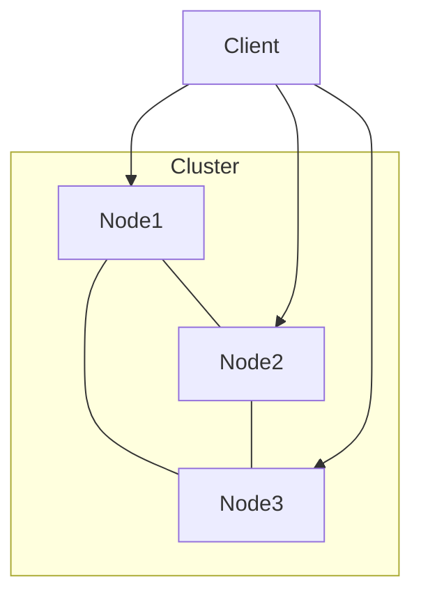

# Akka集群原理与代码实例讲解

关键词：Akka、Actor模型、分布式系统、容错、可扩展性、并发编程

## 1. 背景介绍
### 1.1 问题的由来
在当今大数据时代，企业需要处理海量数据和高并发请求，单台服务器已无法满足性能和可靠性需求。构建分布式系统成为必然选择，而如何设计一个高效、可靠、易于扩展的分布式框架是亟待解决的问题。
### 1.2 研究现状
目前业界有多种分布式框架，如Hadoop、Spark等，但它们大多基于Master-Slave模型，存在单点故障、扩展性差等问题。Akka作为一个轻量级分布式框架，采用去中心化的Peer-to-Peer模型，每个节点平等，避免了单点故障，并且具有很好的扩展性和容错能力。
### 1.3 研究意义
深入研究Akka集群原理，对于设计高可用、易扩展的分布式系统具有重要意义。通过理解其工作机制，可以更好地应用到实际项目中，提升系统性能和稳定性。同时Akka也为并发编程提供了新的思路。
### 1.4 本文结构
本文将从以下几方面展开：首先介绍Akka的核心概念Actor模型，然后深入剖析Akka集群的工作原理，包括节点发现、成员管理、分布式数据等，并给出数学建模和公式推导。接着通过代码实例讲解如何使用Akka构建集群应用，最后探讨其应用场景和未来发展趋势。

## 2. 核心概念与联系
Akka的核心是Actor模型，它是一种并发编程模型，将应用程序划分为多个Actor，每个Actor是一个独立的实体，有自己的状态和行为，通过异步消息进行通信。Actor之间是相互隔离的，只能通过消息交互，不共享内存，避免了锁和线程同步问题，是一种更高层的并发抽象。

在分布式场景下，Akka提供了集群（Cluster）功能，允许将Actor部署到多个节点，形成一个逻辑上的整体。集群中的节点可以自动发现彼此，进行消息路由和负载均衡。同时Akka还提供了容错机制，当某个节点失败时，系统可以自动进行故障转移和状态恢复。

下图展示了Akka集群的基本架构：



可以看到，集群由多个节点组成，每个节点都是平等的，没有中心节点。客户端请求可以发送到任意节点，然后由Akka自动路由到目标Actor。

## 3. 核心算法原理 & 具体操作步骤
### 3.1 算法原理概述
Akka集群的核心算法包括节点发现、成员管理、故障检测、分布式数据一致性等。
### 3.2 算法步骤详解
1. 节点发现：当一个节点启动时，它需要加入集群并发现其他节点。Akka采用了基于Gossip协议的节点发现机制，新节点向种子节点发送加入请求，种子节点将新节点加入并同步集群状态，然后新节点再与其他节点进行Gossip同步。

2. 成员管理：集群需要维护成员节点的状态，包括Up、Down、Leaving等。Akka使用基于CRDT（Conflict-free Replicated Data Type）的成员状态同步协议，通过Vector Clock实现因果一致性，最终所有节点的状态达成一致。

3. 故障检测：集群需要能够检测节点失败并自动进行故障转移。Akka采用了Phi Accrual Failure Detector算法，通过计算节点心跳包到达的概率来判断是否怀疑节点失败，并设置阈值来确定失败。
   
4. 分布式数据一致性：对于需要在集群中共享和复制的数据，Akka提供了CRDTs数据类型，如GCounter、PNCounter、ORSet等。这些数据类型可以在不同节点独立更新，最终通过冲突合并达到最终一致性。

### 3.3 算法优缺点
Akka集群算法的优点是：
- 去中心化，避免单点故障
- 弹性可扩展，新节点可以随时加入
- 基于最终一致性，放松了强一致性要求
- 对应用透明，屏蔽了分布式细节

缺点是：
- 算法实现复杂，对开发人员要求较高  
- 最终一致性可能不适用于某些强一致性场景
- 成员状态同步可能存在网络开销

### 3.4 算法应用领域
Akka集群广泛应用于构建高可用、可扩展的分布式系统，如实时数据处理、流处理、微服务、物联网等。

## 4. 数学模型和公式 & 详细讲解 & 举例说明
### 4.1 数学模型构建
我们可以使用Gossip传播模型来分析Akka集群的节点发现效率。假设集群有N个节点，Gossip同步间隔为Δt，单次Gossip能够同步到的节点比例为f，则T轮Gossip后，节点感知到其他节点的比例为：

$$ P(T) = 1 - (1 - f)^T $$

可见Gossip传播具有指数级收敛速度，当 $f=0.1, T=10$ 时，$P(T)=0.65$，即10轮Gossip后，节点平均能发现65%的其他节点。

### 4.2 公式推导过程
令 $P(T)$ 表示T轮Gossip后节点发现其他节点的比例，$P(T+1)$ 表示T+1轮后的比例，则：

$$
\begin{aligned}
P(T+1) &= P(T) + (1-P(T))f \\
&= P(T) + f - fP(T) \\
&= f + (1-f)P(T) \\
&= f + (1-f)(f + (1-f)P(T-1)) \\
&= f + f(1-f) + (1-f)^2P(T-1) \\
&= f(1 + (1-f)) + (1-f)^2P(T-1) \\ 
&= f(2-f) + (1-f)^2P(T-1)
\end{aligned} 
$$

递推下去，可得：

$$
\begin{aligned}
P(T) &= f(2-f) + (1-f)^2(f(2-f) + (1-f)^2P(T-2)) \\
&= f(2-f)(1 + (1-f)^2) + (1-f)^4P(T-2) \\
&= f(2-f)(1 + (1-f)^2 + ... + (1-f)^{2(T-1)}) + (1-f)^{2T}P(0) \\
&= f(2-f)\frac{1-(1-f)^{2T}}{1-(1-f)^2} + (1-f)^{2T}P(0) \\
&= 1 - (1-f)^{2T}
\end{aligned}
$$

其中 $P(0)=0$，即初始时节点未发现任何其他节点。

### 4.3 案例分析与讲解
举一个具体例子，假设一个由10个节点组成的Akka集群，Gossip同步间隔为1秒，单次Gossip能同步到30%的节点，求6秒后节点平均发现其他节点的比例。

代入公式，$f=0.3, T=6$，得到：

$$
\begin{aligned}
P(6) &= 1 - (1-0.3)^{2*6} \\
&= 1 - 0.7^{12} \\
&= 1 - 0.014 \\
&= 0.986
\end{aligned}
$$

即6秒后，平均每个节点能发现98.6%的其他节点，Gossip传播效率非常高。

### 4.4 常见问题解答
Q: Gossip传播是否有可能导致某些节点被孤立？
A: 理论上存在这种可能，但概率极低。如果某个节点长时间未收到其他节点的Gossip同步，会主动尝试联系种子节点重新加入集群。同时可以增加种子节点数量来提高容错性。

Q: 集群中可以容忍多少节点失败？
A: 这取决于具体的容错配置，如果要求strict majority，则允许的最大失败节点数为(N-1)/2。如果要求所有节点都同意，则任一节点失败都会导致集群不可用。可以根据实际需求选择合适的容错级别。

## 5. 项目实践：代码实例和详细解释说明
下面我们通过一个简单的Akka集群示例来说明如何编写代码。

### 5.1 开发环境搭建
- 安装JDK 8+
- 安装sbt构建工具
- 准备3台服务器节点

### 5.2 源代码详细实现

1. 在`build.sbt`中添加Akka依赖：
```scala
libraryDependencies ++= Seq(
  "com.typesafe.akka" %% "akka-actor" % "2.6.19",
  "com.typesafe.akka" %% "akka-cluster" % "2.6.19"
)
```

2. 创建`application.conf`配置文件：
```hocon
akka {
  actor {
    provider = cluster
  }
  remote {
    artery {
      transport = tcp
      canonical.hostname = "127.0.0.1"
      canonical.port = 2551
    }
  }
  cluster {
    seed-nodes = [
      "akka://ClusterSystem@127.0.0.1:2551",
      "akka://ClusterSystem@127.0.0.1:2552"]
    downing-provider-class = "akka.cluster.sbr.SplitBrainResolverProvider"
  }
}
```

3. 编写集群成员Actor：
```scala
class ClusterMember extends Actor with ActorLogging {
  val cluster = Cluster(context.system)

  override def preStart(): Unit = {
    cluster.subscribe(self, classOf[MemberEvent])
  }
  override def postStop(): Unit = {
    cluster.unsubscribe(self)
  }

  def receive = {
    case MemberUp(member) =>
      log.info("Member is Up: {}", member.address)
    case MemberRemoved(member, previousStatus) =>
      log.info("Member is Removed: {} after {}", member.address, previousStatus)
    case _: MemberEvent => // ignore
  }
}
```

4. 编写集群应用Main类：
```scala
object ClusterApp extends App {
  val system = ActorSystem("ClusterSystem")
  system.actorOf(Props[ClusterMember], "clusterMember")
}
```

### 5.3 代码解读与分析
- 集群成员Actor订阅了MemberEvent事件，包括MemberUp和MemberRemoved，可以监听成员状态变化。
- 在`application.conf`中配置了种子节点和Split Brain Resolver，使集群具有分区容错能力。
- 在Main类中创建了ActorSystem，并启动ClusterMember。

### 5.4 运行结果展示
在三个节点上分别运行应用，控制台输出：
```
[info] Member is Up: akka://ClusterSystem@127.0.0.1:2551
[info] Member is Up: akka://ClusterSystem@127.0.0.1:2552
[info] Member is Up: akka://ClusterSystem@127.0.0.1:2553
```
表明三个节点成功组成了集群。

## 6. 实际应用场景
Akka集群可以应用于以下场景：
- 金融交易系统，需要高吞吐和低延迟
- 电商大促活动，需要应对瞬时高并发
- 车联网平台，需要连接海量设备并实时处理数据
- 游戏服务器，需要支持多人在线和动态伸缩

### 6.4 未来应用展望
随着5G、物联网的发展，Akka集群有望在边缘计算、车辆网络、智慧城市等领域得到更广泛应用，支撑海量设备的实时通信和控制。同时Akka也在不断演进，与Kubernetes、Serverless等云原生技术深度融合，进一步提升分布式应用的开发和运维效率。

## 7. 工具和资源推荐
### 7.1 学习资源推荐
- 官方文档：https://doc.akka.io/docs/akka/current/
- Akka in Action 图书
- Coursera课程：Big Data Analysis with Scala and Spark
### 7.2 开发工具推荐
- IntelliJ IDEA + Scala插件
- sbt构建工具
- Lightbend Telemetry 监控工具
### 7.3 相关论文推荐
- Akka Cluster Metrics
- Akka Anti-entropy Protocol
- Distributed Data in Akka
### 7.4 其他资