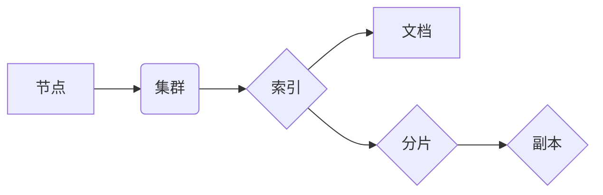

## 1. 背景介绍
### 1.1  问题的由来
随着互联网的蓬勃发展，海量数据量的产生和存储成为一个不可忽视的问题。传统的搜索引擎在面对海量数据时，效率低下，难以满足用户快速获取信息的需求。分布式搜索引擎应运而生，旨在通过将数据分散存储在多个节点上，并采用并行处理的方式，提高搜索效率和处理能力。

### 1.2  研究现状
分布式搜索引擎技术近年来发展迅速，ElasticSearch作为其中佼佼者，凭借其高性能、高可用性和丰富的功能，在电商、社交媒体、日志分析等领域得到广泛应用。

### 1.3  研究意义
深入理解ElasticSearch的原理和架构，能够帮助开发者更好地利用其强大的功能，构建高效、可靠的搜索系统。

### 1.4  本文结构
本文将从ElasticSearch的背景介绍、核心概念、算法原理、代码实例等方面进行详细讲解，并结合实际应用场景，帮助读者全面掌握ElasticSearch的知识和技能。

## 2. 核心概念与联系
ElasticSearch是一个基于Lucene的分布式搜索和分析引擎，其核心概念包括：

* **节点 (Node):** ElasticSearch集群由多个节点组成，每个节点都运行一个ElasticSearch进程，负责处理数据存储、搜索和分析等任务。
* **集群 (Cluster):** 多个节点组成的集合称为集群，集群中的节点之间相互通信，共同处理数据。
* **索引 (Index):** 索引是数据存储的结构化单元，类似于数据库中的表，包含多个文档。
* **文档 (Document):** 文档是索引中的基本数据单元，类似于数据库中的记录，包含一系列键值对。
* **分片 (Shard):** 索引可以被分割成多个分片，每个分片独立存储一部分数据，提高数据处理效率。
* **副本 (Replica):** 每个分片可以有多个副本，副本用于数据备份和容灾，保证数据可靠性。

**关系图:**



## 3. 核心算法原理 & 具体操作步骤
### 3.1  算法原理概述
ElasticSearch的核心算法基于Lucene，主要包括以下几个方面：

* **分词 (Tokenization):** 将文本分解成单个词语或单词。
* **词干化 (Stemming):** 将词语还原到其词干形式，例如将“running”还原为“run”。
* **词形变化 (Lemmatization):** 将词语还原到其词根形式，例如将“better”还原为“good”。
* **逆向索引 (Inverted Index):** 将每个词语映射到包含该词语的文档列表，实现快速搜索。
* **排序 (Ranking):** 根据查询条件和文档的相关性，对搜索结果进行排序。

### 3.2  算法步骤详解
1. **数据预处理:** 将数据进行分词、词干化、词形变化等预处理操作，生成索引所需的格式。
2. **索引构建:** 将预处理后的数据存储到索引中，构建逆向索引。
3. **查询处理:** 用户输入查询条件，ElasticSearch根据查询条件构建查询语句，并利用逆向索引快速定位包含相关词语的文档。
4. **结果排序:** 根据查询条件和文档的相关性，对搜索结果进行排序，返回用户。

### 3.3  算法优缺点
**优点:**

* 高效的搜索速度
* 强大的数据分析功能
* 灵活的查询语法
* 高可用性和容灾能力

**缺点:**

* 复杂的数据模型
* 需要一定的学习成本
* 对硬件资源要求较高

### 3.4  算法应用领域
ElasticSearch广泛应用于以下领域:

* **搜索引擎:** 提供快速、精准的搜索功能。
* **日志分析:** 收集、存储和分析日志数据，帮助用户了解系统运行状况。
* **监控系统:** 实时监控系统性能和状态，及时发现问题。
* **数据可视化:** 将数据可视化，帮助用户更好地理解数据。

## 4. 数学模型和公式 & 详细讲解 & 举例说明
### 4.1  数学模型构建
ElasticSearch的搜索算法基于信息检索理论，其中一个关键概念是TF-IDF（Term Frequency-Inverse Document Frequency）。TF-IDF是一种衡量词语重要性的指标，它考虑了词语在文档中出现的频率以及词语在整个语料库中出现的频率。

**公式:**

$$TF-IDF(t, d) = TF(t, d) \times IDF(t)$$

其中：

* $TF(t, d)$ 表示词语 $t$ 在文档 $d$ 中出现的频率。
* $IDF(t)$ 表示词语 $t$ 在整个语料库中出现的逆文档频率。

$$IDF(t) = log_e \frac{N}{df(t)}$$

其中：

* $N$ 表示语料库中文档总数。
* $df(t)$ 表示词语 $t$ 在语料库中出现的文档数。

### 4.2  公式推导过程
TF-IDF公式的推导过程如下：

* **TF(t, d):** 词语 $t$ 在文档 $d$ 中出现的频率越高，该词语对该文档的 relevance 越高。
* **IDF(t):** 词语 $t$ 在整个语料库中出现的频率越低，该词语的 distinctiveness 越高，对搜索结果的区分度越高。

因此，TF-IDF 将这两个因素结合起来，衡量词语在特定文档中的重要性。

### 4.3  案例分析与讲解
假设我们有一个语料库包含1000个文档，其中包含以下词语：

* "苹果"：出现在500个文档中
* "香蕉"：出现在100个文档中

根据公式，我们可以计算出这两个词语的TF-IDF值：

* $IDF(苹果) = log_e \frac{1000}{500} = log_e 2$
* $IDF(香蕉) = log_e \frac{1000}{100} = log_e 10$

可以看到，"香蕉"的IDF值比"苹果"的IDF值高，这意味着"香蕉"在语料库中出现的频率更低，其 distinctiveness 更高。

### 4.4  常见问题解答
* **如何选择合适的TF-IDF权重？**

TF-IDF权重可以通过实验和调整来确定，不同的应用场景可能需要不同的权重设置。

* **TF-IDF算法是否适用于所有类型的文本数据？**

TF-IDF算法适用于文本数据，但对于结构化数据或图像数据，需要使用其他算法。

## 5. 项目实践：代码实例和详细解释说明
### 5.1  开发环境搭建
ElasticSearch的开发环境搭建需要以下软件：

* Java JDK
* ElasticSearch安装包
* Elasticsearch客户端库

### 5.2  源代码详细实现
以下是一个简单的ElasticSearch代码实例，演示如何创建索引、添加文档和查询文档：

```java
import org.elasticsearch.action.index.IndexRequest;
import org.elasticsearch.action.index.IndexResponse;
import org.elasticsearch.client.RequestOptions;
import org.elasticsearch.client.RestHighLevelClient;
import org.elasticsearch.common.xcontent.XContentType;

public class ElasticsearchExample {

    public static void main(String[] args) throws Exception {
        // 创建ElasticSearch客户端
        RestHighLevelClient client = new RestHighLevelClient();

        // 创建索引请求
        IndexRequest request = new IndexRequest("my_index")
                .id("1")
                .source("{\"name\":\"John Doe\",\"age\":30}", XContentType.JSON);

        // 添加文档
        IndexResponse response = client.index(request, RequestOptions.DEFAULT);

        // 查询文档
        // ...

        // 关闭客户端
        client.close();
    }
}
```

### 5.3  代码解读与分析
* **创建ElasticSearch客户端:** 使用RestHighLevelClient类创建ElasticSearch客户端，用于与ElasticSearch集群进行通信。
* **创建索引请求:** 使用IndexRequest类创建索引请求，指定索引名称、文档ID和文档内容。
* **添加文档:** 使用client.index()方法发送索引请求，将文档添加到索引中。
* **查询文档:** 可以使用其他ElasticSearch API查询文档，例如search()方法。
* **关闭客户端:** 使用client.close()方法关闭ElasticSearch客户端。

### 5.4  运行结果展示
运行以上代码后，将创建一个名为"my_index"的索引，并添加一个ID为"1"的文档，包含姓名和年龄信息。

## 6. 实际应用场景
### 6.1  电商搜索
ElasticSearch可以用于构建电商平台的搜索引擎，帮助用户快速找到所需的商品。

### 6.2  日志分析
ElasticSearch可以用于收集、存储和分析日志数据，帮助用户了解系统运行状况和潜在问题。

### 6.3  监控系统
ElasticSearch可以用于构建监控系统，实时监控系统性能和状态，及时发现问题。

### 6.4  未来应用展望
随着大数据和人工智能技术的不断发展，ElasticSearch的应用场景将更加广泛，例如：

* **个性化推荐:** 基于用户行为数据，提供个性化商品推荐。
* **机器学习:** 利用ElasticSearch的强大的数据分析功能，进行机器学习模型训练和预测。
* **实时数据分析:** 实时分析流式数据，帮助用户做出更快速、更准确的决策。

## 7. 工具和资源推荐
### 7.1  学习资源推荐
* **ElasticSearch官方文档:** https://www.elastic.co/guide/en/elasticsearch/reference/current/index.html
* **ElasticSearch中文社区:** https://www.elastic.co/cn/community
* **ElasticSearch Udemy课程:** https://www.udemy.com/topic/elasticsearch/

### 7.2  开发工具推荐
* **ElasticSearch客户端库:** https://www.elastic.co/guide/en/elasticsearch/client/java-rest/current/java-rest-client.html
* **Kibana:** https://www.elastic.co/products/kibana

### 7.3  相关论文推荐
* **Elasticsearch: A Distributed, Scalable Search Engine:** https://www.elastic.co/blog/elasticsearch-a-distributed-scalable-search-engine

### 7.4  其他资源推荐
* **ElasticSearch博客:** https://www.elastic.co/blog
* **ElasticSearch GitHub仓库:** https://github.com/elastic/elasticsearch

## 8. 总结：未来发展趋势与挑战
### 8.1  研究成果总结
本文详细介绍了ElasticSearch的原理、算法、代码实例和应用场景，帮助读者全面掌握ElasticSearch的知识和技能。

### 8.2  未来发展趋势
ElasticSearch未来将继续朝着以下方向发展:

* **更强大的数据分析功能:** 支持更复杂的查询语法和数据分析算法。
* **更完善的机器学习集成:** 将机器学习模型集成到ElasticSearch中，实现更智能的搜索和分析功能。
* **更强大的云原生支持:** 提供更完善的云原生部署和管理方案。

### 8.3  面临的挑战
ElasticSearch也面临一些挑战，例如:

* **数据安全:** 如何保障ElasticSearch数据安全和隐私保护。
* **性能优化:** 如何在海量数据下保持高性能和低延迟。
* **生态系统建设:** 如何构建更完善的ElasticSearch生态系统，吸引更多开发者和用户。

### 8.4  研究展望
未来，我们将继续深入研究ElasticSearch的原理和应用，探索其在更多领域的新应用场景，并积极参与ElasticSearch社区的建设，推动ElasticSearch技术的进步。

## 9. 附录：常见问题与解答
* **ElasticSearch集群如何配置？**

ElasticSearch集群的配置需要根据实际需求进行调整，包括节点数量、分片数量、副本数量等。

* **如何监控ElasticSearch集群的性能？**

可以使用Kibana等工具监控ElasticSearch集群的性能，包括CPU使用率、内存使用率、磁盘使用率等指标。

* **如何备份和恢复ElasticSearch数据？**

ElasticSearch提供了一些备份和恢复工具，可以定期备份数据，并进行数据恢复。


<end_of_turn>