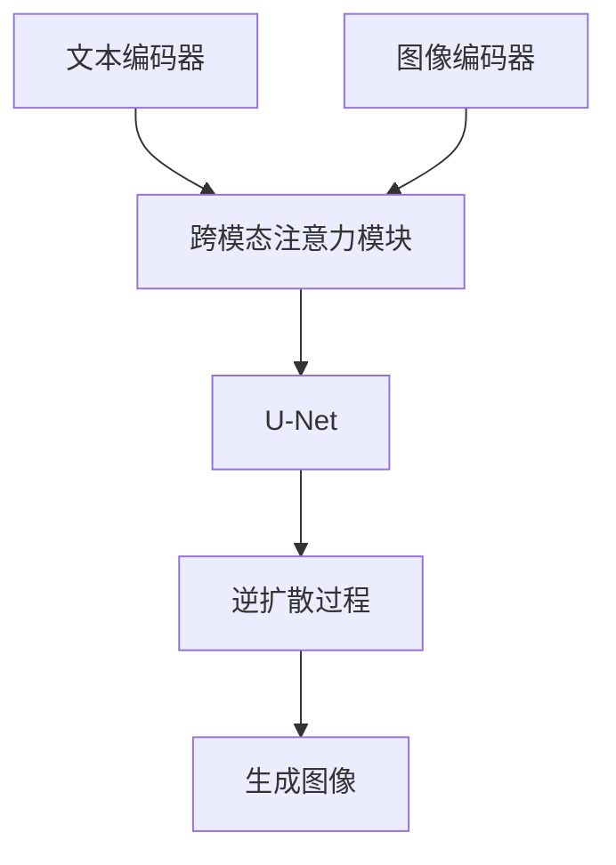

# Imagen原理与代码实例讲解

## 1. 背景介绍

### 1.1 问题的由来

在人工智能领域中,图像生成一直是一个具有挑战性的任务。传统的计算机视觉方法主要关注图像识别和分类,而生成高质量、高分辨率的图像则需要更复杂的模型和算法。随着深度学习技术的发展,生成式对抗网络(Generative Adversarial Networks, GANs)应运而生,为图像生成任务提供了新的解决方案。

然而,现有的GAN模型在生成高分辨率、细节丰富的图像时仍然存在一些挑战。例如,生成的图像可能存在artifact(伪影)、模糊或不连贯的问题。此外,控制生成图像的内容和风格也是一个难题。因此,需要开发更加先进的模型来克服这些限制。

### 1.2 研究现状

近年来,一些突破性的工作为提高生成图像的质量和多样性做出了重要贡献。例如,StyleGAN系列模型通过引入全新的生成架构,能够生成逼真的人脸图像。而像DALL-E和Stable Diffusion这样的文本到图像生成模型,则展示了利用自然语言描述来控制图像生成的能力。

谷歌的Imagen模型正是在这一背景下诞生的。作为一种新型的文本到图像生成模型,Imagen旨在生成高分辨率、高质量的图像,同时保持对图像内容和风格的控制。

### 1.3 研究意义

Imagen模型的研究和开发对于推进人工智能图像生成技术具有重要意义:

1. **提高图像质量**:Imagen能够生成分辨率高达1024x1024的高质量图像,图像细节丰富,清晰度高。这为各种视觉应用提供了新的可能性。

2. **增强内容控制**:通过自然语言描述,Imagen可以精准控制生成图像的内容、布局和风格,满足不同场景的需求。

3. **促进多模态学习**:Imagen整合了自然语言处理和计算机视觉技术,推动了多模态学习的发展,为构建更加通用的人工智能系统奠定基础。

4. **拓展应用领域**:高质量的图像生成技术可以应用于广告、设计、娱乐等多个领域,为相关行业带来新的创意和商机。

### 1.4 本文结构

本文将全面介绍Imagen模型的原理、实现和应用。内容安排如下:

1. 核心概念与联系
2. 核心算法原理与具体操作步骤
3. 数学模型和公式详细讲解与案例分析
4. 项目实践:代码实例和详细解释说明
5. 实际应用场景
6. 工具和资源推荐
7. 总结:未来发展趋势与挑战
8. 附录:常见问题与解答

## 2. 核心概念与联系

在深入探讨Imagen模型之前,我们先来了解一些核心概念及其相互关系。

### 2.1 生成式对抗网络(GANs)

生成式对抗网络(Generative Adversarial Networks, GANs)是一种用于生成式模型的深度学习架构。它由两个神经网络组成:生成器(Generator)和判别器(Discriminator)。生成器的目标是生成逼真的数据样本(如图像),而判别器则旨在区分生成的样本和真实数据。通过生成器和判别器之间的对抗训练,GAN可以学习数据的真实分布,并生成新的逼真样本。

GANs为图像生成任务提供了有力的工具,但也存在一些挑战,如训练不稳定、模式崩溃等。Imagen在GAN的基础上进行了创新和改进,以克服这些限制。

### 2.2 扩散模型(Diffusion Models)

扩散模型是一种新兴的生成模型,它通过学习数据的逆噪声过程来生成样本。具体来说,扩散模型首先将数据(如图像)添加噪声,形成一个从纯噪声到数据的过程。然后,模型学习逆过程,即从噪声中恢复原始数据。通过对逆过程建模,扩散模型可以生成新的样本。

扩散模型在生成高质量图像方面表现出色,但训练过程计算复杂,效率较低。Imagen结合了GAN和扩散模型的优点,以提高生成质量和效率。

### 2.3 自注意力机制(Self-Attention)

自注意力机制是一种用于捕获长期依赖关系的神经网络层。它允许模型在处理序列数据(如文本或图像)时,直接关注其他位置的信息,而不受位置限制。自注意力机制在自然语言处理和计算机视觉领域都取得了巨大成功。

Imagen利用了自注意力机制来建模图像和文本之间的交互,从而实现了精准的内容控制。

### 2.4 大型语言模型(Large Language Models)

大型语言模型(如GPT-3、BERT等)是一种预训练的深度学习模型,能够从大量文本数据中学习语言的统计规律。这些模型具有强大的语言理解和生成能力,可以应用于各种自然语言处理任务。

Imagen将大型语言模型与视觉模型相结合,利用语言模型对文本描述进行理解和编码,从而实现了高质量的文本到图像生成。

上述核心概念相互关联、相辅相成,共同推动了Imagen模型的发展和应用。接下来,我们将深入探讨Imagen的核心算法原理和实现细节。

## 3. 核心算法原理与具体操作步骤

### 3.1 算法原理概述

Imagen是一种基于扩散模型和自注意力机制的文本到图像生成模型。它的核心思想是将文本描述和图像数据融合,并通过对逆扩散过程的建模来生成高质量图像。

Imagen的整体架构如下所示:

1. **文本编码器**:利用大型语言模型(如BERT)对输入的文本描述进行编码,获取其语义表示。

2. **图像编码器**:对输入的噪声图像进行编码,获取其视觉特征表示。

3. **跨模态注意力模块**:融合文本和图像的表示,建立它们之间的关联。

4. **U-Net**:一种常用的卷积神经网络架构,用于对图像进行编码和解码。

5. **逆扩散过程**:根据融合的文本和图像表示,对噪声图像进行逐步去噪,生成最终的目标图像。

该架构的关键在于跨模态注意力模块和逆扩散过程。前者实现了文本和图像的融合,后者则通过对扩散过程的逆向建模,生成符合文本描述的高质量图像。

### 3.2 算法步骤详解

Imagen算法的具体步骤如下:

1. **文本编码**:将输入的文本描述喂入预训练的大型语言模型(如BERT),获取其上下文表示。

2. **图像编码**:将一个随机噪声图像喂入图像编码器(如U-Net的编码器部分),获取其视觉特征表示。

3. **跨模态注意力**:将文本表示和图像表示输入跨模态注意力模块,通过自注意力机制捕获它们之间的关联。

4. **逆扩散过程**:
   1) 将融合后的表示喂入U-Net的解码器部分,对噪声图像进行逐步去噪。
   2) 在每个去噪步骤中,模型预测出当前噪声水平下的图像,并与上一步的输出进行融合。
   3) 重复上述过程,直到获得最终的目标图像。

5. **图像输出**:输出生成的高质量图像。

该算法的核心在于利用自注意力机制融合文本和图像信息,并通过逆扩散过程逐步生成目标图像。这种方法结合了GANs和扩散模型的优点,能够生成高质量、高分辨率的图像,同时保持对图像内容和风格的控制。

### 3.3 算法优缺点

**优点**:

1. **高质量图像生成**:Imagen能够生成分辨率高达1024x1024的高质量图像,细节丰富、清晰度高。

2. **精准内容控制**:通过自然语言描述,Imagen可以精确控制生成图像的内容、布局和风格。

3. **多样性**:由于采用了扩散模型,Imagen可以生成多样化的图像,避免了模式崩溃的问题。

4. **鲁棒性**:模型对于文本描述的变化具有一定的鲁棒性,能够生成相似但不完全相同的图像。

**缺点**:

1. **计算复杂度高**:由于需要对扩散过程进行建模,Imagen的训练和推理过程计算量较大,对硬件要求较高。

2. **训练数据需求大**:为了获得良好的生成效果,Imagen需要大量的高质量图像-文本对作为训练数据。

3. **生成偏差**:虽然Imagen能够生成逼真的图像,但有时会出现与文本描述不完全匹配的情况。

4. **缺乏物理约束**:生成的图像可能缺乏物理合理性,如违反重力或透视原理。

总的来说,Imagen算法在图像质量和内容控制方面表现出色,但仍有一些需要改进的地方,如提高计算效率、减少生成偏差等。

### 3.4 算法应用领域

Imagen算法及其生成的高质量图像可以应用于多个领域:

1. **内容创作**:Imagen可用于创作插画、概念艺术、故事板等视觉内容,为艺术家和设计师提供灵感和辅助工具。

2. **广告和营销**:通过自然语言描述,Imagen能够生成符合特定主题和风格的图像,为广告和营销活动提供个性化的视觉素材。

3. **教育和培训**:Imagen生成的图像可用于教学演示、培训材料等,帮助学习者更好地理解抽象概念。

4. **游戏和娱乐**:在游戏开发中,Imagen可用于生成逼真的环境、角色和道具,提升游戏的视觉体验。

5. **科研和可视化**:Imagen能够根据文本描述生成科学数据或概念的可视化表示,助力科研人员更好地理解和交流复杂的理论和模型。

6. **辅助设计**:在建筑、工业设计等领域,Imagen可用于快速生成设计草图和概念图,加速设计流程。

总之,Imagen算法为多个领域带来了新的可能性,有望推动人工智能在视觉内容创作和应用方面的发展。

## 4. 数学模型和公式详细讲解与举例说明

在探讨Imagen算法的数学模型和公式之前,我们先介绍一些基本概念。

### 4.1 扩散过程(Forward Diffusion Process)

扩散过程是一种将数据(如图像)转换为噪声的过程。具体来说,它通过在每个时间步添加一定量的高斯噪声,逐步破坏原始数据,直到完全变为纯噪声。该过程可以用以下公式描述:

$$
q\left(x_{t} | x_{t-1}\right)=\mathcal{N}\left(x_{t} ; \sqrt{1-\beta_{t}} x_{t-1}, \beta_{t} \mathbf{I}\right)
$$

其中:
- $x_t$表示时间步$t$的噪声数据
- $x_0$表示原始数据(如清晰图像)
- $\beta_t$是一个超参数,控制每个时间步添加的噪声量
- $\mathcal{N}(\mu, \Sigma)$表示均值为$\mu$,协方差矩阵为$\Sigma$的高斯分布

通过上述过程,我们可以获得一系列噪声数据$\{x_0, x_1, \ldots, x_T\}$,其中$x_T$是纯噪声。

### 4.2 逆扩散过程(Reverse Diffusion Process)

逆扩散过程旨在从噪声数据$x_T$中恢复原始数据$x_0$。根据贝叶