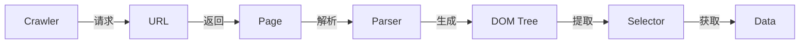
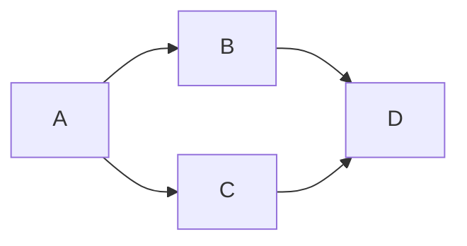

# Reptile原理与代码实例讲解

作者：禅与计算机程序设计艺术 / Zen and the Art of Computer Programming

## 1. 背景介绍

### 1.1 问题的由来
在互联网时代，海量的数据分布在各个网站和应用中。如何高效地获取这些数据，是许多企业和研究机构面临的重要课题。传统的数据采集方式，如人工复制粘贴、编写专门的爬虫程序等，存在效率低下、维护成本高等问题。于是，一种灵活高效的数据采集方案 —— Reptile应运而生。

### 1.2 研究现状
目前，Reptile已经被广泛应用于各个领域，如搜索引擎、推荐系统、舆情监控等。各大互联网公司纷纷推出了自己的Reptile框架，如Scrapy、Pyspider等。同时，学术界也对Reptile技术进行了深入研究，提出了许多改进和优化方案。

### 1.3 研究意义
Reptile作为一种灵活高效的数据采集技术，有助于企业和研究机构快速获取海量数据，为数据分析和挖掘奠定基础。深入研究Reptile的原理和实现，对于推动数据采集技术的发展具有重要意义。

### 1.4 本文结构
本文将从以下几个方面对Reptile进行深入讲解：

1. 介绍Reptile的核心概念和基本原理
2. 详细讲解Reptile的工作流程和算法步骤
3. 构建Reptile的数学模型，推导相关公式
4. 通过代码实例，演示Reptile的具体实现
5. 总结Reptile的特点、应用场景及未来发展方向

## 2. 核心概念与联系

Reptile的核心概念包括：

- 爬虫(Crawler)：自动访问互联网上的网页并获取数据的程序。
- 网页(Page)：HTML格式的文档，由标签和内容组成。
- URL：用于定位网络上的资源的字符串。
- 选择器(Selector)：用于从HTML文档中提取所需数据的工具，常用的有XPath、CSS选择器等。
- 解析器(Parser)：用于解析HTML文档，生成便于提取数据的中间格式，如DOM树。

这些概念之间的联系如下：



## 3. 核心算法原理 & 具体操作步骤

### 3.1 算法原理概述
Reptile的基本工作原理可以概括为：给定一个初始URL，爬虫程序从该URL开始，获取页面内容，并提取其中的链接，再依次访问这些链接，如此递归，直到达到某个停止条件。在此过程中，爬虫会根据预定义的规则，提取所需的数据。

### 3.2 算法步骤详解
1. 初始化请求队列，将起始URL加入队列。
2. 从队列中取出一个URL，下载该URL对应的网页内容。
3. 使用解析器解析网页内容，生成DOM树或其他中间格式。
4. 利用选择器从中间格式中提取所需数据，如链接、文本等。
5. 将提取的数据存入结果集中。
6. 将提取的链接加入请求队列。
7. 重复步骤2-6，直到队列为空或达到预定的停止条件。

### 3.3 算法优缺点
Reptile算法的优点包括：

- 实现简单，易于上手。
- 通用性强，可以适用于各种类型的网页。
- 灵活性高，可以根据需求定制化爬取规则和提取方式。

缺点包括：

- 对于一些动态加载的页面，如Ajax渲染的内容，爬取难度较大。
- 爬取速度受限于网络传输和页面解析的速度。
- 可能对网站造成较大负担，需要遵守爬虫协议和robots.txt的约束。

### 3.4 算法应用领域
Reptile算法广泛应用于以下领域：

- 搜索引擎：通过爬虫抓取网页，建立网页索引。
- 数据挖掘：爬取海量数据，进行分析和挖掘。
- 舆情监控：抓取新闻、评论等信息，进行舆情分析。
- 商业情报：获取竞争对手的产品、价格等信息，进行市场调研。

## 4. 数学模型和公式 & 详细讲解 & 举例说明

### 4.1 数学模型构建
我们可以将Reptile爬取过程抽象为一个有向图$G=(V, E)$，其中节点$V$表示网页，边$E$表示网页之间的链接。假设爬虫在时间$t$从节点$i$转移到节点$j$的概率为$p_{ij}(t)$，则爬虫访问节点$i$的概率$\pi_i(t)$满足以下迭代公式：

$$
\pi_j(t+1) = \sum_{i=1}^{n} \pi_i(t)p_{ij}(t)
$$

其中$n$为节点总数。上式表明，节点$j$在$t+1$时刻被访问的概率，等于所有节点在$t$时刻被访问概率与转移到$j$的概率的乘积之和。

### 4.2 公式推导过程
假设初始时刻$t=0$，爬虫位于节点$i_0$，则有：

$$
\pi_i(0) = \begin{cases}
1, & i=i_0 \\
0, & i \neq i_0
\end{cases}
$$

根据迭代公式，可以依次计算出各个时刻爬虫访问每个节点的概率。当满足某个停止条件时，即可得到爬虫访问各节点的最终概率分布。

### 4.3 案例分析与讲解
考虑一个简单的网站，共有4个网页$A, B, C, D$，它们之间的链接关系如下图所示：



假设初始时刻爬虫位于节点$A$，且每条链接的转移概率均为$1/2$，则可以计算出：

$$
\pi_A(0) = 1, \pi_B(0) = \pi_C(0) = \pi_D(0) = 0 \\
\pi_A(1) = 0, \pi_B(1) = \pi_C(1) = 1/2, \pi_D(1) = 0 \\
\pi_A(2) = 0, \pi_B(2) = 0, \pi_C(2) = 0, \pi_D(2) = 1
$$

可见，经过2步转移后，爬虫必然到达节点$D$。

### 4.4 常见问题解答
Q: 爬虫如何避免陷入"死循环"，反复爬取同一批页面？
A: 可以使用布隆过滤器等数据结构，记录已爬取的URL，避免重复爬取。也可以设置爬取深度的限制，控制爬虫的"探索广度"。

Q: 如何提高爬虫的效率？
A: 可以采用多线程、异步I/O等并发技术，提高爬取速度。也可以优化爬虫的调度策略，优先爬取重要性高的页面。

## 5. 项目实践：代码实例和详细解释说明

### 5.1 开发环境搭建
本项目使用Python语言，依赖以下第三方库：

- requests：用于发送HTTP请求，获取网页内容。
- beautifulsoup4：用于解析HTML文档，提取所需数据。
- lxml：高性能的HTML解析器。

可以使用pip安装这些库：

```bash
pip install requests beautifulsoup4 lxml
```

### 5.2 源代码详细实现
下面是一个简单的Reptile爬虫示例，用于爬取某个博客网站的文章标题和链接：

```python
import requests
from bs4 import BeautifulSoup
import queue

start_url = 'https://www.example.com'  # 起始URL
url_queue = queue.Queue()  # URL队列
seen = set()  # 已爬取的URL集合

url_queue.put(start_url)
seen.add(start_url)

while not url_queue.empty():
    current_url = url_queue.get()  # 取出队首URL
    
    # 发送GET请求，获取页面内容
    response = requests.get(current_url) 
    html_doc = response.text
    
    # 解析HTML，提取所需数据
    soup = BeautifulSoup(html_doc, 'lxml')
    title = soup.title.get_text()
    print(f'Title: {title}, URL: {current_url}')
    
    # 提取页面中的链接
    for link in soup.find_all('a'):
        next_url = link.get('href')
        if next_url and next_url.startswith('http') and next_url not in seen:
            url_queue.put(next_url)
            seen.add(next_url)
```

### 5.3 代码解读与分析
1. 首先初始化起始URL、URL队列和已爬取URL集合。
2. 将起始URL加入队列，并标记为已爬取。
3. 当队列不为空时，循环执行以下步骤：
   1. 取出队首URL，发送GET请求获取页面内容。
   2. 使用BeautifulSoup解析HTML，提取文章标题并打印。
   3. 遍历页面中的所有链接，对于未爬取过的、以"http"开头的链接，将其加入队列并标记为已爬取。
4. 循环直到队列为空，爬取完所有可达页面。

通过队列和集合这两个数据结构，可以实现对页面的广度优先遍历，避免重复爬取。BeautifulSoup提供了方便的HTML解析和数据提取方法，简化了页面解析的流程。

### 5.4 运行结果展示
在本地运行上述代码，可以看到控制台输出爬取到的文章标题和URL，形如：

```
Title: Hello World, URL: https://www.example.com/hello.html
Title: Python Tutorial, URL: https://www.example.com/python.html
...
```

同时，程序还会将爬取过程中遇到的新链接加入队列，继续爬取，直到无新链接可爬为止。

## 6. 实际应用场景

Reptile爬虫技术在实际中有非常广泛的应用，下面列举几个常见的场景：

1. 搜索引擎：爬虫是搜索引擎的重要组成部分，负责抓取互联网上的海量网页，建立索引，为用户检索信息提供数据基础。
2. 数据分析：爬虫可以采集各种来源的数据，如社交媒体、电商平台、新闻网站等，为数据分析和挖掘提供原始素材。
3. 舆情监控：通过爬虫抓取新闻报道、用户评论等信息，进行文本分析和情感分析，实现对网络舆情的实时监测。
4. 竞争情报：利用爬虫收集竞争对手的产品信息、用户评价、价格变动等数据，进行市场调研和竞争分析。
5. 学术研究：爬虫可以帮助研究者快速获取海量文献资料，如论文、专利等，节省文献检索的时间和精力。

### 6.4 未来应用展望
随着互联网数据的爆炸式增长，爬虫技术面临着新的机遇和挑战。未来，爬虫在以下方面有望得到进一步发展：

1. 智能化：引入机器学习、自然语言处理等人工智能技术，使爬虫能够自动理解网页内容，提取关键信息。
2. 分布式：采用分布式架构，利用多台机器并行爬取，提高爬取效率和稳定性。
3. 实时性：开发实时爬虫系统，能够快速响应网络内容的更新，保证数据的时效性。
4. 可视化：与数据可视化技术结合，实现爬取结果的直观展示和交互式分析。

## 7. 工具和资源推荐

### 7.1 学习资源推荐
1. 《Python网络数据采集》（Web Scraping with Python）：系统介绍了Python爬虫开发的各项技术，适合初学者入门。
2. 《精通Python爬虫框架Scrapy》：深入讲解Scrapy框架的使用方法，教你开发高效的爬虫程序。
3. 《用Python写网络爬虫》（Web Scraping with Python）：通过实例详