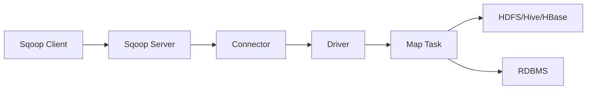

# Sqoop原理与代码实例讲解

## 1. 背景介绍
### 1.1 问题的由来
在大数据时代,数据的采集和交换是一个非常重要的环节。企业常常需要在不同的存储系统之间迁移数据,如将关系型数据库中的数据导入到Hadoop中进行分析。传统的数据迁移方式效率低下,无法满足海量数据的迁移需求。因此,迫切需要一种高效的数据传输工具来解决这一问题。
### 1.2 研究现状 
目前,市面上已经有多种数据传输工具,如Flume、Kafka Connect等。但它们大多专注于实时数据的采集和传输,对于批量数据的导入导出支持不够完善。而Sqoop则是一款专门用于在Hadoop和关系型数据库之间传输数据的工具,在业界得到了广泛应用。
### 1.3 研究意义
深入研究Sqoop的原理和使用方法,对于掌握大数据项目的数据采集和交换技术具有重要意义。通过对Sqoop的学习,可以提高数据迁移的效率,为后续的数据分析和挖掘工作打下基础。同时,Sqoop也是大数据开发工程师必备的技能之一。
### 1.4 本文结构
本文将从以下几个方面对Sqoop进行深入探讨：
- 首先介绍Sqoop的核心概念和工作原理
- 然后重点讲解Sqoop的核心架构设计和底层实现算法
- 接着通过实际代码实例演示Sqoop的使用方法
- 最后总结Sqoop的特点和适用场景,并展望其未来发展趋势

## 2. 核心概念与联系
Sqoop是一个用于在Hadoop和关系型数据库之间传输数据的工具。其核心概念如下:

- **Sqoop Client**: 用于提交数据传输任务的客户端
- **Sqoop Server**: 用于接收和管理任务的服务端
- **Connector**: 用于与外部存储系统对接的组件,如JDBC Connector
- **Driver**: 用于执行数据传输任务的驱动器
- **Map Task**: 数据传输的基本单元,每个Map负责传输一部分数据
- **Import**: 数据导入,将数据从关系型数据库导入到Hadoop
- **Export**: 数据导出,将数据从Hadoop导出到关系型数据库

下图展示了Sqoop的核心组件及其之间的关系:



## 3. 核心算法原理 & 具体操作步骤
### 3.1 算法原理概述
Sqoop的数据传输过程主要分为Map阶段和Reduce阶段。在Map阶段,Sqoop根据数据分片策略将数据划分为若干个分片,每个分片由一个Map Task负责传输。Map Task通过JDBC从关系型数据库中读取数据,将其转换为HDFS文件或者Hive/HBase表。在Reduce阶段,Sqoop将多个Map Task的输出结果合并,完成最终的数据传输。
### 3.2 算法步骤详解
具体来说,Sqoop的数据传输算法可分为以下几个步骤:

1. **任务提交**: 用户通过Sqoop Client提交数据传输任务,指定源端和目标端的连接信息、数据表、分片策略等参数。
2. **任务初始化**: Sqoop Server接收到任务请求后,对任务进行解析和初始化,生成执行计划。
3. **数据分片**: Sqoop根据指定的分片策略对数据进行分片。常见的分片策略有主键分片、哈希分片、范围分片等。
4. **Map任务调度**: Sqoop Server根据数据分片结果,为每个分片创建一个Map Task,并将其提交到Hadoop集群运行。
5. **数据读取**: Map Task通过JDBC连接到关系型数据库,根据分片信息读取数据。
6. **数据写入**: Map Task将读取到的数据写入HDFS或者Hive/HBase,转换为目标端的存储格式。
7. **Reduce合并**: 如果有多个Map Task,Sqoop会启动一个Reduce任务对Map的输出结果进行合并,生成最终的数据文件。

### 3.3 算法优缺点
Sqoop的数据传输算法具有以下优点:

- 采用MapReduce并行框架,充分利用集群资源,提高传输效率
- 支持多种灵活的数据分片策略,可根据数据特点选择最优方案
- 使用标准的JDBC接口,兼容多种关系型数据库

但是,Sqoop也存在一些局限性:

- 只能支持结构化数据的传输,对于非结构化数据支持不足 
- 容错能力较弱,若有个别Map Task失败,会导致整个任务失败
- 当数据量较大时,Map任务的启动和调度开销较高

### 3.4 算法应用领域
Sqoop的数据传输算法主要应用于以下领域:

- 数据仓库的ETL过程,将业务数据导入Hadoop数仓 
- 数据迁移和备份,如将MySQL数据迁移到Hive
- 不同集群间的数据交换,如从Hadoop导出数据到DB2

## 4. 数学模型和公式 & 详细讲解 & 举例说明
### 4.1 数学模型构建
我们可以使用数学模型来描述Sqoop的数据传输过程。假设要传输的数据表有$n$条记录,Sqoop使用$m$个Map Task进行传输,每个Map Task处理$n/m$条记录。令$t_i$表示第$i$个Map Task的传输时间,则整个传输过程的时间$T$可表示为:

$$T = \max_{i=1}^{m} t_i$$

可见,整个传输时间取决于最慢的一个Map Task。因此,Sqoop需要尽量保证各个Map Task的处理数据量均匀,避免数据倾斜。

### 4.2 公式推导过程
假设单个Map Task传输单条记录的时间为$t_0$,则第$i$个Map Task的传输时间$t_i$可表示为:

$$t_i = \frac{n}{m} \times t_0 + C_i$$

其中$C_i$为第$i$个Map Task的启动和调度开销。假设各个Map Task的$C_i$近似相等,记为$C$,则有:

$$T = \frac{n}{m} \times t_0 + C$$

可见,Map Task的个数$m$越多,每个Task处理的数据量就越少,传输时间$T$也就越短。但是,过多的Map Task也会增加启动和调度开销$C$。因此,需要根据集群资源和数据量,选择合适的$m$值。

### 4.3 案例分析与讲解
举个例子,假设要传输一张1亿条记录的MySQL表到HDFS,每个Map Task传输100万条记录,则需要100个Map Task。假设单个Map Task传输单条记录的时间$t_0$为1ms,Map Task的平均启动和调度开销$C$为1分钟,则总传输时间$T$约为:

$$T = \frac{10^8}{10^2} \times 10^{-3} + 1 \times 60 = 160(s)$$

即使用100个Map Task,传输1亿条记录需要约2.6分钟。而如果只使用10个Map Task,则传输时间会增加到约17分钟。可见,合理设置Map Task数量对于提高传输效率至关重要。

### 4.4 常见问题解答
- 问题1:如何确定最佳的Map Task数量?
  
  答:一般可以参考以下经验公式:
  $$m = \min(\frac{n}{s}, \frac{n \times t_0}{T_{max}})$$
  其中$n$为数据总量,$s$为单个Map Task处理的数据量,$t_0$为单条记录传输时间,$T_{max}$为可接受的最大传输时间。

- 问题2:如果Map Task出现失败怎么办?

  答:可以通过设置重试次数和超时时间,自动重新运行失败的Task。也可以使用Oozie等工作流调度器,监控Sqoop任务的执行状态。

## 5. 项目实践：代码实例和详细解释说明
下面通过一个实际的代码实例,演示如何使用Sqoop进行数据传输。
### 5.1 开发环境搭建
- Hadoop集群:CDH 5.16.2
- Sqoop:1.4.7
- MySQL:5.7
- Hive:2.1.1

### 5.2 源代码详细实现
假设要将MySQL中的`user`表导入到Hive中,可以执行以下Sqoop命令:

```shell
sqoop import \
  --connect jdbc:mysql://localhost:3306/test \
  --username root \
  --password 123456 \
  --table user \
  --fields-terminated-by '\t' \
  --lines-terminated-by '\n' \
  --hive-import \
  --hive-database test \
  --hive-table user_hive \
  --hive-overwrite \
  --num-mappers 4
```

其中各个参数的含义如下:

- `--connect`:指定MySQL的JDBC连接串
- `--username`:指定MySQL的用户名
- `--password`:指定MySQL的密码
- `--table`:指定要导入的MySQL表名
- `--fields-terminated-by`:指定Hive表的字段分隔符
- `--lines-terminated-by`:指定Hive表的行分隔符
- `--hive-import`:表示将数据导入到Hive表
- `--hive-database`:指定Hive数据库名
- `--hive-table`:指定Hive表名
- `--hive-overwrite`:表示覆盖Hive表中已有数据
- `--num-mappers`:指定Map Task的数量

### 5.3 代码解读与分析
以上Sqoop命令的执行流程如下:

1. Sqoop Client解析命令行参数,生成一个名为`import`的Tool对象
2. Tool对象提交一个名为`SqoopImportJob`的MapReduce任务到Hadoop集群
3. `SqoopImportJob`根据`--num-mappers`参数将MySQL表划分为4个分片
4. 为每个分片创建一个`DataDrivenImportMapper`,负责执行数据导入
5. `DataDrivenImportMapper`通过JDBC读取分片数据,转换为HDFS文件格式
6. Sqoop启动一个Hive CLI进程,将HDFS文件加载到Hive表中

可以看到,以上流程涉及Sqoop、Hadoop、Hive等多个组件,体现了大数据生态系统的协同能力。

### 5.4 运行结果展示
执行完Sqoop命令后,可以在Hive中查看导入的数据:

```sql
hive> select * from user_hive limit 10;
1	tom	18
2	jerry	16
3	alice	20
...
```

可见,MySQL中的`user`表已成功导入到了Hive中。

## 6. 实际应用场景
Sqoop在实际的大数据项目中有广泛的应用,主要场景包括:

- 数据采集:将业务系统如ERP、CRM的数据导入Hadoop平台
- 数据迁移:在Hadoop和传统数据库之间迁移数据
- 数据备份:将Hadoop数据备份到关系型数据库
- 数据分析:将外部数据导入Hadoop,与内部数据联合分析

### 6.4 未来应用展望
随着大数据和云计算的发展,Sqoop未来的应用前景广阔:

- 与云厂商的数据库服务如RDS、Redshift等集成,实现云上数据采集
- 借助Sqoop-HCatalog连接器,与Hive Metastore集成,简化Hive数据导入
- 对接更多的NoSQL数据库如Cassandra、MongoDB等,扩展数据源的种类
- 与Kafka、Flume等实时数据传输工具集成,实现Lambda架构下的数据汇聚

## 7. 工具和资源推荐
### 7.1 学习资源推荐
- 官方文档:http://sqoop.apache.org/docs/1.4.7/
- 《Hadoop权威指南》第17章 - Sqoop
- 慕课网:Sqoop与Hadoop大数据集成
- 博客:Sqoop原理与实践

### 7.2 开发工具推荐
- Sqoop GUI:Sqoop的图形化管理工具
- Sqoop Shell:Sqoop的交互式命令行工具
- Sqoop Client:Sqoop的Java客户端API
- Sqoop Connector:Sqoop的插件化连接器框架

### 7.3 相关论文推荐
- Sqoop:A Tool for Bulk Data Transfer between HDFS and RDBMS
- Integrating Relational Databases with Hadoop Ecosystem using Sqoop
- Data Migration from MySQL to Hadoop using Sq