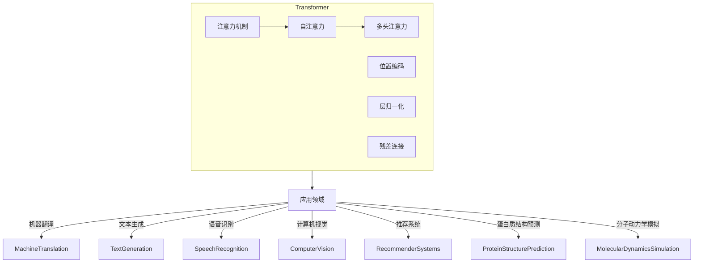

# Transformer原理与代码实例讲解

## 1. 背景介绍

### 1.1 问题的由来

在自然语言处理(NLP)和序列数据建模领域,长期以来都存在着一个核心挑战:如何有效地捕捉长距离依赖关系。传统的序列模型,如循环神经网络(RNN)和长短期记忆网络(LSTM),虽然在处理短期依赖关系时表现良好,但在捕捉长距离依赖关系时却存在着固有的缺陷。这种缺陷主要源于它们的递归计算方式,导致了梯度消失或梯度爆炸的问题,从而限制了模型的表现能力。

为了解决这一挑战,Transformer模型应运而生。Transformer是一种全新的基于注意力机制(Attention Mechanism)的序列建模架构,它完全摒弃了RNN和LSTM中的递归计算,而是通过自注意力(Self-Attention)机制直接对输入序列中的任意两个位置进行建模,从而有效地捕捉长距离依赖关系。

### 1.2 研究现状

自2017年Transformer模型在论文"Attention Is All You Need"中被提出以来,它在机器翻译、文本生成、语音识别等多个NLP任务中展现出了卓越的性能,并迅速成为NLP领域的主流模型。此后,Transformer模型也被广泛应用于计算机视觉、推荐系统等其他领域,取得了令人瞩目的成就。

随着Transformer模型的不断发展和优化,各种变体模型也相继问世,如GPT、BERT、XLNet、RoBERTa等,它们在下游任务中表现出了更加出色的性能。同时,Transformer模型也被应用于越来越多的领域,如蛋白质结构预测、分子动力学模拟等,展现出了广阔的应用前景。

### 1.3 研究意义

深入理解Transformer模型的原理和实现细节,对于掌握当前主流的序列建模技术、提高自身的NLP能力、探索注意力机制在其他领域的应用都具有重要意义。本文将全面解析Transformer模型的核心思想、数学原理、实现细节,并通过代码示例帮助读者更好地掌握该模型。

### 1.4 本文结构

本文将从以下几个方面全面介绍Transformer模型:

- 核心概念与联系
- 核心算法原理与具体操作步骤
- 数学模型和公式详细讲解与案例分析
- 项目实践:代码实例和详细解释说明
- 实际应用场景
- 工具和资源推荐
- 总结:未来发展趋势与挑战
- 附录:常见问题与解答

## 2. 核心概念与联系

在深入探讨Transformer模型之前,我们需要先了解它所依赖的几个核心概念:

1. **注意力机制(Attention Mechanism)**

   注意力机制是Transformer模型的核心所在,它允许模型在编码输入序列时,对序列中的每个位置都分配一定的注意力权重,从而捕捉序列内部的长距离依赖关系。

2. **自注意力(Self-Attention)**

   自注意力是注意力机制在Transformer中的具体实现形式。不同于传统注意力机制需要将查询(Query)、键(Key)和值(Value)从不同的源获取,自注意力机制将查询、键和值都从同一个输入序列中获取,实现了对输入序列的自注意力建模。

3. **多头注意力(Multi-Head Attention)**

   多头注意力是对多个不同的自注意力子空间进行捕捉和融合,从而提高模型对不同位置关系的建模能力。它将输入序列线性映射到多个子空间,分别计算自注意力,然后将这些子空间的结果进行拼接和线性变换,得到最终的注意力表示。

4. **位置编码(Positional Encoding)**

   由于Transformer模型完全放弃了RNN和LSTM中的递归结构,因此它无法像这些模型那样自然地捕捉序列的位置信息。为了解决这个问题,Transformer引入了位置编码的概念,将序列的位置信息直接编码到输入的嵌入向量中。

5. **层归一化(Layer Normalization)**

   层归一化是一种常见的神经网络正则化技术,它通过对每一层的输入进行归一化处理,从而加速模型的收敛并提高模型的性能。在Transformer中,层归一化被广泛应用于各个子模块,如注意力层、前馈网络层等。

6. **残差连接(Residual Connection)**

   残差连接是一种常见的神经网络优化技术,它通过将输入直接传递到输出,并与主网络的输出相加,从而缓解了深度网络的梯度消失或爆炸问题。在Transformer中,残差连接被应用于每个编码器和解码器层,以提高模型的性能。

这些核心概念相互关联、相辅相成,共同构建了Transformer模型的理论基础和实现框架。下一节我们将详细探讨Transformer模型的核心算法原理和具体操作步骤。

## 3. 核心算法原理与具体操作步骤

### 3.1 算法原理概述

Transformer模型的核心算法原理可以概括为以下几个关键步骤:

1. **嵌入层(Embedding Layer)**

   将输入序列(如文本序列)映射为一系列连续的向量表示,即嵌入向量。此外,还需要将序列的位置信息编码到嵌入向量中,形成位置编码的嵌入向量。

2. **编码器(Encoder)**

   编码器由多个相同的层组成,每一层包含两个子层:多头自注意力层和前馈网络层。多头自注意力层对输入序列进行自注意力建模,捕捉序列内部的长距离依赖关系;前馈网络层则对每个位置的表示进行独立的非线性变换,提供了一种位置wise的特征交互机制。

3. **解码器(Decoder)(仅用于序列生成任务)**

   解码器的结构与编码器类似,也由多个相同的层组成,每一层包含三个子层:掩蔽多头自注意力层、编码器-解码器注意力层和前馈网络层。掩蔽多头自注意力层用于捕捉已生成序列内部的依赖关系;编码器-解码器注意力层则捕捉输入序列与输出序列之间的依赖关系;前馈网络层与编码器中的相同。

4. **输出层(Output Layer)**

   输出层根据解码器的输出,生成目标序列(如机器翻译的目标语言序列)。

在整个过程中,注意力机制(尤其是自注意力和多头注意力)扮演着核心角色,它允许模型直接对输入序列中的任意两个位置进行建模,从而有效捕捉长距离依赖关系。与RNN和LSTM相比,Transformer模型摒弃了递归计算,完全基于注意力机制进行并行计算,从理论上解决了梯度消失或爆炸的问题。

### 3.2 算法步骤详解

接下来,我们将详细解析Transformer模型的具体算法步骤。为了便于理解,我们将以机器翻译任务为例进行说明。

#### 3.2.1 嵌入层

假设我们有一个源语言序列 $X = (x_1, x_2, ..., x_n)$ 和一个目标语言序列 $Y = (y_1, y_2, ..., y_m)$,其中 $x_i$ 和 $y_j$ 分别表示源语言和目标语言的单词索引。我们首先需要将这些单词索引映射为连续的向量表示,即嵌入向量:

$$
\begin{aligned}
X &= (x_1, x_2, ..., x_n) \xrightarrow{\text{嵌入}} (e_{x_1}, e_{x_2}, ..., e_{x_n}) \\
Y &= (y_1, y_2, ..., y_m) \xrightarrow{\text{嵌入}} (e_{y_1}, e_{y_2}, ..., e_{y_m})
\end{aligned}
$$

其中 $e_{x_i}$ 和 $e_{y_j}$ 分别表示源语言和目标语言单词的嵌入向量。

为了捕捉序列的位置信息,我们还需要将位置编码添加到嵌入向量中:

$$
\begin{aligned}
X' &= (e_{x_1} + p_1, e_{x_2} + p_2, ..., e_{x_n} + p_n) \\
Y' &= (e_{y_1} + p_1, e_{y_2} + p_2, ..., e_{y_m} + p_m)
\end{aligned}
$$

其中 $p_i$ 表示位置 $i$ 的位置编码向量。位置编码向量的计算方式有多种,最常见的是基于三角函数的位置编码。

#### 3.2.2 编码器

编码器的输入是源语言序列的位置编码嵌入向量 $X'$。每一层的编码器都包含两个子层:多头自注意力层和前馈网络层。

**多头自注意力层**

多头自注意力层的计算过程如下:

1. 将输入 $X'$ 线性映射到查询(Query)、键(Key)和值(Value)空间,得到 $Q$、$K$ 和 $V$:

   $$
   \begin{aligned}
   Q &= X'W^Q \\
   K &= X'W^K \\
   V &= X'W^V
   \end{aligned}
   $$

   其中 $W^Q$、$W^K$ 和 $W^V$ 是可学习的权重矩阵。

2. 计算注意力权重:

   $$
   \text{Attention}(Q, K, V) = \text{softmax}\left(\frac{QK^T}{\sqrt{d_k}}\right)V
   $$

   其中 $d_k$ 是缩放因子,用于防止点积过大导致的梯度不稳定问题。

3. 对多个注意力头的结果进行拼接和线性变换,得到最终的自注意力表示:

   $$
   \text{MultiHead}(Q, K, V) = \text{Concat}(head_1, ..., head_h)W^O
   $$

   其中 $head_i = \text{Attention}(QW_i^Q, KW_i^K, VW_i^V)$,表示第 $i$ 个注意力头的计算结果;$W_i^Q$、$W_i^K$、$W_i^V$ 和 $W^O$ 是可学习的权重矩阵。

**前馈网络层**

前馈网络层对每个位置的表示进行独立的非线性变换,计算过程如下:

$$
\text{FFN}(x) = \max(0, xW_1 + b_1)W_2 + b_2
$$

其中 $W_1$、$W_2$、$b_1$ 和 $b_2$ 是可学习的权重和偏置参数。

在每个子层的输出上,我们还需要应用层归一化和残差连接,以提高模型的性能和稳定性。

#### 3.2.3 解码器

解码器的输入是目标语言序列的位置编码嵌入向量 $Y'$。每一层的解码器包含三个子层:掩蔽多头自注意力层、编码器-解码器注意力层和前馈网络层。

**掩蔽多头自注意力层**

掩蔽多头自注意力层的计算过程与编码器中的多头自注意力层类似,不同之处在于它引入了一个掩码机制,确保每个位置的计算只依赖于该位置之前的输入,而不会受到未来位置的影响。这一机制对于序列生成任务(如机器翻译)至关重要,因为我们只能根据已生成的序列来预测下一个单词。

**编码器-解码器注意力层**

编码器-解码器注意力层的作用是捕捉输入序列(源语言序列)与输出序列(目标语言序