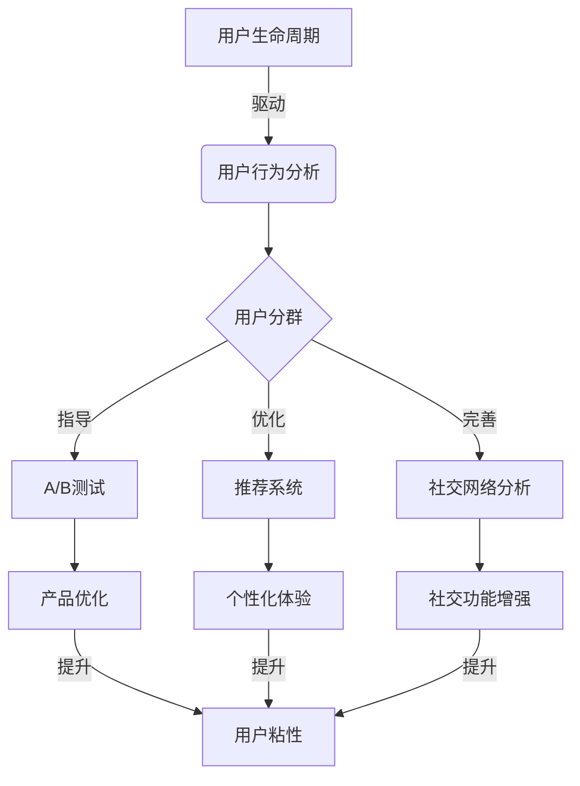

以下是《基于大数据的短视频创业用户发展分析与研究》的正文内容:

# 基于大数据的短视频创业用户发展分析与研究

## 1. 背景介绍

### 1.1 问题的由来

随着移动互联网和智能终端的快速发展,短视频应用程序在全球范围内出现了爆发式增长。短视频凭借其娱乐性强、内容丰富多样、互动性高等优势,吸引了大量年轻用户的青睐。在这个充满机遇与挑战的新兴市场中,如何有效地吸引、留存和发展用户,已经成为短视频创业公司面临的一个关键问题。

### 1.2 研究现状

目前,许多学者和企业都在探索如何利用大数据技术来分析用户行为,优化产品体验,提高用户粘性。然而,由于短视频行业的独特性,现有的用户增长策略往往难以完全适用。短视频用户的使用习惯、内容偏好和社交互动方式与传统互联网产品存在明显差异,需要更加精细化的分析和个性化的运营策略。

### 1.3 研究意义

本文旨在深入探讨如何利用大数据技术,全面分析短视频创业公司的用户发展情况,从而制定有效的用户增长策略。通过对用户行为数据的深入挖掘,我们可以更好地了解用户需求,优化产品体验,提高用户粘性。同时,本文还将介绍相关的数据处理和建模技术,为短视频创业公司提供实用的技术支持。

### 1.4 本文结构

本文将从以下几个方面展开讨论:

- 核心概念与联系
- 核心算法原理与具体操作步骤
- 数学模型和公式详细讲解与案例分析
- 项目实践:代码实例和详细解释说明
- 实际应用场景
- 工具和资源推荐
- 总结:未来发展趋势与挑战
- 附录:常见问题与解答

## 2. 核心概念与联系

在探讨短视频创业用户发展分析之前,我们需要先了解以下几个核心概念及其相互关系:

1. **用户生命周期(User Lifecycle)**:用户生命周期描述了用户从发现产品到最终离开的整个过程,包括获取(Acquisition)、激活(Activation)、留存(Retention)、收益(Revenue)和离场(Churn)等阶段。

2. **用户行为分析(User Behavior Analytics)**:通过收集和分析用户在使用产品时的各种行为数据(如浏览、点赞、评论、分享等),来深入理解用户的需求和偏好,从而优化产品体验和运营策略。

3. **用户分群(User Segmentation)**:根据用户的人口统计特征、地理位置、使用习惯等因素,将用户划分为不同的群组,以便进行更加精准的运营和营销策略。

4. **A/B测试(A/B Testing)**:通过对照试验的方式,比较不同版本的产品功能或营销策略对用户行为的影响,从而优化产品设计和运营决策。

5. **推荐系统(Recommendation System)**:利用协同过滤、内容过滤等算法,根据用户的历史行为和偏好,为用户推荐感兴趣的内容或产品。

6. **社交网络分析(Social Network Analysis)**:分析用户之间的社交关系和互动模式,以便更好地理解用户行为,优化社交功能和内容传播策略。

这些核心概念相互关联、相互影响,共同构成了短视频创业用户发展分析的理论基础和技术支撑。只有将它们有机结合起来,才能全面把握用户发展的整体情况,制定出行之有效的增长策略。

## 3. 核心算法原理与具体操作步骤

### 3.1 算法原理概述

在短视频创业用户发展分析中,我们需要借助多种算法和模型来处理海量的用户行为数据,从中发现有价值的信息和规律。以下是一些常用的核心算法:

1. **协同过滤算法(Collaborative Filtering)**:通过分析用户之间的相似性,为用户推荐其他相似用户喜欢的内容。这种算法广泛应用于推荐系统中。

2. **关联规则挖掘(Association Rule Mining)**:发现数据集中的频繁模式、相关性和关联规则,常用于发现用户行为模式和进行商品关联推荐。

3. **聚类算法(Clustering Algorithms)**:根据数据之间的相似性,将数据划分为多个簇或群组,用于用户分群和异常检测等场景。

4. **决策树算法(Decision Tree Algorithms)**:构建决策树模型,根据特征条件对数据进行分类或回归预测,常用于用户行为预测和个性化推荐。

5. **深度学习算法(Deep Learning Algorithms)**:利用神经网络模型自动从数据中学习特征表示,在图像、语音、自然语言处理等领域表现出色。

6. **社交网络分析算法(Social Network Analysis Algorithms)**:分析用户之间的社交关系和影响力传播,用于优化社交功能和内容营销策略。

这些算法各有特点,需要根据具体的分析目标和数据特征进行选择和组合使用。下面我们将详细介绍其中几种核心算法的具体原理和操作步骤。

### 3.2 算法步骤详解

#### 3.2.1 协同过滤算法

协同过滤算法是推荐系统中最常用的一种技术,它的基本思想是:对于当前用户,找到与其兴趣相似的其他用户,然后根据这些相似用户的喜好,为当前用户推荐相关的内容或产品。

协同过滤算法主要分为两种类型:基于用户的协同过滤和基于项目的协同过滤。

1. **基于用户的协同过滤**

算法步骤如下:

1) 计算任意两个用户之间的相似度,常用的相似度计算方法有余弦相似度、皮尔逊相关系数等。
2) 对每个活跃用户 u,找到与其最相似的 k 个用户,组成 u 的最近邻用户集 N(u)。
3) 根据 N(u) 中用户对物品 i 的评分,预测 u 对 i 的兴趣程度:

$$
\hat{r}_{u,i} = \overline{r_u} + \frac{\sum\limits_{v \in N(u)}sim(u,v)(r_{v,i} - \overline{r_v})}{\sum\limits_{v \in N(u)}|sim(u,v)|}
$$

其中 $\hat{r}_{u,i}$ 表示预测的 u 对物品 i 的兴趣程度, $\overline{r_u}$ 和 $\overline{r_v}$ 分别表示 u 和 v 的平均评分, $sim(u,v)$ 表示 u 和 v 的相似度。

4) 根据预测的兴趣程度,为用户 u 推荐感兴趣的物品。

2. **基于项目的协同过滤**

算法步骤如下:

1) 计算任意两个物品之间的相似度。
2) 对每个物品 i,找到与其最相似的 k 个物品,组成 i 的最近邻物品集 N(i)。
3) 根据活跃用户 u 对 N(i) 中物品的评分,预测 u 对物品 i 的兴趣程度:

$$
\hat{r}_{u,i} = \frac{\sum\limits_{j \in N(i)}sim(i,j)r_{u,j}}{\sum\limits_{j \in N(i)}|sim(i,j)|}
$$

其中 $\hat{r}_{u,i}$ 表示预测的 u 对物品 i 的兴趣程度, $r_{u,j}$ 表示 u 对物品 j 的真实评分, $sim(i,j)$ 表示物品 i 和 j 的相似度。

4) 根据预测的兴趣程度,为用户 u 推荐感兴趣的物品。

协同过滤算法可以有效地解决数据稀疏和冷启动问题,并且无需了解物品的内容信息,但也存在可扩展性差、无法处理新物品等缺点。在实际应用中,通常会与基于内容的推荐算法相结合,以发挥各自的优势。

#### 3.2.2 关联规则挖掘算法

关联规则挖掘算法旨在从大量数据中发现有趣且有用的关联模式,常用于发现用户行为模式和商品关联推荐。其核心思想是找出频繁项集,并从中导出关联规则。

算法步骤如下:

1) **数据预处理**:将原始数据转换为事务数据集的形式。
2) **找出频繁项集**:通过设置最小支持度阈值,找出所有满足最小支持度要求的频繁项集。支持度计算公式如下:

$$
support(X) = \frac{包含项集X的事务数量}{总事务数量}
$$

常用的发现频繁项集的算法有 Apriori 算法、FP-Growth 算法等。

3) **生成关联规则**:从频繁项集中导出所有满足最小置信度阈值的关联规则。置信度计算公式如下:

$$
confidence(X \Rightarrow Y) = \frac{support(X \cup Y)}{support(X)}
$$

其中 X 和 Y 是不相交的项集,规则 X⇒Y 表示如果事务包含 X,那么它也可能包含 Y。

4) **规则评估**:根据支持度、置信度和其他指标(如提升度、利润等)对关联规则进行评估和排序,选择有价值的规则用于决策分析。

关联规则挖掘算法可以发现数据中隐藏的有趣关联模式,为短视频创业公司提供有价值的用户行为洞察和商品推荐依据。但该算法也存在一些缺陷,如对噪声和离群数据敏感、难以发现低支持度但有价值的规则等,需要结合其他算法和专家知识进行优化和补充。

### 3.3 算法优缺点

每种算法都有其适用场景和局限性,我们需要根据具体问题和数据特征,选择合适的算法或算法组合。以下是几种常用算法的优缺点总结:

1. **协同过滤算法**
   - 优点:无需了解物品内容信息,可以发现隐式的用户兴趣;能够解决数据稀疏和冷启动问题。
   - 缺点:可扩展性较差,难以推荐新物品;受到用户偏好变化的影响较大。

2. **关联规则挖掘算法**
   - 优点:能够发现数据中隐藏的有趣关联模式,为决策分析提供依据。
   - 缺点:对噪声和离群数据敏感;难以发现低支持度但有价值的规则。

3. **聚类算法**
   - 优点:无需事先标注数据,可以自动发现数据内在的聚类结构。
   - 缺点:聚类结果受算法参数和初始化值的影响较大;需要事先确定聚类数目。

4. **决策树算法**
   - 优点:模型可解释性强,可以发现数据中的重要特征。
   - 缺点:容易过拟合,对数据噪声敏感;难以捕捉数据中的线性规律。

5. **深度学习算法**
   - 优点:能够自动学习数据的高阶特征表示,在复杂任务上表现出色。
   - 缺点:模型可解释性较差,需要大量的训练数据;训练过程计算量大。

因此,在实际应用中,我们通常需要根据问题的特点和数据的特征,综合选择和组合使用多种算法,发挥各自的优势,以获得最佳的分析效果。

### 3.4 算法应用领域

上述算法在短视频创业用户发展分析中有广泛的应用场景,包括但不限于:

1. **个性化推荐**:利用协同过