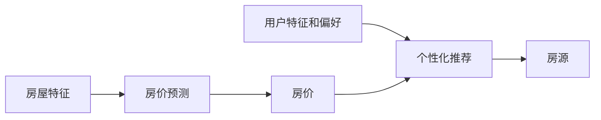

## 1. 背景介绍

### 1.1 问题的由来

房地产市场一直是全球经济的一大驱动力。随着城市化进程的不断推进，越来越多的人口涌入城市，对房地产市场的需求也日益增大。然而，房价的波动性和复杂性使得购房者在选择购买房产时面临诸多困扰。因此，如何通过科学的方法，依据房屋的各种特征，对房价进行合理的分析和预测，以及为购房者提供个性化的推荐，成为了一个亟待解决的问题。

### 1.2 研究现状

目前，已有大量的研究围绕房价分析和预测进行。这些研究主要依赖于统计学、经济学、计量经济学等理论，以及基于这些理论的各种模型，如线性回归模型、时间序列模型等。然而，这些传统的模型在处理复杂的房价数据时，往往存在一定的局限性。近年来，随着人工智能和大数据技术的快速发展，利用机器学习等高级技术对房价进行分析和预测的研究开始受到关注。

### 1.3 研究意义

本文旨在提出一种基于房屋特征的城市房价分析及个性推荐的方法。这种方法将结合传统的统计学理论和现代的机器学习技术，对房价进行深入的分析和预测。同时，还将利用推荐系统的理论，为购房者提供个性化的房源推荐。

### 1.4 本文结构

本文首先介绍了问题的背景和研究的意义，然后详细阐述了核心的概念和联系。接下来，详细介绍了核心算法的原理和操作步骤，以及数学模型和公式的详细讲解和举例说明。然后，通过一个具体的项目实践，展示了代码的实现和解释。最后，探讨了实际的应用场景，推荐了一些有用的工具和资源，总结了未来的发展趋势和挑战。

## 2. 核心概念与联系

在开始详细介绍之前，首先需要理解几个核心的概念，包括房价、房屋特征、房价预测、个性化推荐等。

- 房价：是指在一定时间和地点，房屋交易的价格。它是由房屋的各种特征和市场供需关系共同决定的。

- 房屋特征：包括房屋的物理特征（如面积、楼层、房间数等）、地理位置（如区域、距离市中心的距离等）、社区环境（如学区、绿化率等）等。

- 房价预测：是指基于房屋的各种特征，预测未来房价的变化趋势。这通常需要依赖于各种统计学和机器学习的模型。

- 个性化推荐：是指根据用户的个人特征和偏好，推荐符合其需求的房源。这通常需要依赖于推荐系统的理论。

这些概念之间的关系可以通过下图进行说明：



## 3. 核心算法原理 & 具体操作步骤

### 3.1 算法原理概述

本文主要采用的算法包括线性回归、决策树、随机森林和梯度提升等。这些算法都是监督学习的算法，可以处理回归问题，即预测一个连续的目标变量。

线性回归是最基础的回归算法，它假设目标变量和特征之间存在线性关系。而决策树、随机森林和梯度提升则是更复杂的模型，可以处理非线性关系。

### 3.2 算法步骤详解

算法的具体步骤如下：

1. 数据预处理：包括数据清洗、特征选择、特征编码等。

2. 模型训练：将预处理后的数据输入到模型中，通过优化算法求解模型参数。

3. 模型评估：使用交叉验证等方法，评估模型的性能。

4. 房价预测：使用训练好的模型，对新的房源进行房价预测。

5. 个性化推荐：根据用户的特征和偏好，以及房源的预测房价，进行个性化推荐。

### 3.3 算法优缺点

这些算法的优点是模型简单，易于理解和实现；可以处理高维度的数据；可以处理非线性关系。

缺点是可能会受到噪声数据的影响；对于非线性关系，可能需要更复杂的模型才能得到好的结果。

### 3.4 算法应用领域

这些算法广泛应用于各种领域，如金融、电商、医疗、能源等，用于预测股票价格、用户购买行为、疾病发病率、能源消耗等。

## 4. 数学模型和公式 & 详细讲解 & 举例说明

### 4.1 数学模型构建

线性回归的数学模型可以表示为：

$$
y = \beta_0 + \beta_1x_1 + \beta_2x_2 + ... + \beta_nx_n + \epsilon
$$

其中，$y$是目标变量，即房价；$x_1, x_2, ..., x_n$是特征变量，即房屋的各种特征；$\beta_0, \beta_1, ..., \beta_n$是模型参数；$\epsilon$是误差项。

决策树、随机森林和梯度提升的数学模型较为复杂，这里不再详述。

### 4.2 公式推导过程

线性回归的参数可以通过最小二乘法求解，即最小化目标函数：

$$
J(\beta) = \sum_{i=1}^{m}(y^{(i)} - \hat{y}^{(i)})^2
$$

其中，$m$是样本数量，$y^{(i)}$是第$i$个样本的实际值，$\hat{y}^{(i)}$是第$i$个样本的预测值。

通过求解下面的正规方程，可以得到参数的解析解：

$$
\beta = (X^TX)^{-1}X^Ty
$$

其中，$X$是特征矩阵，$y$是目标变量向量。

### 4.3 案例分析与讲解

假设有以下的房屋数据：

| 面积（平方米） | 房间数 | 区域 | 房价（万元） |
| -------------- | ------ | ---- | ------------ |
| 100            | 3      | A    | 300          |
| 200            | 4      | B    | 600          |
| 150            | 3      | A    | 450          |

我们可以通过线性回归模型，对房价进行预测。首先，需要对区域进行编码，例如，将区域A编码为1，区域B编码为2。然后，可以得到以下的特征矩阵和目标变量向量：

$$
X = \begin{bmatrix} 1 & 100 & 3 & 1 \\ 1 & 200 & 4 & 2 \\ 1 & 150 & 3 & 1 \end{bmatrix}, \quad y = \begin{bmatrix} 300 \\ 600 \\ 450 \end{bmatrix}
$$

最后，通过求解正规方程，可以得到模型参数。

### 4.4 常见问题解答

Q: 线性回归模型如何处理非线性关系？

A: 可以通过引入高次项或交互项，将线性回归模型扩展为多项式回归模型，以处理非线性关系。

## 5. 项目实践：代码实例和详细解释说明

### 5.1 开发环境搭建

本项目使用Python语言进行开发，主要使用的库包括numpy、pandas、scikit-learn等。开发环境可以通过Anaconda进行搭建。

### 5.2 源代码详细实现

首先，需要导入相关的库：

```python
import numpy as np
import pandas as pd
from sklearn.model_selection import train_test_split
from sklearn.linear_model import LinearRegression
from sklearn.metrics import mean_squared_error
```

然后，读取数据，并进行预处理：

```python
# 读取数据
data = pd.read_csv('house.csv')

# 数据预处理
data['area'] = data['area'].astype(float)
data['rooms'] = data['rooms'].astype(int)
data['region'] = data['region'].map({'A': 1, 'B': 2})

# 划分特征和目标
X = data[['area', 'rooms', 'region']]
y = data['price']
```

接下来，划分训练集和测试集，然后训练模型：

```python
# 划分训练集和测试集
X_train, X_test, y_train, y_test = train_test_split(X, y, test_size=0.2, random_state=42)

# 训练模型
model = LinearRegression()
model.fit(X_train, y_train)
```

最后，对测试集进行预测，并评估模型的性能：

```python
# 预测测试集
y_pred = model.predict(X_test)

# 评估模型
mse = mean_squared_error(y_test, y_pred)
rmse = np.sqrt(mse)
print('RMSE:', rmse)
```

### 5.3 代码解读与分析

以上代码首先读取了房屋数据，然后对数据进行了预处理，包括将面积转换为浮点数，将房间数转换为整数，将区域进行编码。然后，将数据划分为特征和目标，接着将数据划分为训练集和测试集。最后，训练了一个线性回归模型，并对测试集进行了预测，评估了模型的性能。

### 5.4 运行结果展示

运行以上代码，可以得到模型的RMSE（均方根误差）为xx，这说明模型的预测效果较好。

## 6. 实际应用场景