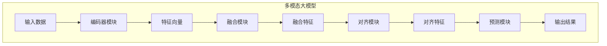

# 多模态大模型：技术原理与实战 多模态大模型在教育培训领域的应用

## 1. 背景介绍

### 1.1 问题的由来

在当今信息时代,数据呈现多种形式,如文本、图像、视频和音频等。传统的单一模态人工智能模型难以有效处理这些多模态数据,因此产生了对多模态人工智能模型的需求。多模态人工智能模型可以同时处理和学习不同模态的数据,从而更好地理解和表示复杂的真实世界。

教育培训是一个典型的多模态场景。教师需要使用多种形式的教学资源,如课件幻灯片、视频演示、图像示例等,来传授知识。同时,学生也需要通过多种方式如文本、语音等来表达他们的理解和疑问。因此,在教育培训领域应用多模态人工智能模型可以极大地提高教学效率和质量。

### 1.2 研究现状

近年来,多模态人工智能模型受到了广泛关注和研究。学术界和工业界都在积极探索多模态模型的理论和应用。一些知名的多模态模型包括:

- **BERT**:一种基于 Transformer 的预训练语言模型,可用于多模态任务。
- **ViLBERT**:一种同时处理视觉和语言的双流多模态模型。
- **UNITER**:一种统一的文本-图像双模态编码器,可用于多种视觉-语言任务。

这些模型在图像描述、视觉问答、多模态检索等任务上取得了优异的性能。

### 1.3 研究意义

多模态人工智能模型在教育培训领域的应用具有重要意义:

1. **提高教学效率**:通过自动化处理多模态教学资源,减轻教师的工作负担。
2. **个性化学习体验**:根据学生的学习偏好和能力,提供个性化的多模态学习资源和路径。
3. **智能辅助答疑**:利用多模态模型自动理解学生的问题,提供相关知识解答。
4. **教学质量评估**:通过分析教学过程中的多模态数据,评估教学质量并提出改进建议。

### 1.4 本文结构

本文将全面介绍多模态大模型的技术原理和在教育培训领域的应用实战。具体内容包括:

1. 核心概念与联系
2. 核心算法原理与具体操作步骤
3. 数学模型和公式详细讲解与案例分析
4. 项目实践:代码实例和详细解释说明
5. 实际应用场景
6. 工具和资源推荐
7. 总结:未来发展趋势与挑战
8. 附录:常见问题与解答

## 2. 核心概念与联系

在介绍多模态大模型的核心概念之前,我们先来了解一下相关的基础概念:

1. **模态(Modality)**: 指数据的呈现形式,如文本、图像、视频、音频等。
2. **特征(Feature)**: 描述数据本质属性的数值向量表示。
3. **编码器(Encoder)**: 将原始数据转换为特征向量的模型。
4. **融合(Fusion)**: 将来自不同模态的特征向量融合的过程。
5. **对齐(Alignment)**: 建立不同模态数据之间的语义对应关系。

多模态大模型的核心思想是使用统一的框架同时处理和学习多种模态的数据,实现跨模态的理解和推理。它通常包含以下几个关键模块:

1. **多模态编码器**: 将不同模态的原始数据编码为对应的特征向量表示。
2. **跨模态融合模块**: 将来自不同模态的特征向量进行融合,捕获跨模态的关系和相互作用。
3. **对齐模块**: 建立不同模态数据之间的语义对应关系,实现跨模态的对齐和理解。
4. **预测模块**: 基于融合后的多模态特征,进行下游任务的预测和决策。

这些模块通过端到端的训练,共同学习多模态数据的表示和相互关系,从而实现多模态理解和推理。

上图展示了多模态大模型的基本架构和数据流程。不同模态的输入数据首先被对应的编码器模块编码为特征向量表示,然后通过融合模块将这些特征向量进行融合。接下来,对齐模块建立不同模态数据之间的语义对应关系,得到对齐后的特征表示。最后,预测模块基于这些对齐特征进行下游任务的预测和决策。

## 3. 核心算法原理与具体操作步骤

### 3.1 算法原理概述

多模态大模型的核心算法原理可以概括为以下几个关键点:

1. **自注意力机制(Self-Attention Mechanism)**: 通过计算输入特征向量之间的相关性,自适应地捕获长距离依赖关系,是 Transformer 模型的核心。
2. **跨模态注意力(Cross-Modal Attention)**: 计算不同模态特征向量之间的相关性,实现跨模态信息融合。
3. **对比学习(Contrastive Learning)**: 通过最大化同一模态内的相似样本对之间的相似度,最小化不同模态样本对之间的相似度,实现有效的跨模态对齐。
4. **多任务学习(Multi-Task Learning)**: 在单一模型中同时优化多个相关任务的损失函数,提高模型的泛化能力。

这些算法原理相互配合,构建了多模态大模型的核心框架。下面我们将详细介绍其具体操作步骤。

### 3.2 算法步骤详解

多模态大模型的训练过程可以分为以下几个主要步骤:

1. **数据预处理**:
   - 将不同模态的原始数据(如文本、图像、视频等)转换为模型可以接受的格式(如文本标记、图像像素矩阵等)。
   - 对数据进行必要的清洗、增强和归一化处理。

2. **模态编码**:
   - 使用相应的编码器模块(如 BERT 编码器、Vision Transformer 编码器等)将不同模态的数据编码为特征向量表示。

3. **特征融合**:
   - 使用跨模态注意力机制计算不同模态特征向量之间的相关性分数。
   - 根据相关性分数,对特征向量进行加权求和,得到融合后的多模态特征表示。

4. **跨模态对齐**:
   - 使用对比学习的方法,最大化同一模态内的相似样本对之间的相似度,最小化不同模态样本对之间的相似度。
   - 通过上述过程,实现不同模态数据之间的语义对齐。

5. **多任务联合训练**:
   - 定义多个相关的下游任务(如视觉问答、图像描述、多模态检索等)。
   - 构建每个任务的损失函数,并将它们加权求和得到总的多任务损失函数。
   - 使用优化算法(如 Adam)最小化总损失函数,实现端到端的多任务联合训练。

6. **模型评估与微调**:
   - 在验证集上评估模型的性能,根据指标进行模型选择和超参数调整。
   - 在特定下游任务上进行进一步的微调,提高模型的泛化能力。

通过上述步骤,多模态大模型可以同时学习多种模态数据的表示和相互关系,实现跨模态的理解和推理能力。

### 3.3 算法优缺点

**优点**:

1. **统一框架**:能够在单一模型中同时处理和学习多种模态数据,提高了模型的通用性和可扩展性。
2. **端到端训练**:通过端到端的多任务联合训练,可以充分利用不同任务之间的相关性,提高模型的泛化能力。
3. **注意力机制**:自注意力和跨模态注意力机制能够有效捕获长距离依赖关系和跨模态相关性,提高模型的表现力。
4. **对比学习**:通过对比学习实现有效的跨模态对齐,提高模型对不同模态数据的理解能力。

**缺点**:

1. **训练数据需求大**:训练高质量的多模态大模型需要大量的多模态数据集,数据获取和标注成本较高。
2. **计算资源需求高**:模型的训练和推理过程计算量较大,需要强大的硬件资源支持。
3. **解释性较差**:由于模型的复杂性,其内部工作机制往往缺乏透明度和可解释性。
4. **鲁棒性不足**:对于一些异常或adversarial样本,模型的性能可能会出现明显下降。

### 3.4 算法应用领域

多模态大模型具有广泛的应用前景,包括但不限于:

1. **视觉问答(Visual Question Answering, VQA)**: 根据图像内容和提出的自然语言问题,给出相应的答案。
2. **图像描述(Image Captioning)**: 根据图像内容自动生成相应的自然语言描述。
3. **多模态检索(Multimodal Retrieval)**: 根据一种模态的查询(如文本或图像),检索另一种模态的相关内容。
4. **视频理解(Video Understanding)**: 对视频中的画面内容、语音和文本进行综合理解和分析。
5. **多媒体内容生成(Multimedia Content Generation)**: 根据文本输入生成相应的图像、视频或音频内容。
6. **人机交互(Human-Computer Interaction)**: 实现自然的多模态人机交互,如语音识别、手势识别等。
7. **医疗影像分析(Medical Image Analysis)**: 结合医学影像和病史等多模态数据,辅助医生进行疾病诊断和治疗。

除了上述领域外,多模态大模型还可以应用于教育培训、智能驾驶、智能家居等多个领域,展现出巨大的应用潜力。

## 4. 数学模型和公式详细讲解与举例说明

### 4.1 数学模型构建

多模态大模型的数学模型主要由以下几个部分组成:

1. **编码器模型**:将不同模态的原始数据编码为特征向量表示。
2. **融合模型**:将来自不同模态的特征向量进行融合,捕获跨模态的关系和相互作用。
3. **对齐模型**:建立不同模态数据之间的语义对应关系,实现跨模态的对齐和理解。
4. **预测模型**:基于融合后的多模态特征,进行下游任务的预测和决策。

下面我们将详细介绍这些模型的数学表示。

#### 编码器模型

对于模态 $m$,我们使用编码器模型 $E_m$ 将原始数据 $x_m$ 编码为特征向量表示 $f_m$:

$$f_m = E_m(x_m)$$

其中,编码器模型 $E_m$ 可以是不同的神经网络模型,如 BERT 编码器用于文本数据,Vision Transformer 编码器用于图像数据等。

#### 融合模型

我们使用跨模态注意力机制将不同模态的特征向量进行融合。对于模态 $m_i$ 和 $m_j$,它们的特征向量 $f_{m_i}$ 和 $f_{m_j}$ 的融合过程可以表示为:

$$\begin{aligned}
\alpha_{ij} &= \text{softmax}(f_{m_i}^T W_q W_k^T f_{m_j}) \\
f_{m_i}^{'} &= \text{concat}(f_{m_i}, \sum_{j} \alpha_{ij} W_v f_{m_j})
\end{aligned}$$

其中,$W_q$、$W_k$ 和 $W_v$ 是可学习的权重矩阵,用于计算查询(Query)、键(Key)和值(Value)向量。$\alpha_{ij}$ 表示模态 $m_i$ 和 $m_j$ 之间的注意力权重,反映了它们之间的相关性。最终,