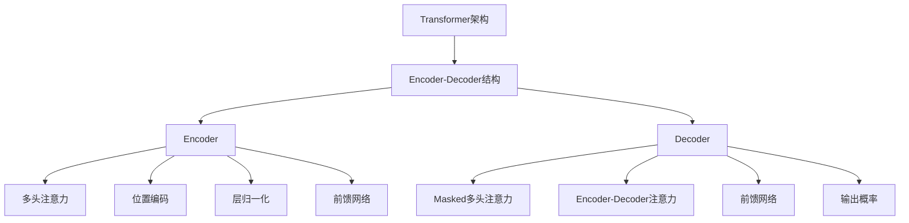

以下是标题为《大语言模型应用指南：Transformer解码器详解》的技术博客文章正文内容：

# 大语言模型应用指南：Transformer解码器详解

## 1. 背景介绍

### 1.1 问题的由来

在自然语言处理(NLP)领域中,机器翻译、文本生成和问答系统等任务都需要生成连贯、流畅的语句序列输出。传统的基于循环神经网络(RNN)和长短期记忆网络(LSTM)的序列生成模型由于存在梯度消失/爆炸、难以并行化等问题,在处理长序列时效果并不理想。2017年,Transformer模型应运而生,它完全基于注意力机制,摒弃了RNN/LSTM的递归结构,在长期依赖建模和并行计算方面有着巨大优势,成为目前最先进的序列生成模型。

### 1.2 研究现状

Transformer模型最初被提出用于机器翻译任务,之后在自然语言生成、语音识别、计算机视觉等领域都取得了卓越的成绩。大型预训练语言模型(PLM)如BERT、GPT、T5等都是基于Transformer的Encoder-Decoder结构,通过自监督学习方式在大规模无标注文本数据上预训练,获得了强大的语言理解和生成能力。目前,大型PLM已在自然语言处理的各种下游任务中广泛应用,取得了超越人类的性能表现。

### 1.3 研究意义

作为Transformer模型的核心部件,Decoder结构对于生成高质量的序列输出至关重要。深入理解Transformer Decoder的工作原理和内部机理,对于更好地利用和优化大型语言模型、提升自然语言生成的性能具有重要意义。本文将系统地介绍Transformer Decoder的设计思想、算法细节和应用实践,为读者提供全面的理解和指导。

### 1.4 本文结构 

本文将从以下几个方面对Transformer Decoder进行全面解析:

1. 核心概念与联系
2. 核心算法原理与具体操作步骤
3. 数学模型和公式详细推导
4. 项目实践:代码实例和详细解释
5. 实际应用场景
6. 相关工具和资源推荐
7. 总结:未来发展趋势与挑战
8. 附录:常见问题与解答

## 2. 核心概念与联系



Transformer是一种全新的基于注意力机制的序列模型架构,主要由Encoder和Decoder两个核心部分组成。Encoder用于编码输入序列,捕获输入的上下文语义信息;Decoder则负责根据Encoder的输出以及之前生成的输出序列,预测下一个最可能的词元,从而生成整个目标序列。

Encoder和Decoder内部都采用了多头注意力(Multi-Head Attention)、残差连接(Residual Connection)、层归一化(Layer Normalization)和前馈网络(Feed-Forward Network)等关键组件,通过自注意力机制捕获长距离依赖关系,并且允许高度并行化。

与Encoder不同,Decoder还引入了Masked Multi-Head Attention和Encoder-Decoder Attention两种特殊的注意力机制。前者用于防止注意力计算时利用了后续位置的信息,后者则融合了Encoder的输出,使Decoder能够关注输入序列中与当前生成步骤相关的部分。

## 3. 核心算法原理与具体操作步骤

### 3.1 算法原理概述

Transformer Decoder的核心是注意力机制,它允许模型在生成序列时,动态地为每个位置分配注意力权重,关注与当前生成目标最相关的上下文信息。具体来说,Decoder包含以下三种注意力计算:

1. **Masked Multi-Head Attention**:对输入的前缀序列(已生成的部分)计算自注意力,但遮掩掉后续位置的信息,避免模型偷窥。
2. **Encoder-Decoder Attention**: 将Decoder的输出与Encoder的输出序列计算注意力,获取输入序列中与当前生成步骤相关的上下文信息。
3. **Feed-Forward Network**: 对注意力输出进行非线性变换,融合不同注意力信息。

通过上述注意力计算,Decoder能够综合已生成序列和输入序列的信息,预测下一个最可能的词元,从而逐步生成完整的目标序列。

### 3.2 算法步骤详解

Transformer Decoder在每个时间步上的计算过程如下:

1. **输入表示**:将上一时间步的输出词元(或起始符<BOS>)映射为词向量表示。

2. **Masked Multi-Head Attention**:
   - 将输入词向量与之前生成的序列计算注意力权重
   - 对注意力权重施加掩码,遮掩掉当前位置之后的信息
   - 根据注意力权重,对序列进行加权求和,得到上下文向量表示

3. **Encoder-Decoder Attention**:
   - 将上一步的上下文向量与Encoder输出计算注意力权重
   - 根据注意力权重,对Encoder输出序列进行加权求和
   - 获得融合了输入序列信息的上下文表示

4. **Feed-Forward Network**:
   - 将注意力输出通过前馈网络进行非线性变换
   - 融合Masked多头注意力和Encoder-Decoder注意力的信息

5. **输出概率计算**:
   - 将前馈网络输出通过线性投影和Softmax,得到下一个词元的概率分布
   - 选择概率最大的词元作为输出

6. **迭代生成**:重复上述步骤,直至生成终止符<EOS>或达到最大长度。

算法伪代码:

```python
def transformer_decoder(inputs, encoder_outputs):
    outputs = []
    state = init_decoder_state(inputs)
    
    for t in range(max_len):
        # Masked Multi-Head Attention
        masked_attn = masked_multihead_attn(state, state)
        
        # Encoder-Decoder Attention 
        enc_attn = multihead_attn(masked_attn, encoder_outputs)
        
        # Feed-Forward Network
        state = positionwise_feedforward(enc_attn)
        
        # Output Probability
        output = linear_softmax(state)
        outputs.append(output)
        
        # Update State
        state = update_state(state, output)
        
        if output == <EOS>:
            break
            
    return outputs
```

### 3.3 算法优缺点

**优点**:

1. **长期依赖建模**:注意力机制能够直接捕获输入和输出序列中任意两个位置之间的依赖关系,有效解决了RNN/LSTM在长序列场景下的梯度消失/爆炸问题。

2. **并行计算**:Transformer完全基于注意力计算,没有序列操作,可以高度并行化,在GPU/TPU等加速硬件上表现出色。

3. **灵活性**:Encoder-Decoder结构使Transformer可以适用于多种任务,如机器翻译、文本生成、序列到序列学习等。

**缺点**:

1. **计算复杂度高**:注意力机制的计算量会随着序列长度的平方增长,对长序列场景带来一定瓶颈。

2. **缺乏位置信息**:Transformer模型本身无法获取序列中词元的绝对位置信息,需要引入外部的位置编码。

3. **解释性较差**:注意力机制虽然增强了模型性能,但其内部计算过程较为黑箱,缺乏可解释性。

### 3.4 算法应用领域

Transformer Decoder及其变体广泛应用于自然语言处理的各种生成式任务:

- **机器翻译**: 将源语言文本翻译成目标语言,如英->中、法->英等。
- **文本摘要**: 根据输入文本自动生成对应的摘要。
- **对话系统**: 根据对话历史上下文生成自然语言回复。
- **代码生成**: 将自然语言描述转化为可执行代码。
- **问答系统**: 根据问题上下文生成相应的答复。
- **文本续写**: 给定文本前缀,自动续写下文内容。
- **文本修复**: 根据上下文语境修复文本中的错词、缺失等。

除NLP外,Transformer Decoder也逐渐在计算机视觉、语音、多模态等领域得到应用。

## 4. 数学模型和公式详细讲解与举例说明

在详细介绍Transformer Decoder的数学模型之前,我们先回顾一下注意力机制(Attention Mechanism)的核心思想。

注意力机制的主要目标是为不同的输入赋予不同的权重,使模型能够专注于对当前任务最相关的部分。具体来说,对于一个查询向量(Query) $\boldsymbol{q}$ 和一组键值对 $\{(\boldsymbol{k}_i, \boldsymbol{v}_i)\}_{i=1}^n$,注意力机制首先计算查询向量与每个键向量之间的相似性得分:

$$\text{Score}(\boldsymbol{q}, \boldsymbol{k}_i) = f(\boldsymbol{q}, \boldsymbol{k}_i)$$

其中 $f$ 是一个相似性函数,通常使用点积或缩放点积:

$$\begin{align*}
f(\boldsymbol{q}, \boldsymbol{k}_i) &= \boldsymbol{q}^\top \boldsymbol{k}_i \\
\text{或} \quad f(\boldsymbol{q}, \boldsymbol{k}_i) &= \frac{\boldsymbol{q}^\top \boldsymbol{k}_i}{\sqrt{d_k}}
\end{align*}$$

其中 $d_k$ 是键向量的维度,缩放点积有助于缓解较大的点积值导致的梯度不稳定性。

接下来,通过 Softmax 函数将相似性得分归一化为注意力权重:

$$\alpha_i = \text{Softmax}(\text{Score}(\boldsymbol{q}, \boldsymbol{k}_i)) = \frac{\exp(\text{Score}(\boldsymbol{q}, \boldsymbol{k}_i))}{\sum_{j=1}^n \exp(\text{Score}(\boldsymbol{q}, \boldsymbol{k}_j))}$$

最后,根据注意力权重对值向量进行加权求和,得到注意力输出:

$$\text{Attention}(\boldsymbol{q}, \{\boldsymbol{k}_i, \boldsymbol{v}_i\}_{i=1}^n) = \sum_{i=1}^n \alpha_i \boldsymbol{v}_i$$

注意力输出向量融合了与查询最相关的值向量信息,可以作为下游任务的输入或中间表示。

### 4.1 数学模型构建

基于上述注意力机制,我们可以构建 Transformer Decoder 的数学模型。在时间步 $t$ 上,Decoder 需要生成输出词元 $y_t$,其条件概率可表示为:

$$P(y_t | y_{<t}, X) = \text{Decoder}(y_{<t}, X)$$

其中 $y_{<t}$ 表示已生成的输出序列前缀,即 $(y_1, y_2, \ldots, y_{t-1})$; $X$ 表示输入序列。Decoder 的具体计算过程如下:

1. **Masked Multi-Head Attention**

首先,对输出序列前缀 $y_{<t}$ 计算 Masked 多头注意力,得到上下文向量表示 $\boldsymbol{z}_t^1$:

$$\boldsymbol{z}_t^1 = \text{MaskedMultiHeadAttn}(y_{<t}, y_{<t}, y_{<t})$$

其中,Masked 机制通过在注意力得分矩阵中加入掩码,确保在计算时间步 $t$ 的注意力权重时,不会利用到后续位置 $t+1, t+2, \ldots$ 的信息。

2. **Encoder-Decoder Attention**

接下来,将上一步的输出 $\boldsymbol{z}_t^1$ 与 Encoder 输出 $H$ 计算 Encoder-Decoder 注意力,融合输入序列的上下文信息:

$$\boldsymbol{z}_t^2 = \text{MultiHeadAttn}(\boldsymbol{z}_t^1, H, H)$$

3. **Feed-Forward Network**

最后,将注意力输出 $\boldsymbol{z}_t^2$ 通过前馈网络进行非线性变换,得到