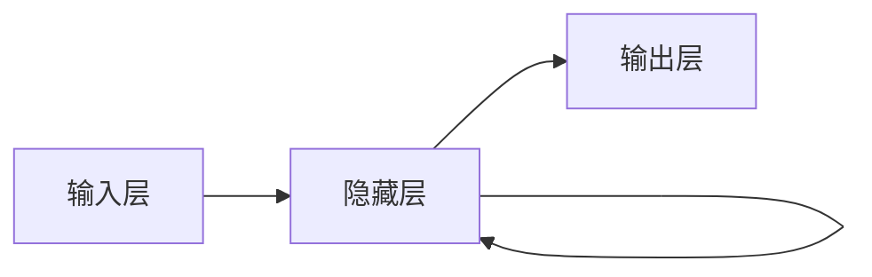

# 循环神经网络 (Recurrent Neural Network)

关键词：循环神经网络, RNN, 时序数据, 长短期记忆, LSTM, 门控循环单元, GRU, 梯度消失, 梯度爆炸

## 1. 背景介绍
### 1.1  问题的由来
在自然语言处理、语音识别、时间序列预测等领域,我们经常会遇到序列化的数据。传统的前馈神经网络难以很好地处理这类数据,因为它们无法捕捉数据中的时序关系。为了解决这个问题,循环神经网络(Recurrent Neural Network, RNN)应运而生。

### 1.2  研究现状
RNN的概念最早由Hopfield在1982年提出,此后经历了长足的发展。1997年,Hochreiter和Schmidhuber提出了长短期记忆(Long Short-Term Memory, LSTM)网络,大大改善了RNN的长期依赖问题。2014年,Cho等人提出了门控循环单元(Gated Recurrent Unit, GRU),进一步简化了LSTM的结构。近年来,RNN及其变体在各个领域取得了瞩目的成就。

### 1.3  研究意义
RNN能够有效地处理序列化数据,在自然语言处理、语音识别、机器翻译、时间序列预测等领域有着广泛的应用前景。深入研究RNN的原理和应用,对于推动人工智能的发展具有重要意义。

### 1.4  本文结构
本文将从以下几个方面深入探讨RNN:
- 核心概念与联系
- 核心算法原理与具体操作步骤
- 数学模型和公式详解
- 项目实践:代码实例和详细解释
- 实际应用场景
- 工具和资源推荐
- 未来发展趋势与挑战
- 常见问题与解答

## 2. 核心概念与联系

RNN是一类用于处理序列数据的神经网络。与前馈神经网络不同,RNN引入了循环机制,使得网络能够记忆之前的信息。RNN中的隐藏状态不仅取决于当前的输入,还取决于上一时刻的隐藏状态。这使得RNN能够捕捉数据中的时序关系,从而更好地处理序列化数据。

RNN的变体主要包括以下几种:

- 长短期记忆(LSTM):引入了门机制,解决了RNN的梯度消失和梯度爆炸问题。
- 门控循环单元(GRU):简化了LSTM的结构,同样能够缓解梯度消失和梯度爆炸问题。
- 双向RNN(Bidirectional RNN):同时考虑序列的正向和反向信息,提高了模型的性能。

这些变体在保留RNN基本结构的同时,针对其缺陷进行了改进,使得RNN能够更好地应用于实际问题中。



## 3. 核心算法原理 & 具体操作步骤
### 3.1  算法原理概述
RNN的核心思想是引入循环机制,使得网络能够记忆之前的信息。具体来说,RNN在每个时间步都有一个隐藏状态$h_t$,它不仅取决于当前时间步的输入$x_t$,还取决于上一时间步的隐藏状态$h_{t-1}$。这可以用以下公式表示:

$$h_t = f(Ux_t + Wh_{t-1} + b)$$

其中,$U$和$W$分别是输入到隐藏层和隐藏层到隐藏层的权重矩阵,$b$是偏置项,$f$是激活函数(通常为tanh或sigmoid)。

### 3.2  算法步骤详解
RNN的前向传播过程如下:

1. 将输入序列$\{x_1, x_2, ..., x_T\}$送入RNN。
2. 对于每个时间步$t=1,2,...,T$:
   - 计算隐藏状态:$h_t = f(Ux_t + Wh_{t-1} + b)$
   - 计算输出:$y_t = g(Vh_t + c)$,其中$V$是隐藏层到输出层的权重矩阵,$c$是偏置项,$g$是输出层的激活函数。
3. 输出最终的预测结果$\{y_1, y_2, ..., y_T\}$。

在训练过程中,RNN通过反向传播算法(Back Propagation Through Time, BPTT)来更新权重。BPTT的基本思想是将RNN在时间维度上展开,然后应用标准的反向传播算法。

### 3.3  算法优缺点
RNN的优点在于:
- 能够处理任意长度的序列数据。
- 能够捕捉数据中的时序关系。
- 参数共享,训练效率高。

RNN的缺点包括:
- 容易出现梯度消失和梯度爆炸问题,导致难以捕捉长期依赖。
- 训练速度慢,难以并行化。

### 3.4  算法应用领域
RNN广泛应用于以下领域:
- 自然语言处理:语言模型、机器翻译、情感分析等。
- 语音识别:声学模型、语言模型等。
- 时间序列预测:股票预测、天气预报、销量预测等。
- 图像描述:根据图像生成文字描述。
- 手写识别:根据笔画序列识别手写字符。

## 4. 数学模型和公式 & 详细讲解 & 举例说明
### 4.1  数学模型构建
RNN可以看作是一个递归函数,它将前一时刻的隐藏状态$h_{t-1}$和当前时刻的输入$x_t$映射到当前时刻的隐藏状态$h_t$:

$$h_t = f_{\theta}(h_{t-1}, x_t)$$

其中,$\theta$表示RNN的参数(即权重矩阵和偏置项)。如果将RNN展开,可以得到:

$$h_t = f_{\theta}(f_{\theta}(...f_{\theta}(h_0, x_1)...), x_t)$$

这表明,当前时刻的隐藏状态$h_t$包含了之前所有时刻的信息。

### 4.2  公式推导过程
为了更新RNN的参数,需要计算损失函数对各个参数的梯度。以$U$为例,损失函数$L$对$U$的梯度为:

$$\frac{\partial L}{\partial U} = \sum_{t=1}^T \frac{\partial L_t}{\partial U}$$

其中,$L_t$表示时间步$t$的损失函数。根据链式法则,有:

$$\frac{\partial L_t}{\partial U} = \frac{\partial L_t}{\partial y_t} \frac{\partial y_t}{\partial h_t} \frac{\partial h_t}{\partial U}$$

$$\frac{\partial h_t}{\partial U} = \frac{\partial h_t}{\partial h_{t-1}} \frac{\partial h_{t-1}}{\partial U} + \frac{\partial h_t}{\partial U}$$

可以看出,梯度$\frac{\partial h_t}{\partial U}$包含了前一时刻的梯度$\frac{\partial h_{t-1}}{\partial U}$。这意味着,当序列较长时,梯度可能会不断累积,导致梯度爆炸;或者不断衰减,导致梯度消失。

### 4.3  案例分析与讲解
考虑一个简单的RNN,它有一个输入单元、一个隐藏单元和一个输出单元。假设激活函数为tanh,输出层的激活函数为恒等函数。给定一个长度为$T$的输入序列$\{x_1, x_2, ..., x_T\}$,RNN在每个时间步的计算过程如下:

$$h_t = \tanh(ux_t + wh_{t-1} + b)$$
$$y_t = vh_t + c$$

其中,$u$、$w$、$v$分别是输入到隐藏层、隐藏层到隐藏层、隐藏层到输出层的权重,$b$和$c$分别是隐藏层和输出层的偏置项。

假设损失函数为均方误差(Mean Squared Error, MSE):

$$L = \frac{1}{T} \sum_{t=1}^T (y_t - \hat{y}_t)^2$$

其中,$\hat{y}_t$是时间步$t$的真实输出。根据反向传播算法,可以计算出各个参数的梯度,并用梯度下降法更新参数:

$$u := u - \alpha \frac{\partial L}{\partial u}$$
$$w := w - \alpha \frac{\partial L}{\partial w}$$
$$v := v - \alpha \frac{\partial L}{\partial v}$$
$$b := b - \alpha \frac{\partial L}{\partial b}$$
$$c := c - \alpha \frac{\partial L}{\partial c}$$

其中,$\alpha$是学习率。重复以上过程,直到损失函数收敛或达到预设的迭代次数。

### 4.4  常见问题解答
**Q**: RNN为什么会出现梯度消失和梯度爆炸问题?
**A**: RNN在反向传播过程中,梯度会不断乘以同一个矩阵(即隐藏层到隐藏层的权重矩阵)。当这个矩阵的谱半径小于1时,梯度会指数衰减,导致梯度消失;当谱半径大于1时,梯度会指数增长,导致梯度爆炸。

**Q**: 如何缓解RNN的梯度消失和梯度爆炸问题?
**A**: 常见的方法包括:
- 使用LSTM或GRU等变体,引入门机制来控制信息的流动。
- 使用梯度裁剪(Gradient Clipping)来限制梯度的范数。
- 使用正则化技术,如L1/L2正则化、Dropout等。
- 合理设置学习率和初始化策略。

**Q**: RNN能否处理可变长度的序列?
**A**: 可以。RNN本身并不限制输入序列的长度,因此可以处理任意长度的序列。在实际应用中,通常会设置一个最大长度,对于超过最大长度的序列进行截断,对于不足最大长度的序列进行填充。

## 5. 项目实践：代码实例和详细解释说明
### 5.1  开发环境搭建
本项目使用Python 3和PyTorch实现RNN。首先,安装必要的依赖库:

```bash
pip install torch numpy matplotlib
```

### 5.2  源代码详细实现
下面是一个简单的RNN示例,用于对正弦函数进行预测:

```python
import torch
import torch.nn as nn
import numpy as np
import matplotlib.pyplot as plt

# 定义RNN模型
class RNN(nn.Module):
    def __init__(self, input_size, hidden_size, output_size):
        super(RNN, self).__init__()
        self.hidden_size = hidden_size
        self.i2h = nn.Linear(input_size + hidden_size, hidden_size)
        self.i2o = nn.Linear(input_size + hidden_size, output_size)

    def forward(self, input, hidden):
        combined = torch.cat((input, hidden), 1)
        hidden = torch.tanh(self.i2h(combined))
        output = self.i2o(combined)
        return output, hidden

    def init_hidden(self):
        return torch.zeros(1, self.hidden_size)

# 生成数据
def generate_data(steps):
    time_steps = np.linspace(0, np.pi, steps)
    data = np.sin(time_steps)
    data = data.reshape(steps, 1)
    return torch.Tensor(data[:-1]).view(-1, 1, 1), torch.Tensor(data[1:]).view(-1, 1, 1)

# 设置参数
input_size = 1
hidden_size = 32
output_size = 1
num_epochs = 100
learning_rate = 0.1
steps = 100

# 实例化模型和优化器
model = RNN(input_size, hidden_size, output_size)
criterion = nn.MSELoss()
optimizer = torch.optim.Adam(model.parameters(), lr=learning_rate)

# 训练模型
for epoch in range(num_epochs):
    inputs, targets = generate_data(steps)
    hidden = model.init_hidden()
    optimizer.zero_grad()
    loss = 0
    for input, target in zip(inputs, targets):
        output, hidden = model(input, hidden)
        loss += criterion(output, target)
    loss.backward()
    optimizer.step()
    if (epoch + 1) % 10 == 0:
        print(f'Epoch [{epoch+1}/{num_epochs}], Loss: {loss.item():.4f}')

# 测试模型
with torch.no_grad():
    inputs, targets = generate_data(steps)
    hidden = model.init_hidden()
    predictions = []
    for input in inputs:
        output, hidden = model(input, hidden)
        predictions.append(output.numpy().ravel())
    plt.plot(range(steps - 1), predictions, label='Predicted')
    plt.plot(