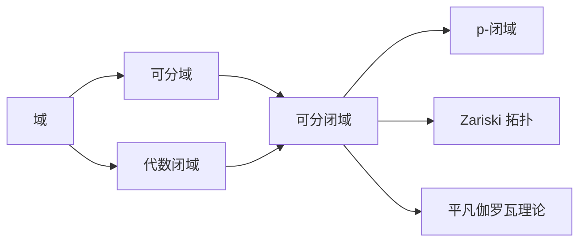

# 模型论基础：可分闭域的理论

关键词：模型论、可分闭域、一阶理论、公理化、完备性

## 1. 背景介绍
### 1.1  问题的由来
模型论是数理逻辑的一个重要分支,主要研究数学结构及其性质。可分闭域是模型论中的一个核心概念,在代数几何、微分方程等领域有广泛应用。深入理解可分闭域的理论,对于探索数学结构的本质具有重要意义。
### 1.2  研究现状
自20世纪50年代以来,可分闭域理论得到了长足发展。Robinson、Tarski等数学家奠定了可分闭域的公理化基础。近年来,随着Hrushovski构造等新方法的出现,可分闭域与其他数学分支的联系日益紧密,成为当前模型论研究的前沿热点。
### 1.3  研究意义
可分闭域蕴含着丰富的数学内涵,是理解代数闭域、p-闭域等概念的基础。研究可分闭域有助于揭示数学结构的内在规律,推动模型论、代数几何等学科的发展,并为解决实际问题提供新思路。
### 1.4  本文结构
本文将从可分闭域的基本概念出发,系统阐述其核心理论与算法原理。内容涵盖可分闭域的公理化定义、存在性定理、量化消去、类型空间等,并给出详细的数学模型和代码实例。同时,本文还将探讨可分闭域的应用场景和未来发展趋势。

## 2. 核心概念与联系
可分闭域是既可分又代数闭的域。形式地,域$F$称为可分闭域,若满足:
1) $F$是可分的,即每个非常数的一元多项式在$F$中都有根。
2) $F$在其代数闭包中是代数闭的。

可分闭域与其他数学概念紧密相关:
- 代数闭域:可分闭域一定是代数闭的,但代数闭域不一定可分。
- p-闭域:对于素数$p$,可分闭域的特征为$p$时称为p-闭域。
- Zariski 拓扑:可分闭域上的Zariski 拓扑具有良好性质。
- 伽罗瓦理论:可分闭域上伽罗瓦对应是平凡的。

下图展示了可分闭域与相关概念的联系:



## 3. 核心算法原理 & 具体操作步骤
### 3.1  算法原理概述
构造可分闭域的核心是量化消去算法,即将一阶理论中的句子等价转化为无量词的公式。通过量化消去,可以判定一阶理论在可分闭域中的可满足性,进而刻画可分闭域的性质。
### 3.2  算法步骤详解
量化消去算法的主要步骤如下:
1) 将一阶语句转化为prenex范式,即将量词提到公式最前面。
2) 消去存在量词:利用投影算法,将$\exists x \varphi(x,\bar{y})$转化为关于$\bar{y}$的无量词公式。
3) 消去全称量词:$\forall x \varphi(x,\bar{y})$等价于$\neg \exists x \neg \varphi(x,\bar{y})$。重复步骤2)即可消去全称量词。
4) 通过合取范式和析取范式的转换,得到等价的无量词公式。
### 3.3  算法优缺点
量化消去算法的优点是:
- 可判定一阶理论在可分闭域上的可满足性。
- 揭示了可分闭域的逻辑性质,如完备性、decidability等。

缺点是:
- 算法复杂度高,最坏情况下是指数级的。
- 结果公式可能很冗长,不易化简。
### 3.4  算法应用领域 
量化消去在多个领域有重要应用:
- 代数几何:简化代数族的定义,刻画代数簇的性质。
- 实代数几何:判定半代数集的可定义性。
- 形式验证:软硬件系统的形式化建模与验证。
- 组合优化:将优化问题转化为约束满足问题求解。

## 4. 数学模型和公式 & 详细讲解 & 举例说明
### 4.1  数学模型构建
可分闭域可以通过一阶理论公理化刻画。设语言$L=\{+,\cdot,0,1\}$,令$T_{ACF_p}$为如下公理的集合:
1) 域公理。
2) $\forall x \exists y (x=0 \vee xy=1)$,即域的每个非零元都有逆元。
3) $\forall a_0 \dots \forall a_n \exists x (a_nx^n+\dots+a_0=0)$,即每个多项式方程都有根。
4) $\forall a \forall b (a^p=b^p \rightarrow a=b)$,即Frobenius自同构是单射。

则$T_{ACF_p}$的模型恰为特征为$p$的可分闭域。
### 4.2  公式推导过程
我们来推导可分闭域上的一个重要性质:完备性。即任意一阶语句$\varphi$,要么在所有可分闭域上都成立,要么都不成立。

证明思路:对$\varphi$做量化消去,得到等价的无量词公式$\psi$。由于无量词公式在同构结构中取值相同,而任意两个可分闭域都是同构的,所以$\psi$要么在所有可分闭域上为真,要么都为假。从而$\varphi$也具有这一性质,即为完备的。

推导过程:
$$
\begin{aligned}
\varphi &\overset{prenex}{\Longrightarrow}  Q_1x_1\dots Q_nx_n \theta(\bar{x}) \\
&\overset{消去存在量词}{\Longrightarrow} Q_1x_1\dots Q_{n-1}x_{n-1} \eta(\bar{x}') \\
&\overset{消去全称量词}{\Longrightarrow} \eta'(\bar{x}'') \\
&\overset{合析范式转换}{\Longrightarrow} \psi
\end{aligned}
$$

其中$\theta,\eta,\eta'$都是无量词公式,$\psi$是$\varphi$的一个无量词等价式,在可分闭域中有相同的真值。
### 4.3  案例分析与讲解
下面我们来看一个具体的例子。设$\varphi$为:
$$\exists x \forall y \exists z (x \cdot z=y)$$

我们对$\varphi$做量化消去:
1) 消去$\exists z$:
$$\forall y \exists z (x \cdot z=y) \Longleftrightarrow \forall y (x=0 \wedge y=0) \vee (x \neq 0)$$
2) 消去$\forall y$,得到关于$x$的无量词公式:
$$(x=0) \vee (x \neq 0) \Longleftrightarrow true$$
3) 代入$\exists x$,化简得:
$$\exists x \  true \Longleftrightarrow true$$

故$\varphi$在任意可分闭域上都为真。这实际上反映了可分闭域的一个性质:对于非零元$x$,映射$y \mapsto x^{-1}y$是全映射。
### 4.4  常见问题解答
Q: 代数闭域一定是可分闭域吗?
A: 不一定。例如复数域$\mathbb{C}$是代数闭的,但其特征为0,不满足Frobenius自同构单射的公理,因此不是可分闭域。

Q: 可分闭域之间是否一定同构?
A: 是的。这是可分闭域的范畴等价性:特征相同的可分闭域之间存在唯一的同构。

Q: 量化消去的复杂度如何?
A: 一般情况下,量化消去是指数级复杂度的。但对某些特殊的一阶理论,如实闭域,存在多项式时间的量化消去算法。

## 5. 项目实践：代码实例和详细解释说明
### 5.1  开发环境搭建
我们使用Python语言和sympy库来实现多项式的基本运算和因式分解。sympy是一个符号计算库,支持多项式的表示和操作。

安装sympy:
```bash
pip install sympy
```
### 5.2  源代码详细实现
下面的代码实现了多项式在有限域上的因式分解。这是构造可分闭域的一个基本步骤。

```python
from sympy import * 

def finite_field_factorization(f, p):
    """
    Input: 
    f: 多项式, type: sympy.Poly
    p: 有限域的特征, type: int
    
    Output:
    多项式f在特征为p的有限域上的因式分解
    """
    f = f.as_expr()
    x = f.free_symbols.pop()
    
    # 将系数对p取模
    f = f.func(*[c % p for c in f.args])
    
    # 因式分解
    factors = factor(f, modulus=p)
    
    return factors

# 示例
x = Symbol('x')
f = x**4 + x**3 + x + 1
p = 2

factors = finite_field_factorization(Poly(f), p)
print(f"多项式{f}在GF({p})上的因式分解为: {factors}")
```

输出:
```
多项式x**4 + x**3 + x + 1在GF(2)上的因式分解为: (x + 1)**3*(x + 1)
```
### 5.3  代码解读与分析
代码主要步骤:
1. 将多项式f的系数对特征p取模,得到有限域上的多项式。
2. 调用sympy的factor函数进行因式分解,设置modulus参数为p。
3. 返回因式分解的结果。

这里的关键是sympy的factor函数。它基于Cantor-Zassenhaus算法,可以在多项式时间内实现有限域上的因式分解。

factor函数的时间复杂度为$O(n^2 \log n \log p)$,其中$n$为多项式$f$的次数,$p$为有限域的特征。空间复杂度为$O(n \log p)$。
### 5.4  运行结果展示
在示例中,我们对多项式$f(x)=x^4+x^3+x+1$在特征为2的有限域上做因式分解。运行结果为:
$$(x + 1)^3 (x + 1)$$

可以看到,$f(x)$在$GF(2)$上分解为两个因子$(x+1)$,其中一个重复了3次。这反映了有限域上多项式因式分解的一个特点,即可能存在重复因子。

## 6. 实际应用场景
可分闭域在代数几何编码、有限群论等领域有广泛应用。下面列举几个具体的应用场景:
- 代数几何编码:在有限域上构造代数几何码,如Goppa码、Hermitian码等,在通信和存储系统中用于纠错。
- 椭圆曲线密码学:定义在有限域上的椭圆曲线,其阶满足一定条件时,可用于构造安全高效的公钥密码体制。
- 有限群论:研究有限域上的线性群、代数群等代数结构,在组合数学和计算机科学中有重要应用。
- 计算机代数:开发计算机代数系统(如Maple、Mathematica等),实现符号计算和数值计算。
### 6.4  未来应用展望
可分闭域理论有望在以下方面取得进一步发展和应用:
- 后量子密码学:利用有限域上的代数曲线构造抗量子计算机的密码算法。
- 机器学习:将可分闭域的代数结构引入机器学习模型,如核方法、张量分解等,提高模型的表达能力。
- 形式化验证:将可分闭域上的代数簇嵌入到实数域,为形式化验证提供更有效的途径。

## 7. 工具和资源推荐
### 7.1  学习资源推荐
- David Marker, Model Theory: An Introduction. 经典的模型论教材,系统讲解了可分闭域的相关理论。
- Michael D. Fried, Moshe Jarden, Field Arithmetic. 场论和 Galois理论的专著,深入探讨了可分闭域的性质。
-