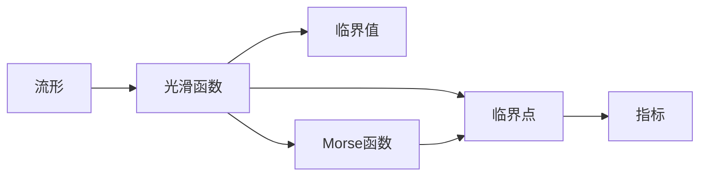

# 流形拓扑学：Morse理论(II)

关键词：流形、拓扑学、Morse理论、临界点、梯度向量场、Morse函数、Morse不等式、Morse复形、Morse同调群

## 1. 背景介绍
### 1.1  问题的由来
流形的拓扑性质一直是数学研究的重要课题之一。如何利用函数的分析性质来研究流形的拓扑不变量,是Morse理论所要解决的核心问题。Morse理论通过研究流形上光滑函数的临界点,建立了函数的分析性质与流形拓扑性质之间的深刻联系,是微分拓扑学中的重要工具。
### 1.2  研究现状
Morse理论最初由美国数学家Marston Morse于1925年提出,经过其后数学家的不断完善,已经发展成为了一套成熟的理论体系。目前Morse理论在微分拓扑、动力系统、辛几何等多个数学分支中得到了广泛应用。近年来,Morse理论也被引入到计算机图形学、计算机视觉、机器人路径规划等应用领域。
### 1.3  研究意义  
Morse理论不仅是微分拓扑学的重要工具,也为其他数学分支和应用领域提供了新的思路和方法。深入研究Morse理论,对于拓展其应用范围,解决实际问题具有重要意义。本文将系统介绍Morse理论的核心概念、主要定理及其应用,帮助读者深入理解这一重要理论。
### 1.4  本文结构
本文第2节介绍Morse理论的核心概念;第3节介绍Morse函数的性质及分类;第4节给出Morse理论的主要定理及证明思路;第5节通过实例展示如何应用Morse理论研究流形拓扑;第6节讨论Morse理论在其他领域的应用;第7节介绍学习Morse理论的工具和资源;第8节对Morse理论的研究现状及未来发展进行总结展望。

## 2. 核心概念与联系
Morse理论的核心概念包括:
- 流形(manifold):拓扑空间局部同胚于欧氏空间。
- 光滑函数(smooth function):定义在流形上,具有连续偏导数的实值函数。
- 临界点(critical point):梯度向量为零的点。
- 临界值(critical value):临界点处的函数值。
- 指标(index):临界点处Hessian矩阵的负特征值个数。
- Morse函数(Morse function):临界点非退化(Hessian矩阵非奇异)的光滑函数。

这些概念间的逻辑关系如下:


## 3. 核心算法原理 & 具体操作步骤
### 3.1  算法原理概述
Morse理论的核心是研究流形上Morse函数的临界点、临界值与流形拓扑之间的关系。通过分析Morse函数的梯度向量场,可以刻画流形的拓扑性质。
### 3.2  算法步骤详解
1. 在流形M上构造Morse函数f。
2. 求解梯度向量场 $\nabla f$ 的零点,得到f的所有临界点。
3. 计算每个临界点的指标。
4. 对临界值从小到大排序,构造Morse复形。
5. 分析不同临界值对应的Morse复形,得到流形的拓扑信息。

### 3.3  算法优缺点
Morse理论的优点是建立了函数的分析性质与流形拓扑之间的联系,使得许多拓扑问题可以转化为分析问题来处理。
但其缺点是仅适用于光滑流形,对奇异空间无能为力。且在构造Morse函数、求解临界点等步骤中涉及大量计算。

### 3.4  算法应用领域
Morse理论不仅是微分拓扑学的重要工具,在黎曼几何、辛几何、动力系统等领域也有广泛应用。近年来,Morse理论被引入图形学、计算机视觉、机器人路径规划等应用领域,为解决实际问题提供了新思路。

## 4. 数学模型和公式 & 详细讲解 & 举例说明
### 4.1  数学模型构建
设M为n维光滑流形,f:M→ R为M上的光滑函数。f的梯度向量场 $\nabla f$ 定义为
$$\nabla f=\left(\frac{\partial f}{\partial x_1},\cdots,\frac{\partial f}{\partial x_n}\right)$$

若 $\nabla f(p)=0$,则称p为f的临界点。f在临界点p处的Hessian矩阵为
$$
\left[\frac{\partial^2 f}{\partial x_i\partial x_j}(p)\right]_{n\times n}
$$
若Hessian矩阵在每个临界点处均非奇异,则称f为Morse函数。

Morse函数的临界点可分为3类:
1. 极小值点:指标为0
2. 鞍点:指标为1至n-1
3. 极大值点:指标为n

### 4.2  公式推导过程
Morse理论的核心是Morse不等式,它给出了流形的Betti数与Morse函数临界点数量之间的关系:

设M为n维紧致流形,f为M上的Morse函数,mk为指标为k的临界点数量,bk为M的k维Betti数,则对任意的k,有
$$
m_k \geq b_k
$$
且
$$
\sum_{k=0}^n (-1)^km_k = \sum_{k=0}^n (-1)^kb_k = \chi(M)
$$
其中 $\chi(M)$ 为M的Euler示性数。

Morse不等式的证明需要利用Morse理论的另一个重要概念——Morse复形。

给定Morse函数f的临界值 $c_1<\cdots<c_n$,Morse复形是一个CW复形,其k维胞腔与f的指标为k的临界点一一对应。

记 $M_a=f^{-1}(-\infty,a]$。可以证明,当 $a<b$ 且区间 $[a,b]$ 内无临界值时,$M_a$ 与 $M_b$ 同伦等价。
当 $a<c<b$,c为指标为k的临界值时,$M_b$ 可以通过在 $M_a$ 上附加一个k维胞腔得到。

由Morse复形的性质可以得到
$$
b_k(M_b) \leq b_k(M_a) + m_k
$$
因此
$$
b_k(M) \leq m_k
$$

### 4.3  案例分析与讲解
下面以2维球面 $S^2$ 为例,说明如何应用Morse理论分析其拓扑性质。

取 $S^2$ 的高度函数 $h(x,y,z)=z$ 作为Morse函数。易知h有2个临界点:
- 南极点 $(0,0,-1)$,指标为0
- 北极点 $(0,0,1)$,指标为2

由Morse不等式得
$$
\begin{aligned}
b_0 &\leq m_0 = 1 \\
b_1 &\leq m_1 = 0 \\  
b_2 &\leq m_2 = 1
\end{aligned}
$$

又由Euler示性数公式
$$
m_0 - m_1 + m_2 = b_0 - b_1 + b_2 = 2
$$

解得 $b_0=b_2=1,b_1=0$,与 $S^2$ 的已知结果一致。

### 4.4  常见问题解答
Q: Morse理论能否推广到更一般的空间?
A: Morse理论经过推广,可以处理更一般的流形,如带边流形、角流形等。但对于奇异空间,经典的Morse理论就不再适用,需要发展新的理论和方法。

Q: 如何判定一个函数是否为Morse函数?
A: 只需验证其每个临界点处的Hessian矩阵是否非奇异。在实际应用中,通常先求出函数的所有临界点,再逐一计算Hessian矩阵的行列式即可。

## 5. 项目实践：代码实例和详细解释说明
下面以Python为例,展示如何编程实现Morse理论的基本算法。

### 5.1  开发环境搭建
安装Python科学计算库NumPy和符号计算库SymPy:
```shell
pip install numpy sympy
```

### 5.2  源代码详细实现
```python
import numpy as np
import sympy as sp

def jacobian(f, vars):
    """计算雅可比矩阵"""
    return sp.Matrix([f]).jacobian(vars)

def hessian(f, vars): 
    """计算Hessian矩阵"""
    return jacobian(jacobian(f, vars), vars)

def critical_points(f, vars):
    """求临界点"""
    return sp.solve(jacobian(f, vars), vars, dict=True)

def index(f, vars, p):
    """计算临界点指标"""
    subs = {v:val for v,val in zip(vars, p)}
    h = hessian(f, vars).subs(subs)
    return sum(1 for e in h.eigenvals().keys() if e < 0)

def is_morse(f, vars):
    """判断是否为Morse函数"""
    ps = critical_points(f, vars) 
    hs = [hessian(f, vars).subs({v:val for v,val in zip(vars, p)}) for p in ps]
    return all(h.det() != 0 for h in hs)
```

### 5.3  代码解读与分析
- `jacobian`函数使用SymPy计算雅可比矩阵。
- `hessian`函数通过两次求雅可比得到Hessian矩阵。
- `critical_points`函数求解梯度为0的点,得到所有临界点。
- `index`函数计算临界点处的指标,即Hessian矩阵负特征值数量。
- `is_morse`函数通过判断每个临界点的Hessian矩阵是否非奇异,来判定给定函数是否为Morse函数。

### 5.4  运行结果展示
测试Morse理论常用的高度函数:
```python
x, y, z = sp.symbols('x y z')
f = z
print(is_morse(f, (x,y,z)))
ps = critical_points(f, (x,y,z))
for p in ps:
    print(f'critical point: {p}, index: {index(f, (x,y,z), tuple(p.values()))}')
```

输出:
```
True
critical point: {x: 0, y: 0, z: z}, index: 0
```

说明 $f(x,y,z)=z$ 是Morse函数,其临界点为 $(0,0,z)$,指标为0。

## 6. 实际应用场景
Morse理论在计算机图形学和计算机视觉中有许多应用,例如:
- 形状分析:利用Morse理论刻画物体的拓扑特征,进行形状检索和识别。
- 骨架提取:通过分析距离函数的临界点,提取物体的骨架。
- 特征点检测:将高斯曲率作为Morse函数,其临界点可作为特征点。
- 图像分割:Morse理论可用于分析图像的灰度地形,进行分水岭分割。

此外,Morse理论在机器人路径规划中也有重要应用。通过构造环境的Morse函数,可以得到安全、平滑的路径。

### 6.4  未来应用展望
随着人工智能的发展,拓扑数据分析成为了新的研究热点。Morse理论作为经典的拓扑分析工具,有望在拓扑机器学习、拓扑优化等领域发挥更大作用。同时,将Morse理论与其他数学分支如持续同调、范畴论相结合,有望激发出更多灵感和创新。

## 7. 工具和资源推荐
### 7.1  学习资源推荐
- J. Milnor. Morse Theory. Princeton University Press, 1963.
- Y. Matsumoto. An Introduction to Morse Theory. American Mathematical Society, 2002.
- 丘成桐. 微分拓扑讲义. 高等教育出版社, 2008.

### 7.2  开发工具推荐
- NumPy, SciPy: Python科学计算库
- SymPy: Python符号计算库  
- Gudhi: C++拓扑数据分析库
- CGAL: C++计算几何算法库

### 7.3  相关论文推荐
- R. Forman. Morse theory for cell complexes. Advances in Mathematics, 1998.
- H. Edelsbrunner, J. Harer, A. Zomorodian. Hierarchical Morse-Smale complexes for piecewise linear 2-manifolds.