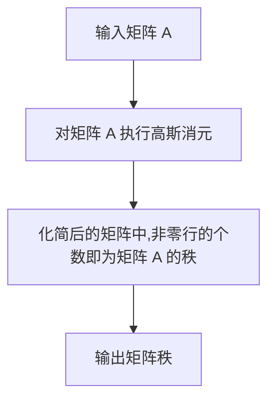
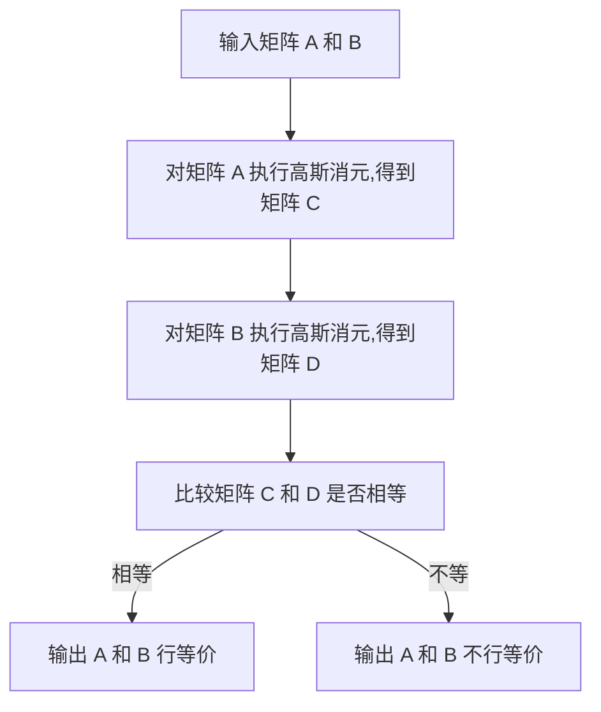

# 线性代数导引：整数有序环

## 1. 背景介绍

### 1.1 问题的由来

在数学和计算机科学领域中,线性代数是一个基础且广泛应用的分支。它为研究矩阵、向量空间和线性变换等概念奠定了理论基础。然而,传统的线性代数理论主要建立在实数域或复数域之上,而对于整数有序环(ordered integral domain)这一特殊的代数结构,相关研究则相对匮乏。

整数有序环是指具有加法、乘法运算且满足可交换、结合、存在单位元等代数运算律的有序集合。与实数域不同,整数有序环中的元素是有序的,且不存在除法逆元。这种特殊的代数结构在密码学、计算机代数等领域有着重要应用,因此对其进行深入研究就显得尤为必要。

### 1.2 研究现状

目前,关于整数有序环的研究主要集中在以下几个方面:

1. 整数有序环的代数性质研究,包括环的表示理论、理想理论等。
2. 整数有序环上的线性方程组求解问题,例如整数有序环上的高斯消元法。
3. 整数有序环上的矩阵理论,如矩阵的秩、逆等概念在整数有序环上的推广。
4. 整数有序环在密码学中的应用,如在椭圆曲线密码、格密码等中的作用。

然而,现有研究成果大多局限于特定领域,缺乏系统性的整体框架。同时,许多经典线性代数概念和算法在整数有序环上的推广也有待进一步探索。

### 1.3 研究意义

对整数有序环的线性代数理论进行系统研究,不仅可以丰富线性代数的理论体系,也有助于拓展其在密码学、计算机代数等领域的应用前景。具体来说,该研究具有以下重要意义:

1. 建立整数有序环线性代数的理论框架,完善线性代数的知识体系。
2. 推广经典线性代数概念和算法,拓展其在整数有序环上的应用范围。
3. 为密码学、计算机代数等领域提供理论支持,促进相关领域的发展。
4. 探索线性代数在新兴领域(如后量子密码学)中的潜在应用。

### 1.4 本文结构

本文将系统地介绍整数有序环线性代数的核心概念、算法原理和应用场景。全文共分为九个部分:

1. 背景介绍
2. 核心概念与联系
3. 核心算法原理与具体操作步骤
4. 数学模型和公式详细讲解与举例说明
5. 项目实践:代码实例和详细解释说明
6. 实际应用场景
7. 工具和资源推荐
8. 总结:未来发展趋势与挑战
9. 附录:常见问题与解答

## 2. 核心概念与联系

在探讨整数有序环线性代数之前,我们需要先了解以下几个核心概念:

1. **整数有序环(Ordered Integral Domain)**: 一个代数结构 $(R, +, *, \leq)$,其中 $R$ 是一个非空集合,加法 $+$ 和乘法 $*$ 在 $R$ 上定义,且满足交换律、结合律和存在单位元等代数运算律。同时,在 $R$ 上还定义了一个严格线性序 $\leq$,使得对于任意 $a, b, c \in R$,如果 $a \leq b$ 且 $b \leq c$,那么 $a \leq c$。常见的整数有序环包括整数集 $\mathbb{Z}$、多项式环 $\mathbb{Z}[x]$ 等。

2. **向量(Vector)**: 在整数有序环 $R$ 上的向量是一个有序 $n$ 元组 $(a_1, a_2, \ldots, a_n)$,其中 $a_i \in R$。向量的加法和数乘运算分别定义为:
   $$
   (a_1, \ldots, a_n) + (b_1, \ldots, b_n) = (a_1 + b_1, \ldots, a_n + b_n)
   $$
   $$
   r \cdot (a_1, \ldots, a_n) = (r a_1, \ldots, r a_n), \quad r \in R
   $$

3. **矩阵(Matrix)**: 在整数有序环 $R$ 上的矩阵是一个 $m \times n$ 的矩阵,其元素属于 $R$。矩阵的加法和数乘运算与经典线性代数中的定义相同。

4. **线性变换(Linear Transformation)**: 设 $V$、$W$ 分别为 $R$ 上的向量空间,线性变换 $T: V \rightarrow W$ 是一个函数,满足对任意向量 $u, v \in V$ 和任意环元素 $r \in R$,有:
   $$
   T(u + v) = T(u) + T(v), \quad T(r \cdot u) = r \cdot T(u)
   $$

5. **秩(Rank)**: 一个 $m \times n$ 矩阵 $A$ 的秩是矩阵 $A$ 的行向量(或列向量)在 $R$ 上生成的向量空间的维数。

6. **行等价(Row Equivalence)**: 两个矩阵 $A$、$B$ 在 $R$ 上行等价,是指存在可逆矩阵 $P$、$Q$,使得 $B = PAQ$。

这些概念相互关联、相辅相成,共同构建了整数有序环线性代数的理论框架。接下来,我们将详细介绍其中的核心算法原理和具体操作步骤。

## 3. 核心算法原理与具体操作步骤

### 3.1 算法原理概述

在整数有序环线性代数中,有几个核心算法值得重点关注:

1. **高斯消元法(Gaussian Elimination)**
2. **矩阵秩计算算法**
3. **矩阵行等价变换算法**
4. **线性方程组求解算法**

这些算法的原理都源于经典线性代数中的对应算法,但在推广到整数有序环时需要作出适当修改和调整。

高斯消元法是求解线性方程组的经典算法,其在整数有序环上的推广需要考虑环元素的有序性和无除法逆元的特点。矩阵秩计算算法和矩阵行等价变换算法则是基于高斯消元法的思想,用于研究矩阵的基本性质。线性方程组求解算法则综合运用了上述几种算法,以求解整数有序环上的线性方程组。

### 3.2 算法步骤详解

#### 3.2.1 高斯消元法

在整数有序环 $R$ 上,高斯消元法用于求解线性方程组 $Ax = b$,其中 $A$ 是 $m \times n$ 阶矩阵,$ b$ 是 $m$ 维向量,$ x$ 是未知 $n$ 维向量。算法步骤如下:

1. 将增广矩阵 $[A \; b]$ 化为行最简形式,即对每一行执行如下操作:
   - 找到当前行中第一个非零元素,将其所在列的其他元素通过行变换消去。
   - 如果当前行为全零行,则跳过。
2. 从最后一行开始,对于每个主元行(主元为该行第一个非零元素),用行变换将其他行中相应的元素消去。
3. 化简后的增广矩阵中,矩阵 $A$ 的行对应于线性方程组的方程,而矩阵 $b$ 对应于常数项。如果存在无解的方程,则整个方程组无解;否则,可以从最后一个未知量开始,通过替代的方式求解每个未知量。

需要注意的是,在整数有序环上进行行变换时,我们只能使用"行互换"和"将某行乘以环元素后加到另一行"这两种行变换。

#### 3.2.2 矩阵秩计算算法

计算矩阵秩的算法步骤如下:



#### 3.2.3 矩阵行等价变换算法

判断两个矩阵 $A$、$B$ 在整数有序环 $R$ 上是否行等价的算法步骤如下:



#### 3.2.4 线性方程组求解算法

求解整数有序环 $R$ 上的线性方程组 $Ax = b$ 的算法步骤如下:

```mermaid
graph TD
    A[输入增广矩阵 [A b]] --> B[对增广矩阵执行高斯消元]
    B --> C[判断是否存在无解的方程]
    C -->|存在无解方程| D[输出方程组无解]
    C -->|不存在无解方程| E[从最后一个未知量开始,通过替代求解每个未知量]
    E --> F[输出解向量 x]
```

### 3.3 算法优缺点

整数有序环线性代数中的核心算法具有以下优缺点:

**优点**:

1. 算法思路清晰,源于经典线性代数,易于理解和实现。
2. 能够很好地解决整数有序环上的线性方程组、矩阵等问题。
3. 在密码学等领域具有重要应用价值。

**缺点**:

1. 由于整数有序环中没有除法逆元,算法在运算过程中可能会遇到"被零化简"的问题,需要特殊处理。
2. 算法的时间复杂度和空间复杂度较高,对于大规模的线性方程组或矩阵,计算效率会受到影响。
3. 算法的数值稳定性有待进一步改进,在某些情况下可能会出现数值溢出或失真的问题。

### 3.4 算法应用领域

整数有序环线性代数中的核心算法在以下领域有着广泛的应用:

1. **密码学**:在基于格的密码系统(如NTRU、GGH等)、基于码的密码系统(如McEliece密码系统)以及基于多变量方程的密码系统中,需要在整数有序环上求解线性方程组和研究矩阵的性质。

2. **计算机代数**:在符号计算、代数几何计算等领域,需要在多项式环等整数有序环上进行线性运算。

3. **数论**:整数有序环线性代数为研究整数环、代数数论等领域提供了有力的理论工具。

4. **编码理论**:在线性码的编码和解码过程中,需要在有限域(也是一种整数有序环)上进行线性运算。

5. **组合数学**:在研究有理生成函数、矩阵有理生成函数等组合数学问题时,需要在整数有序环上进行矩阵运算。

总的来说,整数有序环线性代数理论为上述诸多领域提供了重要的理论基础和计算工具。

## 4. 数学模型和公式详细讲解与举例说明

### 4.1 数学模型构建

在整数有序环线性代数中,我们通常将线性方程组、矩阵等问题建模为向量空间和线性变换的数学模型。

设 $R$ 为一个整数有序环,向量空间 $V$ 是 $R$ 上所有 $n$ 维向量的集合,即:

$$
V = R^n = \{(a_1, a_2, \ldots, a_n) \; | \; a_i \in R, 1 \leq i \leq n\}
$$

在 $V$ 上定义加法和数乘运算如下:

$$
\begin{aligned}
(a_1, \ldots, a_n) + (b_1, \ldots, b_n) &= (a_1 + b_1, \ldots, a_n + b_n) \\
r \cdot (a_1, \ldots, a_n) &= (r a_1,