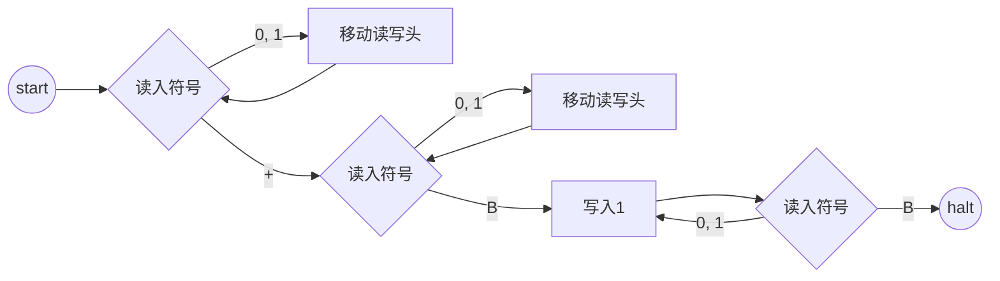

# 计算：第三部分 计算理论的形成 第 8 章 计算理论的诞生：图灵的可计算数 图灵的命运

关键词：图灵机、停机问题、可计算性、人工智能、密码学

## 1. 背景介绍
### 1.1 问题的由来
在计算机科学的发展历程中，英国数学家艾伦·图灵(Alan Turing)的贡献不可或缺。他提出的图灵机模型和可计算理论奠定了现代计算机科学的理论基础，被誉为"计算机科学之父"和"人工智能之父"。本文将探讨图灵的一生以及他在计算理论方面的开创性工作。

### 1.2 研究现状
目前，图灵的工作已经成为计算机科学领域的经典理论，被广泛应用于算法设计、复杂性分析、可计算性研究等方面。近年来，随着人工智能的快速发展，图灵早期对机器智能的思考也引发了新一轮的讨论和研究热潮。

### 1.3 研究意义
深入理解图灵的工作对于计算机科学的发展具有重要意义。一方面，图灵机模型为算法复杂性分析提供了理论基础；另一方面，图灵对人工智能的思考也启发了后来的研究者，推动了人工智能的发展。此外，图灵在二战中的密码破译工作也彰显了计算理论在实际应用中的重要价值。

### 1.4 本文结构
本文将分为以下几个部分：首先介绍图灵机和可计算性理论的核心概念；然后重点讲解图灵机的工作原理和停机问题；接着介绍图灵机的数学模型和相关公式；之后通过代码实例演示图灵机的实现；最后总结图灵工作的意义以及对未来人工智能发展的启示。

## 2. 核心概念与联系
- 图灵机(Turing Machine)：一种抽象计算模型，由纸带、读写头、状态寄存器和程序组成。
- 可计算性(Computability)：对于给定的问题，是否存在一个算法能够解决该问题。
- 停机问题(Halting Problem)：判断一个程序是否会在有限时间内结束运行。图灵证明该问题是不可判定的。
- 人工智能(Artificial Intelligence)：图灵提出的"图灵测试"成为衡量机器智能的经典标准。
- 密码学(Cryptography)：图灵在二战中领导了破解德军Enigma密码的工作，为盟军取得胜利做出了重要贡献。

## 3. 核心算法原理 & 具体操作步骤
### 3.1 算法原理概述
图灵机由一条无限长的纸带、一个读写头、一个状态寄存器和一套控制程序组成。纸带被划分为一个个方格，每个方格可以为空白或印有一个符号。读写头可以在纸带上左右移动，读取和改写当前方格中的符号。状态寄存器存储了图灵机的当前状态。控制程序则规定了图灵机在不同状态下的行为。

### 3.2 算法步骤详解
1. 开始时，纸带上输入待处理的字符串，读写头指向纸带最左端，状态寄存器初始化为起始状态。
2. 读写头读取当前方格中的符号，并根据当前状态和符号查询控制程序，得到下一步操作。
3. 根据控制程序的指令，修改当前方格中的符号、改变状态寄存器的值以及移动读写头。
4. 重复步骤2-3，直到达到停机状态或无限循环。
5. 如果达到停机状态，纸带上的内容即为输出结果。

### 3.3 算法优缺点
图灵机的优点在于其简洁性和通用性，可以模拟任何可计算问题的求解过程。但图灵机作为理论模型，实际运行效率较低，且停机问题无法判定，因此无法用于解决所有问题。

### 3.4 算法应用领域
图灵机广泛应用于理论计算机科学领域，用于分析算法复杂性、研究可计算性问题等。同时，图灵机也是现代计算机的理论基础，启发了冯·诺依曼体系结构的设计思想。

## 4. 数学模型和公式 & 详细讲解 & 举例说明
### 4.1 数学模型构建
形式化地，图灵机可以表示为一个七元组：
$$M = (Q, \Sigma, \Gamma, \delta, q_0, B, F)$$
其中：
- $Q$：有限状态集合
- $\Sigma$：输入符号集合，$\Sigma \subseteq \Gamma \backslash \{B\}$ 
- $\Gamma$：纸带符号集合
- $\delta$：转移函数，$\delta: Q \times \Gamma \rightarrow Q \times \Gamma \times \{L, R\}$
- $q_0$：初始状态，$q_0 \in Q$
- $B$：空白符号，$B \in \Gamma \backslash \Sigma$
- $F$：停机状态集合，$F \subseteq Q$

### 4.2 公式推导过程
对于转移函数$\delta(q, X) = (p, Y, D)$，其含义为：当前状态为$q$，读写头读到符号$X$时，将状态变为$p$，当前方格改写为$Y$，读写头向方向$D$移动一格。图灵机的计算过程实际上是转移函数的递归应用：
$$\begin{aligned}
\delta^0(q, X) &= (q, X) \\
\delta^{n+1}(q, X) &= \delta(\delta^n(q, X))
\end{aligned}$$

### 4.3 案例分析与讲解
考虑一个二进制加法器的图灵机实现。该图灵机的输入是两个用二进制表示的数，输出为它们的和。图灵机的纸带初始情况如下：
```
... 0 0 1 0 1 1 + 1 1 0 1 0 0 ...
```
其中，`+`用于分隔两个加数。图灵机的状态转移图如下：



图中，双圆圈表示停机状态，方框表示普通状态，菱形表示判断条件。

### 4.4 常见问题解答
- Q: 图灵机能否模拟任意算法？
  A: 图灵机是通用计算模型，根据邱奇-图灵论题，图灵机与其他计算模型等价，因此理论上能够模拟任何算法。

- Q: 图灵机的时间复杂度如何分析？
  A: 图灵机的时间复杂度通常用转移函数的执行次数来衡量。对于给定的输入，图灵机在达到停机状态前执行的步骤数即为其时间复杂度。

## 5. 项目实践：代码实例和详细解释说明
### 5.1 开发环境搭建
本节将使用Python语言实现一个简单的图灵机模拟器。首先需要安装Python解释器(版本>=3.6)，然后创建一个新的Python源文件。

### 5.2 源代码详细实现
下面是图灵机模拟器的Python实现代码：

```python
class TuringMachine:
    def __init__(self, states, symbols, blank, transitions, start, accept, reject):
        self.states = states
        self.symbols = symbols
        self.blank = blank
        self.transitions = transitions
        self.start = start
        self.accept = accept
        self.reject = reject
        
    def run(self, tape):
        state = self.start
        head = 0
        while state not in [self.accept, self.reject]:
            symbol = tape[head]
            state, symbol, direction = self.transitions[(state, symbol)]
            tape[head] = symbol
            head += direction
        return state == self.accept

# 测试
states = {0, 1, 2, 3}
symbols = {'0', '1', ' '}
blank = ' '
transitions = {
    (0, '0'): (1, '0', 1),
    (0, '1'): (0, '1', 1),
    (0, ' '): (3, ' ', 0),
    (1, '0'): (1, '0', 1),
    (1, '1'): (2, '1', -1),  
    (1, ' '): (3, ' ', 0),
    (2, '0'): (2, '1', -1),
    (2, '1'): (0, '0', 1),
    (2, ' '): (3, ' ', 0)
}
start = 0
accept = 3
reject = -1

tm = TuringMachine(states, symbols, blank, transitions, start, accept, reject)

tape1 = list('010011 ')
tape2 = list('1111111 ')

print(tm.run(tape1))  # True
print(tm.run(tape2))  # False
```

### 5.3 代码解读与分析
- `TuringMachine`类封装了图灵机的定义，包括状态集合、符号集合、空白符号、转移函数、起始状态、接受状态和拒绝状态。
- `run`方法接受一个字符列表作为初始纸带，模拟图灵机的运行过程。如果最终到达接受状态，则返回`True`，否则返回`False`。
- 在测试代码中，我们定义了一个判断字符串是否包含子串`'010'`的图灵机，并测试了两个不同的输入。

### 5.4 运行结果展示
运行上述代码，输出结果为：
```
True
False
```
表明第一个输入字符串包含子串`'010'`，而第二个输入不包含。

## 6. 实际应用场景
图灵机作为一种理论计算模型，在现实中并没有直接的应用。但图灵机的思想对计算机科学的发展产生了深远影响，体现在以下几个方面：
- 算法复杂性分析：图灵机为分析算法的时间和空间复杂度提供了理论基础。
- 可计算性理论：图灵机被用于研究哪些问题是可计算的，哪些问题是不可计算的。
- 现代计算机设计：图灵机的存储程序概念启发了冯·诺依曼体系结构，成为现代计算机的设计蓝本。
- 人工智能：图灵提出的"图灵测试"为判断机器是否具有智能提供了一个标准，推动了人工智能的发展。

### 6.4 未来应用展望
随着计算机科学的不断发展，图灵机的思想有望在以下领域得到进一步应用：
- 量子计算：量子图灵机被提出用于研究量子计算的理论模型。
- DNA计算：DNA分子被用于构建生物图灵机，为分子计算提供了新的思路。
- 神经网络：图灵机与神经网络结合，探索更接近人脑的计算模型。

## 7. 工具和资源推荐
### 7.1 学习资源推荐
- 《计算的本质：深入剖析程序和计算机》(The Annotated Turing)：图灵的经典论文与解读
- Coursera课程《计算理论导论》(Introduction to the Theory of Computation)：系统介绍可计算理论
- 《计算理论导引》(Introduction to the Theory of Computation)：可计算理论的经典教材

### 7.2 开发工具推荐
- Python：简单易学的编程语言，适合编写图灵机模拟器
- JFLAP：图灵机、有限状态机等的图形化设计与模拟工具
- Turing Machine Simulator：在线图灵机模拟器

### 7.3 相关论文推荐
- Turing, A. M. (1937). On computable numbers, with an application to the Entscheidungsproblem. Proceedings of the London mathematical society, 2(1), 230-265.
- Turing, A. M. (1950). Computing machinery and intelligence. Mind, 59(236), 433-460.
- Cook, S. A. (1971). The complexity of theorem-proving procedures. In Proceedings of the third annual ACM symposium on Theory of computing (pp. 151-158).

### 7.4 其他资源推荐
- 图灵数字档案(The Turing Digital Archive)：收录了图灵的论文、信件、照片等大量资料
- 图灵纪念网站(The Alan Turing Website)：介绍图灵生平和主要成就
- 电影《模仿游戏》(The Imitation Game)：改编自图灵的生平事迹

## 8. 总结：未来发展趋