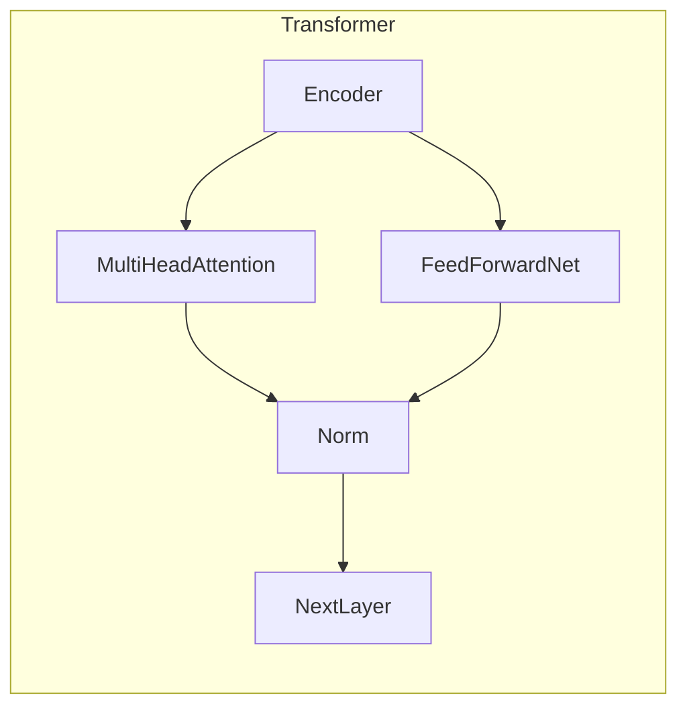
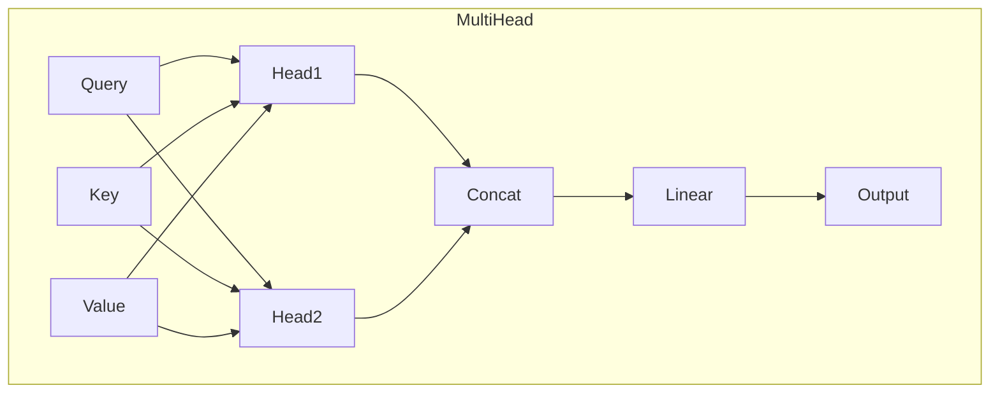

# Transformer大模型实战 探讨BERT库

## 1. 背景介绍

### 1.1 问题的由来

在自然语言处理(NLP)领域中,transformer模型凭借其出色的性能,已经成为了主流的模型架构。作为transformer模型的一种重要延伸,BERT(Bidirectional Encoder Representations from Transformers)模型在各种NLP任务中表现出了卓越的效果。

传统的语言模型通常是单向的,即在生成句子时只考虑了前面的上下文信息。而BERT则采用了双向transformer编码器,可以同时获取句子中每个单词的前后文信息,从而更好地理解语义。这种双向编码的方式大大提高了语义表示的质量,使BERT在文本分类、问答系统、序列标注等任务中都取得了突破性的进展。

### 1.2 研究现状

自2018年发布以来,BERT模型及其变体在学术界和工业界都引起了极大的关注。研究人员不断在探索BERT模型的优化方向,如减小模型大小、提高训练效率、改进注意力机制等,以期获得更好的性能表现。

与此同时,一些知名的科技公司如Google、微软等也在积极开发和应用BERT模型,将其应用于各种实际场景,如智能问答、机器翻译、文本摘要等,取得了卓越的效果。

### 1.3 研究意义 

BERT模型的出现极大地推动了NLP技术的发展,开启了transformer时代。深入研究BERT模型的原理和实践应用,对于提高自然语言理解能力、促进人工智能技术发展都具有重要意义。

本文将全面介绍BERT模型的核心概念、算法原理、数学模型以及实际应用,旨在为读者提供一个系统的学习路径,帮助读者掌握BERT模型的本质,并能够将其灵活应用于实际项目中。

### 1.4 本文结构

本文共分为9个部分:

1. 背景介绍
2. 核心概念与联系
3. 核心算法原理与具体操作步骤
4. 数学模型和公式详细讲解与举例说明  
5. 项目实践:代码实例和详细解释说明
6. 实际应用场景
7. 工具和资源推荐
8. 总结:未来发展趋势与挑战
9. 附录:常见问题与解答

## 2. 核心概念与联系

BERT模型的核心思想是基于transformer的双向编码器,能够同时获取序列中每个单词的上下文信息。它主要由以下几个核心概念组成:

### 2.1 Transformer

Transformer是一种全新的基于注意力机制的序列到序列(Seq2Seq)模型,不同于传统的RNN或CNN模型,它完全基于注意力机制来捕获输入和输出之间的全局依赖关系。Transformer模型的编码器和解码器都由多个相同的层组成,每层包含多头自注意力(Multi-Head Attention)和前馈神经网络(Feed-Forward Neural Network)。



### 2.2 注意力机制(Attention Mechanism)

注意力机制是Transformer模型的核心,它能够自动捕获输入序列中不同位置的单词之间的依赖关系,并对它们进行加权求和,生成对应位置的表示向量。这种机制使得模型不再受限于序列顺序,能够有效地处理长距离依赖问题。

```mermaid
graph TB
    subgraph Attention
        Q[Query] --> Attention
        K[Key] --> Attention
        V[Value] --> Attention
        Attention --> Output
    end
```

### 2.3 多头注意力(Multi-Head Attention)

多头注意力是对多个注意力的结果进行concatenate,再经过一个线性变换,从而捕获不同子空间的信息,增强了模型的表达能力。



### 2.4 掩码机制(Mask)

BERT采用了两种掩码机制:Padding Mask和Sequence Mask。前者用于忽略输入序列中的Padding部分,后者则用于区分编码器和解码器的输入,从而实现双向编码。

### 2.5 位置编码(Positional Encoding)

由于Transformer模型没有捕获序列顺序的能力,因此引入了位置编码,将单词在序列中的位置信息编码到它们的向量表示中。

### 2.6 BERT输入表示

BERT的输入由三部分组成:Token Embeddings、Segment Embeddings和Position Embeddings。它们分别对应输入单词、句子以及单词位置信息。

### 2.7 预训练任务

BERT采用了两个无监督预训练任务:Masked Language Model(MLM)和Next Sentence Prediction(NSP)。前者用于捕获深层次的语义信息,后者则用于学习句子之间的关系表示。

### 2.8 微调(Fine-tuning)

BERT模型先在大规模无标注语料上进行预训练,获得通用的语义表示能力。然后在特定的有标注数据集上进行微调,将预训练的模型迁移到具体的下游任务。

## 3. 核心算法原理与具体操作步骤  

### 3.1 算法原理概述

BERT算法的核心思想是利用Transformer的双向编码器,对输入序列进行深度双向编码,从而获取每个单词的上下文语义表示。具体来说,算法分为以下几个主要步骤:

1. **输入表示**:将输入文本序列映射为单词嵌入向量、分段嵌入向量和位置嵌入向量的综合表示。

2. **注意力计算**:利用多头注意力机制,捕获输入序列中单词之间的长距离依赖关系。

3. **掩码语言模型**:对输入序列中的部分单词进行遮蔽,利用上下文预测被遮蔽单词,从而学习深层次的语义表示。

4. **句子关系表示**:通过句子关系预测任务,捕获句子之间的语义关联。

5. **模型微调**:在大规模语料上预训练BERT模型后,可将其应用于具体的下游NLP任务,并在有标注数据上进行微调,进一步提升性能。

### 3.2 算法步骤详解

1. **输入表示**

   BERT的输入由三部分组成:Token Embeddings、Segment Embeddings和Position Embeddings。

   - Token Embeddings: 将每个单词映射为一个固定维度的向量表示。
   - Segment Embeddings: 区分输入序列属于不同的句子,通常用两个向量[0,1]和[1,0]表示。
   - Position Embeddings: 编码单词在序列中的位置信息。

   三部分向量相加,即可得到BERT的最终输入表示:

   $$\text{Input Representation} = \text{Token Embeddings} + \text{Segment Embeddings} + \text{Position Embeddings}$$

2. **多头注意力计算**

   BERT采用了Transformer中的多头注意力机制,对输入序列中的每个单词,根据其与其他单词的关联程度,计算注意力权重,并对所有单词的表示进行加权求和,得到该单词的上下文语义表示。

   具体来说,对于序列中的第i个单词$x_i$,其注意力表示$\mathrm{Attention}(x_i)$计算如下:

   $$\begin{aligned}
   \mathrm{Attention}(x_i) &= \mathrm{softmax}\left(\frac{(\mathrm{W_Q}x_i)(\mathrm{W_K}X)^\top}{\sqrt{d_k}}\right)(\mathrm{W_V}X) \\
   &= \sum_{j=1}^n \alpha_{ij}(\mathrm{W_V}x_j)
   \end{aligned}$$

   其中,$\mathrm{W_Q}$、$\mathrm{W_K}$和$\mathrm{W_V}$分别为查询(Query)、键(Key)和值(Value)的线性变换矩阵;$d_k$为缩放因子;$\alpha_{ij}$为$x_i$对$x_j$的注意力权重。

   多头注意力则是将多个注意力头的结果进行拼接:

   $$\mathrm{MultiHead}(X) = \mathrm{Concat}(\mathrm{head_1}, \ldots, \mathrm{head_h})\mathrm{W^O}$$

   其中,$\mathrm{head_i} = \mathrm{Attention}(X\mathrm{W_i^Q}, X\mathrm{W_i^K}, X\mathrm{W_i^V})$。

3. **掩码语言模型(Masked Language Model)**

   BERT采用了掩码语言模型作为其中一个预训练任务。具体来说,对输入序列中的一部分单词(如15%)进行遮蔽,然后利用其余单词的上下文信息,来预测被遮蔽单词的语义表示。

   例如,对于输入序列"The man went to [MASK] store"中被遮蔽的单词"[MASK]",BERT需要根据上下文"The man went to"和"store"来推测出"[MASK]"最有可能是"the"。

   这种任务迫使BERT模型充分利用上下文信息,学习到单词的深层次语义表示。

4. **句子关系表示(Next Sentence Prediction)**  

   BERT的另一个预训练任务是句子关系预测。具体来说,对于一对输入序列A和B,BERT需要判断B是否为A的下一句。

   例如,对于"The man went to the store. [SEP] He bought a bag of apples.",BERT需要预测[SEP]之后的句子是否为前一句的下文。

   这一任务迫使BERT捕获句子之间的语义关联,从而学习到更好的句子级别的表示。

5. **模型微调**

   BERT模型先在大规模无标注语料(如Wikipedia)上进行上述两个预训练任务,获得通用的语义表示能力。然后,针对具体的下游NLP任务(如文本分类、序列标注等),将预训练的BERT模型进行微调(Fine-tuning),使其适应该任务的特定需求。

   微调过程中,BERT模型的大部分参数保持不变,只对最后几层的参数进行调整,从而在保留通用语义表示能力的同时,也获得了针对特定任务的专门表示。

### 3.3 算法优缺点

**优点:**

1. **双向编码**:BERT能够同时获取单词的前后文信息,从而学习到更好的语义表示。
2. **长距离依赖捕获**:基于注意力机制,BERT可以有效捕获长距离依赖关系,解决了RNN模型梯度消失的问题。
3. **通用语义表示**:通过大规模无监督预训练,BERT获得了强大的语义表示能力,可广泛应用于各种NLP任务。
4. **高效微调**:只需在少量有标注数据上进行微调,即可将BERT应用于具体的下游任务。

**缺点:**

1. **计算资源消耗大**:BERT模型通常包含数亿参数,对硬件资源要求较高。
2. **输入长度限制**:由于注意力机制的计算复杂度较高,BERT对输入序列长度有一定限制。
3. **缺乏序列生成能力**:作为编码器模型,BERT无法直接用于序列生成任务,如机器翻译等。
4. **缺乏长期依赖建模**:尽管注意力机制可捕获长距离依赖,但无法很好地建模长期的上下文依赖关系。

### 3.4 算法应用领域

由于BERT模型强大的语义表示能力,它已被广泛应用于各种自然语言处理任务,主要包括:

1. **文本分类**: 如新闻分类、情感分析等。
2. **序列标注**: 如命名实体识别、关系抽取等。
3. **问答系统**: 如阅读理解、开放域问答等。
4. **语言推理**: 如自然语言推理、语义相似度计算等。
5. **文本生成**: 结合生成模型,如文本摘要、机器翻译等。
6. **其他领域**: 如代码理解、蛋白质结构预测等。

## 4. 数学模型和公式详细讲解与举例说明

### 4.1 数学模型构