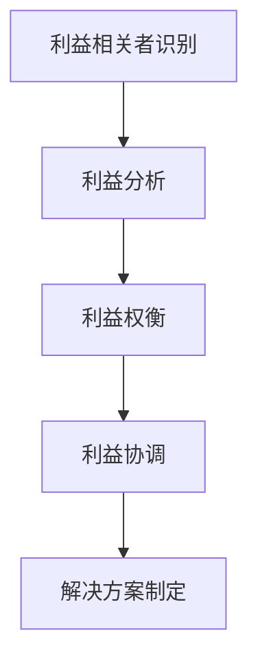
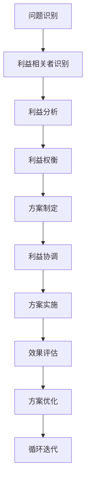

# 杜月笙：解决问题要从别人的利益出发

## 1. 背景介绍

### 1.1 问题的由来

在当今快节奏的商业世界中，解决问题的能力是一项关键技能。无论是在企业内部还是与客户打交道,总会遇到各种各样的挑战和问题需要解决。然而,传统的解决问题方式往往过于注重技术层面,忽视了人性化的因素,导致解决方案难以真正解决问题,甚至可能带来新的麻烦。

### 1.2 研究现状

目前,大多数解决问题的方法论都集中在分析问题根源、制定解决方案、实施和评估等技术层面。虽然这些步骤有其合理性,但往往忽视了人的因素,例如利益相关者的需求、情绪和动机等。结果往往是,即使技术上的解决方案很完美,但由于没有考虑人性化因素,最终仍然难以真正解决问题。

### 1.3 研究意义

杜月笙提出的"解决问题要从别人的利益出发"这一理念,为我们提供了一种全新的解决问题思路。它强调,在解决问题的过程中,我们必须充分考虑所有利益相关者的需求和利益,并将其作为出发点和核心。通过这种方式,我们不仅能够制定出技术上可行的解决方案,而且还能确保解决方案能够真正解决问题,获得所有利益相关者的认可和支持。

### 1.4 本文结构

本文将从以下几个方面深入探讨杜月笙的"解决问题要从别人的利益出发"理念:

1. 核心概念与联系
2. 核心算法原理与具体操作步骤
3. 数学模型和公式详细讲解与案例分析
4. 项目实践:代码实例和详细解释
5. 实际应用场景
6. 工具和资源推荐
7. 总结:未来发展趋势与挑战
8. 附录:常见问题与解答

## 2. 核心概念与联系

杜月笙的"解决问题要从别人的利益出发"理念,其核心概念包括:

1. **利益相关者识别**
2. **利益分析**
3. **利益权衡**
4. **利益协调**

这四个核心概念相互关联,构成了一个完整的解决问题框架。

1. **利益相关者识别**: 首先需要识别出所有与问题相关的利益相关者,包括直接相关者和间接相关者。只有全面识别出所有利益相关者,才能够真正解决问题。

2. **利益分析**: 对于每一个利益相关者,我们需要深入分析他们的需求、期望、担忧等,了解他们在该问题上的利益诉求。

3. **利益权衡**: 由于不同利益相关者的利益诉求可能存在冲突,因此需要对各方利益进行权衡,寻找平衡点。

4. **利益协调**: 在权衡各方利益的基础上,我们需要与所有利益相关者进行沟通协调,寻求大家都能接受的解决方案。

通过这四个核心概念的有机结合,我们可以制定出真正能够解决问题的方案,获得所有利益相关者的认可和支持。

## 3. 核心算法原理与具体操作步骤

### 3.1 算法原理概述

杜月笙"解决问题要从别人的利益出发"算法的核心原理,可以概括为以下几个方面:

1. **以人为本**: 传统的解决问题方法往往过于注重技术层面,忽视了人的因素。而杜月笙算法将人的需求和利益作为出发点和核心,真正体现了"以人为本"的理念。

2. **系统思维**: 解决问题不能只看问题本身,而是需要从整体系统的角度来看待问题。杜月笙算法强调要全面识别所有利益相关者,并对他们的利益进行系统分析和权衡。

3. **协作共赢**: 解决问题不是单方面的行为,而是需要所有利益相关者的参与和协作。杜月笙算法强调要与所有利益相关者进行沟通协调,寻求大家都能接受的解决方案,实现多方共赢。

4. **动态迭代**: 解决问题是一个动态的过程,需要不断地根据情况变化进行调整和优化。杜月笙算法也体现了这一点,它是一个循环迭代的过程,而不是一次性的行为。

### 3.2 算法步骤详解

杜月笙"解决问题要从别人的利益出发"算法的具体步骤如下:

1. **问题识别**: 首先需要清晰地识别和定义需要解决的问题。

2. **利益相关者识别**: 识别出所有与该问题相关的利益相关者,包括直接相关者和间接相关者。

3. **利益分析**: 对每一个利益相关者的需求、期望、担忧等进行深入分析,了解他们在该问题上的利益诉求。

4. **利益权衡**: 由于不同利益相关者的利益诉求可能存在冲突,因此需要对各方利益进行权衡,寻找平衡点。

5. **方案制定**: 在权衡各方利益的基础上,制定出初步的解决方案。

6. **利益协调**: 与所有利益相关者进行沟通协调,征求他们的意见和建议,并根据反馈对解决方案进行调整和优化。

7. **方案实施**: 在获得所有利益相关者的认可后,实施优化后的解决方案。

8. **效果评估**: 对解决方案的实施效果进行评估,了解是否真正解决了问题。

9. **方案优化**: 根据效果评估的结果,对解决方案进行进一步优化。

10. **循环迭代**: 解决问题是一个动态的过程,需要不断地根据情况变化进行调整和优化,重复上述步骤。

### 3.3 算法优缺点

杜月笙"解决问题要从别人的利益出发"算法的优点包括:

1. **以人为本**: 真正体现了"以人为本"的理念,将人的需求和利益作为出发点和核心。

2. **系统思维**: 从整体系统的角度来看待问题,全面考虑所有利益相关者的需求。

3. **协作共赢**: 强调与所有利益相关者进行沟通协调,寻求大家都能接受的解决方案,实现多方共赢。

4. **动态迭代**: 体现了解决问题是一个动态的过程,需要不断地根据情况变化进行调整和优化。

算法的缺点包括:

1. **时间成本较高**: 需要花费大量时间来识别利益相关者、分析利益、权衡利益、协调利益等,效率相对较低。

2. **协调难度较大**: 由于需要协调多方利益,可能会面临一些利益相关者难以达成共识的情况,协调难度较大。

3. **主观性较强**: 在利益分析和权衡过程中,存在一定的主观性,可能会受到个人经验和偏好的影响。

### 3.4 算法应用领域

杜月笙"解决问题要从别人的利益出发"算法适用于以下领域:

1. **企业管理**: 在企业内部,经常会遇到各种各样的问题需要解决,而且往往涉及多个部门和利益相关者。该算法可以帮助企业更好地协调内部利益,制定出大家都能接受的解决方案。

2. **项目管理**: 项目管理中经常会遇到各种问题和挑战,而且涉及多个利益相关方,如客户、供应商、合作伙伴等。该算法可以帮助项目经理更好地协调各方利益,确保项目顺利推进。

3. **政府决策**: 政府在制定政策和决策时,往往需要平衡不同利益群体的诉求。该算法可以帮助政府更好地分析和权衡各方利益,制定出能够获得广泛认可的政策和决策。

4. **社区事务**: 在社区中,经常会出现一些影响多个利益相关者的问题,如噪音污染、交通拥堵等。该算法可以帮助社区更好地协调各方利益,找到大家都能接受的解决方案。

5. **家庭关系**: 即使在家庭关系中,也经常会出现一些需要解决的问题,如教育子女、分配家务等。该算法可以帮助家庭成员更好地沟通和协调,达成一致意见。

总的来说,只要是涉及多个利益相关者的问题,都可以应用杜月笙"解决问题要从别人的利益出发"算法,以寻求一个大家都能接受的解决方案。

## 4. 数学模型和公式详细讲解与举例说明

在杜月笙"解决问题要从别人的利益出发"算法中,我们可以构建一个数学模型来量化和优化利益权衡过程。

### 4.1 数学模型构建

假设有 $n$ 个利益相关者,我们用 $S = \{s_1, s_2, \dots, s_n\}$ 表示利益相关者集合。每个利益相关者 $s_i$ 对问题解决方案 $x$ 的满意度可以用一个实值函数 $f_i(x)$ 来表示,其中 $f_i(x) \in [0, 1]$,值越大表示满意度越高。

我们的目标是找到一个解决方案 $x^*$,使得所有利益相关者的加权平均满意度最大化,即:

$$
\max_{x} \sum_{i=1}^{n} w_i f_i(x)
$$

其中 $w_i$ 是利益相关者 $s_i$ 的权重,表示其相对重要性。权重的设置可以根据具体情况而定,可以通过专家评估或其他方式确定。

在实际应用中,满意度函数 $f_i(x)$ 的形式可能会因问题而异,但通常可以用一些常见的函数形式来近似,如线性函数、指数函数、对数函数等。

### 4.2 公式推导过程

我们可以将上述优化问题转化为一个约束优化问题:

$$
\begin{aligned}
\max_{x} & \sum_{i=1}^{n} w_i f_i(x) \\
\text{s.t.} & g_j(x) \leq 0, \quad j = 1, 2, \dots, m \\
& h_k(x) = 0, \quad k = 1, 2, \dots, p
\end{aligned}
$$

其中 $g_j(x)$ 和 $h_k(x)$ 分别表示不等式约束条件和等式约束条件,用于描述解决方案 $x$ 需要满足的各种限制条件。

对于这个约束优化问题,我们可以使用各种经典的优化算法来求解,如梯度下降法、牛顿法、内点法等。具体选择哪种算法,需要根据问题的特点和求解效率进行权衡。

另外,在实际应用中,我们还需要考虑一些其他因素,如计算复杂度、数据可获得性等,可能需要对模型进行简化或近似。

### 4.3 案例分析与讲解

假设一家企业需要制定一项新的员工福利政策,涉及三个主要利益相关者:员工、管理层和股东。我们用 $x$ 表示福利政策方案,其中 $x \in [0, 1]$,值越大表示福利越好。

1. 员工的满意度函数可设为 $f_1(x) = x$,即福利越好,员工的满意度越高。

2. 管理层的满意度函数可设为 $f_2(x) = 1 - x$,因为福利越好,企业的成本就越高,管理层的满意度就越低。

3. 股东的满意度函数可设为 $f_3(x) = 1 - x^