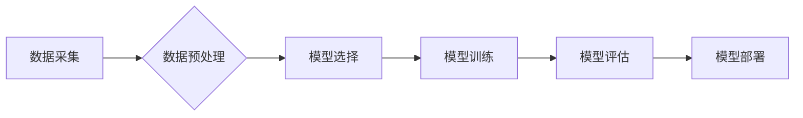

> 机器学习、算法原理、代码实现、深度学习、数据分析、Python、TensorFlow

## 1. 背景介绍

机器学习作为人工智能领域的核心技术之一，近年来发展迅速，并在各个领域取得了令人瞩目的成就。从语音识别、图像识别到自然语言处理，机器学习算法已经渗透到我们生活的方方面面。

随着数据量的爆炸式增长，机器学习的应用场景也越来越广泛。然而，对于初学者来说，深入理解机器学习的原理和实现方法仍然是一个挑战。

本文旨在通过对机器学习核心算法原理的讲解，以及代码实例的演示，帮助读者掌握机器学习的基本知识和实践技能。

## 2. 核心概念与联系

机器学习的核心思想是通过算法学习数据中的模式，从而能够对新的数据进行预测或分类。

**机器学习流程:**



**核心概念:**

* **监督学习:**  利用标记数据训练模型，预测输出值。
* **无监督学习:**  利用未标记数据发现数据中的隐藏模式。
* **强化学习:**  通过试错学习，在环境中获得最大奖励。

## 3. 核心算法原理 & 具体操作步骤

### 3.1  算法原理概述

**线性回归:**

线性回归是一种监督学习算法，用于预测连续值。其核心思想是找到一条直线，使得这条直线与数据点之间的距离最小。

### 3.2  算法步骤详解

1. **数据准备:** 收集并预处理数据，包括特征选择、数据清洗等。
2. **模型构建:**  定义线性回归模型，即找到一条直线方程。
3. **模型训练:**  使用训练数据，通过最小二乘法求解模型参数，使得模型拟合数据。
4. **模型评估:**  使用测试数据评估模型的性能，例如计算均方误差。
5. **模型部署:**  将训练好的模型部署到实际应用场景中，用于预测新的数据。

### 3.3  算法优缺点

**优点:**

* 算法简单易懂，易于实现。
* 计算效率高，适合处理大规模数据。

**缺点:**

* 只能处理线性关系的数据。
* 对异常值敏感。

### 3.4  算法应用领域

* 房价预测
* 股票价格预测
* 销售额预测

## 4. 数学模型和公式 & 详细讲解 & 举例说明

### 4.1  数学模型构建

线性回归模型的数学表达式为：

$$y = w_0 + w_1x_1 + w_2x_2 + ... + w_nx_n + \epsilon$$

其中：

* $y$ 是预测值
* $w_0, w_1, w_2, ..., w_n$ 是模型参数
* $x_1, x_2, ..., x_n$ 是输入特征
* $\epsilon$ 是误差项

### 4.2  公式推导过程

最小二乘法是求解线性回归模型参数的常用方法。其目标是找到一组参数，使得模型预测值与真实值之间的误差平方和最小。

### 4.3  案例分析与讲解

假设我们想要预测房屋价格，输入特征包括房屋面积、房间数量等。我们可以使用线性回归模型，通过训练数据学习房屋价格与特征之间的关系。

## 5. 项目实践：代码实例和详细解释说明

### 5.1  开发环境搭建

* Python 3.x
* NumPy
* Pandas
* Scikit-learn

### 5.2  源代码详细实现

```python
import numpy as np
from sklearn.linear_model import LinearRegression
from sklearn.model_selection import train_test_split

# 数据加载
data = np.loadtxt('house_data.csv', delimiter=',')
X = data[:, :-1]  # 特征
y = data[:, -1]  # 目标值

# 数据分割
X_train, X_test, y_train, y_test = train_test_split(X, y, test_size=0.2, random_state=42)

# 模型训练
model = LinearRegression()
model.fit(X_train, y_train)

# 模型预测
y_pred = model.predict(X_test)

# 模型评估
from sklearn.metrics import mean_squared_error
mse = mean_squared_error(y_test, y_pred)
print(f'均方误差: {mse}')
```

### 5.3  代码解读与分析

* 数据加载：使用 NumPy 加载数据，并分离特征和目标值。
* 数据分割：使用 train_test_split 函数将数据分割成训练集和测试集。
* 模型训练：使用 LinearRegression 类创建线性回归模型，并使用 fit 方法训练模型。
* 模型预测：使用 predict 方法对测试集进行预测。
* 模型评估：使用 mean_squared_error 函数计算均方误差，评估模型性能。

### 5.4  运行结果展示

运行代码后，会输出模型的均方误差值。

## 6. 实际应用场景

* **金融领域:** 股票价格预测、信用风险评估
* **医疗领域:** 疾病诊断、患者风险预测
* **电商领域:** 商品推荐、用户画像

### 6.4  未来应用展望

* **个性化推荐:** 基于用户行为和偏好，提供个性化推荐服务。
* **自动驾驶:** 利用机器学习算法，实现自动驾驶功能。
* **智能客服:** 利用自然语言处理技术，构建智能客服系统。

## 7. 工具和资源推荐

### 7.1  学习资源推荐

* **书籍:**
    * 《机器学习》 - 周志华
    * 《深入理解机器学习》 -  李航
* **在线课程:**
    * Coursera: Machine Learning by Andrew Ng
    * edX: Artificial Intelligence by Columbia University

### 7.2  开发工具推荐

* **Python:** 
    * Scikit-learn
    * TensorFlow
    * PyTorch

### 7.3  相关论文推荐

* **《机器学习》** - 周志华
* **《深入理解机器学习》** - 李航

## 8. 总结：未来发展趋势与挑战

### 8.1  研究成果总结

机器学习在各个领域取得了显著的成果，例如图像识别、语音识别、自然语言处理等。

### 8.2  未来发展趋势

* **深度学习:** 深度学习算法在图像识别、语音识别等领域取得了突破性进展，未来将继续发展和完善。
* **迁移学习:** 迁移学习可以利用已训练好的模型，快速适应新的任务，未来将成为机器学习的重要方向。
* **联邦学习:** 联邦学习可以保护数据隐私，未来将应用于医疗、金融等敏感领域。

### 8.3  面临的挑战

* **数据质量:** 机器学习算法对数据质量要求很高，数据不完整、不准确会影响模型性能。
* **算法解释性:** 许多机器学习算法是黑箱模型，难以解释模型的决策过程。
* **伦理问题:** 机器学习算法可能存在偏见和歧视，需要关注其伦理问题。

### 8.4  研究展望

未来机器学习研究将继续探索新的算法、新的应用场景，并解决当前面临的挑战。

## 9. 附录：常见问题与解答

* **什么是机器学习？**
* **机器学习有哪些类型？**
* **如何选择合适的机器学习算法？**
* **如何评估机器学习模型的性能？**

作者：禅与计算机程序设计艺术 / Zen and the Art of Computer Programming


<end_of_turn>