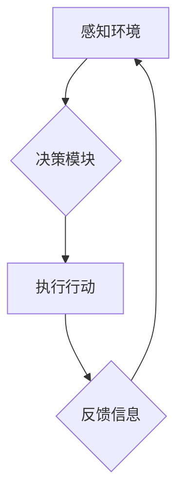

> AI, 人工智能, 智能体, Agent, 设计, 实现, 算法, 数学模型, 项目实践, 应用场景

## 1. 背景介绍

人工智能 (AI) 作为科技发展的重要方向，近年来取得了显著进展。其中，智能体 (Agent) 作为 AI 的核心概念之一，在模拟和增强人类智能方面发挥着重要作用。智能体是指能够感知环境、做出决策并采取行动的独立实体。它可以是软件程序、机器人或其他形式的系统。

随着 AI 技术的不断发展，智能体在各个领域得到了广泛应用，例如：

* **游戏领域:** 智能体可以作为游戏中的对手或伙伴，提供更智能和挑战性的游戏体验。
* **机器人领域:** 智能体可以赋予机器人自主决策和行动的能力，使其能够完成更复杂的任务。
* **金融领域:** 智能体可以用于风险管理、投资决策等方面，提高金融机构的效率和收益。
* **医疗领域:** 智能体可以辅助医生诊断疾病、制定治疗方案，提高医疗服务质量。

## 2. 核心概念与联系

**2.1 智能体 (Agent)**

智能体是一个能够感知环境、做出决策并采取行动的独立实体。它具有以下特征：

* **感知能力:** 智能体能够感知周围环境的信息，例如传感器数据、文本信息等。
* **决策能力:** 智能体能够根据感知到的信息做出决策，选择最优的行动方案。
* **行动能力:** 智能体能够执行决策，采取行动影响环境。
* **自主性:** 智能体能够独立完成任务，无需人工干预。

**2.2 智能体架构**

智能体的架构通常包括以下几个部分：

* **感知模块:** 用于接收和处理环境信息。
* **决策模块:** 用于根据环境信息做出决策。
* **行动模块:** 用于执行决策，采取行动。
* **知识库:** 用于存储和管理智能体的知识和经验。

**2.3 智能体类型**

根据智能体的功能和复杂程度，可以将其分为以下几种类型：

* **简单智能体:** 具有有限的感知和决策能力，通常用于简单的任务。
* **复杂智能体:** 具有更强大的感知和决策能力，能够完成更复杂的任务。
* **多智能体系统:** 由多个智能体组成，能够协同完成复杂任务。

**2.4 Mermaid 流程图**



## 3. 核心算法原理 & 具体操作步骤

**3.1 算法原理概述**

智能体的设计和实现离不开各种算法的支持。常见的智能体算法包括：

* **强化学习:** 通过奖励和惩罚机制，训练智能体在环境中学习最优策略。
* **搜索算法:** 用于在状态空间中搜索最优路径或解。
* **决策树算法:** 用于构建决策规则，指导智能体的决策。
* **神经网络算法:** 用于模拟人类大脑的学习和决策过程。

**3.2 算法步骤详解**

以强化学习为例，其基本步骤如下：

1. **环境建模:** 建立智能体所处的环境模型，包括状态空间、动作空间和奖励函数。
2. **策略初始化:** 初始化智能体的策略，即根据当前状态选择动作的规则。
3. **环境交互:** 智能体与环境进行交互，根据策略选择动作，并获得环境的反馈信息，包括下一个状态和奖励值。
4. **策略更新:** 根据反馈信息，更新智能体的策略，使其在未来能够获得更高的奖励。
5. **重复步骤3-4:** 重复上述步骤，直到智能体达到预设的目标或训练结束。

**3.3 算法优缺点**

* **优点:** 能够学习复杂的任务，适应动态环境。
* **缺点:** 训练时间长，需要大量的训练数据。

**3.4 算法应用领域**

强化学习广泛应用于游戏、机器人控制、推荐系统等领域。

## 4. 数学模型和公式 & 详细讲解 & 举例说明

**4.1 数学模型构建**

智能体的行为可以建模为马尔可夫决策过程 (MDP)。MDP 由以下几个要素组成：

* **状态空间 (S):** 智能体可能处于的所有状态。
* **动作空间 (A):** 智能体可以采取的所有动作。
* **转移概率 (P):** 从一个状态执行一个动作后转移到另一个状态的概率。
* **奖励函数 (R):** 智能体在某个状态执行某个动作后获得的奖励值。

**4.2 公式推导过程**

智能体的目标是找到一个最优策略，使得在长期的交互过程中获得最大的总奖励。最优策略可以用价值函数 (V) 来表示，价值函数表示从某个状态开始执行最优策略的期望总奖励。

价值函数的更新公式为：

$$V(s) = \max_a \sum_{s'} P(s'|s,a) [R(s,a,s') + \gamma V(s')]$$

其中：

* $s$ 表示当前状态。
* $a$ 表示当前动作。
* $s'$ 表示下一个状态。
* $R(s,a,s')$ 表示从状态 $s$ 执行动作 $a$ 后转移到状态 $s'$ 获得的奖励值。
* $\gamma$ 表示折扣因子，控制未来奖励的权重。

**4.3 案例分析与讲解**

例如，在一个简单的迷宫环境中，智能体的目标是找到通往出口的最短路径。我们可以将迷宫环境建模为 MDP，状态空间为迷宫中的每个格子，动作空间为上下左右四个方向。

通过使用价值函数更新公式，智能体可以学习到每个格子的价值，并根据价值函数选择最优的行动方向，最终找到通往出口的路径。

## 5. 项目实践：代码实例和详细解释说明

**5.1 开发环境搭建**

* Python 3.x
* TensorFlow 或 PyTorch 等深度学习框架

**5.2 源代码详细实现**

```python
import tensorflow as tf

# 定义神经网络模型
model = tf.keras.models.Sequential([
    tf.keras.layers.Dense(128, activation='relu', input_shape=(input_size,)),
    tf.keras.layers.Dense(64, activation='relu'),
    tf.keras.layers.Dense(num_actions)
])

# 定义损失函数和优化器
loss_fn = tf.keras.losses.CategoricalCrossentropy()
optimizer = tf.keras.optimizers.Adam()

# 训练模型
for epoch in range(num_epochs):
    for batch in dataset:
        with tf.GradientTape() as tape:
            predictions = model(batch['state'])
            loss = loss_fn(batch['action'], predictions)
        gradients = tape.gradient(loss, model.trainable_variables)
        optimizer.apply_gradients(zip(gradients, model.trainable_variables))

# 保存模型
model.save('agent_model.h5')
```

**5.3 代码解读与分析**

* 代码定义了一个简单的深度学习模型，用于预测智能体在给定状态下采取的动作。
* 模型使用 ReLU 激活函数，并采用 Adam 优化器进行训练。
* 训练过程使用批处理方式，并计算损失函数和梯度，更新模型参数。
* 训练完成后，模型会被保存为 h5 文件。

**5.4 运行结果展示**

训练好的模型可以用于控制智能体在环境中进行交互，并观察其行为。例如，在迷宫环境中，训练好的模型可以使智能体找到通往出口的路径。

## 6. 实际应用场景

**6.1 游戏领域**

智能体可以作为游戏中的对手或伙伴，提供更智能和挑战性的游戏体验。例如，在围棋游戏中，智能体可以根据围棋规则和历史数据学习最佳策略，与人类玩家进行比赛。

**6.2 机器人领域**

智能体可以赋予机器人自主决策和行动的能力，使其能够完成更复杂的任务。例如，在工业生产线中，智能体可以控制机器人进行搬运、装配等操作。

**6.3 金融领域**

智能体可以用于风险管理、投资决策等方面，提高金融机构的效率和收益。例如，智能体可以分析市场数据，预测股票价格走势，并自动进行交易。

**6.4 医疗领域**

智能体可以辅助医生诊断疾病、制定治疗方案，提高医疗服务质量。例如，智能体可以分析患者的病历和影像数据，辅助医生诊断癌症。

**6.5 未来应用展望**

随着 AI 技术的不断发展，智能体将在更多领域得到应用，例如：

* **自动驾驶:** 智能体可以控制自动驾驶汽车，实现无人驾驶。
* **个性化教育:** 智能体可以根据学生的学习情况，提供个性化的学习方案。
* **智能家居:** 智能体可以控制家居设备，实现智能家居。

## 7. 工具和资源推荐

**7.1 学习资源推荐**

* **书籍:**
    * 《Reinforcement Learning: An Introduction》 by Richard S. Sutton and Andrew G. Barto
    * 《Artificial Intelligence: A Modern Approach》 by Stuart Russell and Peter Norvig
* **在线课程:**
    * Coursera: Reinforcement Learning Specialization
    * Udacity: Artificial Intelligence Nanodegree

**7.2 开发工具推荐**

* **Python:** 广泛用于 AI 开发，拥有丰富的库和框架。
* **TensorFlow:** Google 开发的深度学习框架。
* **PyTorch:** Facebook 开发的深度学习框架。

**7.3 相关论文推荐**

* **Deep Reinforcement Learning with Double Q-learning**
* **Proximal Policy Optimization Algorithms**
* **Asynchronous Methods for Deep Reinforcement Learning**

## 8. 总结：未来发展趋势与挑战

**8.1 研究成果总结**

近年来，智能体研究取得了显著进展，特别是强化学习算法取得了突破性进展。智能体在游戏、机器人控制、推荐系统等领域得到了广泛应用。

**8.2 未来发展趋势**

* **更强大的算法:** 研究更强大的强化学习算法，使其能够学习更复杂的任务，并适应更复杂的动态环境。
* **更安全的智能体:** 研究更安全的智能体，使其能够可靠地执行任务，并避免潜在的风险。
* **更解释性的智能体:** 研究更解释性的智能体，使其能够解释自己的决策过程，提高人类对智能体的信任。

**8.3 面临的挑战**

* **数据获取和标注:** 强化学习算法需要大量的训练数据，获取和标注这些数据是一个挑战。
* **计算资源:** 训练大型智能体模型需要大量的计算资源，这对于资源有限的机构来说是一个挑战。
* **伦理问题:** 智能体的应用可能会带来一些伦理问题，例如算法偏见、隐私泄露等，需要认真考虑和解决。

**8.4 研究展望**

未来，智能体研究将继续朝着更强大、更安全、更解释性的方向发展。随着 AI 技术的不断进步，智能体将在更多领域发挥重要作用，改变我们的生活方式。

## 9. 附录：常见问题与解答

**9.1 如何选择合适的智能体算法？**

选择合适的智能体算法取决于具体的应用场景和任务需求。例如，对于简单任务，可以使用简单的算法，例如搜索算法或决策树算法。对于复杂任务，可以使用更强大的算法，例如强化学习算法。

**9.2 如何训练智能体模型？**

训练智能体模型需要准备训练数据，并使用合适的算法和优化器进行训练。训练过程通常需要多次迭代，直到模型性能达到预设的目标。

**9.3 如何评估智能体模型的性能？**

智能体模型的性能可以通过各种指标进行评估，例如准确率、召回率、F1 值等。具体的评估指标取决于具体的应用场景和任务需求。


作者：禅与计算机程序设计艺术 / Zen and the Art of Computer Programming 
<end_of_turn>