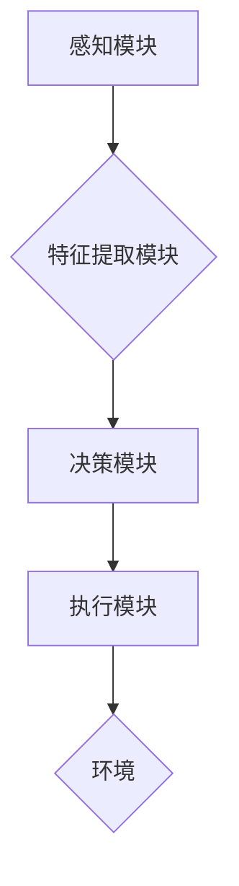

> 深度学习、智能代理、架构设计、可拓展性、算法原理、实践应用

## 1. 背景介绍

深度学习作为人工智能领域最前沿的技术之一，在图像识别、自然语言处理、语音识别等领域取得了突破性的进展。智能代理作为一种能够自主学习和决策的智能体，在自动化、机器人、游戏等领域具有广泛的应用前景。将深度学习与智能代理相结合，可以构建出更智能、更灵活、更适应复杂环境的智能系统。

然而，构建高性能、可扩展的深度学习智能代理仍然面临着诸多挑战：

* **算法复杂性:** 深度学习算法本身非常复杂，需要大量的计算资源和训练数据。
* **架构设计:** 如何设计一个能够有效地整合深度学习模型和智能代理决策机制的架构是一个关键问题。
* **可拓展性:**  随着任务复杂度的增加，智能代理需要不断扩展其知识和能力，而现有的架构往往难以满足这种需求。

## 2. 核心概念与联系

**2.1 深度学习**

深度学习是一种基于多层神经网络的机器学习方法。它能够从海量数据中自动学习特征，并进行复杂的模式识别和预测。

**2.2 智能代理**

智能代理是一种能够感知环境、做出决策并执行行动的软件实体。它通常具有以下特征：

* **自主性:** 智能代理能够自主地感知环境信息并做出决策。
* **目标导向性:** 智能代理具有明确的目标，并会根据目标进行决策和行动。
* **交互性:** 智能代理能够与环境和其他代理进行交互。

**2.3 深度学习智能代理**

深度学习智能代理将深度学习算法与智能代理相结合，利用深度学习模型学习环境特征和决策策略，从而实现更智能、更灵活的代理行为。

**2.4 架构设计**

深度学习智能代理的架构通常包括以下几个模块：

* **感知模块:** 用于获取环境信息，例如图像、文本、传感器数据等。
* **特征提取模块:** 利用深度学习模型从感知数据中提取特征。
* **决策模块:** 根据提取的特征和代理目标，做出决策。
* **执行模块:** 将决策转化为实际行动，例如控制机器人运动、生成文本等。

**2.5 Mermaid 流程图**



## 3. 核心算法原理 & 具体操作步骤

### 3.1 算法原理概述

深度学习智能代理的核心算法通常是基于强化学习的，例如深度Q网络（DQN）和策略梯度算法。

* **强化学习:** 强化学习是一种机器学习方法，其中代理通过与环境交互，学习一个策略，以最大化累积奖励。

* **深度Q网络 (DQN):** DQN 将深度神经网络应用于强化学习，学习一个Q函数，该函数估计在给定状态下采取特定动作的期望回报。

* **策略梯度算法:** 策略梯度算法直接优化代理的策略，通过梯度上升法更新策略参数，以最大化累积奖励。

### 3.2 算法步骤详解

**3.2.1 DQN 算法步骤:**

1. 初始化 Q 网络参数。
2. 在环境中进行采样，收集状态、动作、奖励和下一个状态的数据。
3. 使用经验回放机制，从存储的经验数据中随机抽取样本进行训练。
4. 计算目标 Q 值，并使用梯度下降法更新 Q 网络参数。
5. 重复步骤 2-4，直到 Q 网络收敛。

**3.2.2 策略梯度算法步骤:**

1. 初始化策略网络参数。
2. 在环境中进行采样，收集状态、动作、奖励和下一个状态的数据。
3. 计算策略梯度，并使用梯度上升法更新策略网络参数。
4. 重复步骤 2-3，直到策略网络收敛。

### 3.3 算法优缺点

**3.3.1 DQN 算法:**

* **优点:** 能够学习复杂的策略，并具有较好的稳定性。
* **缺点:** 训练过程相对复杂，需要大量的经验数据。

**3.3.2 策略梯度算法:**

* **优点:** 训练过程相对简单，能够直接优化策略。
* **缺点:** 训练过程可能不稳定，容易出现震荡。

### 3.4 算法应用领域

深度学习智能代理的算法在以下领域具有广泛的应用前景：

* **机器人控制:** 构建能够自主导航、避障、抓取物体的智能机器人。
* **游戏 AI:** 开发更智能、更具挑战性的游戏 AI。
* **自动驾驶:** 构建能够自主驾驶的自动驾驶汽车。
* **医疗诊断:** 利用深度学习模型辅助医生进行疾病诊断。

## 4. 数学模型和公式 & 详细讲解 & 举例说明

### 4.1 数学模型构建

**4.1.1 Q 函数:**

Q 函数是深度学习智能代理的核心数学模型，它估计在给定状态 s 和动作 a 下采取该动作的期望回报。

$$Q(s, a) = E[\sum_{t=0}^{\infty} \gamma^t r_{t+1}|s_t = s, a_t = a]$$

其中：

* $s$ 是状态。
* $a$ 是动作。
* $r_{t+1}$ 是在时间步 t+1 获得的奖励。
* $\gamma$ 是折扣因子，控制未来奖励的权重。

**4.1.2 策略网络:**

策略网络是一个深度神经网络，它将状态映射到动作概率分布。

$$p(a|s) = \sigma(W^T \phi(s) + b)$$

其中：

* $p(a|s)$ 是在状态 s 下采取动作 a 的概率。
* $\sigma$ 是 sigmoid 函数，将网络输出映射到 [0, 1] 的概率范围内。
* $W$ 和 $b$ 是策略网络的参数。
* $\phi(s)$ 是状态 s 的特征向量。

### 4.2 公式推导过程

**4.2.1 DQN 算法目标函数:**

DQN 算法的目标函数是最大化 Q 函数的期望值，可以使用以下公式表示：

$$J(\theta) = E_{s, a, r, s'} [ (r + \gamma \max_{a'} Q(s', a') - Q(s, a))^2 ]$$

其中：

* $\theta$ 是 Q 网络的参数。

**4.2.2 策略梯度算法目标函数:**

策略梯度算法的目标函数是最大化累积奖励，可以使用以下公式表示：

$$J(\theta) = E_{s, a, r, s'} [ \log p(a|s) (r + \gamma \max_{a'} Q(s', a')) ]$$

### 4.3 案例分析与讲解

**4.3.1 CartPole 环境:**

CartPole 环境是一个经典的强化学习环境，其中一个车在轨道上移动，需要通过控制车轮的角度来保持平衡。

在 CartPole 环境中，可以使用 DQN 算法训练一个智能代理，使其能够学习保持平衡的策略。

**4.3.2 AlphaGo:**

AlphaGo 是 DeepMind 公司开发的围棋 AI，它使用了深度学习和强化学习算法，在围棋比赛中战胜了世界冠军。

AlphaGo 的核心算法是基于策略梯度算法，它学习了一个策略网络，该网络能够预测在给定棋盘状态下采取哪个动作。

## 5. 项目实践：代码实例和详细解释说明

### 5.1 开发环境搭建

* **操作系统:** Ubuntu 18.04
* **Python 版本:** 3.7
* **深度学习框架:** TensorFlow 2.0
* **其他依赖:** numpy, matplotlib

### 5.2 源代码详细实现

```python
import tensorflow as tf

# 定义 Q 网络
class QNetwork(tf.keras.Model):
    def __init__(self, state_size, action_size):
        super(QNetwork, self).__init__()
        self.dense1 = tf.keras.layers.Dense(64, activation='relu')
        self.dense2 = tf.keras.layers.Dense(32, activation='relu')
        self.output = tf.keras.layers.Dense(action_size)

    def call(self, state):
        x = self.dense1(state)
        x = self.dense2(x)
        return self.output(x)

# 定义 DQN 算法
class DQNAgent:
    def __init__(self, state_size, action_size, learning_rate=0.001, gamma=0.99, epsilon=1.0, epsilon_decay=0.995, epsilon_min=0.01):
        self.state_size = state_size
        self.action_size = action_size
        self.learning_rate = learning_rate
        self.gamma = gamma
        self.epsilon = epsilon
        self.epsilon_decay = epsilon_decay
        self.epsilon_min = epsilon_min
        self.q_network = QNetwork(state_size, action_size)
        self.optimizer = tf.keras.optimizers.Adam(learning_rate=self.learning_rate)

    def choose_action(self, state):
        if tf.random.uniform(()) < self.epsilon:
            return tf.random.uniform(shape=(1,), minval=0, maxval=self.action_size, dtype=tf.int32)
        else:
            q_values = self.q_network(state)
            return tf.argmax(q_values, axis=1)

    def train(self, state, action, reward, next_state, done):
        with tf.GradientTape() as tape:
            q_values = self.q_network(state)
            target_q = reward + self.gamma * tf.reduce_max(self.q_network(next_state), axis=1) * (1 - done)
            loss = tf.keras.losses.MeanSquaredError()(target_q, q_values[0, action])
        gradients = tape.gradient(loss, self.q_network.trainable_variables)
        self.optimizer.apply_gradients(zip(gradients, self.q_network.trainable_variables))

        self.epsilon = max(self.epsilon * self.epsilon_decay, self.epsilon_min)

```

### 5.3 代码解读与分析

* **QNetwork 类:** 定义了 Q 网络的结构，包括两个全连接层和一个输出层。
* **DQNAgent 类:** 定义了 DQN 算法的实现，包括初始化网络、选择动作、训练网络等方法。
* **choose_action 方法:** 根据 epsilon-greedy 策略选择动作。
* **train 方法:** 使用梯度下降法更新 Q 网络参数。

### 5.4 运行结果展示

运行上述代码，可以训练一个智能代理，使其能够在 CartPole 环境中保持平衡。

## 6. 实际应用场景

### 6.1 智能机器人控制

深度学习智能代理可以用于控制机器人，使其能够自主导航、避障、抓取物体等。例如，在物流行业，可以使用深度学习智能代理控制机器人进行货物搬运和分拣。

### 6.2 游戏 AI

深度学习智能代理可以用于开发更智能、更具挑战性的游戏 AI。例如，AlphaGo 使用深度学习算法战胜了世界围棋冠军，证明了深度学习在游戏 AI 领域的巨大潜力。

### 6.3 自动驾驶

深度学习智能代理可以用于构建自动驾驶汽车，使其能够感知周围环境、做出决策并控制车辆行驶。

### 6.4 未来应用展望

随着深度学习技术的不断发展，深度学习智能代理将在更多领域得到应用，例如医疗诊断、金融交易、个性化推荐等。

## 7. 工具和资源推荐