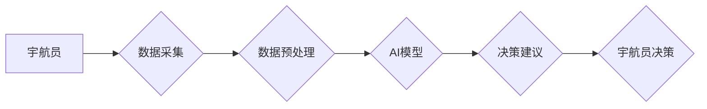

>  人工智能、太空探索、宇航员决策、机器学习、深度学习、自然语言处理、风险评估、预测建模

## 1. 背景介绍

人类对太空的探索永不停歇，从最初的月球登陆到如今对火星的探测，每一次探索都充满了挑战和未知。宇航员作为太空探索的先锋，需要在极端环境下做出快速、准确的决策，以确保任务的成功和自身的安全。然而，太空环境的复杂性和信息量的巨大增长，使得传统的决策模式难以应对。

人工智能（AI）技术的快速发展为太空探索提供了新的机遇。AI算法能够从海量数据中提取关键信息，识别模式，并提供基于数据分析的决策建议，从而有效辅助宇航员做出更明智的选择。

## 2. 核心概念与联系

**2.1  AI在太空探索中的应用**

AI在太空探索中的应用涵盖多个领域，包括：

* **任务规划和执行:** AI可以帮助规划太空任务的路线、时间和资源分配，并根据实时数据调整执行计划。
* **遥感图像分析:** AI可以分析遥感图像，识别地貌特征、资源分布和潜在的危险区域，为宇航员提供更全面的环境信息。
* **机器人控制:** AI可以控制太空机器人，执行任务、收集数据和进行维护，减轻宇航员的工作负担。
* **宇航员健康监测:** AI可以监测宇航员的生理指标和心理状态，及时发现潜在的健康问题，并提供相应的建议。

**2.2  AI辅助宇航员决策**

AI辅助宇航员决策的核心是利用AI算法分析太空环境数据，并生成可解释的决策建议。

**2.3  架构图**



## 3. 核心算法原理 & 具体操作步骤

**3.1  算法原理概述**

在AI辅助宇航员决策中，常用的算法包括：

* **机器学习:** 通过训练模型，从历史数据中学习模式和规律，预测未来事件。
* **深度学习:** 利用多层神经网络，学习更复杂的特征和关系，提高预测精度。
* **自然语言处理:** 处理和理解自然语言文本，例如宇航员的语音指令和报告。

**3.2  算法步骤详解**

1. **数据收集:** 收集来自各种传感器、仪器和宇航员的各种数据，例如环境参数、任务进度、宇航员状态等。
2. **数据预处理:** 对收集到的数据进行清洗、转换和特征提取，使其适合AI模型的训练和使用。
3. **模型训练:** 选择合适的AI算法，并利用预处理后的数据进行模型训练，使其能够学习数据中的模式和规律。
4. **模型评估:** 使用测试数据评估模型的性能，例如预测精度、召回率等。
5. **模型部署:** 将训练好的模型部署到太空平台，并将其集成到宇航员决策系统中。
6. **决策建议生成:** 当宇航员面临决策时，系统会根据实时数据和模型预测，生成可解释的决策建议。
7. **宇航员决策:** 宇航员根据系统建议和自身经验，做出最终的决策。

**3.3  算法优缺点**

* **优点:**
    * 能够处理海量数据，识别复杂模式。
    * 能够提供基于数据分析的决策建议，提高决策效率和准确性。
    * 可以学习和适应不断变化的太空环境。
* **缺点:**
    * 需要大量高质量的数据进行训练。
    * 模型的解释性可能较差，难以理解模型的决策逻辑。
    * 存在算法偏差和安全风险。

**3.4  算法应用领域**

* **任务规划和执行:** 优化任务路线、时间和资源分配。
* **风险评估和应急处理:** 识别潜在的危险，并提供应对措施建议。
* **宇航员状态监测和辅助:** 监测宇航员的生理和心理状态，提供健康建议和支持。
* **太空资源探测和利用:** 分析遥感图像，识别资源分布和潜在的利用方式。

## 4. 数学模型和公式 & 详细讲解 & 举例说明

**4.1  数学模型构建**

在AI辅助宇航员决策中，常用的数学模型包括：

* **贝叶斯网络:** 用于表示随机变量之间的概率关系，可以用于风险评估和决策分析。
* **决策树:** 用于表示决策过程，可以根据数据特征进行分类和预测。
* **支持向量机:** 用于分类和回归问题，可以找到数据中的最佳决策边界。

**4.2  公式推导过程**

例如，使用贝叶斯网络进行风险评估，可以根据以下公式计算风险概率：

$$P(风险|证据) = \frac{P(证据|风险) * P(风险)}{P(证据)}$$

其中：

* $P(风险|证据)$: 给定证据条件下，风险发生的概率。
* $P(证据|风险)$: 给定风险条件下，证据出现的概率。
* $P(风险)$: 风险发生的概率。
* $P(证据)$: 证据出现的概率。

**4.3  案例分析与讲解**

假设宇航员在执行任务时，发现仪器出现故障，需要判断故障的严重程度和潜在风险。可以使用贝叶斯网络将相关证据（例如仪器读数、故障历史等）与风险等级（例如轻微、中度、严重）联系起来，计算出不同风险等级发生的概率。

## 5. 项目实践：代码实例和详细解释说明

**5.1  开发环境搭建**

* 操作系统: Ubuntu 20.04
* Python 版本: 3.8
* 必要的库: TensorFlow, PyTorch, scikit-learn, NumPy, Pandas

**5.2  源代码详细实现**

```python
# 导入必要的库
import tensorflow as tf

# 定义模型结构
model = tf.keras.models.Sequential([
    tf.keras.layers.Dense(64, activation='relu', input_shape=(10,)),
    tf.keras.layers.Dense(32, activation='relu'),
    tf.keras.layers.Dense(1, activation='sigmoid')
])

# 编译模型
model.compile(optimizer='adam', loss='binary_crossentropy', metrics=['accuracy'])

# 训练模型
model.fit(X_train, y_train, epochs=10, batch_size=32)

# 评估模型
loss, accuracy = model.evaluate(X_test, y_test)
print('Loss:', loss)
print('Accuracy:', accuracy)
```

**5.3  代码解读与分析**

* 该代码示例展示了使用TensorFlow构建一个简单的深度学习模型进行分类任务。
* 模型结构包括三个全连接层，第一层输入维度为10，最后一层输出维度为1，用于预测二分类结果。
* 模型使用Adam优化器，损失函数为二分类交叉熵，评估指标为准确率。
* 模型训练使用训练数据，并评估其在测试数据上的性能。

**5.4  运行结果展示**

训练完成后，可以查看模型的损失值和准确率，评估其性能。

## 6. 实际应用场景

**6.1  任务规划和执行**

AI可以帮助规划太空任务的路线、时间和资源分配，并根据实时数据调整执行计划。例如，AI可以分析星体位置、燃料消耗和任务目标，优化宇航员的飞行路径，并根据实时数据调整航线，避免潜在的危险。

**6.2  风险评估和应急处理**

AI可以识别潜在的危险，并提供应对措施建议。例如，AI可以分析宇航员的生理指标和环境数据，识别潜在的健康问题或环境风险，并及时提醒宇航员并提供应对措施。

**6.3  宇航员状态监测和辅助**

AI可以监测宇航员的生理和心理状态，提供健康建议和支持。例如，AI可以分析宇航员的睡眠、饮食、运动和情绪数据，识别潜在的健康问题，并提供个性化的健康建议。

**6.4  未来应用展望**

随着AI技术的不断发展，其在太空探索中的应用将更加广泛和深入。例如：

* **自主驾驶:** AI可以控制太空船和机器人，实现自主驾驶和任务执行。
* **智能协作:** AI可以帮助宇航员进行智能协作，提高任务效率和安全性。
* **太空资源探测:** AI可以帮助探测和利用太空资源，例如水、矿物等。

## 7. 工具和资源推荐

**7.1  学习资源推荐**

* **书籍:**
    * 《深度学习》
    * 《机器学习》
    * 《人工智能：一种现代方法》
* **在线课程:**
    * Coursera: 深度学习
    * edX: 机器学习
    * Udacity: AI Nanodegree

**7.2  开发工具推荐**

* **TensorFlow:** 开源深度学习框架
* **PyTorch:** 开源深度学习框架
* **scikit-learn:** 机器学习库
* **NumPy:** 数值计算库
* **Pandas:** 数据分析库

**7.3  相关论文推荐**

* **AI for Space Exploration: A Survey**
* **Deep Learning for Spacecraft Navigation and Control**
* **Machine Learning for Risk Assessment in Space Exploration**

## 8. 总结：未来发展趋势与挑战

**8.1  研究成果总结**

AI在太空探索中的应用取得了显著进展，例如任务规划、风险评估、宇航员状态监测等领域取得了突破。

**8.2  未来发展趋势**

* **自主性增强:** AI将更加自主地执行任务，减少宇航员的工作负担。
* **智能协作:** AI将帮助宇航员进行更有效的协作，提高任务效率和安全性。
* **跨领域融合:** AI将与其他技术融合，例如机器人技术、遥感技术等，实现更复杂的太空探索任务。

**8.3  面临的挑战**

* **数据获取和处理:** 太空环境数据获取困难，需要开发更有效的收集和处理方法。
* **模型解释性和可信度:** AI模型的决策逻辑难以解释，需要提高模型的透明度和可信度。
* **安全性和可靠性:** AI系统需要具备高安全性、可靠性和鲁棒性，以确保太空任务的安全。

**8.4  研究展望**

未来，需要继续加强AI在太空探索领域的研发，解决上述挑战，推动AI技术在太空探索中的更广泛应用，为人类探索宇宙提供更强大的技术支撑。

## 9. 附录：常见问题与解答

**9.1  AI是否会取代宇航员？**

AI不会取代宇航员，而是作为宇航员的助手，帮助他们完成更复杂的任务，提高工作效率和安全性。

**9.2  AI模型的决策是否可靠？**

AI模型的决策基于训练数据，其可靠性取决于数据的质量和模型的训练效果。需要不断完善模型算法和训练方法，提高模型的准确性和可靠性。

**9.3  如何确保AI系统的安全性和可靠性？**

需要采用多重安全措施，例如冗余系统、安全认证、入侵检测等，确保AI系统的安全性和可靠性。


作者：禅与计算机程序设计艺术 / Zen and the Art of Computer Programming 
<end_of_turn>