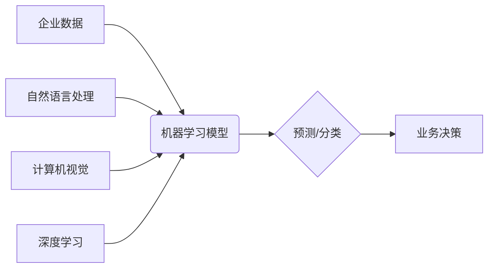

>  人工智能、企业应用、机器学习、深度学习、自然语言处理、计算机视觉、数据分析、自动化

## 1. 背景介绍

人工智能（AI）技术近年来发展迅速，从学术研究走向了实际应用，并开始深刻地改变着各行各业。企业作为社会经济发展的重要组成部分，也积极拥抱AI技术，将其应用于各个环节，以提升效率、降低成本、创造新的价值。

**1.1 AI技术发展现状**

AI技术的发展经历了多个阶段，从早期规则型AI到如今的深度学习时代，取得了显著的进步。深度学习算法的出现，使得AI系统能够从海量数据中学习，并实现更精准的预测和决策。

**1.2 企业对AI的需求**

企业对AI的需求主要体现在以下几个方面：

* **提高效率:** AI可以自动化完成许多重复性任务，例如数据录入、客户服务等，从而解放人力资源，提高工作效率。
* **降低成本:** AI可以帮助企业优化资源配置，减少浪费，降低运营成本。
* **提升决策质量:** AI可以分析海量数据，发现隐藏的模式和趋势，为企业决策提供更科学的依据。
* **创造新价值:** AI可以帮助企业开发新的产品和服务，开拓新的市场。

## 2. 核心概念与联系

**2.1 核心概念**

* **机器学习:** 是一种人工智能技术，通过算法训练模型，使模型能够从数据中学习，并进行预测或分类。
* **深度学习:** 是一种机器学习的子集，使用多层神经网络来模拟人类大脑的学习过程，能够处理更复杂的数据。
* **自然语言处理 (NLP):** 是一种人工智能技术，旨在使计算机能够理解和处理人类语言。
* **计算机视觉:** 是一种人工智能技术，旨在使计算机能够“看”和理解图像和视频。

**2.2 联系**

AI技术在企业中的应用涉及多个领域，这些领域之间相互关联，共同构成了AI生态系统。例如，NLP技术可以用于客户服务聊天机器人，计算机视觉技术可以用于图像识别和分析，深度学习技术可以用于预测客户行为。



## 3. 核心算法原理 & 具体操作步骤

**3.1 算法原理概述**

机器学习算法的核心是通过训练模型，使模型能够从数据中学习。训练过程通常包括以下步骤：

1. **数据收集和预处理:** 收集相关数据，并进行清洗、转换等预处理操作。
2. **模型选择:** 根据具体任务选择合适的机器学习算法。
3. **模型训练:** 使用训练数据训练模型，调整模型参数，使模型能够准确地预测或分类。
4. **模型评估:** 使用测试数据评估模型的性能，例如准确率、召回率等。
5. **模型部署:** 将训练好的模型部署到实际应用场景中。

**3.2 算法步骤详解**

以线性回归算法为例，详细说明其训练步骤：

1. **数据准备:** 收集包含特征和目标变量的数据集。
2. **特征工程:** 对特征进行选择、转换等操作，以提高模型的性能。
3. **模型初始化:** 初始化模型参数，例如权重和偏差。
4. **梯度下降:** 使用梯度下降算法迭代更新模型参数，使模型的预测结果与实际目标变量之间的误差最小化。
5. **模型评估:** 使用测试数据评估模型的性能，例如均方误差 (MSE)。

**3.3 算法优缺点**

* **优点:** 
    * 能够从数据中学习，无需人工编程。
    * 能够处理复杂的数据关系。
    * 能够不断改进模型性能。
* **缺点:** 
    * 需要大量的训练数据。
    * 训练过程可能耗时较长。
    * 模型解释性较差。

**3.4 算法应用领域**

机器学习算法广泛应用于各个领域，例如：

* **预测分析:** 预测客户行为、市场趋势等。
* **图像识别:** 人脸识别、物体检测等。
* **自然语言处理:** 文本分类、机器翻译等。
* **推荐系统:** 推荐商品、电影等。

## 4. 数学模型和公式 & 详细讲解 & 举例说明

**4.1 数学模型构建**

线性回归模型的数学模型如下：

$$
y = w_0 + w_1x_1 + w_2x_2 + ... + w_nx_n + \epsilon
$$

其中：

* $y$ 是目标变量。
* $x_1, x_2, ..., x_n$ 是特征变量。
* $w_0, w_1, w_2, ..., w_n$ 是模型参数。
* $\epsilon$ 是误差项。

**4.2 公式推导过程**

线性回归模型的目标是找到最优的模型参数，使模型的预测结果与实际目标变量之间的误差最小化。常用的误差函数是均方误差 (MSE)：

$$
MSE = \frac{1}{n} \sum_{i=1}^{n} (y_i - \hat{y}_i)^2
$$

其中：

* $n$ 是样本数量。
* $y_i$ 是第 $i$ 个样本的目标变量。
* $\hat{y}_i$ 是模型预测的第 $i$ 个样本的目标变量。

通过梯度下降算法，可以迭代更新模型参数，使MSE最小化。

**4.3 案例分析与讲解**

假设我们想要预测房价，特征变量包括房屋面积、房间数量、地理位置等。我们可以使用线性回归模型训练一个模型，将这些特征变量作为输入，预测房价。

## 5. 项目实践：代码实例和详细解释说明

**5.1 开发环境搭建**

* Python 3.x
* TensorFlow 或 PyTorch 等深度学习框架
* Jupyter Notebook 或 VS Code 等开发环境

**5.2 源代码详细实现**

```python
import tensorflow as tf

# 定义模型
model = tf.keras.models.Sequential([
    tf.keras.layers.Dense(64, activation='relu', input_shape=(7,)),
    tf.keras.layers.Dense(1)
])

# 编译模型
model.compile(optimizer='adam', loss='mse')

# 训练模型
model.fit(X_train, y_train, epochs=10)

# 评估模型
loss = model.evaluate(X_test, y_test)
print('Loss:', loss)
```

**5.3 代码解读与分析**

* 使用 TensorFlow 框架定义一个简单的线性回归模型。
* 模型包含两层全连接层，第一层有 64 个神经元，使用 ReLU 激活函数，输入层维度为 7。
* 使用 Adam 优化器和均方误差 (MSE) 作为损失函数。
* 使用训练数据训练模型 10 个 epochs。
* 使用测试数据评估模型的性能。

**5.4 运行结果展示**

训练完成后，可以查看模型的损失值，以及在测试数据上的预测结果。

## 6. 实际应用场景

**6.1 客户服务自动化**

AI 驱动的聊天机器人可以自动回答客户常见问题，提供24/7 的客户服务，提高客户满意度。

**6.2 营销精准化**

AI 可以分析客户数据，预测客户行为，帮助企业进行精准营销，提高营销效果。

**6.3 运营效率提升**

AI 可以自动化完成许多重复性任务，例如数据录入、报表生成等，提高运营效率。

**6.4 产品研发创新**

AI 可以帮助企业分析市场需求，挖掘新的产品和服务创意，推动产品研发创新。

**6.5 未来应用展望**

随着 AI 技术的不断发展，其在企业中的应用场景将更加广泛，例如：

* **个性化定制:** AI 可以根据客户需求，提供个性化的产品和服务。
* **智能决策:** AI 可以帮助企业进行更智能的决策，降低风险。
* **协同办公:** AI 可以帮助企业实现更有效的协同办公，提高团队效率。

## 7. 工具和资源推荐

**7.1 学习资源推荐**

* **在线课程:** Coursera, edX, Udacity 等平台提供丰富的 AI 课程。
* **书籍:** 《深度学习》、《机器学习实战》等书籍。
* **开源项目:** TensorFlow, PyTorch 等开源项目。

**7.2 开发工具推荐**

* **Python:** 作为 AI 开发的主要语言。
* **Jupyter Notebook:** 用于代码编写和可视化。
* **TensorFlow/PyTorch:** 深度学习框架。

**7.3 相关论文推荐**

* **《ImageNet Classification with Deep Convolutional Neural Networks》**
* **《Attention Is All You Need》**
* **《BERT: Pre-training of Deep Bidirectional Transformers for Language Understanding》**

## 8. 总结：未来发展趋势与挑战

**8.1 研究成果总结**

近年来，AI 技术取得了显著的进展，在各个领域都取得了突破性成果。

**8.2 未来发展趋势**

* **模型更加强大:** 模型规模将继续扩大，性能将进一步提升。
* **应用更加广泛:** AI 将应用于更多领域，例如医疗、教育、金融等。
* **解释性更强:** 研究者将致力于开发更可解释的 AI 模型。

**8.3 面临的挑战**

* **数据安全:** AI 模型训练需要大量数据，如何保证数据安全是一个重要挑战。
* **算法偏见:** AI 模型可能存在算法偏见，需要进行公平性评估和改进。
* **伦理问题:** AI 的发展引发了一些伦理问题，需要进行深入探讨和规范。

**8.4 研究展望**

未来，AI 研究将继续朝着更强大、更安全、更可解释的方向发展，为人类社会带来更多福祉。

## 9. 附录：常见问题与解答

**9.1 如何选择合适的 AI 算法？**

选择合适的 AI 算法取决于具体的应用场景和数据特点。

**9.2 如何解决 AI 模型的过拟合问题？**

可以使用正则化、交叉验证等方法来解决 AI 模型的过拟合问题。

**9.3 如何评估 AI 模型的性能？**

可以使用准确率、召回率、F1-score 等指标来评估 AI 模型的性能。


作者：禅与计算机程序设计艺术 / Zen and the Art of Computer Programming 
<end_of_turn>