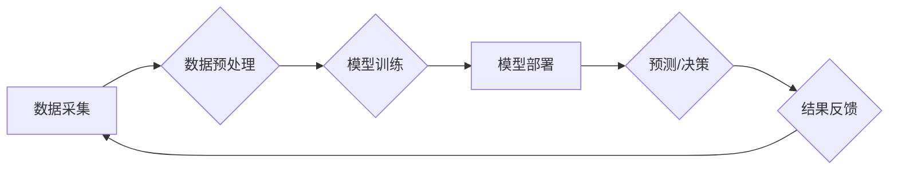

> 人工智能，消费市场，应用场景，算法原理，机器学习，深度学习，自然语言处理，计算机视觉

## 1. 背景介绍

人工智能（AI）技术近年来发展迅速，已从实验室走向现实生活，深刻地改变着我们的世界。其中，在消费市场领域，AI技术应用尤为广泛，为消费者带来了全新的体验和便利。从智能手机的语音助手到电商平台的个性化推荐，从智能家居的自动化控制到金融领域的风险评估，AI技术无处不在，正在重塑消费市场格局。

随着技术的不断进步，AI技术的应用场景将更加丰富，对消费市场的影响也将更加深远。本文将深入探讨AI技术在消费市场中的应用，分析其核心概念、算法原理、应用场景以及未来发展趋势。

## 2. 核心概念与联系

**2.1  人工智能（AI）**

人工智能是指模拟人类智能行为的计算机系统。它涵盖了多个领域，包括机器学习、深度学习、自然语言处理、计算机视觉等。

**2.2  机器学习（ML）**

机器学习是人工智能的一个重要分支，它通过算法训练模型，使模型能够从数据中学习，并根据学习到的知识进行预测或决策。

**2.3  深度学习（DL）**

深度学习是机器学习的一个子领域，它使用多层神经网络来模拟人类大脑的学习过程，能够处理更复杂的数据，并取得更优的性能。

**2.4  自然语言处理（NLP）**

自然语言处理是指使计算机能够理解和处理人类语言的技术。它包括文本分析、机器翻译、语音识别等应用。

**2.5  计算机视觉（CV）**

计算机视觉是指使计算机能够“看”和理解图像的技术。它包括图像识别、物体检测、图像分割等应用。

**2.6  消费市场**

消费市场是指商品和服务的买卖活动，涉及消费者购买商品和服务以满足个人需求的过程。

**2.7  AI技术与消费市场的关系**

AI技术在消费市场中的应用，主要体现在以下几个方面：

* **个性化推荐:** AI算法可以分析用户的消费行为、偏好和兴趣，并推荐个性化的商品和服务。
* **智能客服:** AI驱动的聊天机器人可以提供24小时在线客服，解答用户疑问，解决问题。
* **精准营销:** AI技术可以分析用户数据，进行精准的市场营销，提高营销效率。
* **智能物流:** AI可以优化物流路线，提高配送效率，降低物流成本。
* **增强现实（AR）和虚拟现实（VR）:** AI技术可以增强AR和VR体验，为消费者提供更沉浸式的购物体验。

**2.8  AI技术应用架构**



## 3. 核心算法原理 & 具体操作步骤

### 3.1  算法原理概述

在AI技术应用中，常用的算法包括：

* **线性回归:** 用于预测连续数值，例如商品价格。
* **逻辑回归:** 用于分类问题，例如判断用户是否会购买商品。
* **决策树:** 用于分类和回归问题，通过树状结构进行决策。
* **支持向量机 (SVM):** 用于分类问题，寻找最佳的分隔超平面。
* **神经网络:** 用于复杂问题，例如图像识别和自然语言处理。

### 3.2  算法步骤详解

以线性回归为例，其算法步骤如下：

1. **数据收集:** 收集相关数据，例如商品价格、销售量等。
2. **数据预处理:** 对数据进行清洗、转换和特征工程，例如处理缺失值、归一化数据等。
3. **模型训练:** 使用训练数据训练线性回归模型，找到最佳的模型参数。
4. **模型评估:** 使用测试数据评估模型性能，例如计算均方误差 (MSE)。
5. **模型部署:** 将训练好的模型部署到生产环境中，用于预测新的数据。

### 3.3  算法优缺点

每个算法都有其优缺点，需要根据具体应用场景选择合适的算法。

* **线性回归:** 优点：简单易懂，计算速度快。缺点：对数据线性关系要求高，难以处理复杂关系。
* **逻辑回归:** 优点：适用于分类问题，易于解释。缺点：对数据分布要求较高，难以处理高维数据。
* **决策树:** 优点：易于理解和解释，可以处理非线性关系。缺点：容易过拟合，对数据噪声敏感。
* **支持向量机 (SVM):** 优点：可以处理高维数据，具有较好的泛化能力。缺点：训练时间较长，参数选择较复杂。
* **神经网络:** 优点：可以处理复杂关系，具有强大的学习能力。缺点：训练时间长，参数众多，难以解释。

### 3.4  算法应用领域

不同的算法适用于不同的应用领域。例如：

* **线性回归:** 预测房价、股票价格等。
* **逻辑回归:** 判断用户是否会点击广告、是否会购买商品等。
* **决策树:** 诊断疾病、信用评分等。
* **支持向量机 (SVM):** 手写数字识别、图像分类等。
* **神经网络:** 语音识别、机器翻译、图像生成等。

## 4. 数学模型和公式 & 详细讲解 & 举例说明

### 4.1  数学模型构建

在AI技术中，数学模型是描述算法原理和计算过程的抽象表示。例如，线性回归模型的数学表达式为：

$$y = w_0 + w_1x_1 + w_2x_2 + ... + w_nx_n + \epsilon$$

其中：

* $y$ 是预测值
* $w_0, w_1, w_2, ..., w_n$ 是模型参数
* $x_1, x_2, ..., x_n$ 是输入特征
* $\epsilon$ 是误差项

### 4.2  公式推导过程

模型参数的求解可以通过最小化误差函数来实现。常用的误差函数是均方误差 (MSE)：

$$MSE = \frac{1}{n}\sum_{i=1}^{n}(y_i - \hat{y}_i)^2$$

其中：

* $n$ 是样本数量
* $y_i$ 是真实值
* $\hat{y}_i$ 是预测值

通过梯度下降算法，可以迭代更新模型参数，使得MSE最小化。

### 4.3  案例分析与讲解

例如，假设我们想要预测房价，输入特征包括房屋面积、房间数量、地理位置等。我们可以使用线性回归模型，通过训练数据，学习到房价与这些特征之间的关系。然后，对于新的房屋，我们可以输入其特征，使用训练好的模型预测其价格。

## 5. 项目实践：代码实例和详细解释说明

### 5.1  开发环境搭建

* Python 3.x
* Jupyter Notebook
* scikit-learn

### 5.2  源代码详细实现

```python
from sklearn.linear_model import LinearRegression
from sklearn.model_selection import train_test_split
import pandas as pd

# 加载数据
data = pd.read_csv('house_price.csv')

# 选择特征和目标变量
X = data[['area', 'rooms', 'location']]
y = data['price']

# 将数据分为训练集和测试集
X_train, X_test, y_train, y_test = train_test_split(X, y, test_size=0.2, random_state=42)

# 创建线性回归模型
model = LinearRegression()

# 训练模型
model.fit(X_train, y_train)

# 预测测试集数据
y_pred = model.predict(X_test)

# 评估模型性能
from sklearn.metrics import mean_squared_error
mse = mean_squared_error(y_test, y_pred)
print(f'Mean Squared Error: {mse}')
```

### 5.3  代码解读与分析

* 首先，我们加载数据，选择特征和目标变量。
* 然后，我们将数据分为训练集和测试集，用于训练和评估模型。
* 创建线性回归模型，并使用训练数据进行训练。
* 训练完成后，我们可以使用模型预测测试集数据，并评估模型性能。

### 5.4  运行结果展示

运行代码后，会输出模型的均方误差 (MSE) 值，该值越小，模型性能越好。

## 6. 实际应用场景

### 6.1  电商平台个性化推荐

AI技术可以分析用户的购买历史、浏览记录、评价等数据，推荐个性化的商品和服务，提高用户体验和转化率。

### 6.2  智能客服

AI驱动的聊天机器人可以提供24小时在线客服，解答用户疑问，解决问题，提高客户服务效率。

### 6.3  精准营销

AI技术可以分析用户数据，进行精准的市场营销，例如根据用户的兴趣爱好推送个性化的广告，提高广告点击率和转化率。

### 6.4  未来应用展望

随着AI技术的不断发展，其在消费市场中的应用将更加广泛和深入。例如：

* **增强现实（AR）和虚拟现实（VR）:** AI技术可以增强AR和VR体验，为消费者提供更沉浸式的购物体验。
* **个性化定制:** AI技术可以根据用户的需求，进行个性化的商品定制，满足用户的个性化需求。
* **智能物流:** AI可以优化物流路线，提高配送效率，降低物流成本。

## 7. 工具和资源推荐

### 7.1  学习资源推荐

* **在线课程:** Coursera, edX, Udacity
* **书籍:** 《深度学习》、《机器学习实战》
* **博客:** Towards Data Science, Machine Learning Mastery

### 7.2  开发工具推荐

* **Python:** 广泛用于AI开发
* **TensorFlow:** 深度学习框架
* **PyTorch:** 深度学习框架
* **scikit-learn:** 机器学习库

### 7.3  相关论文推荐

* **《ImageNet Classification with Deep Convolutional Neural Networks》**
* **《Attention Is All You Need》**
* **《BERT: Pre-training of Deep Bidirectional Transformers for Language Understanding》**

## 8. 总结：未来发展趋势与挑战

### 8.1  研究成果总结

AI技术在消费市场中的应用取得了显著的成果，为消费者带来了全新的体验和便利。

### 8.2  未来发展趋势

* **模型更加智能化:** AI模型将更加智能化，能够更好地理解和响应用户的需求。
* **应用场景更加广泛:** AI技术将应用于更多消费场景，例如医疗保健、教育、娱乐等。
* **数据安全和隐私保护:** 随着AI技术的应用，数据安全和隐私保护将成为更加重要的议题。

### 8.3  面临的挑战

* **算法解释性:** 许多AI算法难以解释其决策过程，这可能会导致用户对AI技术的信任度降低。
* **数据质量:** AI模型的性能依赖于数据质量，数据不完整、不准确或存在偏差都会影响模型的性能。
* **伦理问题:** AI技术的应用可能会带来一些伦理问题，例如算法偏见、就业替代等。

### 8.4  研究展望

未来，AI技术在消费市场中的应用将继续发展，需要进一步研究以下问题：

* 如何提高AI模型的解释性，增强用户对AI技术的信任度。
* 如何解决数据质量问题，提高AI模型的性能。
* 如何应对AI技术的伦理挑战，确保其安全、公平、可持续地发展。

## 9. 附录：常见问题与解答

### 9.1  常见问题

* **什么是AI？**

AI是指模拟人类智能行为的计算机系统。

* **AI技术有哪些应用场景？**

AI技术应用广泛，例如智能客服、个性化推荐、精准营销等。

* **如何学习AI技术？**

可以通过在线课程、书籍、博客等方式学习AI技术。

### 9.2  解答

* **AI