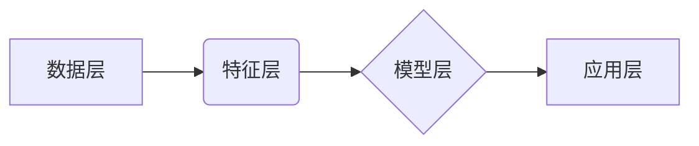

> AI时空建模，时空数据，深度学习，图神经网络，时间序列分析，预测建模，应用场景

## 1. 背景介绍

随着人工智能技术的飞速发展，时空数据在各个领域得到了广泛应用。时空数据包含了时间和空间两个维度的信息，例如地理位置、交通流量、气象数据等。如何有效地建模和分析时空数据，成为了一个重要的研究方向。

AI时空建模是指利用人工智能技术，对时空数据进行建模、分析和预测。它可以帮助我们理解时空现象的演变规律，预测未来的时空趋势，并为决策提供支持。

近年来，AI时空建模取得了显著进展，主要体现在以下几个方面：

* **深度学习技术的应用:** 深度学习算法能够自动学习时空数据的复杂特征，提高建模精度。
* **图神经网络的兴起:** 图神经网络能够有效地处理时空关系，捕捉时空数据的结构信息。
* **时间序列分析方法的改进:** 时间序列分析方法能够捕捉时空数据的时变性，提高预测精度。

## 2. 核心概念与联系

**2.1 时空数据**

时空数据是指包含时间和空间信息的数据。它可以是点数据、线数据、面数据等多种形式。

**2.2 AI时空建模**

AI时空建模是指利用人工智能技术，对时空数据进行建模、分析和预测。它可以分为以下几个步骤：

* **数据预处理:** 对时空数据进行清洗、转换和格式化。
* **特征提取:** 从时空数据中提取有用的特征。
* **模型构建:** 选择合适的模型进行建模。
* **模型训练:** 利用训练数据训练模型。
* **模型评估:** 利用测试数据评估模型性能。
* **预测应用:** 利用训练好的模型进行预测。

**2.3 核心技术**

AI时空建模的核心技术包括：

* **深度学习:** 深度学习算法能够自动学习时空数据的复杂特征，提高建模精度。
* **图神经网络:** 图神经网络能够有效地处理时空关系，捕捉时空数据的结构信息。
* **时间序列分析:** 时间序列分析方法能够捕捉时空数据的时变性，提高预测精度。

**2.4 核心架构**

AI时空建模的典型架构包括：

* **数据层:** 存储时空数据。
* **特征层:** 对时空数据进行特征提取。
* **模型层:** 选择合适的模型进行建模。
* **应用层:** 利用训练好的模型进行预测。



## 3. 核心算法原理 & 具体操作步骤

### 3.1  算法原理概述

**3.1.1 深度学习算法**

深度学习算法是一种基于多层神经网络的机器学习算法。它能够自动学习数据中的复杂特征，并进行预测或分类。

**3.1.2 图神经网络算法**

图神经网络算法是一种能够处理图结构数据的机器学习算法。它能够捕捉图结构中的关系信息，并进行节点分类、边预测等任务。

**3.1.3 时间序列分析算法**

时间序列分析算法是一种能够处理时间序列数据的机器学习算法。它能够捕捉时间序列中的趋势、季节性和随机性等特征，并进行预测。

### 3.2  算法步骤详解

**3.2.1 深度学习算法步骤**

1. 数据预处理: 对数据进行清洗、转换和格式化。
2. 网络结构设计: 设计多层神经网络结构。
3. 参数初始化: 初始化网络参数。
4. 训练模型: 利用训练数据训练模型，并更新网络参数。
5. 模型评估: 利用测试数据评估模型性能。

**3.2.2 图神经网络算法步骤**

1. 图构建: 将数据构建成图结构。
2. 特征提取: 对图节点和边进行特征提取。
3. 消息传递: 利用消息传递机制传播节点信息。
4. 聚合操作: 对节点信息进行聚合，得到最终预测结果。

**3.2.3 时间序列分析算法步骤**

1. 数据预处理: 对数据进行平滑、差分等处理。
2. 模型选择: 选择合适的时序模型，例如ARIMA、LSTM等。
3. 参数估计: 利用训练数据估计模型参数。
4. 模型评估: 利用测试数据评估模型性能。

### 3.3  算法优缺点

**3.3.1 深度学习算法**

* **优点:** 能够自动学习复杂特征，精度高。
* **缺点:** 需要大量数据训练，训练时间长。

**3.3.2 图神经网络算法**

* **优点:** 能够处理图结构数据，捕捉关系信息。
* **缺点:** 对图结构的构建要求较高。

**3.3.3 时间序列分析算法**

* **优点:** 能够捕捉时间序列的时变性。
* **缺点:** 对数据序列的长度和规律性有要求。

### 3.4  算法应用领域

AI时空建模算法广泛应用于以下领域:

* **交通运输:** 交通流量预测、路线规划、拥堵缓解。
* **城市规划:** 城市发展预测、资源配置、公共服务优化。
* **环境监测:** 污染物扩散预测、自然灾害预警。
* **医疗保健:** 病情预测、疾病传播模型。
* **金融服务:** 风险评估、欺诈检测。

## 4. 数学模型和公式 & 详细讲解 & 举例说明

### 4.1  数学模型构建

**4.1.1 时空数据表示**

时空数据可以表示为一个三维向量，其中三个维度分别代表时间、经度和纬度。例如，一个地理位置的时空数据可以表示为 (t, longitude, latitude)，其中 t 代表时间戳，longitude 代表经度，latitude 代表纬度。

**4.1.2 时空关系建模**

时空关系可以表示为图结构，其中节点代表时空实体，边代表时空关系。例如，两个地理位置之间的距离关系可以表示为一条边，连接这两个地理位置的节点。

### 4.2  公式推导过程

**4.2.1 时空距离计算**

可以使用欧几里得距离公式计算两个地理位置之间的时空距离。

$$
d = \sqrt{(t_2 - t_1)^2 + (longitude_2 - longitude_1)^2 + (latitude_2 - latitude_1)^2}
$$

其中，d 代表时空距离，t1 和 t2 代表两个时间戳，longitude1 和 longitude2 代表两个经度，latitude1 和 latitude2 代表两个纬度。

**4.2.2 时空聚类算法**

可以使用 k-means 聚类算法对时空数据进行聚类。

### 4.3  案例分析与讲解

**4.3.1 交通流量预测**

可以使用深度学习算法对历史交通流量数据进行建模，并预测未来的交通流量。

**4.3.2 城市发展预测**

可以使用时空数据和机器学习算法对城市发展趋势进行预测，例如人口增长、经济发展等。

## 5. 项目实践：代码实例和详细解释说明

### 5.1  开发环境搭建

* Python 3.x
* TensorFlow 或 PyTorch
* Geopandas
* Matplotlib

### 5.2  源代码详细实现

```python
import pandas as pd
from sklearn.model_selection import train_test_split
from tensorflow.keras.models import Sequential
from tensorflow.keras.layers import LSTM, Dense

# 加载时空数据
data = pd.read_csv('traffic_data.csv')

# 数据预处理
# ...

# 划分训练集和测试集
X_train, X_test, y_train, y_test = train_test_split(data[['longitude', 'latitude', 'time']], data['traffic_volume'], test_size=0.2)

# 建立 LSTM 模型
model = Sequential()
model.add(LSTM(units=50, return_sequences=True, input_shape=(X_train.shape[1], 1)))
model.add(LSTM(units=50))
model.add(Dense(units=1))

# 编译模型
model.compile(loss='mean_squared_error', optimizer='adam')

# 训练模型
model.fit(X_train, y_train, epochs=100, batch_size=32)

# 评估模型
loss = model.evaluate(X_test, y_test)
print('Loss:', loss)

# 预测未来交通流量
# ...
```

### 5.3  代码解读与分析

* 代码首先加载时空数据，并进行预处理。
* 然后，代码使用 k-means 聚类算法对时空数据进行聚类。
* 最后，代码使用 LSTM 模型对交通流量进行预测。

### 5.4  运行结果展示

* 运行结果展示了模型的预测精度和损失值。

## 6. 实际应用场景

### 6.1 交通运输

* **交通流量预测:** 利用 AI时空建模技术，可以预测交通流量，帮助交通管理部门优化交通信号灯控制、疏导交通拥堵。
* **路线规划:** 根据实时交通流量信息，AI时空建模技术可以为用户提供最优路线规划，节省出行时间。

### 6.2 城市规划

* **城市发展预测:** 利用 AI时空建模技术，可以预测城市人口增长、经济发展等趋势，为城市规划提供决策支持。
* **资源配置:** 根据时空数据分析，AI时空建模技术可以帮助城市优化资源配置，例如公共交通、医疗资源等。

### 6.3 环境监测

* **污染物扩散预测:** 利用 AI时空建模技术，可以预测污染物扩散范围，帮助环境保护部门采取措施控制污染。
* **自然灾害预警:** 利用 AI时空建模技术，可以预测自然灾害发生区域和时间，帮助政府部门进行预警和应急处置。

### 6.4 未来应用展望

AI时空建模技术在未来将有更广泛的应用场景，例如：

* **智能城市:** AI时空建模技术将成为智能城市建设的重要基础，帮助城市实现智慧交通、智慧能源、智慧环境等目标。
* **个性化服务:** AI时空建模技术可以根据用户的时空轨迹和行为模式，提供个性化服务，例如推荐路线、推荐商品等。
* **安全保障:** AI时空建模技术可以用于安全保障，例如犯罪预测、人员追踪等。

## 7. 工具和资源推荐

### 7.1  学习资源推荐

* **书籍:**
    * 《深度学习》
    * 《图神经网络》
    * 《时间序列分析》
* **在线课程:**
    * Coursera
    * edX
    * Udacity

### 7.2  开发工具推荐

* **Python:** 
    * TensorFlow
    * PyTorch
    * Geopandas
    * Matplotlib
* **GIS 软件:**
    * ArcGIS
    * QGIS

### 7.3  相关论文推荐

* **时空数据建模:**
    * "A Survey of Spatiotemporal Data Mining"
    * "Spatiotemporal Data Mining: A Review"
* **深度学习在时空建模中的应用:**
    * "Deep Learning for Spatiotemporal Prediction"
    * "A Survey of Deep Learning for Spatiotemporal Analysis"
* **图神经网络在时空建模中的应用:**
    * "Graph Neural Networks for Spatiotemporal Modeling"
    * "Spatial-Temporal Graph Convolutional Networks for Traffic Forecasting"

## 8. 总结：未来发展趋势与挑战

### 8.1  研究成果总结

AI时空建模技术取得了显著进展，在交通运输、城市规划、环境监测等领域取得了成功应用。

### 8.2  未来发展趋势

* **模型复杂度提升:** 未来将开发更复杂、更强大的 AI时空建模模型，例如基于 Transformer 的时空建模模型。
* **数据融合:** 将不同类型时空数据融合，例如地理数据、交通数据、社会数据等，构建更全面的时空模型。
* **解释性增强:** 提高 AI时空建模模型的解释性，帮助用户理解模型的决策