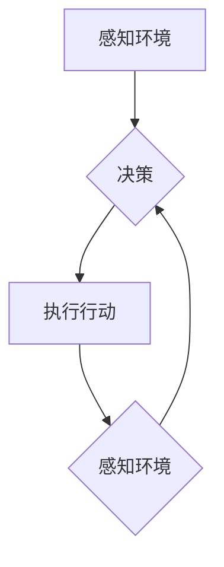

>  Agent代理，多智能体系统，人工智能，机器学习，决策理论，状态空间，行为策略

## 1. 背景介绍

在现代人工智能领域，代理（Agent）的概念扮演着至关重要的角色。代理可以被理解为一个能够感知环境、做出决策并采取行动的智能体。它可以是软件程序、机器人、甚至生物个体，其目标是通过与环境交互来最大化自身的利益或完成特定的任务。

代理的概念源于哲学和经济学，并在20世纪70年代被正式引入人工智能领域。随着人工智能技术的不断发展，代理的概念也得到了广泛的应用，例如：

* **机器人控制:** 代理可以控制机器人的运动和行为，使其能够自主完成任务，例如导航、抓取和组装。
* **游戏人工智能:** 代理可以作为游戏中的对手或伙伴，通过学习和决策来实现智能行为。
* **网络安全:** 代理可以监控网络流量，识别恶意攻击并采取防御措施。
* **电子商务:** 代理可以帮助用户进行商品搜索、价格比较和购买决策。

## 2. 核心概念与联系

**2.1 代理的定义**

代理是一个能够感知环境、做出决策并采取行动的智能体。它具有以下特征：

* **感知能力:** 代理能够感知环境中的信息，例如传感器数据、网络流量或用户输入。
* **决策能力:** 代理能够根据感知到的信息做出决策，选择最优的行动方案。
* **行动能力:** 代理能够执行决策，与环境进行交互，例如移动、操作设备或发送信息。
* **目标:** 代理具有特定的目标或任务，例如完成任务、最大化收益或最小化成本。

**2.2 代理类型**

代理可以根据不同的分类标准进行划分，例如：

* **基于模型的代理:** 这些代理拥有环境模型，能够预测环境的变化并做出决策。
* **基于行为的代理:** 这些代理不拥有环境模型，而是通过经验学习和强化学习来改进行为。
* **简单代理:** 这些代理具有有限的感知和决策能力，通常用于简单的任务。
* **复杂代理:** 这些代理具有强大的感知和决策能力，能够处理复杂的任务。

**2.3 代理架构**

代理通常由以下几个主要部分组成：

* **感知模块:** 用于收集环境信息。
* **决策模块:** 用于根据环境信息做出决策。
* **行动模块:** 用于执行决策，与环境交互。
* **知识库:** 用于存储代理的知识和经验。

**2.4 多智能体系统**

多智能体系统是由多个代理组成的系统，代理之间可以相互通信和协作。多智能体系统在许多领域都有广泛的应用，例如：

* **自动驾驶:** 多个代理可以协作完成驾驶任务，例如导航、避障和车道保持。
* **无人机编队:** 多个无人机可以协作完成任务，例如监视、搜索和救援。
* **智能家居:** 多个代理可以协作完成家居自动化任务，例如控制灯光、温度和安全系统。

**2.5 Mermaid 流程图**



## 3. 核心算法原理 & 具体操作步骤

### 3.1 算法原理概述

代理的决策过程通常基于一些算法，例如：

* **状态空间搜索:** 这种算法将环境状态表示为一个状态空间，代理通过搜索状态空间来找到最优的行动方案。
* **强化学习:** 这种算法通过与环境交互，学习一个策略，该策略能够最大化代理的奖励。
* **决策树:** 这种算法将决策过程表示为一棵决策树，代理根据决策树的规则做出决策。

### 3.2 算法步骤详解

**3.2.1 状态空间搜索算法步骤:**

1. **定义状态空间:** 将环境的所有可能状态表示为一个集合。
2. **定义行动空间:** 将代理可以执行的所有行动表示为一个集合。
3. **评估状态价值:** 为每个状态分配一个价值，表示该状态的好坏。
4. **搜索状态空间:** 从初始状态开始，使用搜索算法（例如广度优先搜索或深度优先搜索）搜索状态空间，找到目标状态或最优状态。
5. **选择行动:** 根据搜索结果，选择最优的行动方案。

**3.2.2 强化学习算法步骤:**

1. **定义奖励函数:** 为每个状态和行动分配一个奖励值，表示代理的行为的好坏。
2. **初始化策略:** 为每个状态分配一个行动概率分布，表示代理在该状态下执行不同行动的概率。
3. **与环境交互:** 代理与环境交互，根据策略选择行动，并获得奖励。
4. **更新策略:** 使用强化学习算法（例如Q学习或SARSA）更新策略，使其能够最大化代理的总奖励。
5. **重复步骤3和4:** 直到策略收敛或达到预设的目标。

### 3.3 算法优缺点

**3.3.1 状态空间搜索算法:**

* **优点:** 能够找到最优解，适用于确定性环境。
* **缺点:** 随着状态空间的增大，搜索复杂度指数级增长，难以处理大型复杂环境。

**3.3.2 强化学习算法:**

* **优点:** 能够学习复杂环境，无需事先定义所有状态和行动。
* **缺点:** 学习过程可能很慢，需要大量的训练数据和计算资源。

### 3.4 算法应用领域

* **游戏人工智能:** 强化学习算法广泛应用于游戏人工智能，例如AlphaGo和AlphaZero。
* **机器人控制:** 状态空间搜索算法和强化学习算法都应用于机器人控制，例如导航和避障。
* **金融交易:** 强化学习算法应用于金融交易，例如股票投资和风险管理。

## 4. 数学模型和公式 & 详细讲解 & 举例说明

### 4.1 数学模型构建

代理的决策过程可以建模为一个马尔可夫决策过程（MDP）。MDP由以下几个要素组成：

* **状态空间:** S，表示环境的所有可能状态。
* **行动空间:** A，表示代理可以执行的所有行动。
* **转移概率:** P(s', r | s, a)，表示从状态s执行行动a后，转移到状态s'的概率，以及获得奖励r的概率。
* **奖励函数:** R(s, a)，表示代理在状态s执行行动a后获得的奖励。

### 4.2 公式推导过程

代理的目标是找到一个策略π(s)，该策略能够最大化代理的预期奖励。

**Bellman方程:**

$$
V^{\pi}(s) = \max_a \left[ R(s, a) + \gamma \sum_{s'} P(s', r | s, a) V^{\pi}(s') \right]
$$

其中：

* $V^{\pi}(s)$ 表示状态s下策略π的价值函数。
* $\gamma$ 表示折扣因子，控制未来奖励的权重。

**价值迭代算法:**

1. 初始化价值函数 $V(s)$。
2. 迭代更新价值函数:

$$
V(s) = \max_a \left[ R(s, a) + \gamma \sum_{s'} P(s', r | s, a) V(s') \right]
$$

3. 直到价值函数收敛。

### 4.3 案例分析与讲解

**例子:**

一个代理在迷宫中寻找出口。

* 状态空间: 迷宫中的所有位置。
* 行动空间: 向上、向下、向左、向右四个方向移动。
* 转移概率: 每个位置向四个方向移动的概率取决于迷宫的结构。
* 奖励函数: 找到出口获得最大奖励，其他位置获得零奖励。

使用价值迭代算法，代理可以学习出迷宫中每个位置的价值，并找到最优路径到达出口。

## 5. 项目实践：代码实例和详细解释说明

### 5.1 开发环境搭建

* 操作系统: Ubuntu 20.04
* Python 版本: 3.8
* 必要的库: numpy, matplotlib, gym

### 5.2 源代码详细实现

```python
import gym
import numpy as np

# 定义代理
class Agent:
    def __init__(self, env):
        self.env = env
        self.state_size = env.observation_space.shape[0]
        self.action_size = env.action_space.n
        self.q_table = np.zeros((self.state_size, self.action_size))

    def choose_action(self, state):
        return np.argmax(self.q_table[state])

    def update_q_table(self, state, action, reward, next_state):
        self.q_table[state, action] = (1 - learning_rate) * self.q_table[state, action] + learning_rate * (reward + gamma * np.max(self.q_table[next_state]))

# 设置环境
env = gym.make('CartPole-v1')

# 创建代理
agent = Agent(env)

# 设置超参数
learning_rate = 0.1
gamma = 0.99

# 训练代理
for episode in range(1000):
    state = env.reset()
    done = False
    total_reward = 0

    while not done:
        action = agent.choose_action(state)
        next_state, reward, done, _ = env.step(action)
        agent.update_q_table(state, action, reward, next_state)
        state = next_state
        total_reward += reward

    print(f'Episode: {episode}, Total Reward: {total_reward}')

# 测试代理
state = env.reset()
while True:
    action = agent.choose_action(state)
    state, reward, done, _ = env.step(action)
    env.render()
    if done:
        break
```

### 5.3 代码解读与分析

* **代理类:** 定义了一个代理类，包含状态空间、行动空间、Q表等属性。
* **选择行动:** 使用贪婪策略选择Q表中最大值的行动。
* **更新Q表:** 使用Q学习算法更新Q表，根据奖励和下一个状态的价值。
* **训练代理:** 使用循环训练代理，每一步选择行动、执行行动、获得奖励、更新Q表。
* **测试代理:** 使用训练好的代理在环境中进行测试。

### 5.4 运行结果展示

运行代码后，代理将在CartPole环境中学习平衡杆，并最终能够长时间保持平衡。

## 6. 实际应用场景

### 6.1 智能机器人

* **导航:** 代理可以感知环境，规划路径，并控制机器人导航到目标位置。
* **避障:** 代理可以感知障碍物，避开障碍物，安全地移动。
* **抓取:** 代理可以感知物体，规划抓取动作，并控制机器人抓取物体。

### 6.2 自动驾驶

* **路径规划:** 代理可以感知道路环境，规划最优路径，避免碰撞。
* **车道保持:** 代理可以感知车道线，控制车辆保持在车道内。
* **自动泊车:** 代理可以感知停车位，控制车辆自动泊车。

### 6.3 游戏人工智能

* **游戏策略:** 代理可以学习游戏策略，提高游戏胜率。
* **游戏角色:** 代理可以控制游戏角色，实现智能行为。
* **游戏对手:** 代理可以作为游戏对手，提供更具挑战性的游戏体验。

### 6.4 未来应用展望

* **医疗保健:** 代理可以辅助医生诊断疾病、制定治疗方案。
* **金融服务:** 代理可以进行股票交易、风险管理。
* **教育:** 代理可以提供个性化学习体验。

## 7. 工具和资源推荐

### 7.1 学习资源推荐

* **书籍:**
    * 《人工智能：现代方法》
    * 《机器学习》
    * 《强化学习：原理与算法》
* **在线课程:**
    * Coursera