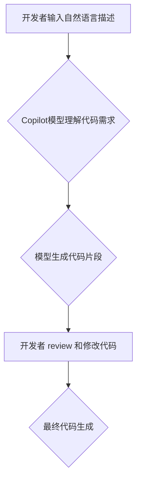

> Copilot, AI 辅助编程, 代码生成, 自然语言处理, 深度学习, 软件开发

## 1. 背景介绍

在软件开发领域，代码编写占据了大量的时间和精力。随着软件系统越来越复杂，代码量不断增加，传统的代码编写方式面临着效率低下、易出错等问题。为了解决这些问题，人工智能（AI）技术逐渐被应用于代码生成领域，其中Copilot模式作为一种新兴的AI辅助编程技术，展现出巨大的潜力。

Copilot模式的核心思想是利用深度学习模型训练出一个能够理解自然语言并生成代码的智能助手。开发者只需用自然语言描述代码的功能需求，Copilot就能自动生成相应的代码片段，极大地提高了开发效率和代码质量。

## 2. 核心概念与联系

### 2.1  Copilot模式

Copilot模式是一种基于Transformer模型的AI辅助编程技术，它将自然语言处理（NLP）和代码生成技术相结合，能够理解开发者用自然语言描述的代码需求，并自动生成相应的代码片段。

### 2.2  Transformer模型

Transformer模型是一种深度学习模型，其核心是注意力机制，能够捕捉文本序列中长距离依赖关系，在自然语言处理任务中取得了显著的成果。

### 2.3  代码生成

代码生成是指利用AI模型自动生成代码的过程。Copilot模式通过训练大量的代码数据集，学习代码的语法结构和语义关系，从而能够生成符合规范和语义要求的代码。

**Mermaid 流程图**



## 3. 核心算法原理 & 具体操作步骤

### 3.1  算法原理概述

Copilot模式的核心算法原理是基于Transformer模型的编码器-解码器结构。

* **编码器:** 负责将开发者输入的自然语言描述转换为一个向量表示，该向量包含了代码需求的语义信息。
* **解码器:** 负责根据编码器的输出，生成相应的代码片段。

### 3.2  算法步骤详解

1. **预处理:** 将开发者输入的自然语言描述进行预处理，例如分词、词性标注等。
2. **编码:** 将预处理后的文本序列输入到编码器中，编码器会将文本序列转换为一个向量表示。
3. **解码:** 将编码器的输出作为解码器的输入，解码器会根据输入的向量表示，生成相应的代码片段。
4. **后处理:** 对生成的代码片段进行后处理，例如语法检查、格式化等。

### 3.3  算法优缺点

**优点:**

* **提高开发效率:** 自动生成代码片段，减少了开发者手动编写代码的时间。
* **提高代码质量:** 基于大量代码数据集训练，生成的代码更符合规范和语义要求。
* **降低开发门槛:** 即使是新手开发者也能利用Copilot模式快速学习和编写代码。

**缺点:**

* **模型训练成本高:** 训练大型Transformer模型需要大量的计算资源和数据。
* **代码生成结果可能不理想:** 模型生成的代码可能存在逻辑错误或不符合特定需求。
* **数据安全问题:** 开发者需要谨慎使用Copilot模式，避免泄露敏感信息。

### 3.4  算法应用领域

Copilot模式在软件开发领域具有广泛的应用场景，例如：

* **代码补全:** 根据开发者输入的代码片段，自动补全后续代码。
* **代码生成:** 根据开发者描述的代码需求，自动生成完整的代码片段。
* **代码翻译:** 将代码从一种编程语言翻译成另一种编程语言。
* **代码修复:** 自动检测和修复代码中的错误。

## 4. 数学模型和公式 & 详细讲解 & 举例说明

### 4.1  数学模型构建

Copilot模式的核心数学模型是Transformer模型，其结构由编码器和解码器组成。

* **编码器:** 编码器由多个Transformer层组成，每个Transformer层包含多头注意力机制和前馈神经网络。
* **解码器:** 解码器也由多个Transformer层组成，每个Transformer层包含多头注意力机制、masked multi-head attention 和前馈神经网络。

### 4.2  公式推导过程

Transformer模型的注意力机制公式如下：

$$
Attention(Q, K, V) = softmax(\frac{QK^T}{\sqrt{d_k}})V
$$

其中：

* $Q$：查询矩阵
* $K$：键矩阵
* $V$：值矩阵
* $d_k$：键向量的维度
* $softmax$：softmax函数

### 4.3  案例分析与讲解

假设我们想要训练一个Copilot模型，用于生成Python代码。我们可以使用公开的Python代码数据集进行训练，例如GitHub上的代码仓库。

训练过程中，模型会学习代码的语法结构和语义关系，并能够根据开发者输入的自然语言描述，生成相应的Python代码片段。

## 5. 项目实践：代码实例和详细解释说明

### 5.1  开发环境搭建

为了使用Copilot模式，我们需要搭建一个开发环境。

* **操作系统:** Linux、macOS 或 Windows
* **编程语言:** Python
* **深度学习框架:** TensorFlow 或 PyTorch
* **代码编辑器:** VS Code 或 Atom

### 5.2  源代码详细实现

由于Copilot模式的代码实现较为复杂，这里只提供一个简单的代码示例，展示了如何使用Python的transformers库调用预训练的Copilot模型进行代码生成。

```python
from transformers import AutoModelForSeq2SeqLM, AutoTokenizer

# 加载预训练的Copilot模型和词典
model_name = "facebook/bart-large-cnn"
tokenizer = AutoTokenizer.from_pretrained(model_name)
model = AutoModelForSeq2SeqLM.from_pretrained(model_name)

# 定义输入文本
input_text = "编写一个函数，计算两个整数的和。"

# 对输入文本进行编码
input_ids = tokenizer.encode(input_text, return_tensors="pt")

# 使用模型生成代码
output = model.generate(input_ids)

# 将生成的代码解码
generated_text = tokenizer.decode(output[0], skip_special_tokens=True)

# 打印生成的代码
print(generated_text)
```

### 5.3  代码解读与分析

这段代码首先加载了预训练的Copilot模型和词典。然后，将开发者输入的自然语言描述进行编码，并使用模型生成相应的代码片段。最后，将生成的代码解码并打印出来。

### 5.4  运行结果展示

运行这段代码后，可能会生成类似于以下的Python代码：

```python
def sum_two_integers(a, b):
  return a + b
```

## 6. 实际应用场景

Copilot模式在软件开发领域具有广泛的应用场景，例如：

### 6.1  代码补全

Copilot可以根据开发者输入的代码片段，自动补全后续代码，提高开发效率。

### 6.2  代码生成

Copilot可以根据开发者描述的代码需求，自动生成完整的代码片段，例如生成函数、类、接口等。

### 6.3  代码翻译

Copilot可以将代码从一种编程语言翻译成另一种编程语言，例如将Python代码翻译成Java代码。

### 6.4  未来应用展望

Copilot模式在未来将会有更广泛的应用场景，例如：

* **自动生成测试用例:** Copilot可以根据代码生成相应的测试用例，提高代码测试效率。
* **自动修复代码错误:** Copilot可以自动检测和修复代码中的错误，提高代码质量。
* **个性化代码生成:** Copilot可以根据开发者的编程风格和习惯，生成个性化的代码片段。

## 7. 工具和资源推荐

### 7.1  学习资源推荐

* **论文:** "Attention Is All You Need"
* **博客:** OpenAI Blog, Hugging Face Blog
* **在线课程:** Coursera, Udemy

### 7.2  开发工具推荐

* **GitHub:** 代码托管平台
* **VS Code:** 代码编辑器
* **PyCharm:** Python开发环境

### 7.3  相关论文推荐

* "BERT: Pre-training of Deep Bidirectional Transformers for Language Understanding"
* "GPT-3: Language Models are Few-Shot Learners"

## 8. 总结：未来发展趋势与挑战

### 8.1  研究成果总结

Copilot模式在代码生成领域取得了显著的成果，能够提高开发效率和代码质量。

### 8.2  未来发展趋势

Copilot模式将朝着以下方向发展：

* **模型规模更大:** 更大的模型能够学习更复杂的代码结构和语义关系。
* **应用场景更广泛:** Copilot模式将应用于更多软件开发场景，例如代码测试、代码修复等。
* **个性化定制:** Copilot模型将能够根据开发者的编程风格和习惯，生成个性化的代码片段。

### 8.3  面临的挑战

Copilot模式也面临着一些挑战：

* **数据安全问题:** 开发者需要谨慎使用Copilot模式，避免泄露敏感信息。
* **模型偏见问题:** 训练数据可能存在偏见，导致生成的代码存在偏见。
* **解释性问题:** Copilot模型的决策过程难以解释，这可能会导致开发者对生成的代码缺乏信任。

### 8.4  研究展望

未来，研究人员将继续探索Copilot模式的潜力，解决其面临的挑战，并将其应用于更多软件开发场景。

## 9. 附录：常见问题与解答

### 9.1  Copilot模式是否可以替代人类程序员？

Copilot模式可以提高开发效率和代码质量，但它不能完全替代人类程序员。人类程序员仍然需要负责设计软件架构、解决复杂问题和进行代码审计等工作。

### 9.2  如何使用Copilot模式生成高质量的代码？

为了生成高质量的代码，需要提供清晰、准确的自然语言描述，并对生成的代码进行 review 和修改。

### 9.3  Copilot模式的安全性如何保证？

开发者需要谨慎使用Copilot模式，避免泄露敏感信息。

作者：禅与计算机程序设计艺术 / Zen and the Art of Computer Programming


<end_of_turn>