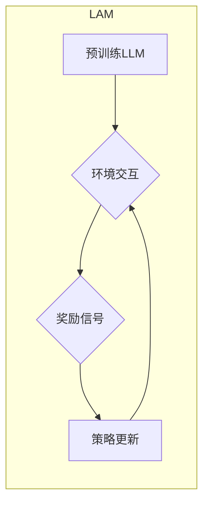

> Large Action Model, 学习机制, 强化学习, 预训练, 微调, 迁移学习, 知识蒸馏, 

## 1. 背景介绍

近年来，大型语言模型（LLM）在自然语言处理领域取得了显著的成就，例如文本生成、机器翻译、问答系统等。这些模型通常基于Transformer架构，并通过海量文本数据进行预训练，从而学习到丰富的语言表示和语法规则。然而，LLM在执行复杂行动或交互式任务方面仍然存在局限性。

为了解决这一问题，大型行动模型（Large Action Model，LAM）应运而生。LAM旨在学习执行一系列行动以实现特定目标的能力。与传统的LLM不同，LAM需要能够理解和执行物理世界中的行动，这需要更复杂的学习机制和更丰富的训练数据。

## 2. 核心概念与联系

LAM的学习机制主要基于强化学习（Reinforcement Learning，RL）和迁移学习（Transfer Learning）的思想。

**2.1 强化学习**

强化学习是一种机器学习方法，其中智能体通过与环境交互，学习最优的行动策略以最大化累积奖励。在LAM的学习过程中，环境可以是物理世界或虚拟环境，行动可以是控制机器人、执行任务或进行决策等。智能体通过执行行动并观察环境的变化，获得奖励或惩罚，从而不断调整其行动策略，最终学习到最优的行动序列。

**2.2 迁移学习**

迁移学习是指利用已学习到的知识和经验，迁移到新的任务或领域。在LAM的学习过程中，可以利用预训练的LLM作为基础模型，迁移其语言理解和生成能力，从而加速LAM的训练过程。

**2.3 架构图**



## 3. 核心算法原理 & 具体操作步骤

### 3.1 算法原理概述

LAM的学习机制主要基于深度强化学习算法，例如深度Q网络（DQN）和策略梯度算法（Policy Gradient）。这些算法通过神经网络学习策略，即从当前状态到下一个状态的行动映射。

**3.1.1 深度Q网络（DQN）**

DQN是一种基于Q值函数的强化学习算法，它学习估计从当前状态执行特定行动所获得的长期奖励。DQN使用神经网络来逼近Q值函数，并通过经验回放和目标网络来稳定训练过程。

**3.1.2 策略梯度算法**

策略梯度算法直接优化策略网络的参数，使其能够最大化累积奖励。策略梯度算法通常使用 REINFORCE 算法或其变体，例如 A2C 和 PPO。

### 3.2 算法步骤详解

1. **环境初始化:** 设置初始状态和奖励函数。
2. **策略网络初始化:** 初始化策略网络的参数。
3. **经验收集:** 智能体与环境交互，收集状态、行动、奖励和下一个状态的经验。
4. **经验回放:** 从经验池中随机采样经验，用于训练策略网络。
5. **策略更新:** 使用策略梯度算法或DQN算法更新策略网络的参数。
6. **重复步骤3-5:** 直到策略网络收敛或达到预设的训练时间。

### 3.3 算法优缺点

**优点:**

* 可以学习复杂的行为序列。
* 可以适应动态变化的环境。
* 可以利用迁移学习加速训练过程。

**缺点:**

* 训练过程可能很慢，需要大量的训练数据和计算资源。
* 容易陷入局部最优解。
* 难以解释模型的行为。

### 3.4 算法应用领域

LAM的学习机制在以下领域具有广泛的应用前景：

* **机器人控制:** 控制机器人执行复杂的任务，例如导航、抓取和组装。
* **游戏 AI:** 开发更智能的游戏 AI，能够学习并适应游戏规则。
* **自动驾驶:** 训练自动驾驶系统，使其能够安全地驾驶车辆。
* **医疗保健:** 辅助医生诊断疾病、制定治疗方案和提供个性化医疗服务。

## 4. 数学模型和公式 & 详细讲解 & 举例说明

### 4.1 数学模型构建

在强化学习中，我们通常使用马尔可夫决策过程（MDP）来建模智能体与环境的交互。MDP由以下几个组成部分组成：

* **状态空间 S:** 所有可能的系统状态的集合。
* **行动空间 A:** 智能体可以执行的行动的集合。
* **转移概率 P(s' | s, a):** 从状态 s 执行行动 a 到状态 s' 的概率。
* **奖励函数 R(s, a):** 智能体在状态 s 执行行动 a 时获得的奖励。
* **折扣因子 γ:** 用于权衡未来奖励的价值。

### 4.2 公式推导过程

**目标:** 找到最优策略 π*, 使得智能体在任何状态下执行最优行动，从而最大化累积奖励。

**Bellman 方程:**

$$
V^{\pi}(s) = R(s, \pi(s)) + \gamma \max_{a \in A} V^{\pi}(s')
$$

其中，V^{\pi}(s) 表示在策略 π 下，从状态 s 开始的期望累积奖励。

**策略梯度算法:**

$$
\nabla_{\theta} J(\theta) = \mathbb{E}_{\tau \sim \pi_{\theta}} \left[ \nabla_{\theta} \log \pi_{\theta}(a_t | s_t) \cdot A(s_t, a_t, r_{t+1}, s_{t+1}) \right]
$$

其中，J(θ) 是策略网络参数 θ 的目标函数，A(s_t, a_t, r_{t+1}, s_{t+1}) 是优势函数，表示在状态 s_t 执行行动 a_t 的优势。

### 4.3 案例分析与讲解

**案例:** 训练一个 LAM 来玩游戏“贪吃蛇”。

* **状态空间:** 蛇的当前位置和方向，食物的位置。
* **行动空间:** 向上、向下、向左、向右移动。
* **奖励函数:** 吃到食物获得奖励，撞到墙壁或自身死亡扣除奖励。
* **折扣因子:** 0.9

可以使用DQN算法或策略梯度算法来训练 LAM。训练过程中，LAM会不断学习最优的行动策略，从而获得更高的分数。

## 5. 项目实践：代码实例和详细解释说明

### 5.1 开发环境搭建

* 操作系统: Ubuntu 20.04
* Python 版本: 3.8
* 必要的库: TensorFlow, PyTorch, OpenAI Gym

### 5.2 源代码详细实现

```python
# 使用 TensorFlow 实现 DQN 算法

import tensorflow as tf

# 定义 DQN 网络结构
class DQN(tf.keras.Model):
    def __init__(self, state_size, action_size):
        super(DQN, self).__init__()
        self.dense1 = tf.keras.layers.Dense(64, activation='relu')
        self.dense2 = tf.keras.layers.Dense(64, activation='relu')
        self.output = tf.keras.layers.Dense(action_size)

    def call(self, state):
        x = self.dense1(state)
        x = self.dense2(x)
        return self.output(x)

# 定义 DQN 训练函数
def train_dqn(dqn, experience_replay_buffer, optimizer):
    # 从经验回放池中采样经验
    batch_size = 32
    states, actions, rewards, next_states, dones = experience_replay_buffer.sample(batch_size)

    # 计算 Q 值
    with tf.GradientTape() as tape:
        q_values = dqn(states)
        target_q_values = tf.reduce_max(dqn(next_states), axis=1)
        target_q_values = rewards + gamma * target_q_values * (1 - dones)
        loss = tf.keras.losses.MeanSquaredError()(target_q_values, q_values[tf.range(batch_size), actions])

    # 更新网络参数
    gradients = tape.gradient(loss, dqn.trainable_variables)
    optimizer.apply_gradients(zip(gradients, dqn.trainable_variables))

# ... 其他代码 ...
```

### 5.3 代码解读与分析

* 代码首先定义了 DQN 网络结构，包括两个全连接层和一个输出层。
* 然后定义了训练函数 `train_dqn`，该函数从经验回放池中采样经验，计算 Q 值，并使用梯度下降算法更新网络参数。
* 训练过程中，使用经验回放机制来稳定训练过程，并使用目标网络来减少训练过程中的震荡。

### 5.4 运行结果展示

训练完成后，可以将 LAM 应用于实际场景中，例如控制机器人执行任务或玩游戏。

## 6. 实际应用场景

### 6.1 机器人控制

LAM 可以用于控制机器人执行复杂的任务，例如导航、抓取和组装。例如，可以训练一个 LAM 来控制机器人导航到指定位置，避开障碍物，并抓取目标物体。

### 6.2 游戏 AI

LAM 可以用于开发更智能的游戏 AI，能够学习并适应游戏规则。例如，可以训练一个 LAM 来玩游戏“围棋”，并与人类玩家进行比赛。

### 6.3 自动驾驶

LAM 可以用于训练自动驾驶系统，使其能够安全地驾驶车辆。例如，可以训练一个 LAM 来控制自动驾驶汽车避开障碍物、识别交通信号灯和做出正确的驾驶决策。

### 6.4 医疗保健

LAM 可以辅助医生诊断疾病、制定治疗方案和提供个性化医疗服务。例如，可以训练一个 LAM 来分析患者的医疗影像数据，识别潜在的疾病风险。

### 6.4 未来应用展望

LAM 的应用前景非常广阔，未来可能会在更多领域得到应用，例如：

* **个性化教育:** 根据学生的学习进度和能力，提供个性化的学习内容和教学方法。
* **金融投资:** 分析市场数据，预测股票价格走势，进行智能投资决策。
* **科学研究:** 自动化实验过程，加速科学发现。

## 7. 工具和资源推荐

### 7.1 学习资源推荐

* **书籍:**
    * Reinforcement Learning: An Introduction by Richard S. Sutton and Andrew G. Barto
    * Deep Reinforcement Learning Hands-On by Maxim Lapan
* **在线课程:**
    * Deep Reinforcement Learning Specialization by DeepLearning.AI
    * Reinforcement Learning by David Silver (University of DeepMind)

### 7.2 开发工具推荐

* **深度学习框架:** TensorFlow, PyTorch
* **强化学习库:** OpenAI Gym, Stable Baselines3
* **环境模拟器:** Gazebo, MuJoCo

### 7.3 相关论文推荐

* **DQN:** Deep Q-Network by Volodymyr Mnih et al. (2015)
* **Policy Gradient:** Proximal Policy Optimization Algorithms by John Schulman et al. (2017)
* **Transfer Learning:** Transfer Learning by Yoshua Bengio et al. (2012)

## 8. 总结：未来发展趋势与挑战

### 8.1 研究成果总结

LAM 的研究取得了显著的进展，在机器人控制、游戏 AI、自动驾驶等领域取得了令人瞩目的成果。

### 8.2 未来发展趋势

* **模型规模和能力的提升:** 随着计算资源的不断发展，LAM 的模型规模和能力将会进一步提升，能够学习更复杂的行为和解决更复杂的问题。
* **多模态学习:** LAM 将会融合多模态数据，例如文本、图像、音频等，从而更好地理解和交互于世界。
* **安全性和可解释性:** 如何保证 LAM 的安全性、可靠性和可解释性是未来研究的重要方向。