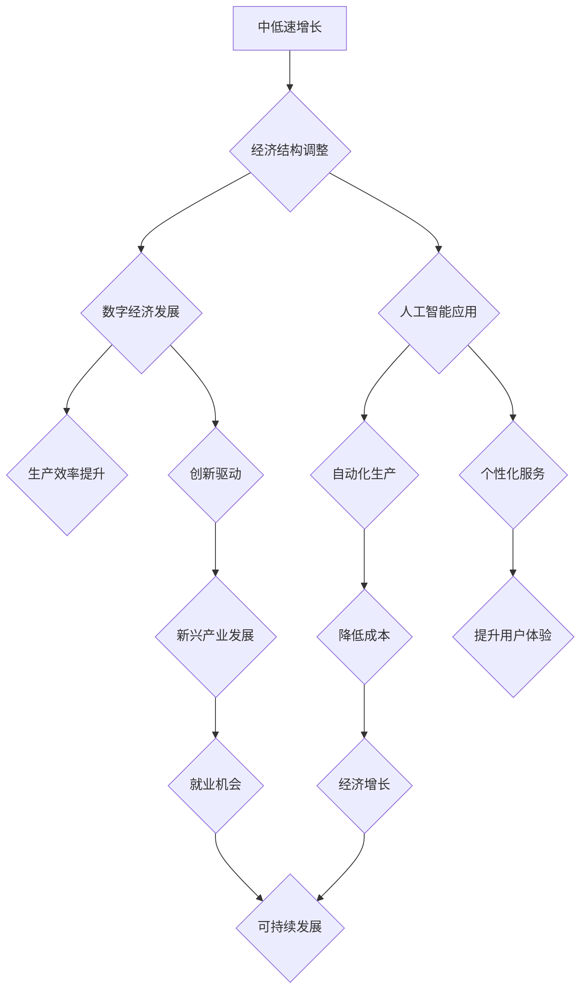

> 中低速增长、经济模型、人工智能、技术创新、数字经济、可持续发展、全球化、政策应对

## 1. 背景介绍

全球经济在过去几十年经历了前所未有的高速增长，但这种增长模式正在发生变化。国际货币基金组织（IMF）预测，未来全球经济增长将放缓，进入一个中低速增长阶段。这种变化是由多种因素共同作用的结果，包括人口老龄化、技术进步放缓、全球化逆转以及气候变化等。

中低速增长对世界经济和社会发展带来了一系列挑战和机遇。一方面，它意味着经济增长空间缩小，就业压力增加，社会不平等可能加剧。另一方面，它也促使各国寻求新的经济增长点，推动技术创新和产业升级，探索更加可持续的经济发展模式。

## 2. 核心概念与联系

**2.1 中低速增长**

中低速增长是指经济增长率处于中等水平，通常低于过去几十年高速增长的水平。这种增长模式的特点是：

* **增长速度放缓：** 经济增长率持续下降，但仍保持正增长。
* **结构性变化：** 经济结构发生深刻变化，服务业占比增加，制造业占比下降。
* **创新驱动：** 技术创新和产业升级成为经济增长的主要动力。
* **可持续发展：** 经济增长更加注重环境保护和社会公平。

**2.2 数字经济**

数字经济是指以数字技术为基础，以数据为核心要素，以网络为平台，以智能化和数字化为特征的新型经济形态。数字经济的快速发展为中低速增长提供了新的机遇：

* **提高生产效率：** 数字技术可以自动化生产流程，提高生产效率和降低成本。
* **促进创新发展：** 数字平台可以连接创新者和市场，促进技术创新和商业模式创新。
* **拓展市场空间：** 数字经济打破了地域限制，拓展了市场空间和消费需求。

**2.3 人工智能**

人工智能（AI）是指模拟人类智能的计算机系统。AI技术在各个领域都有广泛的应用，例如：

* **自动化生产：** AI可以实现机器人的自主学习和决策，提高生产效率和降低人工成本。
* **个性化服务：** AI可以根据用户的需求提供个性化的产品和服务，提升用户体验。
* **数据分析：** AI可以分析海量数据，发现隐藏的规律和趋势，为决策提供支持。

**2.4  可持续发展**

可持续发展是指满足当前需求，不损害后代满足其自身需求的能力。中低速增长需要与可持续发展相结合，实现经济、社会和环境的协调发展。

**2.5  全球化**

全球化是指国家之间经济、政治、文化等方面的相互联系和融合。中低速增长背景下，全球化面临新的挑战和机遇：

* **贸易保护主义：** 一些国家采取贸易保护主义政策，阻碍了全球贸易和投资。
* **地缘政治风险：** 地缘政治紧张局势加剧，增加了全球经济的不确定性。
* **数字经济合作：** 各国需要加强数字经济合作，共同应对全球挑战。

**2.6  政策应对**

各国政府需要采取一系列政策措施，应对中低速增长带来的挑战，促进经济转型升级和可持续发展。

* **促进科技创新：** 加强基础研究和应用研究，支持科技企业发展，培育新的增长点。
* **优化产业结构：** 推动制造业向高端化、智能化转型，发展新兴产业，提高产业竞争力。
* **加强社会保障：** 完善社会保障体系，应对人口老龄化和就业压力。
* **推动绿色发展：** 加强环境保护，发展清洁能源，实现经济与环境的协调发展。
* **深化国际合作：** 加强与其他国家的经济合作，共同应对全球挑战。

**2.7  Mermaid 流程图**



## 3. 核心算法原理 & 具体操作步骤

**3.1 算法原理概述**

在中低速增长背景下，人工智能算法在经济预测、风险管理、资源优化等领域发挥着越来越重要的作用。例如，机器学习算法可以分析历史数据，预测未来经济趋势；深度学习算法可以识别潜在风险，帮助企业进行风险管理；强化学习算法可以优化资源分配，提高生产效率。

**3.2 算法步骤详解**

以机器学习算法为例，其基本步骤包括：

1. **数据收集和预处理:** 收集相关数据，并进行清洗、转换、特征提取等预处理工作。
2. **模型选择:** 根据具体问题选择合适的机器学习算法，例如线性回归、逻辑回归、决策树、支持向量机等。
3. **模型训练:** 使用训练数据训练模型，调整模型参数，使模型能够准确预测目标变量。
4. **模型评估:** 使用测试数据评估模型的性能，例如准确率、召回率、F1-score等。
5. **模型部署:** 将训练好的模型部署到实际应用场景中，用于预测或决策。

**3.3 算法优缺点**

机器学习算法具有以下优点：

* **数据驱动:** 基于大量数据进行训练，能够学习到数据中的复杂模式。
* **自动化学习:** 可以自动学习特征和模型参数，无需人工干预。
* **适应性强:** 可以适应不断变化的数据环境。

但也存在一些缺点：

* **数据依赖:** 算法性能依赖于数据质量和数量。
* **解释性差:** 难以解释模型的决策过程。
* **过拟合风险:** 如果训练数据不足或过于复杂，模型可能过拟合训练数据，导致泛化能力差。

**3.4 算法应用领域**

机器学习算法广泛应用于各个领域，例如：

* **金融:** 欺诈检测、信用评分、风险管理
* **医疗:** 疾病诊断、药物研发、患者个性化治疗
* **电商:** 商品推荐、用户画像、精准营销
* **交通:** 交通预测、自动驾驶、智能交通管理

## 4. 数学模型和公式 & 详细讲解 & 举例说明

**4.1 数学模型构建**

在经济学中，常用的数学模型包括：

* **生产函数:** 描述生产要素与产出的关系。
* **需求函数:** 描述消费者对商品的需求量与价格的关系。
* **供给函数:** 描述生产者对商品的供给量与价格的关系。
* **均衡模型:** 描述市场价格和数量的均衡状态。

**4.2 公式推导过程**

例如，生产函数可以表示为：

$$Y = F(K, L)$$

其中：

* $Y$ 表示产出
* $K$ 表示资本投入
* $L$ 表示劳动力投入
* $F$ 表示生产函数

假设生产函数具有规模报酬递减的特性，即增加投入要素的比例小于产出的增加比例。

**4.3 案例分析与讲解**

例如，假设一个国家的生产函数为：

$$Y = K^{0.5}L^{0.5}$$

如果资本投入增加 10%，劳动力投入保持不变，则产出将增加 5%。

**4* 举例说明**

假设一个国家的生产函数为：

$$Y = K^{0.5}L^{0.5}$$

如果资本投入增加 10%，劳动力投入保持不变，则产出将增加 5%。

## 5. 项目实践：代码实例和详细解释说明

**5.1 开发环境搭建**

可以使用 Python 语言和相关库进行机器学习算法的开发。常用的库包括：

* **NumPy:** 用于数值计算
* **Pandas:** 用于数据处理和分析
* **Scikit-learn:** 用于机器学习算法的实现

**5.2 源代码详细实现**

```python
import numpy as np
from sklearn.linear_model import LinearRegression

# 准备数据
X = np.array([[1], [2], [3], [4], [5]])
y = np.array([2, 4, 5, 4, 5])

# 创建线性回归模型
model = LinearRegression()

# 训练模型
model.fit(X, y)

# 预测新数据
new_data = np.array([[6]])
prediction = model.predict(new_data)

# 打印预测结果
print(prediction)
```

**5.3 代码解读与分析**

这段代码实现了线性回归模型的训练和预测。

* 首先，准备了训练数据和目标变量。
* 然后，创建了一个线性回归模型对象。
* 接着，使用训练数据训练模型。
* 最后，使用训练好的模型预测新数据。

**5.4 运行结果展示**

运行这段代码后，会输出预测结果，例如：

```
[5.5]
```

这表示，根据训练数据，模型预测当输入值为 6 时，输出值为 5.5。

## 6. 实际应用场景

**6.1 经济预测**

机器学习算法可以分析历史经济数据，预测未来经济增长率、通货膨胀率、失业率等指标。

**6.2 风险管理**

金融机构可以使用机器学习算法识别潜在的金融风险，例如欺诈交易、信用违约等。

**6.3 资源优化**

企业可以使用机器学习算法优化资源分配，例如生产计划、库存管理、物流配送等。

**6.4 未来应用展望**

随着人工智能技术的不断发展，其在经济领域的应用将更加广泛和深入。例如：

* **个性化金融服务:** 根据用户的个人情况，提供个性化的金融产品和服务。
* **智能投资:** 利用人工智能算法进行投资决策，提高投资收益。
* **自动化的经济政策制定:** 利用人工智能算法分析经济数据，为政府制定经济政策提供支持。

## 7. 工具和资源推荐

**7.1 学习资源推荐**

* **在线课程:** Coursera、edX、Udacity 等平台提供机器学习和人工智能相关的在线课程。
* **书籍:** 《机器学习》 (周志华)、《深度学习》 (Ian Goodfellow) 等书籍是机器学习和深度学习的经典教材。
* **开源项目:** TensorFlow、PyTorch 等开源项目提供了丰富的机器学习工具和资源。

**7.2 开发工具推荐**

* **Python:** Python 语言是机器学习和人工智能开发的常用语言。
* **Jupyter Notebook:** Jupyter Notebook 是一个交互式编程环境，方便进行机器学习算法的开发和调试。
* **Scikit-learn:** Scikit-learn 是一个 Python 机器学习库，提供了丰富的机器学习算法和工具。

**7.3 相关论文推荐**

* **《机器学习》 (周志华)**
* **《深度学习》 (Ian Goodfellow)**
* **《人工智能：一种现代方法》 (Stuart Russell, Peter Norvig)**

## 8. 总结：未来发展趋势与挑战

**8.1 研究成果总结**

近年来，人工智能技术取得了长足的进步，在经济领域也发挥了越来越重要的作用。机器学习算法能够分析海量数据，预测未来趋势，优化资源分配，提高效率。

**8.2 未来发展趋势**

未来，人工智能技术将继续发展，在经济领域应用更加广泛和深入。例如：

* **更强大的算法:** 研究人员将开发更强大的机器学习算法，能够处理更复杂的数据，做出更准确的预测。
* **更广泛的应用:** 人工智能技术将应用于更多经济领域，例如金融、医疗、教育、交通等。
* **更智能的系统:** 人工智能系统将更加智能化，能够自主学习和决策，无需人工干预。

**8.3 面临的挑战**

人工智能技术的发展也面临一些